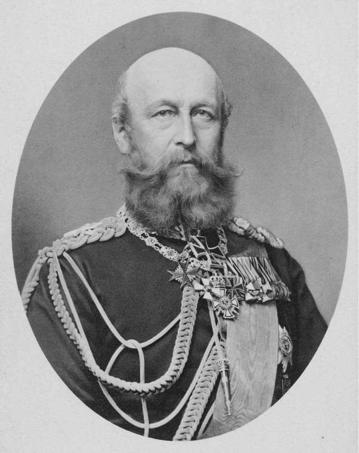

```{r setup, include=FALSE, cache=F, message=F, warning=F, results="hide"}
knitr::opts_chunk$set(cache=TRUE)
knitr::opts_chunk$set(fig.path='figs/')
knitr::opts_chunk$set(cache.path='cache/')

knitr::opts_chunk$set(
                  fig.process = function(x) {
                      x2 = sub('-\\d+([.][a-z]+)$', '\\1', x)
                      if (file.rename(x, x2)) x2 else x
                      }
                  )
```

```{r loadstuff, include=FALSE}
knitr::opts_chunk$set(cache=FALSE)

library(tidyverse)
library(stevemisc)
library(countrycode)
library(knitr)
library(maddison)
library(stringr)
library(dotwhisker)
library(artyfarty)

ATOP <- haven::read_dta("~/Dropbox/data/atop/atop3_0ddyr.dta")
Alliance_my <- read_csv("~/Dropbox/data/cow/alliance/4.1/alliance_v4.1_by_member_yearly.csv")
Alliance_m <- read_csv("~/Dropbox/data/cow/alliance/4.1/alliance_v4.1_by_member.csv")
Alliance_dy <- read_csv("~/Dropbox/data/cow/alliance/4.1/alliance_v4.1_by_dyad_yearly.csv")
Alliance_d <- read_csv("~/Dropbox/data/cow/alliance/4.1/alliance_v4.1_by_dyad.csv")


States <- read_csv("~/Dropbox/data/cow/states/states2016.csv")
  
  
States %>%
 #   mutate(endyear = ifelse(endyear == 2011, 2015, endyear)) %>%
    rowwise() %>%
    mutate(year = list(seq(styear, endyear))) %>%
    ungroup() %>%
    unnest() %>%
    arrange(ccode, year) %>%
    select(ccode, year) %>%
    distinct(ccode, year) -> CYs

CYs %>%
    group_by(year) %>%
    summarize(numstates = n()) -> Numstates

library(cowplot)

```

# Introduction
### Goal for Today

*Define alliances, why states form them, and the drawbacks they have.*

### Confrontation of the Day: The Austro-Prussian [Six Weeks] War (MIC#0261)


```{r mic-of-the-day, eval=TRUE, echo=FALSE, out.width="100%"}

p1 <- ggdraw() + draw_image("friedrich-franz-crop.jpg", scale = 0.5)
p2 <- ggdraw() + draw_image("austria-prussia-war-crop.jpg", scale = 1.3)
#p3 <- ggdraw() + draw_image("img/crush-india-march.png", scale = 0.9)
# p4 <- ggdraw() + draw_image("img/anti-china-protest-2011.jpg", scale = 0.9)

plot_grid(p2, p1)
# nitr::
```


# What We Know About Alliances
## What Is An Alliance?
### What is an Alliance?

Alliances are formal written agreements signed:

- by official representatives of
- at least two independent states, that
- include promises to aid a partner or remain neutral in case of conflict.

### What is an Alliance?

Some features of alliances:

- Anticipatory
- Typically unconcerned with cases of civil war or coup threats
- Non-binding
- Either bilateral or multilateral

### Typology of Alliances

We have a typology of alliances contingent on data source.

- Correlates of War [CoW] (Gibler, 2009)
- Alliance Treaty Obligations and Provisions [ATOP] (Leeds et al., 2002)

### CoW Typology

- Defense
- Neutrality
- Nonaggression
- Entente

###

```{r perc-system-with-alliance-1816-2012, eval=T, echo=F, fig.width=14, fig.height=8.5, warning=F, message=F}

Alliance_my %>%
  group_by(year, ccode) %>%
  filter(year > 0) %>%
  summarize(sum = n()) %>%
  mutate(sum = ifelse(sum > 1, 1, sum)) %>%
  group_by(year) %>%
  summarize(sum = n()) %>%
  left_join(Numstates, .) %>% 
  mutate(perc = sum/numstates) %>%
  ggplot(.,aes(year, perc)) +
  theme_steve_web() +
  geom_line(size=1.1) +
  geom_ribbon(aes(ymin=0, ymax=perc),
              alpha=0.3, fill="#619cff") +
  scale_x_continuous(breaks = seq(1820, 2010, by = 10)) +
  scale_y_continuous(labels = scales::percent, limits=c(0,1)) +
  xlab("Year") + ylab("Percentage of the State System Having At Least One Alliance") +
  labs(title = "Roughly Three-Quarters of the State System Has At Least One Active Alliance",
       subtitle = "The percentage of the state system membership with at least one alliance plummeted after World War I and spiked during World War II.",
       caption = "Data: Correlates of War Alliances Data (v 4.1)")
```

###

```{r most-alliances-all-time-1816-2012, eval=T, echo=F, fig.width=14, fig.height=8.5, warning=F, message=F}
Alliance_m %>%
  group_by(state_name) %>%
  summarize(sum = n()) %>%
  arrange(-sum) %>% head(12) %>%
  mutate(state_name = ifelse(state_name == "United States of America", "United\nStates", state_name),
         state_name = ifelse(state_name == "United Kingdom", "United\nKingdom", state_name),
         state_name = ifelse(state_name == "Austria-Hungary", "Austria-\nHungary", state_name)) %>%
  ggplot(.,aes(reorder(state_name, -sum), sum)) + 
  theme_steve_web() +
  xlab("Country") + ylab("Number of Alliances") +
  geom_bar(stat="identity", color="black", fill="#619cff", alpha=0.8) + 
  geom_text(aes(label=sum), vjust=-.5, colour="black",
            position=position_dodge(.9), size=4, family = "Open Sans") +
  labs(title = "No Country Has Signed More Alliances in the Post-Napoleon History of the World Than Russia",
       subtitle = "Russia's 105 alliances equals the total of France and the United Kingdom combined.",
       caption = "Data: Correlates of War Alliances Data (v. 4.1)")

```

###

```{r usa-rus-alliances-1816-2012, eval=T, echo=F, fig.width=14, fig.height=8.5, warning=F, message=F}
Alliance_my %>%
  filter(ccode == 2 | ccode == 365) %>%
  select(version4id, state_name, year) %>%
  rename(Country = state_name) %>%
  group_by(year, Country) %>%
  summarize(sum = n()) %>% 
  ggplot(.,aes(year, sum, fill=Country, group=Country)) + theme_steve_web() +
  scale_x_continuous(limits=c(1816, 2012), breaks = seq(1820, 2010, by = 10)) +
    geom_bar(aes(fill=Country), stat="identity",  color="black", alpha=I(0.5)) +
  xlab("Year") + ylab("Number of Active Alliances in a Year") +
  #scale_fill_manual(values = pal("five38")) +
  labs(title = "The Number of Active Alliances for the U.S. and Russia, 1816-2012",
       subtitle = "The U.S. foray into alliance-making starts with the Root–Takahira Agreement with Japan. They've been a common part of Russian foreign policy for much longer.",
       caption = "Data: Correlates of War Alliances Data (v. 4.1)")

```


###

```{r alliance-type-1816-2012, eval=T, echo=F, fig.width=14, fig.height=8.5, warning=F, message=F}
Alliance_m %>%
  group_by(version4id, ss_type) %>%
  summarize(sum = n()) %>%
  group_by(ss_type) %>%
  summarize(sum = n()) %>%
  mutate(Type = c("Defense", "Neutrality", "Non-Aggression", "Non-Aggression", "Entente")) %>%
  group_by(Type) %>%
  summarize(sum = sum(sum)) %>%
  ggplot(.,aes(Type, sum)) + theme_steve_web() + 
  geom_bar(stat="identity", color="black", fill="#619cff", alpha=0.8) + 
  geom_text(aes(label=sum), vjust=-.5, colour="black",
            position=position_dodge(.9), size=4, family = "Open Sans") +
  xlab("Type of Alliance (via Singer and Small, 1966)") + ylab("Number of Alliances in the Data") +
  labs(title = "Almost Half (49.5%) of Alliances Are Primarily Defensive",
       subtitle = "An 1862-66 alliance among Hanover, Bavaria, Saxony, Wuerttemburg, Hesse Grand Ducal, and Austria-Hungary is the only primarily neutrality pact in the data.",
       caption = "Data: Correlates of War Alliances Data (v 4.1)")
  
# version4id 42 = only Neutrality
```

###

```{r alliance-pledges-1816-2012, eval=T, echo=F, fig.width=14, fig.height=8.5, warning=F, message=F}
Alliance_d %>%
  group_by(version4id) %>%
  summarize(num_def = sum(defense),
            num_neu = sum(neutrality),
            num_nonagg = sum(nonaggression),
            num_ent = sum(entente)) %>%
  mutate(num_def = ifelse(num_def > 1, 1, num_def),
         num_neu = ifelse(num_neu > 1, 1, num_neu),
         num_nonagg = ifelse(num_nonagg > 1, 1, num_nonagg),
         num_ent = ifelse(num_ent > 1, 1, num_ent)) %>%
  summarize(`Defense` = sum(num_def),
            `Neutrality` = sum(num_neu),
            `Non-Aggression` = sum(num_nonagg),
            `Entente` = sum(num_ent, na.rm=T)) %>%
  gather(Category, Count, `Defense`:`Entente`) %>%
  ggplot(.,aes(Category, Count)) + theme_steve_web() + 
  geom_bar(stat="identity", color="black", fill="#619cff", alpha=0.8) +
  geom_text(aes(label=Count), vjust=-.5, colour="black",
            position=position_dodge(.9), size=4, family = "Open Sans") +
  xlab("Pledge Type (via Singer and Small, 1966)") + ylab("Number of Pledges in the Data") +
  labs(title = "Few Alliances Are Primarily Ententes or Neutrality Pacts, but Those Pledges Appear in Defense and Non-Aggression Pacts",
       subtitle = "Only one alliance was a neutrality pact but 102 alliances contain neutrality pledges.",
       caption = "Data: Correlates of War Alliances Data (v 4.1)")
```

### ATOP Typology

- Offense
- Neutrality
- Nonaggression
- Defense
- Entente

###

```{r atop-cow-alliance-comparisons-1816-2012, eval=T, echo=F, fig.width=14, fig.height=8.5, warning=F, message=F}

Alliance_d %>%
  filter(dyad_st_year <= 2003) %>%
  group_by(version4id) %>%
  summarize(num_def = sum(defense),
            num_neu = sum(neutrality),
            num_nonagg = sum(nonaggression),
            num_ent = sum(entente)) %>%
  mutate(num_def = ifelse(num_def > 1, 1, num_def),
         num_neu = ifelse(num_neu > 1, 1, num_neu),
         num_nonagg = ifelse(num_nonagg > 1, 1, num_nonagg),
         num_ent = ifelse(num_ent > 1, 1, num_ent)) %>%
  summarize(`Defense` = sum(num_def),
            `Neutrality` = sum(num_neu),
            `Non-Aggression` = sum(num_nonagg),
            `Entente` = sum(num_ent, na.rm=T)) %>%
  gather(Category, Count, `Defense`:`Entente`) %>%
  add_row(., Category = "Offense", Count = NA) %>%
  mutate(Data = "Correlates of War") -> cowsums
  

ATOP %>%
  filter(year > 1815) %>%
  group_by(atopid1) %>%
  distinct(atopid1, .keep_all=T) %>%
  ungroup() %>%
  summarize(`Defense` = sum(defense),
            `Offense` = sum(offense),
            `Neutrality` = sum(neutral),
            `Non-Aggression` = sum(nonagg),
            `Entente` = sum(consul)) %>% 
  gather(Category, Count, `Defense`:`Entente`) %>%
  mutate(Data = "ATOP") %>%
  bind_rows(., cowsums) %>%
  ggplot(.,aes(Category, Count, color=Data)) + theme_steve_web() + 
  geom_bar(aes(fill = Data), position = "dodge", stat="identity", alpha = I(0.8),color = I("black")) +
  geom_text(aes(label=Count, group=Data), color="black",
            position=position_dodge(width=.9), size=4, vjust = -.5, family="Open Sans") +
  scale_fill_manual(values = pal("google")) +
  xlab("Alliance Pledge Type") + ylab("Number of Pledges in the Data") +
  labs(title = "ATOP and CoW Alliance Data Have Quite a Few Differences, Beyond the Category for Offense",
       subtitle = "ATOP observes more non-aggression pledges than CoW, but fewer neutrality pledges.",
       caption = "Data: ATOP (v 3.0) and CoW (v. 4.1). Note: temporal domains standardized from 1816-2003.")

```


## Why Form Alliances?
### Why Form Alliances?

Traditional argument: states use alliances for security.

- Quick way of aggregating capabilities toward some adversary.

This led to the familiar balancing/bandwagoning debate.

- Balancing: join weaker side to stop domination
- Bandwagoning: join stronger side to join in spoils of domination


### Why Form Alliances?

Walt's balance of threat theory offers small refinement here.

- States balance against perceived threat, not power.
- Power is instrumental to threat.

Sources of threat:

- Offensive power
- Proximity
- Aggregate capabilities
- Offensive intentions

### Better View of Alliance Formation

States seek an optimal trade-off between security and autonomy.

- Weaker states seek security from stronger states against perceived threats
- Stronger states trade security commitments for policy gains elsewhere.
- The weaker state concedes some autonomy for security.

Would square well with patterns we observe:

- U.S.-Kuwait/Saudi Arabia.
- Marshall Plan in NATO

### Better View of Alliance Formation

States A and B generally form an alliance to signal to State C.

- Assume: B and C have some divisive issue, for which A supports B.
- And: alliances are costly to form (i.e. transaction, opportunity) and costly to break (i.e. reputation, audience).

Therefore: A and B form a costly alliance when:

- A and wants to better empower B/deter C.
- Alliances are relatively inexpensive to form.
- Alliances are costly to break.

###


## Empirical Findings
### Who Forms Alliances?

Empirical analysis for today: what do we know about who forms alliances more generally?

<!-- ### Evaluating a Regression Analysis -->

<!-- I mention there are three things to do when evaluating a regression analysis. -->

<!-- 1. Know (however, general) the data used. -->
<!-- 2. Know what the objects in the regression table are saying. -->
<!-- 3. Know what the regression table *isn't* saying. -->

### Lai and Reiter's (2000) Data

The first step is to know what the variables used are supposed to capture.

- Dependent variable: states are allied (Y/N)
    - CoW alliances and ATOP alliances

Analysis is from older data. 

- CoW domain (1816-1992)
- ATOP domain (1816-1944)

### Lai and Reiter's (2000) Data

Lai and Reiter have three hunches about what explains alliance formation.

1. Regime similarity
    - Joint democracy
    - Polity difference (i.e. testing for "cats and dogs" effect)
2. Cultural similarity/homophily
    - Joint religion/ethnicity/language
3. Shared threat
    - Conflict relations (i.e. severity of recent MIDs)
    - General threat level (i.e. number of MIDs in past 10 years)
    - Common enemy (i.e. if both sides fought against same state)

Additional notes:

- More controls: distance, major power, learning (i.e. regarding past alliances)
- Unit of analysis: dyad-year.

<!-- ### Interpreting the Regression Output

Find the following objects in the regression table:

1. The numbers in parentheses
2. The numbers *not* in parentheses
3. The asterisks that appear next to some numbers.

### Interpreting the Regression Output


1. The numbers in parentheses

    - These are the **standard errors**.
    - They communicate a prediction error (of sorts).
    - However, their interpretation depends on the associated numbers not in parentheses.

2. The numbers *not* in parentheses

    - These are the **regression coefficients**.
    - They communicate the estimated change in the DV for a unit-change in the IV.
    - Determine if it's positive or negative (recall: relationships).
    - However, their substantive interpretation depends on the presence/absence of asterisks.

3. The asterisks that appear next to some numbers.

    - These communicate the **statistical significance**.
    - i.e. is the estimated positive/negative effect discernible from zero?
    - If so, we say that the IV has a "significant" (i.e. highly unlikely to be zero) effect on the DV. -->
    


    
    
###

```{r dwplot-gibler-sarkees-2004-tab2, eval=T, echo=F, fig.width=14, fig.height=8.5, warning=F, message=F}

tribble(
  ~term, ~estimate, ~std.error, ~model,
"Joint Democracy", .176, .031, "CoW Alliances (1816-1992)",
"Joint Democracy", .152, .067, "ATOP Alliances (1816-1944)",
"Polity Difference", -.010, .002, "CoW Alliances (1816-1992)",
"Polity Difference", .012, .004, "ATOP Alliances (1816-1944)",
"Joint Religion", .309, .021, "CoW Alliances (1816-1992)",
"Joint Religion", .029, .038, "ATOP Alliances (1816-1944)",
"Joint Language", .369, .035, "CoW Alliances (1816-1992)",
"Joint Language", .144, .060, "ATOP Alliances (1816-1944)",
"Joint Ethnicity", -.040, .042, "CoW Alliances (1816-1992)",
"Joint Ethnicity", .187, .061, "ATOP Alliances (1816-1944)",
"Conflict Relations", -.108, .040, "CoW Alliances (1816-1992)",
"Conflict Relations", .036, .072, "ATOP Alliances (1816-1944)",
"Joint Enemy", .106, .027, "CoW Alliances (1816-1992)",
"Joint Enemy", .428, .053, "ATOP Alliances (1816-1944)",
"Amount of Threat", .024, .002, "CoW Alliances (1816-1992)",
"Amount of Threat", .010, .005, "ATOP Alliances (1816-1944)"
) %>%
  mutate(statistic = estimate/std.error,
         p.value = 1.96*pnorm(-abs(statistic))) %>%
  ggplot(.,aes(term, estimate, 
               color = model, shape = model,
               ymin= estimate-(p_z(.05)*std.error),
               ymax = estimate+(p_z(.05)*std.error))) +
  geom_pointrange(size=1.1, position = position_dodge(width = .3)) +
  coord_flip() +
  theme_steve_web() +
  #dwplot(.,dot_args = list(aes(colour = model, shape = model), size = 3.5)) + theme_steve_web() +
  geom_hline(yintercept = 0, colour = "grey60", linetype = 2) +
  #theme(legend.position = "bottom") +
  labs(title = "Probit Results of Dyadic Alliance Formation",
       subtitle = "Generally, alliances form from shared regime type, homophily, and mutual threats.",
       caption = "Reproduction of Table II in Gibler and Sarkees (2004).
       Note: Controls for distance, major power, learning, and ally lags excluded for presentation.",
       color = "", shape = "", y = "Coefficient Estimate (with 95% Bounds)", x = "") 
```


### Careful Interpretation of Significance

Some conclusions about who forms alliances:

- Democracies form alliances with each other.
- Culturally similar states form alliances with each other.
- More threatened states form alliances; enemies don't.


<!-- ### Careful Interpretation of Significance

Notice the process looks similar to a deductive approach.

- i.e. if H is true, then the parameter estimates for X1 will be statistically significant.
	- alternatively, and more formally: if the hypothesis is true, the test statistic will be drawn from a probability distribution that matches the population parameter.
- If X1 is statistically significant, we "fail to reject the hypothesis".
	- We don't "prove" the hypothesis or "accept" it. It just lives to be refuted another day.
- If X1 is not significant, we reject the hypothesis.
	- This is akin to denying the consequent.

### Some Cautions about the Regression Table

Regression tables shouldn't be daunting, but they can be misleading.

- Mind the distribution of the DV.
- Don't mistake "significant" for "large" or "very important"

    - For now, just look for significance to assess non-zero positive or negative effects.
- The constant is our estimate of Y when all Xs are zero.

    - It's not terribly important for beginners learning to evaluate regressions in political science.
    
    -->
    
# Conclusion
### Conclusion


- Classifiable into offense/defense, non-aggression, neutrality, entente.
- Alliances constitute a security-autonomy trade-off.
- Homophily (in institutions/culture) and shared sense of threat are important correlates of alliance formation.