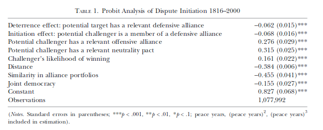
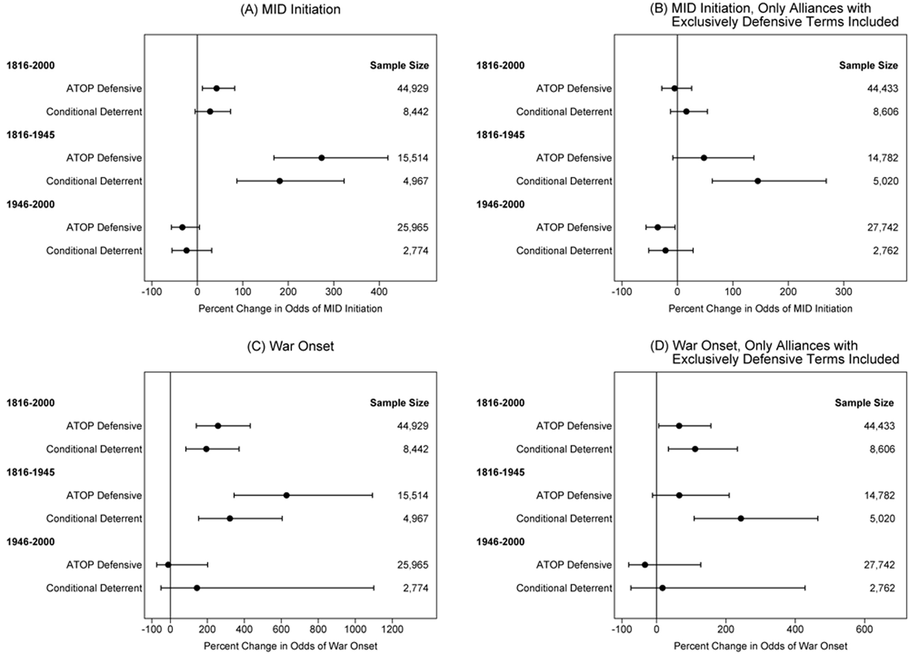
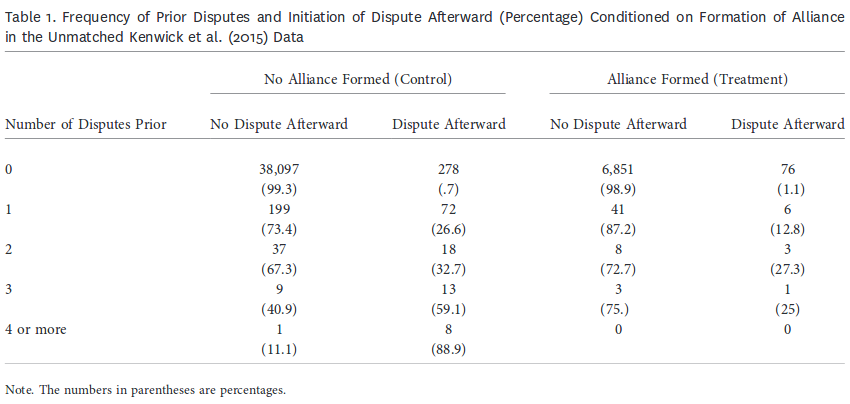

```{r setup, include=FALSE, cache=F, message=F, warning=F, results="hide"}
knitr::opts_chunk$set(cache=TRUE)
knitr::opts_chunk$set(fig.path='figs/')
knitr::opts_chunk$set(cache.path='cache/')

knitr::opts_chunk$set(
                  fig.process = function(x) {
                      x2 = sub('-\\d+([.][a-z]+)$', '\\1', x)
                      if (file.rename(x, x2)) x2 else x
                      }
                  )
```

```{r loadstuff, include=FALSE}
knitr::opts_chunk$set(cache=TRUE)
options(knitr.kable.NA = '')
library(tidyverse)
library(stevemisc)
library(countrycode)
library(knitr)
library(stargazer)
library(dotwhisker)
library(ggrepel)
```


```{r loaddata, cache=T, eval=T, echo=F, message=F, error=F, warning=F}
knitr::opts_chunk$set(cache=FALSE)

Alliance_my <- read_csv("~/Dropbox/data/cow/alliance/4.1/alliance_v4.1_by_member_yearly.csv")

States <- read_csv("~/Dropbox/data/cow/states/states2016.csv")
DDY <- read_csv("~/Dropbox/projects/mid-project/gml-mid-data/2.03/gml-ddy-disputes-2.03.csv")
  
States %>%
 #   mutate(endyear = ifelse(endyear == 2011, 2015, endyear)) %>%
    rowwise() %>%
    mutate(year = list(seq(styear, endyear))) %>%
    ungroup() %>%
    unnest() %>%
    arrange(ccode, year) %>%
    select(ccode, year) %>%
    distinct(ccode, year) -> CYs

  CYs %>%
    group_by(year) %>%
    summarize(numstates = n()) -> Numstates


Data <- read.csv("~/Dropbox/projects/mid-project/gml-mid-data/2.02/gml-ndy-2.02.csv") %>% tbl_df()
Cont <- read.csv("~/Dropbox/data/cow/contiguity/3.2/contdird.csv") %>% tbl_df()
Majors <- read.csv("~/Dropbox/data/cow/states/majors2016.csv") %>% tbl_df()
Contcd <- read.csv("~/Dropbox/data/cow/coldepcont/contcold.csv") %>% tbl_df()
Alliance <- read_csv("~/Dropbox/data/cow/alliance/4.1/alliance_v4.1_by_dyad_yearly.csv")
NMC <- read_csv("~/Dropbox/data/cow/cinc/NMC_5_0.csv")
Polity <- readxl::read_xls("~/Dropbox/data/polity/p4v2016.xls")
ATOP <- haven::read_dta("~/Dropbox/data/atop/atop3_0ddyr.dta")

Contcd %>%
  rename(ccode1 = statelno, ccode2 = statehno) %>%
  select(ccode1, ccode2, year, land, sea, total) %>%
  left_join(Data, .) -> Data

Cont %>%
  rename(ccode1 = state1no, ccode2 = state2no) %>%
  select(ccode1, ccode2, year, conttype) %>%
  left_join(Data, .) -> Data

Data %>%
  mutate(conttype = ifelse(is.na(conttype), 6, conttype),
         land = ifelse(is.na(land), 0, land),
         sea = ifelse(is.na(sea), 0, sea),
         total = ifelse(is.na( total), 0, total),
         contig = ifelse(conttype == 6 & total == 0, 0, 1),
         # Code regions...
         region1 = NA,
         region1 = ifelse(ccode1 < 200, "Americas", region1),
         region1 = ifelse(ccode1 >= 200 & ccode1 < 400, "Europe", region1),
         region1 = ifelse(ccode1 >= 400 & ccode1 < 600, "Africa", region1),
         region1 = ifelse(ccode1 >= 600 & ccode1 < 700, "ME/NA", region1),
         region1 = ifelse(ccode1 >= 700 & ccode1 < 900, "Asia", region1),
         region1 = ifelse(ccode1 >= 900, "Oceania", region1),
         region2 = NA,
         region2 = ifelse(ccode2 < 200, "Americas", region2),
         region2 = ifelse(ccode2 >= 200 & ccode2 < 400, "Europe", region2),
         region2 = ifelse(ccode2 >= 400 & ccode2 < 600, "Africa", region2),
         region2 = ifelse(ccode2 >= 600 & ccode2 < 700, "ME/NA", region2),
         region2 = ifelse(ccode2 >= 700 & ccode2 < 900, "Asia", region2),
         region2 = ifelse(ccode2 >= 900, "Oceania", region2),
         # Code majors...
         maj1 = NA,
         maj1 = ifelse(ccode1 == 2 & year >= 1898, 1, maj1),
         maj1 = ifelse(ccode1 == 200, 1, maj1),
         maj1 = ifelse(ccode1 == 220 & year <= 1940, 1, maj1),
         maj1 = ifelse(ccode1 == 220 & year >= 1945, 1, maj1),
         maj1 = ifelse(ccode1 == 255 & year <= 1918, 1, maj1),
         maj1 = ifelse(ccode1 == 255 & (year >= 1925 & year <= 1945), 1, maj1),
         maj1 = ifelse(ccode1 == 255 & year >= 1991, 1, maj1),
         maj1 = ifelse(ccode1 == 300 & year <= 1918, 1, maj1),
         maj1 = ifelse(ccode1 == 325 & (year >= 1860 & year <= 1943), 1, maj1),
         maj1 = ifelse(ccode1 == 365 & year <= 1917, 1, maj1),
         maj1 = ifelse(ccode1 == 365 & year >= 1922, 1, maj1),
         maj1 = ifelse(ccode1 == 710 & year >= 1950, 1, maj1),
         maj1 = ifelse(ccode1 == 740 & (year >= 1895 & year <= 1945), 1, maj1),
         maj1 = ifelse(ccode1 == 740 & year >= 1991, 1, maj1),
         maj1 = ifelse(is.na(maj1), 0, maj1),
         maj2 = NA,
         maj2 = ifelse(ccode2 == 2 & year >= 1898, 1, maj2),
         maj2 = ifelse(ccode2 == 200, 1, maj2),
         maj2 = ifelse(ccode2 == 220 & year <= 1940, 1, maj2),
         maj2 = ifelse(ccode2 == 220 & year >= 1945, 1, maj2),
         maj2 = ifelse(ccode2 == 255 & year <= 1918, 1, maj2),
         maj2 = ifelse(ccode2 == 255 & (year >= 1925 & year <= 1945), 1, maj2),
         maj2 = ifelse(ccode2 == 255 & year >= 1991, 1, maj2),
         maj2 = ifelse(ccode2 == 300 & year <= 1918, 1, maj2),
         maj2 = ifelse(ccode2 == 325 & (year >= 1860 & year <= 1943), 1, maj2),
         maj2 = ifelse(ccode2 == 365 & year <= 1917, 1, maj2),
         maj2 = ifelse(ccode2 == 365 & year >= 1922, 1, maj2),
         maj2 = ifelse(ccode2 == 710 & year >= 1950, 1, maj2),
         maj2 = ifelse(ccode2 == 740 & (year >= 1895 & year <= 1945), 1, maj2),
         maj2 = ifelse(ccode2 == 740 & year >= 1991, 1, maj2),
         maj2 = ifelse(is.na(maj2), 0, maj2)) -> Data

Data %>%
  mutate(region = NA,
         region = ifelse(region1 == "Americas" & region2 == "Americas", "Americas", region),
         region = ifelse(region1 == "Europe" & region2 == "Europe", "Europe", region),
         region = ifelse(region1 == "Africa" & region2 == "Africa", "Africa", region),
         region = ifelse(region1 == "ME/NA" & region2 == "ME/NA", "ME/NA", region),
         region = ifelse(region1 == "Asia" & region2 == "Asia", "Asia", region),
         region = ifelse(region1 == "Oceania" & region2 == "Oceania", "Oceania", region),
         prd = NA,
         prd = ifelse(contig == 1 | (maj1 == 1 | maj2 == 1), 1, 0)) -> Data


Alliance %>%
  select(ccode1, ccode2, year, defense, neutrality, nonaggression, entente) %>%
  left_join(Data, .) %>%
  mutate(defense = ifelse(is.na(defense), 0, defense),
         neutrality = ifelse(is.na(neutrality), 0, neutrality),
         nonaggression = ifelse(is.na(nonaggression), 0, nonaggression),
         entente = ifelse(is.na(entente), 0, entente)) -> Data

ATOP %>%
  select(stateA, stateB, year, atopally, defense, offense, neutral, nonagg, consul) %>%
  rename(ccode1 = stateA, ccode2 = stateB,
         adefense = defense, aneutral = neutral,
         anonagg = nonagg, aconsul = consul) %>%
  mutate(ccode1 = as.integer(ccode1),
         ccode2 = as.integer(ccode2),
         year = as.integer(year)) %>%
  left_join(Data, .) %>%
  mutate(adefense = ifelse(is.na(adefense), 0, adefense),
         atopally = ifelse(is.na(atopally), 0, atopally),
         offense = ifelse(is.na(offense), 0, offense),
         aneutral = ifelse(is.na(aneutral), 0, aneutral),
         anonagg = ifelse(is.na(anonagg), 0, anonagg),
         aconsul = ifelse(is.na(aconsul), 0, aconsul)) -> Data

NMC %>%
  select(ccode:cinc) %>%
  rename(ccode1 = ccode,
         milex1 = milex,
         milper1 = milper,
         irst1 = irst,
         pec1 = pec,
         tpop1 = tpop,
         upop1 = upop,
         cinc1 = cinc) %>%
  left_join(Data, .) -> Data

NMC %>%
  select(ccode:cinc) %>%
  rename(ccode2 = ccode,
         milex2 = milex,
         milper2 = milper,
         irst2 = irst,
         pec2 = pec,
         tpop2 = tpop,
         upop2 = upop,
         cinc2 = cinc) %>%
  left_join(Data, .) -> Data

#democracy %>% tbl_df() %>%
#  select(cown, year, polity2) %>%
#  rename(ccode1 = cown,
#         polity21 = polity2) %>%
#  left_join(NDY, .)

Polity %>%
  select(ccode, scode, year, polity2) %>%
      mutate(ccode = ifelse(ccode == 305 & year < 1919, 300, ccode),
             ccode = ifelse(ccode == 347, 345, ccode),
             ccode = ifelse(ccode == 364, 365, ccode),
             ccode = ifelse(ccode == 769, 770, ccode),
             ccode = ifelse(ccode == 818, 816, ccode),
             ccode = ifelse(ccode == 529, 530, ccode)) %>%
  rename(ccode1 = ccode,
         scode1 = scode,
         polity21 = polity2) %>%
  left_join(Data, .) -> Data

Polity %>%
  select(ccode, scode, year, polity2) %>%
      mutate(ccode = ifelse(ccode == 305 & year < 1919, 300, ccode),
             ccode = ifelse(ccode == 347, 345, ccode),
             ccode = ifelse(ccode == 364, 365, ccode),
             ccode = ifelse(ccode == 769, 770, ccode),
             ccode = ifelse(ccode == 818, 816, ccode),
             ccode = ifelse(ccode == 529, 530, ccode)) %>%
  rename(ccode2 = ccode,
         scode2 = scode,
         polity22 = polity2) %>%
  left_join(Data, .) -> Data

Data %>% 
  mutate(war = ifelse(hostlev == 5, 1, 0),
         landcontig = ifelse(conttype == 1, 1, 0),
         othercontig = ifelse(conttype > 1 & conttype != 0, 1, 0),
         bilat = ifelse(numa + numb == 2, 1, 0),
         allied = ifelse(defense == 1 | neutrality == 1 | nonaggression == 1 | entente == 1, 1, 0),
         jointdem = ifelse(polity21 >= 6 & polity22 >= 6, 1, 0),
         relpow = ifelse(cinc1 > cinc2, cinc1/cinc2, cinc2/cinc1),
         relpowd = ifelse(relpow >=3, 1, 0)) -> Data


```


# Introduction
### Goal for Today

*Identify how alliances are paths to peace or steps to war.*


# Alliances and War/Peace
### Alliances as Paths to Peace

Neorealists (e.g. Waltz, 1979) see alliances as natural response to anarchy.

- Intuition: promote peace through strength.
- States sufficiently mobilized for war achieve a balance of power.
- This makes states unwilling to actually fight the war, though.

Basically: alliances (defense pacts, in particular) raise costs of conflict relative to benefit of revising status quo.

- All else equal: alliances (defense pacts) deter.

### Alliance as Steps to War

Others, like Vasquez (1993) see alliances as steps to war.

- Follow a realist culture of war.
- Realpolitik takes states to the brink.
- Heightened mistrust and conflict spirals ultimately lead to escalation to war.

### The More Complicated Findings

The alliance-war relationship is not as simple.

- There's no clear system-level relationship.
- Alliances generally promote peace *among* allies.
- Some alliances *types* promote war among allies.
- Alliances-as-deterrence is still subject of a large debate.

## Basic Empirical Results
###

```{r loess, echo=F, eval=T, fig.width = 14, fig.height = 8.5, warning = F, message = F}

Alliance_my %>%
  group_by(year, ccode) %>%
  filter(year > 0) %>%
  summarize(sum = n()) %>%
  mutate(sum = ifelse(sum > 1, 1, sum)) %>%
  group_by(year) %>%
  summarize(sum = n()) %>%
  left_join(Numstates, .) %>% 
  mutate(percall = sum/numstates) -> alldum

DDY %>%
  filter(hostlev == 5) %>%
  distinct(ccode1, year, .keep_all=TRUE) %>%
  group_by(year) %>%
  summarize(numstateswars = n()) %>%
  left_join(Numstates, .) %>%
  mutate(numstateswars = ifelse(is.na(numstateswars), 0, numstateswars),
         percwar = numstateswars/numstates) %>%
  left_join(alldum, .) %>%
  mutate(lab = ifelse(percall > .7 & percwar > .2, year, NA)) %>%
  ggplot(.,aes(percall, percwar, label=lab)) + theme_steve_web() + 
  geom_label_repel() +
  geom_point(size=2.5) + geom_smooth(method="lm", size=2.5) +
  xlab("Percentage of the International System in an Alliance") +
  ylab("Percentage of the International System in a War") +
  labs(caption = "Data: Correlates of War (Alliances) and GML-MIDs (War)",
       title = "There is No Clear System-Level Relationship Between Alliances and War",
       subtitle = "Any 'rise over run' line you draw over the data will be flat and any smoothing you do will overemphasize the WWII and Korean War years.")

```

### The Signal and the Noise

Some comments:

- Be mindful of the ecological issue.
- Very likely (almost certain) World War II is a high-leverage case here.
- Says nothing about the effects alliances have on those that sign them.

### A Simple Test

We'll propose a simple model to explore the effect alliances have on dyads.

- DV: presence of a MID (Y/N)
    - Later: escalation to war (Y/N)
- IV: alliance (Y/N) and alliance type.
    - Data come from CoW and ATOP
- Controls: joint democracy, land contiguity, power preponderance.
- Sampling frame: politically relevant dyads.
- Temporal domain: 1816-2010 (CoW) or 1816-2003 (ATOP)
 
###

```{r onsetmod1, results="asis", echo=F, eval=T}

M1 <- glm(midonset ~ allied + landcontig + jointdem + relpowd,
          data=subset(Data, !(midonset == 0 & midongoing == 1) & prd == 1))

ATOPd <- Data %>% select(midonset, year, landcontig, atopally, jointdem, relpowd, prd, midongoing) %>%
  mutate(allied = atopally,
         midonset2 = midonset)

M2 <- glm(midonset2 ~ allied + landcontig + jointdem + relpowd,
          data=subset(ATOPd, !(midonset2 == 0 & midongoing == 1) & prd == 1 & year < 2004))

stargazer(M1, M2, type = "latex",
          font.size = "footnotesize",
          dep.var.labels=c("COW Alliances","ATOP Alliances"),
          omit.stat = c("ll", "aic"),
          omit=c("Constant"),
          dep.var.caption = "",
          covariate.labels = c("Alliance", "Contiguity",
                               "Joint Democracy", "Power Preponderance"),
          notes = "MID Data come from GML MIDs (v. 2.03)",
          title = "Simple ``Dangerous'' Dyad-Year Onset Model",
          header = FALSE)
```


### 

```{r onsetmod2, results="asis", echo=F, eval=T}

M3 <- glm(midonset ~ defense + neutrality + nonaggression + entente + landcontig + jointdem + relpowd,
          data=subset(Data, !(midonset == 0 & midongoing == 1) & prd == 1))


ATOPd <- Data %>% select(midonset, year, landcontig, offense, adefense, aneutral, anonagg, aconsul, 
                         jointdem, relpowd, prd, midongoing) %>%
  mutate(defense = adefense,
         neutrality = aneutral,
         nonaggression = anonagg,
         entente = aconsul,
         midonset2 = midonset)

M4 <- glm(midonset2 ~ offense + defense + neutrality + nonaggression + entente + landcontig + jointdem + relpowd,
          data=subset(ATOPd, !(midonset2 == 0 & midongoing == 1) & prd == 1 & year < 2004))

stargazer(M3, M4, type = "latex",
          font.size = "tiny",
          dep.var.labels=c("COW Alliances","ATOP Alliances"),
          omit.stat = c("ll", "aic"),
          dep.var.caption = "",
          omit=c("Constant"),
          covariate.labels = c("Offense ", "Defense ",
                               "Neutrality", "Non-aggression",
                               "Entente/Consultation", "Contiguity",
                               "Joint Democracy", "Power Preponderance"),
          notes = "MID Data come from GML MIDs (v. 2.03)",
          title = "Simple ``Dangerous'' Dyad-Year Onset Model",
          header = FALSE)
```

### Alliances and Peace/War

Some findings:

- Generally, alliances are conducive to peace among allies themselves.
- However, that varies by type.
    - Defense pacts are peaceful in both data sets.
    - Ententes/consultations peaceful in CoW data, not in ATOP.
    - Non-aggression/neutrality pacts may be dispute-prone.
    
### The Example of the Indira-Mujib Treaty

The India-Bangladesh 1972 alliance illustrates this well.

- India helped East Pakistan (Bangladesh) secede from Pakistan in a two-week campaign.
- Both concerned about a future conflict, each pledged to "refrain from any aggression against the other party." (i.e. non-aggression)

However, the alliance born from heightened threat wasn't peaceful.

- India still had troops in the country.
- Eight MIDs followed over the 25-year treaty.

###

```{r escalationmode1, results="asis", echo=F, eval=T}

M5 <- glm(war ~ allied + landcontig + jointdem + relpowd,
          data=subset(Data, midongoing == 1 & !(midonset == 0 & midongoing == 1) & prd == 1))

ATOPd <- Data %>% select(midonset, year, landcontig, atopally, jointdem, relpowd, prd, midongoing, war) %>%
  mutate(allied = atopally,
         midonset2 = midonset,
         war2 = war)

M6 <- glm(war2 ~ allied + landcontig + jointdem + relpowd,
          data=subset(ATOPd, midongoing == 1 & !(midonset2 == 0 & midongoing == 1) & prd == 1 & year < 2004))

stargazer(M5, M6, type = "latex",
          font.size = "footnotesize",
          dep.var.labels=c("COW Alliances","ATOP Alliances"),
          omit.stat = c("ll", "aic"),
          dep.var.caption = "",
          omit=c("Constant"),
          covariate.labels = c("Alliance", "Contiguity",
                               "Joint Democracy", "Power Preponderance"),
          notes = "MID Data come from GML MIDs (v. 2.03)",
          title = "Simple ``Dangerous'' Dyad-Year Escalation Model",
          header = FALSE)
```


### 

```{r escalationmod2, results="asis", echo=F, eval=T}

M7 <- glm(war ~ defense + neutrality + nonaggression + entente + landcontig + jointdem + relpowd,
          data=subset(Data, midongoing == 1 & !(midonset == 0 & midongoing == 1) & prd == 1))


ATOPd <- Data %>% select(midonset, year, landcontig, offense, adefense, aneutral, anonagg, aconsul, 
                         jointdem, relpowd, prd, midongoing, war) %>%
  mutate(defense = adefense,
         neutrality = aneutral,
         nonaggression = anonagg,
         entente = aconsul,
         midonset2 = midonset,
         war2 = war)

M8 <- glm(war2 ~ offense + defense + neutrality + nonaggression + entente + landcontig + jointdem + relpowd,
          data=subset(ATOPd, midongoing == 1 & !(midonset2 == 0 & midongoing == 1) & prd == 1 & year < 2004))

stargazer(M7, M8, type = "latex",
          font.size = "tiny",
          dep.var.labels=c("COW Alliances","ATOP Alliances"),
          omit.stat = c("ll", "aic"),
          omit=c("Constant"),
          dep.var.caption = "",
          covariate.labels = c("Offense ", "Defense ",
                               "Neutrality", "Non-aggression",
                               "Entente/Consultation", "Contiguity",
                               "Joint Democracy", "Power Preponderance"),
          notes = "MID Data come from GML MIDs (v. 2.03)",
          title = "Simple ``Dangerous'' Dyad-Year Escalation Model",
          header = FALSE)
```

### Some Implications of the Escalation Model

The findings differ from the onset model.

- States with offensive alliances are more likely to have their MIDs escalate to war.
    - High-leverage cases: German unification and Triple Alliance.
- Defense pacts have no effect on escalation.
- Neutrality agreements seem likely to have a positive effect on escalation.
- Non-aggression pacts decrease likelihood of escalation to war.
- Ententes are positive in ATOP data, not in CoW data.

## Deterrence or Steps-to-War?
### Deterrence or Steps-to-War?

You read a fun scholarly dialogue between Johnson/Leeds and Kenwick/Vasquez.

- Johnson/Leeds: defensive pacts deter.
- Kenwick/Vasquez: defensive pacts are steps-to-war.

How did they achieve such different results?

### Johnson/Leeds Method

Johnson/Leeds' (2011) analysis:

- *Unit of analysis:* directed dyad-year
- *DV*: MID onset/escalation
- *(Main) IVs*: potential target/challenger had defense pact
- *Controls*: challenger has offense/neutrality pact, capability ratio, distance, alliance similarity portfolio, joint democracy
- *Main data sources:* ATOP (for alliances)

###


```{r jl2011tab1, eval=F, echo=F, fig.width=14, fig.height=8.5, warning=F, message=F}

tribble(
  ~term, ~estimate, ~std.error, ~model,
"Potential Target (i.e. Side A)\nHas Defensive Alliance", -.062, .015, "Model 1",
"Potential Challenger (i.e. Side B)\nHas Defensive Alliance", -.068, .016, "Model 1",
"Potential Challenger\nHas Offensive Alliance", .276, .029, "Model 1",
"Potential Challenger\nHas Neutrality Pact", .315, .025, "Model 1",
"Likelihood of Winning\n(Cap. Ratio)", .161, .022, "Model 1",
"Distance", -.384, .006, "Model 1",
"Alliance Similarity/Portfolio", -.455, .041, "Model 1",
"Joint Democracy", .155, .027, "Model 1"
) %>%
  mutate(statistic = estimate/std.error,
         p.value = 1.96*pnorm(-abs(statistic))) %>%
  dwplot(.,dot_args = list(aes(colour = model, shape = model), size = 1.1)) + theme_steve_web() +
  xlab("Coefficient Estimate") +
  geom_vline(xintercept = 0, colour = "grey60", linetype = 2) +
  theme(legend.position = "none") +
  labs(title = "Johnson and Leeds (2011): States With Defense Pacts Are Less Likely to Have MIDs",
       subtitle = "They argue for an observable deterrence effect across all forms of conflict (i.e. initiation and escalation).",
       caption = "Reproduction of Table 1 in Johnson and Leeds (2011).
       Note: Number of observations: 1,077,092. Parameters for peace years/cubic splines omitted for presentation.") +
  scale_colour_discrete(name = "Model") + scale_shape_discrete(name = "Model")
```




### Kenwick/Vasquez Method

Kenwick/Vasquez (with Powers in 2015) propose an alternate test:

- *Unit of analysis:* directed dyad-decade (where alliance is introduced into directed dyad).
    - "Decade" includes five years before the alliance and four years afterward.
- *DV*: MID initiation/war onset
- *(Main) IVs*: ATOP defensive pact, conditional deterrent pact (Benson, 2012)
- *Controls*: mostly same as Johnson and Leeds (2011)
- *Main data sources:* ATOP (for alliances)

Method note: the authors do a "matching analysis" in which observations are identical except for the "treatment" of the alliance.

###



### What Explains the Difference?

The differences between the two are largely issues of research design.

- Case selection
- Dyad-years vs. dyad-decades
- Short-term vs. long-term/general effects
- Differences between pre/post-WWII


### Morrow's (2017) Re-Analysis

<!--  ```{r m2017tab1, eval=TRUE, echo=FALSE, fig.width=11} -->
<!--  -->
<!--  ``` -->


# Conclusion
### Conclusion

Alliances have an ambiguous relationship with peace and war.

- Alliances generally promote peace among allies.
- Not all alliance types do, though.
- Not all alliance types even have consistent effects from onset to escalation.

"Are alliances actually steps-to-war?" is a question that needs to be more specific.

- Short-term: Yes? Maybe? Why else are they forming?
- Long-term/generally: Maybe not, even though the evidence here is mixed/contingent.