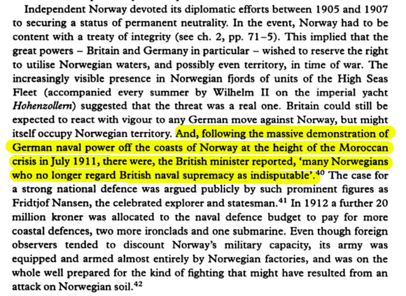

```{r setup, include=FALSE, cache=F, message=F, warning=F, results="hide"}
knitr::opts_chunk$set(cache=TRUE, warning=F, message=F)
knitr::opts_chunk$set(fig.path='figs/')
knitr::opts_chunk$set(cache.path='cache/')

knitr::opts_chunk$set(
                  fig.process = function(x) {
                      x2 = sub('-\\d+([.][a-z]+)$', '\\1', x)
                      if (file.rename(x, x2)) x2 else x
                      }
                  )
```


```{r loadstuff, include=FALSE}
knitr::opts_chunk$set(cache=TRUE)
options(knitr.kable.NA = '')
library(tidyverse)
library(stevemisc)
library(peacesciencer)
library(fixest)
library(kableExtra)
library(modelsummary)
library(patchwork)
library(ggcorrplot)

options("modelsummary_format_numeric_latex" = "plain")
```

```{r loaddata, cache=T, eval=T, echo=F, message=F, error=F, warning=F}

Mods <- readRDS("Mods.rds")
Sims <- readRDS("Sims.rds")
Data <- readRDS("Data.rds")

```

# Introduction
### Goal for Today

*Discuss what is an arms race and what we know about when they emerge.*

### MIC of the Day: The Anglo-German Rivalry Comes to Norway (MIC#1733)

```{r mic-of-the-day1, eval=TRUE, echo=FALSE}

```


###

```{r mic-of-the-day2, eval=TRUE, echo=FALSE}

```

<!-- https://books.google.com/books?id=sx3JAH0LiMEC&lpg=PA32&dq=norway+germany+july+1911&pg=PA32&hl=en#v=onepage&q&f=false -->


###

```{r, echo=F, fig.width=14, fig.height=8.5}
create_stateyears() %>% 
  filter(ccode %in% c(255, 200) & between(year, 1900, 1918)) %>%
  add_nmc() %>% select(-irst, -pec, -tpop, -upop, -cinc) %>% 
  group_by(ccode) %>% 
  mutate(perc_milex = (milex - lag(milex, 1))/lag(milex, 1),
         perc_milper = (milper - lag(milper, 1))/lag(milper, 1)) %>%
  ungroup() %>%
  select(statenme, year, perc_milex) %>%
  gather(var, val, -statenme, -year) %>%
  mutate(group = ifelse(year <= 1910, "1901-1910", "1911-1918"),
         lbl = paste0(mround(val),"%"),
         lbl = ifelse(year == 1900, NA, lbl)) %>% 
  ggplot(.,aes(as.factor(year), val, fill=statenme)) +
  theme_steve_web() +
  geom_bar(stat = "identity", color="black", position = "dodge") +
  facet_wrap(~group, scales="free") +
  scale_y_continuous(labels = scales::percent) +
  geom_text(
    aes(label = lbl),
    size = 2.5,
    vjust = -1.5, 
    position = position_dodge(.9)
  ) +
  labs(x = "", y = "Percentage Change in Military Expenditures from Previous Year",
       fill = "",
       title = "The Anglo-German Arms Race, Visualized",
       subtitle = "German military expenditures started to gradually increase in the early part of the century, resulting in a British response that carried into World War I.",
       caption = "Data: Correlates of War National Material Capabilities (v. 6.0)")
```


### The Concern About Arms Races

Arms races is really a sister topic to alliances in quantitative conflict studies.

- Clear association with (then recent) major conflicts
- Corollaries to antiquity
- Heightened salience midway into the Cold War
- Competing camps about how dangerous these are

However, the two diverge on two important things: conceptualization and operationalization.

# What is an Arms Race?
### Struggling with a Definition

Our understanding of arms races struggles with the concept.

- Implies something episodic, not constant.
- Implies a "race" and not an "increase."
- Implies directionality and equivocation, not an coincidental/incidental/unilateral build-up.

We can point to the Anglo-German naval race and "know it when we see it", but what is the "arms race" more broadly?

## Conceptualizing the Arms Race
### Richardson's (1939, 1960) "Linear Theory of Nations"

Assume two states, $x$ and $y$. We can understand their rate of defense over time in these equations...

$$
dx/dt = ky - \alpha x + g 
$$

$$
dy/dt = lx - \beta y + h
$$

...where:

- $k$ and $l$ are the defense coefficients of $x$ and $y$.
- $\alpha$ and $\beta$ are the "fatigue coefficients" of $x$ and $y$.
- $g$ and $h$ are the "grievance coefficients" of $x$ and $y$.


### Arms Races, According to Richardson

Two states in an arms competition ("arms race") are responding to three things.

- The defense of the other state (+).
- The state's *own* defenses (-).
- The animosity toward the other side (+).

Richardson's formulas suggest these could be estimated by statistical analysis.

- Military expenditures is basically the plug-in variable.


### Validity and Conceputalization

This is an intuitive conceptualization of an "arms race", but:

- It assumes a hostile relationship
- It simplifies the world to just $x$ and $y$
- It (kinda) ignores domestic concerns affecting build-ups.

Notice: the "arms race" collides with other relevant variables (rivalry, capabilities, defense burdens)

## Operationalizing the Arms Race
### Operationalizing the Arms Race

*Operationalizing* the concept of the arms race became an even bigger to-do over time.

- Major debates among the likes of Wallace (1979), Diehl (1983), and Horn (1987).

No matter, Gibler et al. (2005) basically operationalize Richardson into the arms race.


### Operationalizing the Arms Race

Gibler et al. (2005) define an arms race as:

- any dyadic rivalry relationship where
- each dyadic partner is increasing their (military) expenditures OR personnel
- eight percent or more from the previous year, for at least three years.

Thereafter, the authors remove some false positives based on some historical analysis.

- End result: 71 arms races from 1816 to 1992

###

```{r, echo=F}
grh_arms_races %>%
  filter(ccode1 %in% c(2, 200) | ccode2 == 200) %>%
  mutate(ccode1 = countrycode::countrycode(ccode1, "cown", "country.name"),
         ccode2 = countrycode::countrycode(ccode2, "cown", "country.name")) %>%
  kable(., caption="American and British Arms Races, 1816-1992",
        longtable = T, booktabs = TRUE, linesep='',
        col.names = c("Race ID", "State A", "State B", "Start Year", "End Year"),
        align = "cllcc") %>%
  kable_styling(font_size = 8) %>%
  row_spec(0, bold=TRUE) %>%
  footnote(general = "Data: Gibler et al. (2005)")
```

###

```{r, echo=F, fig.width=14, fig.height=8.5}

create_stateyears(subset_years=c(1960:1990)) %>%
  filter(ccode %in% c(200, 211, 390, 350, 325, 260, 212, 210, 235, 230, 640)) %>%
  add_nmc() %>% 
  mutate(statenme = ifelse(ccode == 260, "West\nGermany", statenme),
         statenme = ifelse(ccode == 200, "United\nKingdom", statenme)) %>%
  select(statenme, year, milex) %>%
  group_by(statenme) %>%
 # mutate(milex = (milex - lag(milex, 1))/lag(milex, 1)) %>%
  na.omit -> NATO

NATO %>% spread(statenme, milex) %>% select(-year) %>% as.matrix() %>% cor(method="pearson") %>%
  ggcorrplot(., type="lower", method = "square", lab=TRUE, legend.title = "Correlation") +
  theme_steve_web() +
  labs(x = "", y = "", fill = "", color = "",
       title = "A Correlation Matrix of NATO Military Expenditures, 1960-1990")

```


###

```{r, echo=F}
Data[[1]] %>%
  filter(ccode1 == 651 & ccode2 %in% c(663, 666, 670) & year %in% c(1966, 1967, 1968)) %>%
  select(ccode1, ccode2, year, mmb, perc_milex1, perc_milper1, perc_milex2, perc_milper2) %>%
  mutate_at(vars("perc_milex1", "perc_milper1",
                 "perc_milex2", "perc_milper2"),
            ~paste0(mround(.), "%")) %>%
  mutate(ccode1 = countrycode::countrycode(ccode1, "cown", "country.name"),
         ccode2 = countrycode::countrycode(ccode2, "cown", "country.name"))  %>%
  select(year, everything()) %>%
   kable(., caption="Egyptian Arms Races and Mutual Military Build-ups, 1966-1968",
        longtable = T, booktabs = TRUE, linesep='',
        col.names = c("Year", "State A", "State B",
                      "MMB", "% Change Milex (A)",
                      "% Change Milper (A)",
                      "% Change Milex (B)",
                      "% Change Milper (B)"),
        align = "cllccccc") %>%
  kable_styling(font_size = 6) %>%
  row_spec(c(1:3, 7:9), background="#eeeeee") %>%
  column_spec(c(5, 7), bold=TRUE, color="#00cc00") %>%
  row_spec(0, bold=TRUE, color="black") %>%
  footnote(general = "Data: CoW NMC (v. 6.0), by way of {peacesciencer}.",
           number = "Gibler et al. (2005) code an Israeli arms race (1963-1971) and Saudi arms race (1962-1968) here.")
```

## What Explains the Arms Race?
### What Explains the Arms Race?

This question gets neglected a lot in the literature.

- Major emphasis on whether they cause war or not (next lecture).
- Easy conflation of an explanation with a definition/assumption.

The cause of the arms race itself is worthy of some analysis (c.f. Rider, 2009).

- Major foreign policy gamble
- Major opportunity cost (guns/butter)


### Research Design

- Unit of analysis: non-directed rivalry dyad-years
- *DV*: Onset of an arms race/mutual military build-up
    - Arms race: Gibler et al. (2005)
    - MMB: my recreation of Gibler et al. (2005), without any other case exclusions 
    - Total *n* of interest: 71 arms races and 116 MMBs
- *IVs*: territorial rivalry, joint democracy, major power status, contiguity, CINC (W/S), min. GDP per capita, joint alliance
- *Methods/notes*: logistic regression (with rare events correction), adjustments for temporal dependence


###


```{r reg-table-1, echo=F, eval=T, fig.width = 14, fig.height = 8.5, warning = F, message = F, results="asis"}

# class(Mods[[1]]) <- c("custom", class(Mods[[1]]))
# class(Mods[[2]]) <- c("custom", class(Mods[[2]]))
# class(Mods[[3]]) <- c("custom", class(Mods[[3]]))
# class(Mods[[4]]) <- c("custom", class(Mods[[4]]))
# class(Mods[[5]]) <- c("custom", class(Mods[[5]]))
# class(Mods[[6]]) <- c("custom", class(Mods[[6]]))
# class(Mods[[7]]) <- c("custom", class(Mods[[7]]))

tidy.logistf <- function(x, ...) {
  
  data.frame(term = x$terms,
             estimate = x$coefficients, 
             std.error = diag(x$var)^0.5, 
             statistic = x$coefficients/(diag(x$var)^0.5),
             p.value = 2*pnorm(q=abs(x$coefficients/(diag(x$var)^0.5)), lower.tail=FALSE))
}


glance.logistf <- function(x, ...) {
  data.frame(
    "nobs" = x$n
  )
}

mod_list1 <- list()
class(mod_list1) <- "modelsummary_list"
mod_list1$tidy <- tidy.logistf(Mods[[1]])
mod_list1$glance <- glance(Mods[[1]])


mod_list2 <- list()
class(mod_list2) <- "modelsummary_list"
mod_list2$tidy <- tidy.logistf(Mods[[2]])
mod_list2$glance <- glance(Mods[[2]])

mod_list3 <- list()
class(mod_list3) <- "modelsummary_list"
mod_list3$tidy <- tidy.logistf(Mods[[3]])
mod_list3$glance <- glance(Mods[[3]])


modelsummary(list("Arms Races (1816-1992)" = mod_list1,
                  "MMB (1816-1992)" = mod_list2,
                  "MMB (1816-2010)" = mod_list3),
             # output="latex",  
             longtable=TRUE,
             title = "A Simple Model of Arms Race/MMB Onset",
             gof_omit = "IC|F|Log.|R2$|R2|RMSE|estimate",
             coef_map = c("spatial" = "Territorial Rivalry",
                          "landcontig" = "Land Contiguity",
                          "ndircincprop" = "CINC Proportion",
                          "bothmaj" = "Both Major Powers",
                          "onemaj" = "Major-Minor",
                          "cow_alliance" = "Joint Alliance",
                          "jointdem" = "Joint Democracy",
                          "minwbgdppc" = "Min. GDP per Capita in Dyad"),
             stars = TRUE) %>%
  row_spec(0, bold=TRUE) %>%
  kable_styling(font_size = 7)

```


### Some Takeaways

There's not a whole lot we know about arms race onset.

- Wealthier rivals are more likely to have them
- Jointly democratic rivals seem less likely to have them.


###

```{r reg-table-2, echo=F, eval=T, fig.width = 14, fig.height = 8.5, warning = F, message = F, results="asis"}


mod_list4 <- list()
class(mod_list4) <- "modelsummary_list"
mod_list4$tidy <- tidy.logistf(Mods[[4]])
mod_list4$glance <- glance(Mods[[4]])


mod_list5 <- list()
class(mod_list5) <- "modelsummary_list"
mod_list5$tidy <- tidy.logistf(Mods[[5]])
mod_list5$glance <- glance(Mods[[5]])


modelsummary(list("Arms Races" = mod_list4,
                  "MMB" = mod_list5),
             # output="latex",  
             longtable=TRUE,
             title = "A Simple Model of Arms Race/MMB Onset, 1816-1945",
             gof_omit = "IC|F|Log.|R2$|R2|RMSE|estimate",
             coef_map = c("spatial" = "Territorial Rivalry",
                          "landcontig" = "Land Contiguity",
                          "ndircincprop" = "CINC Proportion",
                          "bothmaj" = "Both Major Powers",
                          "onemaj" = "Major-Minor",
                          "cow_alliance" = "Joint Alliance",
                          "jointdem" = "Joint Democracy",
                          "minwbgdppc" = "Min. GDP per Capita in Dyad"),
             stars = TRUE) %>%
  row_spec(0, bold=TRUE) %>%
  kable_styling(font_size = 7)

```


###

```{r reg-table-3, echo=F, eval=T, fig.width = 14, fig.height = 8.5, warning = F, message = F, results="asis"}


mod_list6 <- list()
class(mod_list6) <- "modelsummary_list"
mod_list6$tidy <- tidy.logistf(Mods[[6]])
mod_list6$glance <- glance(Mods[[6]])


mod_list7 <- list()
class(mod_list7) <- "modelsummary_list"
mod_list7$tidy <- tidy.logistf(Mods[[7]])
mod_list7$glance <- glance(Mods[[7]])


modelsummary(list("Arms Races" = mod_list6,
                  "MMB" = mod_list7),
             # output="latex",  
             longtable=TRUE,
             title = "A Simple Model of Arms Race/MMB Onset, 1946-1990",
             gof_omit = "IC|F|Log.|R2$|R2|RMSE|estimate",
             coef_map = c("spatial" = "Territorial Rivalry",
                          "landcontig" = "Land Contiguity",
                          "ndircincprop" = "CINC Proportion",
                          "bothmaj" = "Both Major Powers",
                          "onemaj" = "Major-Minor",
                          "cow_alliance" = "Joint Alliance",
                          "jointdem" = "Joint Democracy",
                          "minwbgdppc" = "Min. GDP per Capita in Dyad"),
             stars = TRUE) %>%
  row_spec(0, bold=TRUE) %>%
  kable_styling(font_size = 7)

```


### More Takeaways

Disaggregating by temporal domain doesn't yield any more solid insight.

- The effect of wealth in rival dyads seems concentrated to before WW2.
- Seeming effects of territorial issues and parity on MMBs during Cold War (but not arms races).
- Joint democracy has no effect in either temporal domain.

# Conclusion
### Conclusion

Arms races are a companion topic to alliances, but come with some conceptual/measurement issues.

- Important to distinguish an "arms race" from a MMB.
- Collides with other relevant variables, like rivalry and capabilities.

What explains the arms race itself? A lot here is unclear.

- Clearly rivalry/threat, but that is a definition and not an explanation.
- There's much more interest in the effects of the arms race than the causes.