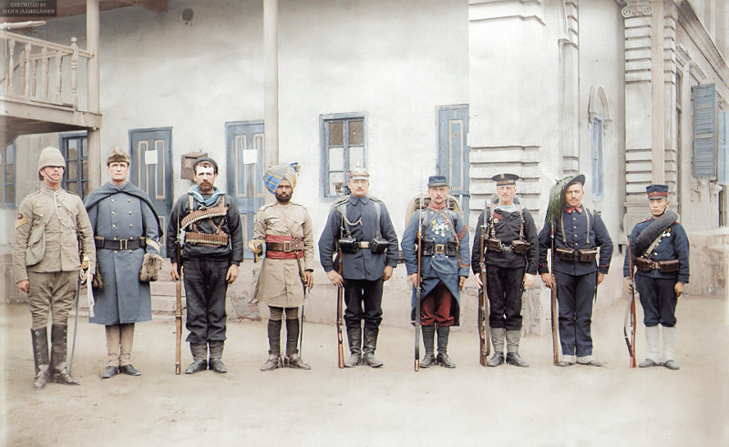
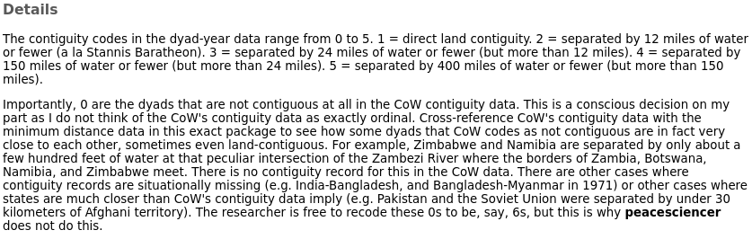
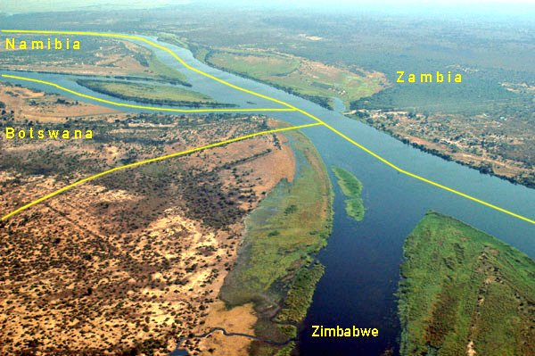

```{r setup, include=FALSE, cache=F, message=F, warning=F, results="hide"}
knitr::opts_chunk$set(cache=TRUE, warning=F)
knitr::opts_chunk$set(fig.path='figs/')
knitr::opts_chunk$set(cache.path='cache/')

knitr::opts_chunk$set(
                  fig.process = function(x) {
                      x2 = sub('-\\d+([.][a-z]+)$', '\\1', x)
                      if (file.rename(x, x2)) x2 else x
                      }
                  )
```


```{r loadstuff, include=FALSE}
knitr::opts_chunk$set(cache=TRUE, echo=FALSE, message=FALSE, warning=FALSE)
options(knitr.kable.NA = '')
library(tidyverse)
library(stevemisc)
library(peacesciencer)
library(fixest)
library(kableExtra)
library(modelsummary)
library(patchwork)

options("modelsummary_format_numeric_latex" = "plain")

```

```{r loaddata, cache=T, eval=T, echo=F, message=F, error=F, warning=F}

# NMC <- read_csv("~/Dropbox/data/cow/nmc/6.0/NMC-60-abridged.csv")
# FAS <- read.csv("~/Dropbox/data/fas-nukes/number-of-nuclear-warheads-in-the-inventory-of-the-nuclear-powers-1945-2014.csv") %>% tbl_df()
# 
Mods <- readRDS("Mods.rds")
Sims <- readRDS("Sims.rds")
Data <- readRDS("Data.rds")

# cow_ddy %>%
#   filter(ccode1 == 652 & ccode2 == 666) %>%
#   add_nmc() %>%
#   select(ccode1:year, cinc1, cinc2) %>%
#     mutate(ccode1 = "Syria",
#          ccode2 = "Israel") %>%
#   mutate(ndircincprop = ifelse(cinc1 > cinc2, cinc2/cinc1, cinc1/cinc2)) -> isr_syr
```

# Introduction
### Goal for Today

*Discuss contiguity as a 'correlate of war' (really: a correlate of confrontation onset).*

### MIC of the Day: The Boxer Rebellion (MIC#0031)

```{r eight-nations-alliance, eval=TRUE, echo=FALSE, out.width="100%"}

```


###

```{r boxer-rebellion-distances, eval=T, echo=F, message=F}
Data[[1]] %>%
  kable(., caption="The Approximate Distance (in Miles) Between China and its Boxer Rebellion Combatants in 1900",
        longtable = T, booktabs = TRUE, linesep='',
        col.names = c("State", "Minimum Distance", "Capital Distance"),
        align = c("l","c","c")) %>%
  kable_styling(font_size = 9) %>%
  row_spec(0, bold=TRUE) %>%
  footnote(general = "Data generated in {peacesciencer}, v. 0.9.9.", number = "Minimum distance: Schvitz et al. (2021). Capital distance: {peacesciencer}")


```


# Contiguity and the "Dangerous Dyads"
### Dangerous Dyads

| **Factor** | **Rank** | **Relationship** |
|:----------|:-------:|:-------------------:|
| Contiguity | 1 | + |
| Major power in the dyad | 2 | + |
| Shared alliance | 3 | - |
| Joint Militarization | 4 | + |
| Joint democracy | 5 | - |
| Jointly advanced economies | 6 | - |
| Power preponderance | 7 | - |


Table: Bremer's (1992) "Dangerous Dyads"

### The "Correlates" of War


We'll talk about democratic peace soon but Bremer (1992) regards contiguity as the strongest correlate of war.

- We just weren't sure how "important" it was.

### Contiguity

Land-contiguous states and those separated by less than 150 miles of water are disproportionately responsible for inter-state conflict.

- Wallensteen (1981): 93% of contiguous dyads have at least one MID in their history.
    - 64% have at least one war.
- Richardson (1960): Of 200 wars between 1480 and 1941, half were dyadic.
    - 75% were fought involving no more than three states.
    
### The Problem of Contiguity

If war were *just* about the balance of power, these findings wouldn't make sense.

- The balance of power concerns everyone.
- We should expect more World War Is and Thirty Years' Wars.

## Why Are Contiguous States Prone to Conflict?
### Why Are Contiguous States Prone to Conflict?

Per Vasquez' (1995) review/critique:

1. Opportunity
2. Interactions/Willingness

A theme to recur: working backward.

- Often a hunch leads to an empirical discovery, for which theoretical arguments are tailored after the fact.

### Opportunity

Conflict happens within a reach.

- Boulding (1962): loss of strength gradient.

In other words: neighbors fight because they can.

- Richardson (1960): total number of borders increases likelihood of new war participation.
- Gleditsch and Singer (1975): decreasing capital-to-capital distance increases likelihood of war onset.

### Interactions/Willingness

An argument about the denominator, so to say (e.g. Starr and Most, 1976)

- The closer states are, they more they interact.
- The more they interact, the more likely they'll find something they are willing to militarize.

If the baseline rate of war is constant, increasing the proverbial denominator is going to increase the number of observational "successes" in a series of trials (i.e. war).

## How Do We Measure Contiguity?
### Measuring Contiguity

The Correlates of War maintains a "direct contiguity" data set.

1. direct land contiguity (e.g. USA-Canada)
2. separated by 12 miles or fewer of water (e.g. USA-Russia)
3. separated by 12-24 miles of water (e.g. UK-France)
4. separated by 24-150 miles of water (e.g. USA-Cuba)
5. separated by 150-400 miles of water (e.g. UK-Germany)
6. no contiguity relationship

### A Comment on Contiguity in `{peacesciencer}`




### A Photo of the Zambezi River

```{r zambezi, eval=TRUE, echo=FALSE, out.width="100%", fig.cap = "Pictured: Namibia, Zambia, Zimbabwe, and Botswana"}

```

### A Photo of the Zambezi River (Borders Annotated)

```{r zambezi2, eval=TRUE, echo=FALSE, out.width="100%"}

```


### Foreground: America. Background: Russia

```{r diomede, eval=TRUE, echo=FALSE, out.width="100%"}

```

# A Dyadic Analysis of Contiguity and Conflict
### What Does This Look Like Dyadically?

**Unit of analysis**: non-directed dyad-year

- *dyad*: a pairing of any two states (e.g. USA-Canada, India-Pakistan)
- *year*: should be intuitive
- *non-directed*: USA-Canada and Canada-USA are observationally the same.
    - Useful for explaining simple onsets.
    - Operationally: keep the dyad where `ccode2` > `ccode1`.
    
### Dependent Variables

**Dependent Variables**: (i.e. the thing(s) we want to explain)

- *confrontation onset*: binary, indicates a unique confrontation onset in dyad-year
- *sum of minimum fatalities*: total (minimum) estimated fatalities in dyad-year
- *sum of maximum fatalities*: total (maximum) estimated fatalities in dyad-year
- *dyadic war*: whether a confrontation escalated to over 1,000 dyadic (minimum) fatalities

### Main Independent Variable(s)

**Main Independent Variable(s)**: contiguity category

- *Land contiguity*: direct land border (contiguity type == 1)
- *Other contiguity*: water border of 400 miles or fewer

In your travels, you'll see this sometimes called a "fixed effect".

- The coefficient of land contiguity is compared to "no contiguity"
- The coefficient of other contiguity is compared to "no contiguity"


###

```{r}

cow_contdir %>%
  group_by(conttype) %>%
  tally() %>%
  mutate(prop = n/sum(n),
         prop = paste0(mround(prop), "%")) %>%
  mutate(conttype = c("Land Contiguity", "12 Miles of Water or Fewer", "12-24 Miles of Water",
                      "24-150 Miles of Water", "150-400 Miles of Water")) %>%
   kable(., caption="A Summary of Direct Contiguity Relationships, 1816-2016",
        longtable = T, booktabs = TRUE, linesep='',
        col.names = c("Contiguity Type", "Number of Entries", "Percentage"),
        align = c("l","c","c")) %>%
  kable_styling(font_size = 9) %>%
  row_spec(0, bold=TRUE) %>%
  footnote(general = "Data generated in {peacesciencer}, v. 0.9.9.", number = "Correlates of War Direct Contiguity Data (v. 3.2)")
```


###

```{r}

Data[[2]] %>%
   kable(., caption="A Summary of Direct Contiguity Relationships Among Non-Directed PRDs, 1816-2014",
        longtable = T, booktabs = TRUE, linesep='',
        col.names = c("Contiguity Type", "Number of Entries", "Percentage"),
        align = c("l","c","c")) %>%
  kable_styling(font_size = 9) %>%
  row_spec(0, bold=TRUE) %>%
  footnote(general = "Data generated in {peacesciencer}, v. 0.9.9.", number = "Correlates of War Direct Contiguity Data (v. 3.2)")
```


### Control Variables

**Control Variables**:

- CINC proportion (W/S), major powers in the dyad, defense pact, joint democracy, advanced economies
- Again: a "Dangerous Dyads" type of analysis (Bremer, 1992).

**Other notes**: (i.e. things that academics care a lot about)

- Confrontation data: Gibler and Miller (Forthcoming)
- Sample: politically relevant dyads (i.e. neighbors and/or dyads with a major power)
- Onset estimated using logistic regression. 
- Fatalities estimated with Heckman sample correction, selecting on ongoing confrontations.
    - Otherwise: basic OLS ("linear regression").
- War model is probit with Heckman sample correction.
    
###

```{r reg-table-1, echo=F, eval=T, fig.width = 14, fig.height = 8.5, warning = F, message = F, results="asis"}

modelsummary(list("Conf. Onset" = Mods[[1]], "Min. Fatalities" = Mods[[3]], 
                  "Max. Fatalities" = Mods[[4]],
                  "Dyadic War" = Mods[[5]]),
             output="latex",  longtable=TRUE,
             title = "A Dangerous Dyad-ish Analysis of Inter-state Conflict",
             gof_omit = "IC|F|Log.|R2$|R2",
             coef_map = c(
                          "landcontig" = "Land Contiguity",
                          "othercontig" = "Other Contiguity",
                          "ndircincprop" = "CINC Proportion",
                          "bothmaj" = "Both Major Powers",
                          "onlyonemaj" = "Major-Minor",
                          "cow_defense" = "Defense Pact",
                          "jointdem" = "Joint Democracy",
                          "minwbgdppc" = "Min. GDP per Capita in Dyad"),
             stars = TRUE) %>%
  kable_styling(font_size = 8) %>%
  footnote(general = "I'm aware that there's a separation problem in Model 5 for joint democracy. Stay out of my mentions.")

```


### How to Interpret a Regression Table Like This

1. Find the variable(s) of interest.
2. Look for direction (positive/negative)
3. Look for "stars" (to determine statistical significance)


###

```{r reg-table-2, echo=F, eval=T, fig.width = 14, fig.height = 8.5, warning = F, message = F, results="asis"}

modelsummary(list("Conf. Onset" = Mods[[1]], "Min. Fatalities" = Mods[[3]], 
                  "Max. Fatalities" = Mods[[4]],
                  "Dyadic War" = Mods[[5]]),
             output="latex",  longtable=TRUE,
             title = "The Important Results of Our Analysis (Omitting the Control Variables)",
             gof_omit = "IC|F|Log.|R2$|R2",
             coef_map = c("landcontig" = "Land Contiguity",
                          "othercontig" = "Other Contiguity"),
             stars = TRUE)  %>%
  kable_styling(font_size = 8)  %>%
  column_spec(1, italic = FALSE, color='#000000')

```


###

```{r reg-table-3, echo=F, eval=T, fig.width = 14, fig.height = 8.5, warning = F, message = F, results="asis"}

modelsummary(list("Conf. Onset" = Mods[[1]], "Min. Fatalities" = Mods[[3]], 
                  "Max. Fatalities" = Mods[[4]],
                  "Dyadic War" = Mods[[5]]),
             output="latex",  longtable=TRUE,
             title = "The Important Results of Our Analysis (Omitting the Control Variables and Color Coded)",
             gof_omit = "IC|F|Log.|R2$|R2",
             coef_map = c("landcontig" = "Land Contiguity",
                          "othercontig" = "Other Contiguity"),
             stars = TRUE)  %>%
  kable_styling(font_size = 8) %>%
  column_spec(c(2, 3), color="#00cc00") %>%
  column_spec(c(4,5), color="#cc0000") %>%
  row_spec(5, color="#000000", bold=FALSE)

```

###

```{r reg-table-4, echo=F, eval=T, fig.width = 14, fig.height = 8.5, warning = F, message = F, results="asis"}

modelsummary(list("Conf. Onset" = Mods[[1]], "Min. Fatalities" = Mods[[3]], 
                  "Max. Fatalities" = Mods[[4]],
                  "Dyadic War" = Mods[[5]]),
            # output="latex",  longtable=TRUE,
             title = "The Important Results of Our Analysis (Omitting the Control Variables, Color Coded, Identifying Significance)",
             gof_omit = "IC|F|Log.|R2$|R2",
             coef_map = c("landcontig" = "Land Contiguity",
                          "othercontig" = "Other Contiguity"),
             stars = TRUE)  %>%
  kable_styling(font_size = 8) %>%
  column_spec(c(2, 3), color="#00cc00") %>%
  column_spec(c(4,5), color="#cc0000") %>%
  column_spec(2, bold=TRUE) %>%
  column_spec(5, bold=TRUE) %>%
  row_spec(5, color="#000000", bold=FALSE)

```

### Takeaways

*Contiguity is a correlate of confrontation onset, not confrontation escalation (to war).*

- Closer states are more likely to have confrontations.
- No real effect of contiguity on confrontation escalation/severity.

*If anything, states further from each other are more likely to escalate their confrontations to war*.

### How Does This Make Sense?

War is a kind of selection effect.

- More powerful states (e.g. hegemons) select into more remote fights.
- There are *a lot* of peculiar wars in terms of distance.
    - e.g. WW1 (e.g. USA-GER), WW2 (e.g. BRA-GER), Chincha Islands War (SPN-CHL), Boxer Rebellion (ITA-CHN), Korean War (SAF-PRK), Vietnam War (AUS-DRV), Gulf War (CAN-IRQ), Iraq War (POL-IRQ), Invasion of Afghanistan (GRC-AFG).
    
Basically: if you're going to select into a war, distance won't be much of an issue.

###

```{r sim-onset, echo=F, eval=T, fig.width = 14, fig.height = 8.5}

Sims[[1]] %>%
  mutate(y = plogis(y)) %>%
  mutate(contiguity_type = case_when(
    landcontig == 1 ~ "Land Contiguity",
    othercontig == 1 ~ "Other Contiguity",
    TRUE ~ "No Contiguity"
  )) %>%
  mutate(contiguity_type = fct_inorder(contiguity_type)) %>%
  group_by(contiguity_type) %>%
  summarize(mean = mean(y),
            lwr = quantile(y, .025),
            upr = quantile(y, .975)) %>%
  ggplot(.,aes(contiguity_type, mean, ymin=lwr, ymax=upr)) +
  geom_pointrange(size = 1.1) +
  theme_steve_web() +
  coord_flip() +
  labs(y = "Mean Probability of Confrontation Onset (with 95% Intervals)",
       x = "",
       title = "The Simulated Probability of Confrontation Onset, by Contiguity Relationship",
       subtitle = "The percentage change in probability of confrontation onset from no contiguity to water contiguity is 72%. From water to land: 105%",
       caption = "Simulation by way of multivariate normal distribution, given Model 1 in this presentation.")

```


###

```{r sim-dywar, echo=F, eval=T, fig.width = 14, fig.height = 8.5}

Sims[[2]] %>%
  mutate(y = pnorm(y)) %>%
  mutate(contiguity_type = case_when(
    landcontig == 1 ~ "Land Contiguity",
    othercontig == 1 ~ "Other Contiguity",
    TRUE ~ "No Contiguity"
  )) %>%
  mutate(contiguity_type = fct_inorder(contiguity_type)) %>%
  group_by(contiguity_type) %>%
  summarize(mean = mean(y),
            lwr = quantile(y, .025),
            upr = quantile(y, .975)) %>%
  ggplot(.,aes(contiguity_type, mean, ymin=lwr, ymax=upr)) +
  geom_pointrange(size = 1.1) +
  theme_steve_web() +
  coord_flip() +
  labs(y = "Mean Probability of Confrontation Escalation to Dyadic War (with 95% Intervals)",
       x = "",
       title = "The Simulated Probability of Confrontation Escalation to Dyadic War, by Contiguity Relationship",
       subtitle = "Contiguity is a correlate of confrontations, not necessarily a 'correlate of war'.",
       caption = "Simulation by way of multivariate normal distribution, given Model 5 in this presentation.")

```

# Conclusion
### Conclusion

We'll riff on what's wrong with the contiguity argument next session, but:

- Contiguity is often a starting point for orienting our study of inter-state conflicts.
- Traditionally: the "strongest correlate of war."

However, this isn't quite right.

- Contiguity arguments are short on the important questions of "how?" and "why?"
- Empirically: contiguity is a correlate of confrontation onset, not escalation/severity.