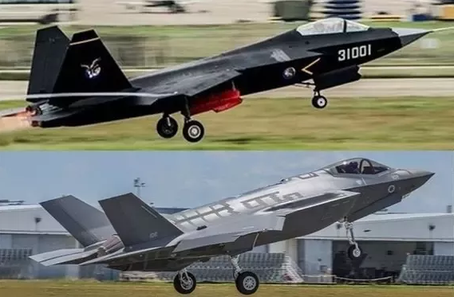

```{r setup, include=FALSE, cache=F, message=F, warning=F, results="hide"}
knitr::opts_chunk$set(cache=TRUE, warning=F, message=F, echo=FALSE, fig.width = 14, fig.height = 8.5)
knitr::opts_chunk$set(fig.path='figs/')
knitr::opts_chunk$set(cache.path='cache/')

knitr::opts_chunk$set(
                  fig.process = function(x) {
                      x2 = sub('-\\d+([.][a-z]+)$', '\\1', x)
                      if (file.rename(x, x2)) x2 else x
                      }
                  )
```


```{r loadstuff, include=FALSE}
knitr::opts_chunk$set(cache=TRUE)
options(knitr.kable.NA = '')
library(tidyverse)
library(stevemisc)
library(peacesciencer)
library(fixest)
library(kableExtra)
library(modelsummary)
library(patchwork)
library(cowplot)


options("modelsummary_format_numeric_latex" = "plain")
options(knitr.kable.NA = '')
```

```{r loaddata, cache=T, eval=T, echo=F, message=F, error=F, warning=F}

Mods <- readRDS("Mods.rds")
Sims <- readRDS("Sims.rds")
Data <- readRDS("Data.rds")

```

# Introduction
### Goal for Today

*Introduce conflict through so-called 'cyber' capabilities, and what we can say about these patterns so far.*


### MIC of the Day: Another Spratly Island Confrontation (MIC#4699)


```{r mic-of-the-day, eval=TRUE, echo=FALSE, out.width="100%"}
# 
p1 <- ggdraw() + draw_image("south-china-sea.jpeg", scale = .98)
p2 <- ggdraw() + draw_image("anti-china-protest-2011.jpg", scale = .98)

plot_grid(p1, p2)
```


### MIC#4699

- *Who*: China v. Vietnam (5 May 2011 - 5 July 2011)
- *Why*: maritime boundary dispute in the South China Sea (Spratly Islands)
- *What happened*:
    - May 2011: China patrol vessel cuts cable on Vietnamese survey boat (in DRV's waters)
    - June 2011: assorted shows of force/vessel chases between both sides
    - July 2011: Chinese soldiers board DRV fishing vessel and assault a crew member.
    
### DCID Cyber Incident of the Day: 209

```{r, eval=TRUE, echo=FALSE, out.width="50%"}

```

<!-- https://www.techinasia.com/vietnam-china-hack -->

### DCID Cyber Incident #209

- *Who*: China v. Vietnam (3 June 2011 - 6 June 2011)
- *Why*: maritime boundary dispute in the South China Sea (Spratly Islands)
    - A coordinated offensive strike to take down websites/disrupt online activities
- *What happened*:
    - Chinese hackers defaced over 200 Vietnamese websites (~10% of which were government websites)
    - Government websites targeted were non-military, mostly agricultural ministry websites
    - Apparent culprits "3King" and "Xiao Lan" were from "Honker Union", a hacker collective from Yancheng
    - Hackers also apparently stole some sensitive information from these websites as well.
    
### What is 'Cyber Conflict?'

"Cyber conflict", broadly understood (Valeriano and Manness, 2015) is:

- the use of computational technology
- for malevolent and destructive purposes to
- impact/change diplomatic/military interactions between states

Notice the phenomenon straddles how we might define things like "(militarized, inter-state) confrontations" and "terrorism".

- i.e. there are clear political aims for initiators against targets, including their respective governments.
- However, initiators/targets need not be "official" government actors/forces

### Why 'Cyber?'

The etymology of 'cyber' comes from Greek, meaning "governance."

- Real origin story: rise of 'cybernetics' in the 1940s-1960s, studying self-governing systems (e.g. thermostats, cruise control).
- 'Cyberspace' first mentioned in 1982 by (SC-born) essayist William Gibson.

Even better origin story:

> Cyber is such a perfect prefix. Because nobody has any idea what it means, it can be grafted onto any old word to make it seem new, cool — and therefore strange, spooky. [New York magazine, Dec. 23, 1996]

# The Dyadic Cyber Incident and Campaign Dataset (DCID)
## What Does 'Cyber Conflict' Look Like?
### The Dyadic Cyber Incident and Campaign Dataset (DCID)

The Dyadic Cyber Incident and Campaign Dataset (DCID) records every instance of dyadic cyber incidents from 2000-2016.

- *Units*: rival dyads (Klein et al., 2006; Thompson, 2001)
- Initiators must be governments or government-sponsored groups.
    - e.g. "Fancy Bear" (i.e. the group that hacked the DNC in 2016) is (from what we know) a GRU outfit.
    - "Berserk Bear" (i.e. the group that hacked the whole damn government from 2019 to 2020) is effectively a state-sponsored (FSB) hacker group, albeit one with a lot of freelancers.
- Targets need not be government actors.

Total number of known cyber incidents: 226

###

```{r}
Data[[1]] %>% bind_rows(., tibble(year = 2002, n = 0)) %>%
  ggplot(.,aes(year, n)) + 
  geom_bar(stat = "identity", fill="#619cff", color="black") +
  geom_text(aes(label = n), vjust = -0.2, family="Open Sans") +
  theme_steve_web() +
  scale_x_continuous(breaks = seq(2000, 2016, by = 2)) +
  labs(x = "", y ="Number of Cyber Incidents Ongoing in a Year",
       title = "The Number of Ongoing Dyadic Cyber Incidents by Year, 2000-2016",
       subtitle = "Cyber capabilities have become better developed over time. 2016 had more cyber incidents than 2000-2008 combined.",
       caption = "Data: Dyadic Cyber Incident and Campaign Dataset (DCID), v. 1.5.")

```


###

```{r}
Data[[2]] %>%# mutate(tot = sum(n))
  ggplot(.,aes(state, n)) + 
  geom_bar(stat = "identity", fill="#619cff", color="black") +
  geom_text(aes(label = n), vjust = -0.2, family="Open Sans") +
  theme_steve_web() +
  labs(x = "", y = "Number of Cyber Incidents Initiated",
       title = "All States Initiating Cyber Incidents, 2000-2016",
       subtitle = "China and Russia stand out for investing significant energy into cyber attacks. Combined, both are more than 52% of all cyber incidents in the data set.",
       caption = "Data: Dyadic Cyber Incident and Campaign Dataset (DCID), v. 1.5.")

```


###

```{r}

Data[[3]] %>%
  select(state, n) %>%
  slice(1:10) %>%
  kbl(., longtable = T, linesep = '', booktabs = TRUE,
      col.names = c("Targeted State", "Number of Cyber Incidents"),
      caption = "The States Most Targeted by Cyber Attacks, 2000-2016",
      align = "lc") %>%
  footnote(general = "Data: Dyadic Cyber Incident and Campaign Dataset (DCID), v. 1.5.") %>%
  row_spec(0, bold=TRUE) %>%
  kable_styling(font_size = 9)

```

###

```{r}

Data[[4]] %>%
 # select(state, n) %>%
  slice(1:10) %>%
  kbl(., longtable = T, linesep = '', booktabs = TRUE,
      col.names = c("Dyad", "Number of Cyber Incidents"),
      caption = "The Dyads with the Most Dyadic Cyber Incidents, 2000-2016",
      align = "lc") %>%
  footnote(general = "Data: Dyadic Cyber Incident and Campaign Dataset (DCID), v. 1.5.")  %>%
  row_spec(0, bold=TRUE) %>%
  kable_styling(font_size = 9)
```

### Target Types

<!-- https://www.cbsnews.com/news/russian-hack-almost-brought-the-u-s-military-to-its-knees/ -->

Cyber incidents go after one of three groups in a state.

1. Private/non-state (e.g. the Sony hack in 2014 [incident 101])
2. Government/non-military (e.g. China's hack of Vietnam in 2011)
3. Government/military (e.g. Russia momentarily seized the JCS' [unclassified] email system in March 2015 [incident: 19])


### The Sony Hack (#101)

```{r, eval=TRUE, echo=FALSE, out.width="95%"}

```

### The Sony Hack (#101)

On 24 Nov. 2014, a DPRK hacker group ("Guardians of Peace") leaked 100 TBs of Sony's data. Including:

- personal information about employees
- email communication between employees
- Copies of upcoming films/plans for future films

*Why*: Sony produced *The Interview*, a then forthcoming film about a plot to assassinate Kim Jong-un.

- The group demanded Sony withdraw the film, threatening terror attacks against cinemas that showed it.

*What happened*: 

- Sony withdrew *The Interview* and cancelled all premieres.
- Sony lost about $35 million on IT repairs, and ate about $30 million on the film.


###

```{r}
Data[[5]] %>%
  select(cat, n) %>%
  #slice(1:10) %>%
  kbl(., longtable = T, linesep = '', booktabs = TRUE,
      col.names = c("Target Type", "Number of Cyber Incidents"),
      caption = "Targets of Dyadic Cyber Incidents, 2000-2016",
      align = "lc") %>%
  footnote(general = "Data: Dyadic Cyber Incident and Campaign Dataset (DCID), v. 1.5.")  %>%
  row_spec(0, bold=TRUE) %>%
  kable_styling(font_size = 9)
```

### Cyber Objectives

Analogous to terrorism, different cyber incidents carry different cyber objectives.

1. Disruption
2. Short-term espionage
3. Long-term espionage
4. Degradation 

### The Lockheed F-35 Hack (#66)

```{r, eval=TRUE, echo=FALSE, out.width="95%"}

```

###

```{r}
Data[[6]] %>%
  select(cat, n) %>%
  #slice(1:10) %>%
  kbl(., longtable = T, linesep = '', booktabs = TRUE,
      col.names = c("Objective Type", "Number of Cyber Incidents"),
      caption = "Objective Types of Dyadic Cyber Incidents, 2000-2016",
      align = "lc") %>%
  footnote(general = "Data: Dyadic Cyber Incident and Campaign Dataset (DCID), v. 1.5.")  %>%
  row_spec(0, bold=TRUE) %>%
  kable_styling(font_size = 9)
```


### Cyber Methods

1. Vandalism
2. DDoS attacks
3. Network intrusion
4. Network infiltration
    - 1. Logic bombs
    - 2. Viruses
    - 3. Worms
    - 4. Keystroke logging

###

```{r}
Data[[7]] %>%
  select(cat, n) %>%
  #slice(1:10) %>%
  kbl(., longtable = T, linesep = '', booktabs = TRUE,
      col.names = c("Method Type", "Number of Cyber Incidents"),
      caption = "The Methods of Dyadic Cyber Incidents, 2000-2016",
      align = "lc") %>%
  footnote(general = "Data: Dyadic Cyber Incident and Campaign Dataset (DCID), v. 1.5.")  %>%
  row_spec(0, bold=TRUE) %>%
  kable_styling(font_size = 9)
```

## The U.S. and Cyber Conflict
### 

```{r}
Data[[8]] %>%
  group_by(us_initiator, stateb) %>%
  count() %>%
  mutate(cat = ifelse(us_initiator == 0, "U.S. is Target", "U.S. is Initiator")) %>%
  group_by(cat) %>%
  mutate(tot = sum(n)) %>%
  ungroup() %>%
  mutate(perc = n/tot,
         perc = make_perclab(perc),
         lbl = paste0(n," (", perc, ")")) %>%
  ggplot(.,aes(stateb, n)) + 
  geom_bar(stat = "identity", fill="#619cff", color="black") +
  geom_text(aes(label = lbl), vjust = -0.2, family="Open Sans") +
  facet_wrap(~cat, scales="free_x") +
  theme_steve_web() +
  labs(x = "", y = "Number of Cyber Incidents",
       title = "The Dyadic Nature of U.S. Cyber Incidents by Initiator and Target, 2000-2016",
       subtitle = "The U.S. is the target of 36% of incidents in the whole data set, most of which are initiated by China.",
       caption = "Data: Dyadic Cyber Incident and Campaign Dataset (DCID), v. 1.5.")

```

### 

```{r}
Data[[8]] %>%
  group_by(us_initiator, targettype) %>%
  count() %>%
  mutate(targ_type = case_when(
    targettype == 1 ~ "Private/non-state",
    targettype == 2 ~ "Government (Non-military)",
    targettype == 3 ~ "Government (Military)"
  )) %>%
  mutate(targ_type = fct_inorder(targ_type)) %>%
  mutate(cat = ifelse(us_initiator == 0, "U.S. is Target", "U.S. is Initiator")) %>%
  group_by(cat) %>%
  mutate(tot = sum(n)) %>%
  ungroup() %>%
  mutate(perc = n/tot,
         perc = make_perclab(perc),
         lbl = paste0(n," (", perc, ")")) %>%
  ggplot(.,aes(targ_type, n)) + 
  geom_bar(stat = "identity", fill="#619cff", color="black") +
  geom_text(aes(label = lbl), vjust = -0.2, family="Open Sans") +
  facet_wrap(~cat, scales="free_x") +
  theme_steve_web() +
  labs(x = "", y = "Number of Cyber Incidents",
       title = "The Target Type of U.S. Cyber Incidents, whether U.S. is Initiator or Target (2000-2016)",
       subtitle = "The U.S. cyber capabailities go after the military of the target. By contrast, U.S. rivals have typically attacked private or non-military actors in the United States.",
       caption = "Data: Dyadic Cyber Incident and Campaign Dataset (DCID), v. 1.5.")

```

### 

```{r}
Data[[8]] %>%
  group_by(us_initiator, cyber_objective) %>%
  count() %>%
  mutate(obj_type = case_when(
    cyber_objective == 1 ~ "Disruption",
    cyber_objective == 2 ~ "Short-term Espionage",
    cyber_objective == 3 ~ "Long-term Espionage",
    cyber_objective == 4 ~ "Degradation"
  )) %>%
  mutate(obj_type = fct_inorder(obj_type)) %>%
  mutate(cat = ifelse(us_initiator == 0, "U.S. is Target", "U.S. is Initiator")) %>%
  group_by(cat) %>%
  mutate(tot = sum(n)) %>%
  ungroup() %>%
  mutate(perc = n/tot,
         perc = make_perclab(perc),
         lbl = paste0(n," (", perc, ")")) %>%
  ggplot(.,aes(obj_type, n)) + 
  geom_bar(stat = "identity", fill="#619cff", color="black") +
  geom_text(aes(label = lbl), vjust = -0.2, family="Open Sans") +
  facet_wrap(~cat, scales="free_x") +
  theme_steve_web() +
  labs(x = "", y = "Number of Cyber Incidents",
       title = "The Objective Type of U.S. Cyber Incidents, whether U.S. is Initiator or Target (2000-2016)",
       subtitle = "The U.S. cyber capabailities often focus on degrading the capacity of the target (e.g. Stuxnet). Almost 75% of the time, the U.S. itself is targeted in espionage campaigns.",
       caption = "Data: Dyadic Cyber Incident and Campaign Dataset (DCID), v. 1.5.")

```


### 

```{r}
Data[[8]] %>%
  group_by(us_initiator, method) %>%
  count() %>%
  mutate(method_type = case_when(
    method == 1 ~ "Vandalism",
    method == 2 ~ "DDos Attacks",
    method == 3 ~ "Network Intrusion",
    TRUE ~ "Network Infiltration"
  )) %>%
  mutate(method_type = fct_inorder(method_type)) %>%
  group_by(us_initiator, method_type) %>%
  summarize(n = sum(n)) %>%
  mutate(cat = ifelse(us_initiator == 0, "U.S. is Target", "U.S. is Initiator")) %>%
  group_by(cat) %>%
  mutate(tot = sum(n)) %>%
  ungroup() %>%
  mutate(perc = n/tot,
         perc = make_perclab(perc),
         lbl = paste0(n," (", perc, ")")) %>%
  ggplot(.,aes(method_type, n)) + 
  geom_bar(stat = "identity", fill="#619cff", color="black") +
  geom_text(aes(label = lbl), vjust = -0.2, family="Open Sans") +
  facet_wrap(~cat, scales="free_x") +
  theme_steve_web() +
  labs(x = "", y = "Number of Cyber Incidents",
       title = "The Method of U.S. Cyber Incidents, whether U.S. is Initiator or Target (2000-2016)",
       subtitle = "American cyber sophistication allows for greater focus on more complicated attacks. Other states, by contrast, focus on trojans and 'backdoors' to gain access to a target's network.",
       caption = "Data: Dyadic Cyber Incident and Campaign Dataset (DCID), v. 1.5.")

```

# Conclusion
### Conclusion

- Cyber incidents emerged as tools for weaker (but still sophisticated) states to signal dissatisfaction with rivals.
- Cyber aims are often limited, as are the cyber methods.
