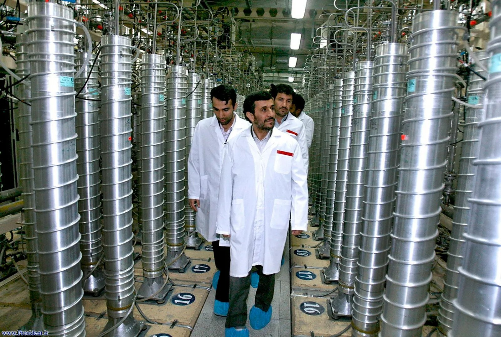
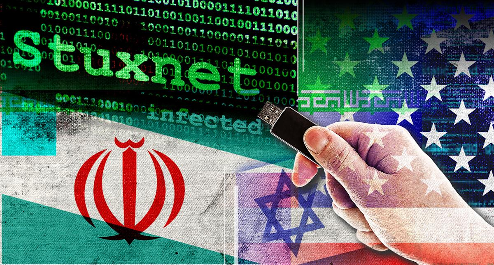
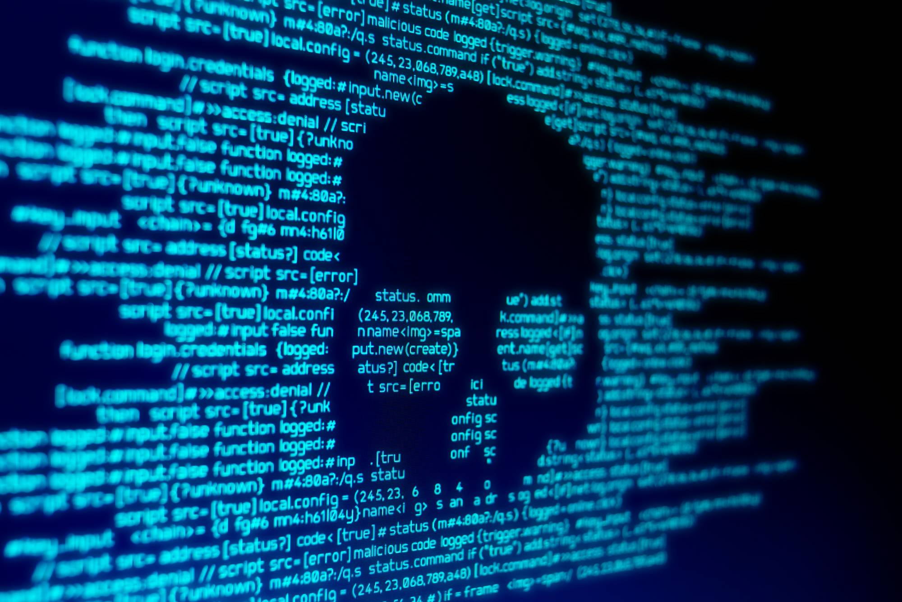
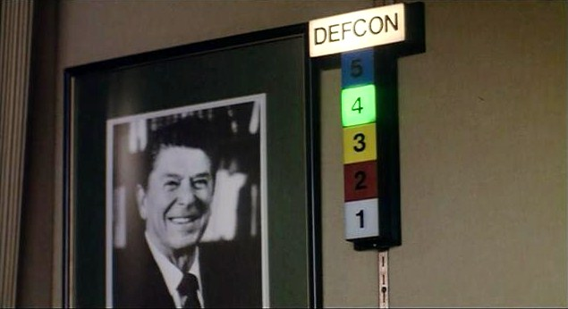
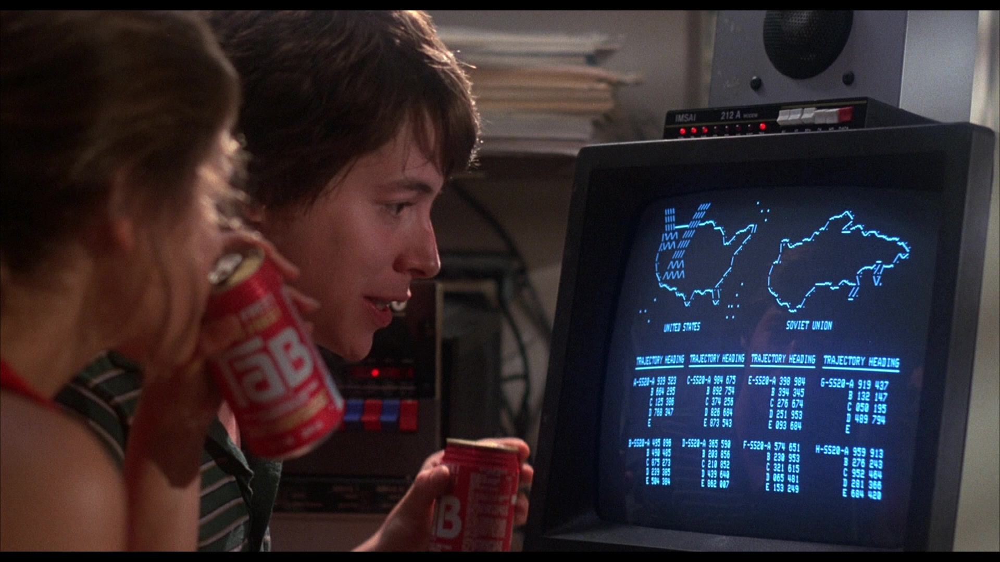

```{r setup, include=FALSE, cache=F, message=F, warning=F, results="hide"}
knitr::opts_chunk$set(cache=TRUE, warning=F, message=F, echo=FALSE, fig.width = 14, fig.height = 8.5)
knitr::opts_chunk$set(fig.path='figs/')
knitr::opts_chunk$set(cache.path='cache/')

knitr::opts_chunk$set(
                  fig.process = function(x) {
                      x2 = sub('-\\d+([.][a-z]+)$', '\\1', x)
                      if (file.rename(x, x2)) x2 else x
                      }
                  )
```


```{r loadstuff, include=FALSE}
knitr::opts_chunk$set(cache=TRUE)
options(knitr.kable.NA = '')
library(tidyverse)
library(stevemisc)
library(peacesciencer)
library(fixest)
library(kableExtra)
library(modelsummary)
library(patchwork)
library(cowplot)


options("modelsummary_format_numeric_latex" = "plain")
options(knitr.kable.NA = '')
```

```{r loaddata, cache=T, eval=T, echo=F, message=F, error=F, warning=F}

DCID <- read_csv("~/Dropbox/data/cyber-incidents/DCID Version 1.5_public_final.csv") %>%
  mutate(interactionstartdate = as.Date(interactionstartdate, '%m/%d/%Y'),
         interactionenddate = as.Date(interactionenddate, '%m/%d/%Y')) %>%
  rename_all(tolower) %>%
  select(cyberincidentnum, dyadpair, initiator, everything()) 

DCID %>%
  mutate(interactionenddate = case_when(
    cyberincidentnum == 27 ~ as.Date('2010/06/01'),
    cyberincidentnum == 51 ~ as.Date('2006/07/07'),
    cyberincidentnum == 261 ~ as.Date('2014/10/10'),
    TRUE ~ interactionenddate
  )) -> DCID

# I think a few start/end dates got crossed.
# See: incidnum 150, 151

DCID %>%
  mutate(stdate = case_when(
    cyberincidentnum %in% c(150, 151) ~ interactionenddate,
    TRUE ~ interactionstartdate
  ),
  enddate = case_when(
    cyberincidentnum %in% c(150, 151) ~ interactionstartdate,
    TRUE ~ interactionenddate
  )) -> DCID

DCID %>%
  mutate(ccodea = countrycode::countrycode(statea, "country.name", "cown"),
         ccodeb = countrycode::countrycode(stateb, "country.name", "cown")) %>%
  mutate(target = ifelse(initiator == ccodea, ccodeb, ccodea)) %>%
  select(cyberincidentnum, dyadpair, initiator, target, everything())  -> DCID
# Mods <- readRDS("Mods.rds")
# Sims <- readRDS("Sims.rds")
# Data <- readRDS("Data.rds")

```

# Introduction
### Goal for Today

*Discuss whether cyber conflict is the future of inter-state confrontations.*


### MIC of the Day: MIC#4535


```{r mic-of-the-day, eval=TRUE, echo=FALSE, out.width="90%"}

# p1 <- ggdraw() + draw_image("south-china-sea.jpeg", scale = .98)
# p2 <- ggdraw() + draw_image("anti-china-protest-2011.jpg", scale = .98)
# 
# plot_grid(p1, p2)
```


### MIC#4535

- *Who*: Iran v. United States (Sept. 2006 - 29 Aug. 2007)
- *Why*: Iran's nuclear program 
- *What happened*:
    - Sept. 2006: Iran fires on U.S. forces across border
    - 11 Jan. 2007: U.S. seizes Iranian consulate in Iraq, confiscating documents
    - March-April: shows of force by U.S. against Iran
    
### DCID Cyber Incident of the Day: Stuxnet (#29)

```{r, eval=TRUE, echo=FALSE, out.width="95%"}

```

<!-- https://www.techinasia.com/vietnam-china-hack -->

### Stuxnet

<!-- https://www.wired.com/2014/11/countdown-to-zero-day-stuxnet/ -->

- *Who*: U.S. v. Iran (June 1, 2009 - Oct. 1, 2010)
- *Why*: disrupt Iran's nuclear development program
- *What happened*:
    - Preceded by another version of same worm (#27)
    - Malware developers (U.S. + Israel) developed/deployed the so-called "first digital super weapon."
    - A worm spread throughout Iran, targeting nuclear contractors in orbit of Iran's nuclear program.
    - It eventually landed at the Natanz nuclear facility and burned out about 20% of the facilities centrifuges.


### Is 'Cyber Conflict' the Future of Conflict?

```{r, eval=TRUE, echo=FALSE, out.width="95%"}

```

# The Cyber Debate
### The Debate

The debate is typically set up between two camps. 

1. Cyber revolutionaries
2. Cyber skeptics

## Revolutionaries vs. Skeptics
### The Cyber Revolution

Lucas Kello (2013) argues scholars ignore cyber conflict at their own risk.

- Cyber weaponry is expanding the range of possible harms.
- Clear precedent to how else new technology has altered conflict (e.g. tanks, U-boats)
- Technological advances outpace our capacity to understand their harms.
- Cyber capabilities shift balance to offense, further undermining stability.
- Attribution issues pervade this frontier as well.

### *WarGames* (1983)

```{r, eval=TRUE, echo=FALSE, out.width="95%"}

```

### *WarGames* (1983)

In this movie, Matthew Broderick:

- Uses his trusty IMSAI 8080 to backdoor through a modem in Sunnyvale, CA to the Cheyenne Mountain Complex
- Triggers a war game (WOPR) that NORAD set up to automate launch control centers
- Cos-plays as the Soviet Union, targeting American cities
- Momentarily convinces NORAD that the Soviets are actually attacking
- Has to trick the computer (otherwise planning a massive response to the Soviets) to learn about no-win situations through tic-tac-toe.
- Induces WOPR to explore no-win scenarios before the launch, thus avoiding the annihilation of all humanity.
- Has a lady friend played by Ally Sheedy (aka the "Basket Case" from *The Breakfast Club*).

### *WarGames* (1983)

```{r, eval=TRUE, echo=FALSE, out.width="90%"}

```

In response to this movie, Ronald Reagan set up the first national task force (NSDD-145) to explore American cyber vulnerabilities.

### Cyber Skepticism

Cyber skeptics dismiss the revolutionary claims here.

- Cyber may be a new domain of conflict, but conflict is still the domain of soldiers on the field.
- We may see (and are seeing more of it), but don't expect it to fundamentally transform conflict processes between states.

## Reasons for Skepticism
### Why Not?


```{r, eval=TRUE, echo=FALSE, out.width="95%"}

```

### Cyber Conflict Has Limited Utility

Think of the classic understanding of coercion (Schelling, 1980).

- Compellence: target does something it otherwise wouldn't.
- Deterrence: target doesn't do something it wants to do.
- For both: initiating state signals rewards/punishments to alter target behavior.

The cyber domain doesn't map neatly to this domain.

- Initiator threats lack credibility/reassurance
- Initiating states don't typically tether threats to policy.

We've seen some change in behavior here (i.e. *Solarium*, recent threats from the U.S.)

- But the difficulty is real, as is the lack of utility.

### 

```{r}
DCID %>% group_by(`concession`) %>% tally() %>%
  mutate(concession = c("No Concessionary Behavioral Change",
                        "Concessionary Behavioral Change")) %>%
  kbl(., caption = "Concessionary Behavioral Changes from Cyber Incidents, 2000-2016",
      longtable = TRUE, booktabs = TRUE,
      align = "lc",
      col.names = c("Cyber Incident Outcome", "N")) %>%
  row_spec(0, bold=TRUE) %>%
  footnote(general = "Data: Dyadic Cyber Incident and Campaign Dataset (DCID), v. 1.5.")
```

### Cyber Offense Depends on a Failure of Cyber Defense

<!-- This is trivially true of a lot of things, but there's something important here. -->

Stuxnet's sophistication belies the kind of cyber incidents we typically see.

- Very few incidents are degradation efforts.
- Relatively few incidents infiltrate networks.

"The best offense is a good defense."


### The OPM Hack (#88)

```{r, eval=TRUE, echo=FALSE, out.width="65%"}

```


### Cyber Conflict Has Had Limited Impact

Again, Stuxnet is an anomaly.

- Very few incidents involve physical damage like that.
- There has yet to be a fatality associated with cyber conflict.
- It's difficult to conjure plausible (i.e. non-sci-fi) paths toward it.

### DCID's Severity Scale

1. Probing/packet sniffing
2. Harassment, propaganda, nuisance
3. Stealing critical information
4. Widespread network intrusion
5. Critical infiltration, destruction
6. Critical infiltration, widespread destruction
7. Minimal death (e.g. hacking a car or pacemaker)
8. Critical economic disruption (e.g. shutting down the NYSE)
9. Critical infrastructure shutdown (e.g. power grid hack)
10. Massive death (e.g. Ferris Bueller doesn't save the day)

###

```{r}

DCID %>% group_by(severity) %>%
  tally() %>%
  mutate(severity = c("Probing/packet sniffing",
                      "Harassment, propaganda, nuisance",
                      "Stealing critical information",
                      "Widespread network intrustion",
                      "Critical infiltration, destruction",
                      "Critical infiltration, widespread destruction")) %>%
  mutate(example = c("Operation SnowMan", "Las Vegas Sands Hack",
                     "Spratly island dispute", "2016 presidential election hack(s)",
                     "Stuxnet", "Left of Launch")) %>%
  select(severity, example, n) %>%
   kbl(., caption = "The Severity of Cyber Incidents, 2000-2016",
      longtable = TRUE, booktabs = TRUE,
      align = "llc", linesep = '',
      col.names = c("Severity Scale", "Example", "N")) %>%
  row_spec(0, bold=TRUE) %>%
  footnote(general = "Data: Dyadic Cyber Incident and Campaign Dataset (DCID), v. 1.5.") %>%
  kable_styling(font_size = 9)
```

# Conclusion
### Conclusion

There are plenty of good reasons to be interested in the trajectory of cyber conflict.

- New technology
- Information/misinformation
- Repressive tool

But do not expect a cyber war to come.

- Cyber conflict is still connected to conflict.
- Cyber aims are typically limited.
- Cyber offense has limited effect.