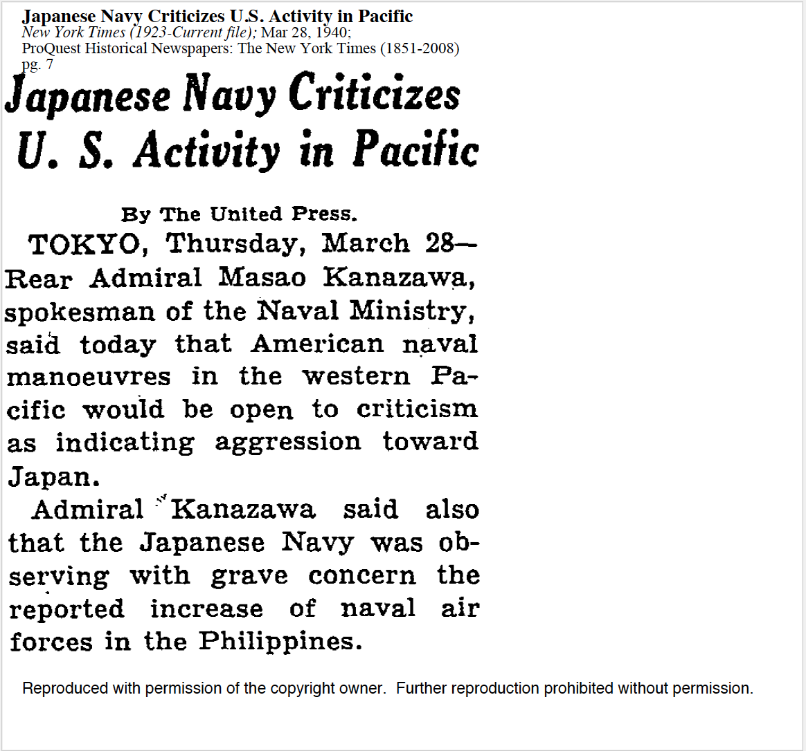
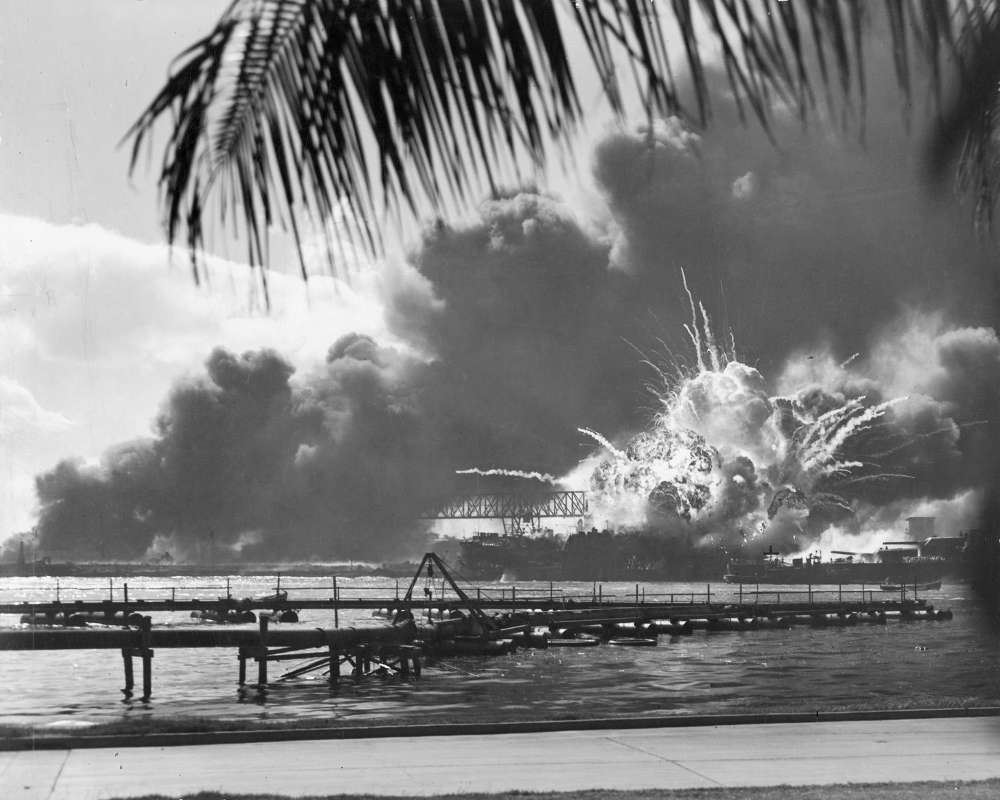
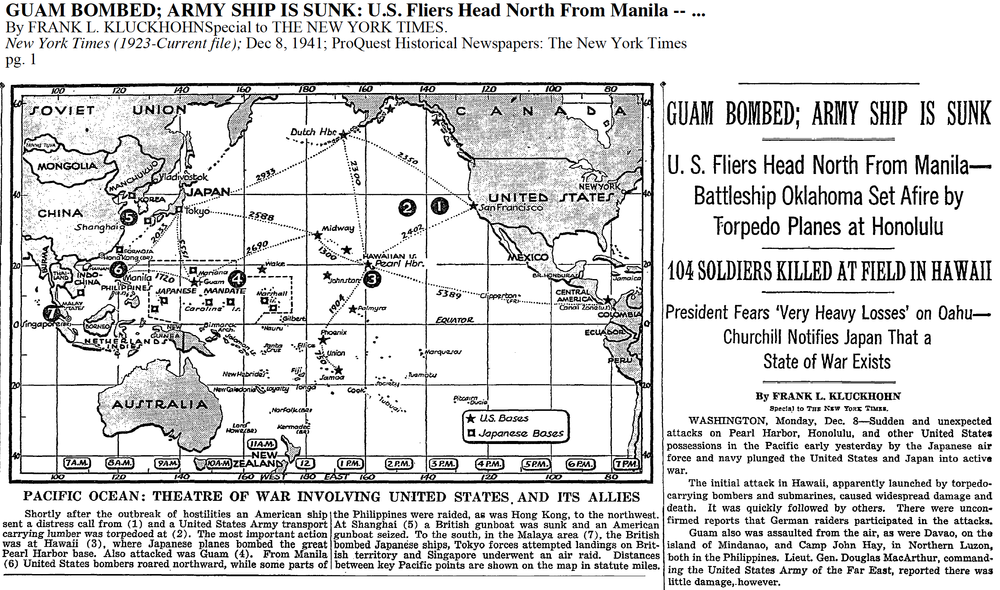
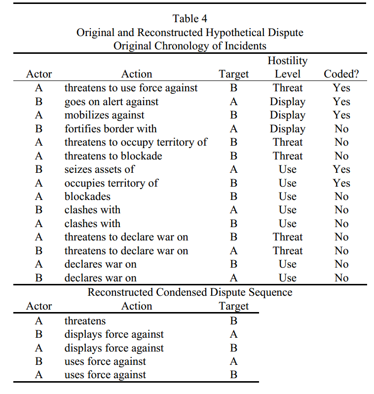

# Introduction

<!-- ### What's the Diehl (2006) article about?

Someone tell me what this article is about...

- Btw, I will do this every class lecture. Get used to it. 

### Introduction

This is actually a presidential address to Peace Science Society.

- It summarizes the state of conflict research for the 2005 annual meeting.

For the purpose of this class, Diehl asks "what is inter-state conflict?"

- He provides a nice survey of the conflict literature too. -->

### Conflict as Process

Overall message: think of conflict as process.

- Processes are multiple, not a phenomenon that is strictly present or absent.
- He critiques a myopic view of conflict that is confined to single, isolated stages, contingent on research question.

# Phases of Conflict
### Phases of Conflict

Diehl suggests four phases to inter-state conflict.

1. Initiation
2. Escalation
3. War Dynamics
4. Post-War

## Initiation
### Initiation

A conflict is started when two states enter into a militarized interstate dispute

- We'll note later: this is the first *threat*, *display*, or *use* of military force.

<!-- ### Initiation

For example, Americans tend to think war with Japan started with Pearl Harbor attack.

- Thus, the U.S. immediately entered ongoing World War II.

This is a mistake. The conflict was initially over Japanese policy in SE Asia.

- U.S. threatened military reprisal for compromising Thailand's sovereignty.
- What better way to neutralize the U.S. ability to follow through that threat than... -->

### The Initiation of MID#0339

### The Conclusion of MID#0339

### The Conclusion of MID#0339

### Origins of Prominent Conflicts

- World War I: Austria threat to declare war after 10 demands to Serbia.
- World War II (Europe): UK/France threat to Germany re: Polish independence.
- World War II (Pacific): A U.S. show of force regarding Japanese encroachment on the Dutch East Indies.
- Gulf War I: Stop slant drilling, or else...

Note: we operationalize initiation as first threat, display, or use of force.

## Escalation
### Escalation

This is phase is post-initiation when two states are at risk of spiraling toward war. Consider July Crisis:

- Austria delivers 10 demands to Serbia.
- Serbia momentarily acquiesces, but negotiates for five days.
- Serbia and Russia mobilize.
- Germany supports Austria, threatens Russia.
- France threatens both Central Powers.

Austria declares war against Serbia. Russia declares war five days later. Germany declares war against Russia. France declares war against both Austria and Germany. UK joins them.

- WWI started as an Austrian threat to use force.
- It escalated from there.

### Escalation

Not all disputes escalate to war.

- 155 of 2,300 MIDs between 1816-2001 escalated to war.

Consider the Trent Affair.

- It started as an American (i.e. Union) seizure of HMS Trent.
- It ended with an apology from Lincoln.
- Britain eagerly accepted.

Motivating question: what disputes escalate to war and why?

## War Dynamics
### War Dynamics

Examples of academic research in this phase include: 

- Duration of war.
    - e.g. First Schleswig-Holstein War lasted three years.
    - Second Schleswig-Holstein War lasted six months.
- Who wins the war.
    - In the previous case: Denmark won the first. 
    - Prussia easily won the second.
- Overall fatalities in the war
    - Important: war is a battle-death threshold.
- Whether the war become multilateral

Overall concern: the properties of the war and behavior of states in it.

## Post-War
### Post-War

Interesting research agenda: states that have already fought a war tend to do it again.

-  Example: Russia and Turkey have fought 12 wars since the 16th century.
-  Wars also recur within the rivalry context (e.g. India-Pakistan).

Other questions:

- Which type of peace agreements lead to lasting peace?
- How long until agreements are abrogated?

This phase begins with the end of the war and ends with onset of next conflict.

# Militarized Interstate Disputes
<!-- ### What's the Jones et al. (2006) article about?

Someone tell me what this article is about...

### Jones et al. (1996)

This article is what we would call a "data feature."

-   Simply, it introduces a version of the Correlates of War (CoW) Militarized Interstate Dispute (MID) data set as we know it now.

Why have this data set?

-   It builds on earlier versions from CoW that looked at “serious
    disputes”.

-   Attempts toward a resolution of other methodological disagreements
    and spatial-temporal domain limitations of other data sets.

    -   Examples: COPDAB, WEIS, BCOW, MID1

All told, IR scholarship was unique for being so theory-rich and
data-poor at the time.

-   This is still mostly true. -->

### Why Study MIDs?

Beyond other data concerns, MIDs are useful in understanding our
overall question of the causes of war. 

-   What causes war is the motivating question of our discipline.
-   However, we can’t look at just wars to see what causes it.
    -   This is the cardinal sin of "selecting on the dependent
        variable."
-   Thus, we need to know what MIDs, once initiated, escalate toward war
    and what MIDs do not.

Data limitations led to an earlier concern for "crises" (e.g.
Agadir Crisis, July Crisis).

- CoW-MID is universal (since 1816) and includes MIDs at much lower levels of hostility and "seriousness."
    
### What Is a MID?

A MID is a united historical case in which one state system member
threatened, display, or outright used military force against the
government, or official representatives, property, or territory of the
government (p. 168).

-   *Militarized:* stakes must be sufficiently important to warrant threat, display, or use of force.
-   *Interstate*: restricts focus off strictly domestic conflagrations.
-   *Dispute*: disagreement over how to resolve one or more issues.

### Incident Coding Rules

There are seven criteria for evaluating if a particular action is a
militarized incident.

1.  Must be between state system members.
2.  Must not be authorized by treaty or invitation of a “target” state.
3.  Must be explicit, non-routine, and government-authorized.
    -   "Vague" actions are included only if Side B responds.
4.  Must be done by official forces of the government.
    -   Local forces tend to count in the developing world.
5.  Will not be treated as separate if two states are at war.
6.  Actions against private property do not count.
    -   Exceptions: (At least 24-hour) seizures, attacks on
        international shipping, pursuit of rebels across borders.
    -   *However*, Side B must respond militarily or
        diplomatically!
7.  Territorial claims must be in a well-defined geographic area.

### Categorizing Militarized Incidents

Militarized Incidents have three categories. 

1. Threats of force
2. Displays of force
3. Use of force

### Threats of Force

Threats are verbal indications of hostile intent, often cloaked in ultimatums. Examples:

- Threats to use force
- Threat to blockade
- Threat to occupy territory
- Threat to declare war
- Threat to use nuclear weapons

### Displays of Force

Displays of force are military demonstrations without actual combat. Examples:

- Alert
- Mobilization
- Show of force (includes airspace/maritime violations)
- Border fortification
- Nuclear alert
- Border violation (by land only)

### Use of Force

Use of force, the highest category, involve active military operations. Examples:

- Blockade
- Occupation of territory
- Seizure
- Attack, Clash
- Raid
- Declaration of war
- Use of CBRN weapons

<!-- ### Sequencing Militarized Incidents

 -->

## Aggregating Incidents to Disputes
### Aggregating Incidents to Disputes

In order to ensure incidents are aggregated to "united, historical cases" (i.e. disputes), CoW-MID employs the following aggregation procedures.

1. All incidents must involve same or overlapping set of state system members.
    - Not a problem in a dyadic dispute.
    - In multilateral disputes, actions must be coordinated among or against multiple state system members.
2. Each issue and geographic dispute area must be discrete, unless historical evidence suggests two seemingly separate issues are in fact connected.

### Aggregating Incidents to Disputes

3. There are specific rules for start dates and end dates.
    - Start date is the date of the first militarized incident.
    - **End date without any type of resolution:** last militarized incident, if no other incident occurs for six months afterward.
    - **End date with formal resolution:** date of formal resolution, if no other incident occurs for one month afterward.
    - **End date with cease-fire:** date of cease-fire, if no other incident occurs for three months afterward.
    
This rule also introduces "six-month counts" into the data.

-  Observed for ``continuous actions'' like seizures, blockades, occupations of territory or show of force.
- Start date is the first militarized incident.
- End date is six months after the continuous action if there is no other militarized incident.

### Aggregating Incidents to Disputes

4. Disputes that escalate to war end other ongoing disputes between state system members.
    - Every militarized incident is then coded as part of the war.
5. In cases of MIDs within context of civil war, whichever side controls the capital is "the government."
    - Turnover in government during a civil war may mark the end of a MID.
6.  Disputes and wars of independence are included only if there are at least one state system member on each sides.
7.  MID ``joiners'' have different start dates and possibly different end dates. 

## Other Attributes of CoW-MID Data Set
### Other Attributes of CoW-MID Data Set

The data set also codes for other attributes of a MID.

-   Revisionist character
    -   Which side is dissatisfied with the status quo and wants to change it?
-   Dispute outcome
    -   Victory (Side A/B), Yield (Side A/B), Stalemate, Compromise, Released
-   Method of settlement
    -   Negotiated, Imposed, None
-   Issue
    -   Territory, Policy, Regime

# Conclusion
### Conclusion

Some things to consider going forward:

- Selection effects: non-random incidence of conflict initiation?
- Rational choice models: is conflict initiation exogenous?
- Issues (and even regime type): is the war-proneness or pacifying effect observed at all phases of conflict?

### Conclusion

*Be clear with your terms.*

- "Conflict" is a process with four phases.
- A "MID" is a disagreement over an issue between two states that includes a threat, display, or use of force.

This is the language we'll be using in this class.

- It also gives us a measurement of the overall concepts we want.
