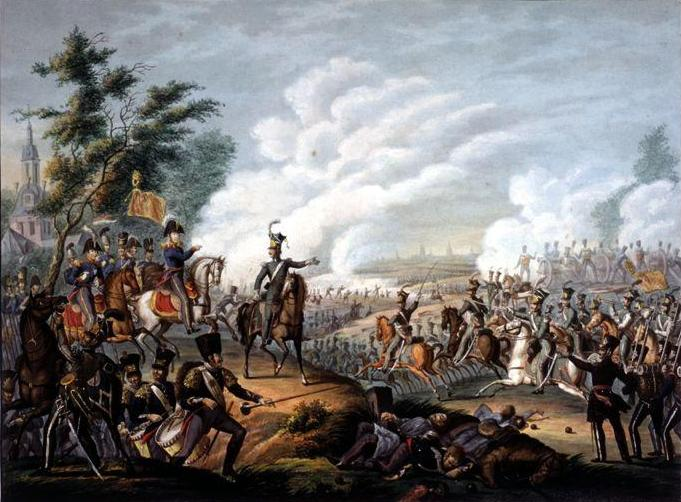

```{r setup, include=FALSE, cache=F, message=F, warning=F, results="hide"}
knitr::opts_chunk$set(cache=TRUE, warning=F, message=F)
knitr::opts_chunk$set(fig.path='figs/', fig.width = 14, fig.height = 8.5)
knitr::opts_chunk$set(cache.path='cache/')

knitr::opts_chunk$set(
                  fig.process = function(x) {
                      x2 = sub('-\\d+([.][a-z]+)$', '\\1', x)
                      if (file.rename(x, x2)) x2 else x
                      }
                  )
```


```{r loadstuff, include=FALSE}
knitr::opts_chunk$set(cache=TRUE, echo=FALSE, message=FALSE, warning=FALSE)
options(knitr.kable.NA = '')
library(tidyverse)
library(stevemisc)
library(peacesciencer)
library(fixest)
library(kableExtra)
library(modelsummary)
library(patchwork)

options("modelsummary_format_numeric_latex" = "plain")

```

```{r loaddata, cache=T, eval=T, echo=F, message=F, error=F, warning=F}

# NMC <- read_csv("~/Dropbox/data/cow/nmc/6.0/NMC-60-abridged.csv")
# FAS <- read.csv("~/Dropbox/data/fas-nukes/number-of-nuclear-warheads-in-the-inventory-of-the-nuclear-powers-1945-2014.csv") %>% tbl_df()
# 
Mods <- readRDS("Mods.rds")
Sims <- readRDS("Sims.rds")
Data <- readRDS("Data.rds")

# cow_ddy %>%
#   filter(ccode1 == 652 & ccode2 == 666) %>%
#   add_nmc() %>%
#   select(ccode1:year, cinc1, cinc2) %>%
#     mutate(ccode1 = "Syria",
#          ccode2 = "Israel") %>%
#   mutate(ndircincprop = ifelse(cinc1 > cinc2, cinc2/cinc1, cinc1/cinc2)) -> isr_syr
```

# Introduction
### Goal for Today

*Discuss the core findings and intuition behind "the democratic peace."*

### Confrontation of the Day: "The Ten Days' Campaign" (MIC#0025)


```{r mic-of-the-day, eval=TRUE, echo=FALSE, out.width="100%"}

```


###

```{r bel-nth, echo=F, eval=T, fig.width = 14, fig.height = 8.5, warning = F, message = F}

Data[[1]] %>%
  filter(ccode %in% c(210, 211)) %>%
  mutate(xm_qudsest = pnorm(xm_qudsest)) %>%
  gather(var, val, -ccode, -statenme, -year) %>%
  mutate(data = case_when(
    var == "v2x_polyarchy" ~ "V-Dem Polyarchy",
    var == "polity2" ~ "Polity",
    var == "xm_qudsest" ~ "Marquez' (2016) 'Quick UDS'"
  )) %>%
  ggplot(.,aes(year, val, color=statenme, linetype=statenme)) +
  theme_steve_web() +
  facet_wrap(~data, nrow= 3, scales = "free") + geom_line(size=1.1) +
  scale_x_continuous(breaks = seq(1820, 2020, by = 10)) +
   scale_color_brewer(palette="Set1") +
  labs(y = "", x = "",
       color = "", linetype="",
       title = "Various Democracy Scores for Belgium and the Netherlands, 1816-2017",
       subtitle = "Peace emerged between Belgium and the Netherlands as both democratized, consistent with a story told by democratic peace theory.",
       caption = "Data: Coppedge et al. (2020), Marshall et al (2017), and Marquez (2016), by way of {peacesciencer}.\nNote: Marquez' 'Quick UDS' extensions standardized to probability of democracy.")

```


###

```{r proportion-democracy, echo=F, eval=T, fig.width = 14, fig.height = 8.5, warning = F, message = F}

Data[[1]] %>%
  mutate(polity_dem = ifelse(polity2 >= 6, 1, 0)) %>%
  group_by(year) %>%
  summarize(prop_dem = mean(polity_dem, na.rm=T)) %>% 
  ggplot(.,aes(year, prop_dem)) + 
  theme_steve_web() +
  geom_line(size=1.1) +
   scale_y_continuous(labels=scales::percent, limits=c(0,1)) +
  xlab("") + ylab("Percentage of International System That's Democratic") +
  scale_x_continuous(breaks = seq(1800, 2020, by = 10)) +
  geom_ribbon(aes(ymin=0, ymax=prop_dem),
              alpha=0.3, fill="blue") +
  labs(caption="Data: The Polity Project (Center for Systemic Peace)",
       subtitle="States coded with `polity2` value at or above 6 are coded as democratic.",
       title="The Proliferation of Democracies in the International System (1816-2017)")
```

### Democratic Peace Theory

Democratic peace theory (DPT) may constitute the most important advancement in IR scholarship.

- Originally a finding by Babst (1964), a skeptical Singer and Small (1976) confirmed it.
- Has important theoretical origins in Immanuel Kant (1795).
- Levy (1988) notes it's the closest thing to an empirical law in all political science.

Long story short: democracies don't fight each other, and never in war.

### Democratic Peace Theory

Nonetheless, DPT is a bit of a misnomer.

- It's a democratic peace *fact.* It *needs* a theory.
- In many ways, this is still true.

So, why don't democracies fight each other?

## The Arguments
### Maoz and Russett (1993)

Maoz and Russett (1993) test two competing explanations.


- Normative model
- Structural (institutional) model

### Normative Model

The authors identify two assumptions of the normative model. 

1. States externalize their *internal* norms of behavior.
2. A conflict between democrats and autocrats will be characterized by the norms of the latter.

### Normative Model

Autocrats have few if any normative bounds on their behavior.

- They may capture the state through use of lethal force and violence.
- They may also keep their hold on power through the same means.
- Autocratic foreign policy behavior reflects the autocrat's preferences.

### Normative Model

Democracies, by contrast, rest on different norms.

- e.g. equal competition, minority rights, consent to be governed.
- Force and repression to govern would be deemed "illegitimate."
- This imposes "normative" restraints on behavior.

International politics becomes an extension of domestic politics.

### The Normative Model

The argument:

- In a jointly democratic dispute, both sides are secure in their knowledge of the other's normative restraints.
- In a mixed or autocratic dispute, nothing is in place to restrain escalation.

Democracies will not fight each other, but will fight other pairs of states.


### Structural (Institutional) Model

The authors identify two assumptions of the structural model.

1. Dangerous foreign policy dilemmas require a lengthy mobilization of domestic support.
2. Only emergencies allow democracies to circumvent this mobilization process.


### Structural (Institutional) Model

The argument:

- In a jointly democratic dispute, selling the conflict domestically takes too much time.
    - Cooler heads will prevail.
- There are no mutual structural constraints in a mixed or autocratic dispute.
    - This resembles an "emergency" that will allow democratic leaders to circumvent the lengthy mobilization process.

Democracies will not fight each other, but will fight other pairs of states.

# An Analysis of Democracy and Conflict
### What Does This Look Like Empirically?

**Units of analysis**: 

- non-directed dyad-year
- state-year (e.g. USA-1816, USA-1817, USA-1818)

    
### Dependent Variables

**Dependent Variables**:

- *confrontation onset*: binary, indicates a unique confrontation onset in dyad-year/state-year
- *sum of minimum fatalities*: total (minimum) estimated fatalities in dyad-year/state-year
- *sum of maximum fatalities*: total (maximum) estimated fatalities in dyad-year/state-year
- *dyadic war*: whether a confrontation escalated to over 1,000 [dyadic] (minimum) fatalities

### Main Independent Variable(s)

**Main Independent Variable(s)**: democracy (Polity project)

- *Joint democracy*: both members of dyad have `polity2 > 6` in dyad-year (dyad-year)
- *State is a democracy*: state has `polity2 > 6` in state-year (state-year)

Note:

- There's not a great reason to use Polity over alternatives these days.
- It is, however, the most common democracy measure you'll see.

### Control Variables

**Control Variables**:

- *Dyad-year*: territorial rivalry, CINC proportion (W/S), land/water contiguity, major powers in the dyad, defense pact, advanced economies
- *State-year*: territorial rivalry, CINC score, num. land/sea borders, major power status, GDP per capita

**Other notes**: (i.e. things that academics care a lot about)

- Confrontation data: Gibler and Miller (Forthcoming)
- Sample: politically relevant dyads (i.e. neighbors and/or dyads with a major power)
- Onset estimated using logistic regression. 
- Fatalities estimated with Heckman sample correction, selecting on ongoing confrontations.
    - Otherwise: basic OLS ("linear regression").
- War model is Bayesian probit with ad hoc Heckman sample correction.
    
###

```{r reg-table-1, echo=F, eval=T, fig.width = 14, fig.height = 8.5, warning = F, message = F, results="asis"}

modelsummary(list("Conf. Onset" = Mods[[1]], "Min. Fatalities" = Mods[[3]], 
                  "Max. Fatalities" = Mods[[4]]),
             # output="latex",  
             longtable=TRUE,
             title = "A Dangerous Dyad-ish Analysis of Inter-state Conflict",
             gof_omit = "IC|F|Log.|R2$|R2",
             coef_map = c("claim" = "Territorial Claim",
                          "spatial" = "Territorial Rivalry",
                          "landcontig" = "Land Contiguity",
                          "othercontig" = "Other Contiguity",
                          "ndircincprop" = "CINC Proportion",
                          "bothmaj" = "Both Major Powers",
                          "onlyonemaj" = "Major-Minor",
                          "cow_defense" = "Defense Pact",
                          "jointdem" = "Joint Democracy",
                          "minwbgdppc" = "Min. GDP per Capita in Dyad"),
             stars = TRUE) %>%
  row_spec(0, bold=TRUE) %>%
  kable_styling(font_size = 7)

```


### How to Interpret a Regression Table Like This

1. Find the variable(s) of interest.
2. Look for direction (positive/negative)
3. Look for "stars" (to determine statistical significance)


###

```{r reg-table-2, echo=F, eval=T, fig.width = 14, fig.height = 8.5, warning = F, message = F, results="asis"}

modelsummary(list("Conf. Onset" = Mods[[1]], "Min. Fatalities" = Mods[[3]], 
                  "Max. Fatalities" = Mods[[4]]),
             # output="latex",  
             longtable=TRUE,
             title = "The Important Results of Our Analysis (Omitting the Control Variables)",
             gof_omit = "IC|F|Log.|R2$|R2",
             coef_map = c("jointdem" = "Joint Democracy"),
             stars = TRUE)  %>%
  row_spec(0, bold=TRUE) %>%
  kable_styling(font_size = 8)  %>%
  column_spec(1, italic = FALSE, color='#000000')

```


###

```{r reg-table-3, echo=F, eval=T, fig.width = 14, fig.height = 8.5, warning = F, message = F, results="asis"}

modelsummary(list("Conf. Onset" = Mods[[1]], "Min. Fatalities" = Mods[[3]], 
                  "Max. Fatalities" = Mods[[4]]),
             # output="latex",  
             longtable=TRUE,
             title = "The Important Results of Our Analysis (Omitting the Control Variables and Color Coded)",
             gof_omit = "IC|F|Log.|R2$|R2",
             coef_map = c("jointdem" = "Joint Democracy"),
             stars = TRUE)  %>%
  row_spec(0, bold=TRUE) %>%
  kable_styling(font_size = 8) %>%
  column_spec(c(2, 3, 4), color = c(rep("#cc0000", 2), "black"))
```

###

```{r reg-table-4, echo=F, eval=T, fig.width = 14, fig.height = 8.5, warning = F, message = F, results="asis"}

modelsummary(list("Conf. Onset" = Mods[[1]], "Min. Fatalities" = Mods[[3]], 
                  "Max. Fatalities" = Mods[[4]]),
            # output="latex",  longtable=TRUE,
             title = "The Important Results of Our Analysis (Omitting the Control Variables, Color Coded, Identifying Significance)",
             gof_omit = "IC|F|Log.|R2$|R2",
             coef_map = c("jointdem" = "Joint Democracy"),
             stars = TRUE)  %>%
  row_spec(0, bold=TRUE) %>%
  kable_styling(font_size = 8) %>%
  column_spec(c(2, 3, 4), color = c(rep("#cc0000", 2), "black")) %>%
  column_spec(c(2, 3, 4), bold = c(rep(TRUE, 2), FALSE))

```

###

```{r reg-table-5, echo=F, eval=T, fig.width = 14, fig.height = 8.5, warning = F, message = F, results="asis"}

modelsummary(list("Dyadic War" = Mods[[5]]),
            # output="latex",  longtable=TRUE,
             title = "An Escalation Model of Dyadic War",
             gof_omit = "IC|F|Log.|R2$|R2|algo|pss",
             coef_map = c("claim" = "Territorial Claim",
                          "spatial" = "Territorial Rivalry",
                          "landcontig" = "Land Contiguity",
                          "othercontig" = "Other Contiguity",
                          "ndircincprop" = "CINC Proportion",
                          "bothmaj" = "Both Major Powers",
                          "onlyonemaj" = "Major-Minor",
                          "cow_defense" = "Defense Pact",
                          "jointdem" = "Joint Democracy",
                          "minwbgdppc" = "Min. GDP per Capita in Dyad"),
            statistic = "conf.int")  %>%
  kable_styling(font_size = 6) %>%
  row_spec(0, bold=TRUE) %>%
  column_spec(c(2), color = c(rep("#00cc00", 2),
                              rep("#cc0000", 2),
                              rep("#cc0000", 2),
                              rep("#cc0000", 2),
                              rep("#00cc00", 2),
                              rep("#00cc00", 2),
                              rep("#cc0000", 2),
                              rep("#cc0000", 2),
                              rep("#cc0000", 2),
                              "black"),
              bold = c(rep(TRUE, 2),
                       rep(FALSE, 2),
                       rep(TRUE, 2),
                       rep(FALSE, 2),
                       rep(TRUE, 10),
                       FALSE)) %>%
  row_spec(c(14, 16), hline_after = TRUE) %>%
  row_spec(c( 15, 16), background="#eeeeee") %>%
  footnote(general = "Model is Bayesian GLM with default {rstanarm} priors.")

```

###

```{r reg-table-6, echo=F, eval=T, fig.width = 14, fig.height = 8.5, warning = F, message = F, results="asis"}

modelsummary(list("Conf. Onset" = Mods[[6]], "Min. Fatalities" = Mods[[8]], 
                  "Max. Fatalities" = Mods[[9]],
                  "War" = Mods[[10]]),
             # output="latex",  
             longtable=TRUE,
             title = "A Monadic Analysis of Inter-state Conflict",
             gof_omit = "IC|F|Log.|R2$|R2",
             coef_map = c("claim" = "Territorial Claim",
                          "has_spatial" = "Has Territorial Rivalry",
                          "land" = "Num. Land Borders",
                          "sea" = "Num. Sea Borders",
                          "cowmaj" = "Major Power",
                          "polity_dem" = "Is Democracy (Polity)",
                          "wbgdppc2011est" = "GDP per Capita"),
             stars = TRUE) %>%
  row_spec(0, bold=TRUE) %>%
  kable_styling(font_size = 7)

```

###

```{r reg-table-7, echo=F, eval=T, fig.width = 14, fig.height = 8.5, warning = F, message = F, results="asis"}

modelsummary(list("Conf. Onset" = Mods[[6]], "Min. Fatalities" = Mods[[8]], 
                  "Max. Fatalities" = Mods[[9]],
                  "War" = Mods[[10]]),
             # output="latex",  
             longtable=TRUE,
             title = "A Monadic Analysis of Inter-state Conflict",
             gof_omit = "IC|F|Log.|R2$|R2",
             coef_map = c(
                          "polity_dem" = "Is Democracy (Polity)"),
             stars = TRUE) %>%
  kable_styling(font_size = 8) %>%
  row_spec(0, bold=TRUE) %>%
  column_spec(c(2, 3, 4, 5), color = c(rep("#cc0000", 2), "black")) %>%
  column_spec(c(3, 4, 5), bold = c(rep(TRUE, 2), FALSE))
  

```

### Takeaways

*The core of the democratic peace: democracies do not fight each other, but aren't necessarily more peaceful in general*.

- Joint democracy is more peaceful than other dyadic regime pairings.
- The probability of escalation to war is fantastically rare.
- Democracies are still as conflict-prone at the unit (monadic) level.
- Their confrontations, though, seem to be of lesser severity.


###

```{r sim-onset, echo=F, eval=T, fig.width = 14, fig.height = 8.5}

Sims[[1]] %>%
  mutate(y = plogis(y)) %>%
  mutate(cat = ifelse(jointdem == 0, "No Joint Democracy", "Joint Democracy")) %>%
  mutate(cat = fct_inorder(cat)) %>%
  group_by(cat) %>%
  summarize(mean = mean(y),
            lwr = quantile(y, .025),
            upr = quantile(y, .975)) %>%
  ggplot(.,aes(cat, mean, ymin=lwr, ymax=upr)) +
  geom_pointrange(size = 1.1) +
  theme_steve_web() +
  coord_flip() +
  labs(y = "Mean Probability of Confrontation Onset (with 95% Intervals)",
       x = "",
       title = "The Simulated Probability of Confrontation Onset, by Dyadic Regime Type",
       subtitle = "Joint democracy leads to percentage change in the probability of confrontation onset of about 55%. That's a big effect!",
       caption = "Simulation by way of multivariate normal distribution, given Model 1 in this presentation.")

```


###

```{r sim-dywar, echo=F, eval=T, fig.width = 14, fig.height = 8.5}

Sims[[2]] %>%
  ungroup() %>%
   mutate(cat = ifelse(jointdem == 0, "No Joint Democracy", "Joint Democracy")) %>%
  mutate(cat = fct_inorder(cat)) %>%
  group_by(cat) %>%
  summarize(mean = mean(.epred),
            lwr = quantile(.epred, .025),
            upr = quantile(.epred, .975)) %>%
  ggplot(.,aes(cat, mean, ymin=lwr, ymax=upr)) +
  geom_pointrange(size = 1.1) +
  theme_steve_web() +
  coord_flip() +
  labs(y = "Mean Probability of Confrontation Escalation to Dyadic War (with 95% Intervals)",
       x = "",
       title = "The Probability of Dyadic War Between Joint Democracies is Fantastically Small, Almost Zero",
       subtitle = "The baseline probability of escalation, all things equal, is .141. With joint democracy: about .00037.",
       caption = "Summaries of estimated predictive draws from the Bayesian probit model from earlier in this presentation.")

```


### What Are The Jointly Democratic Wars We Observe?

Flukes, coding artifacts, odd cases, and almost exceptions that prove the rule.

- Coding artifact of ephemeral declaration of war from WWII allies to Finland
    - There were some low-level skirmishes between the UK and Finland in 1941, with no more than 25 fatalities through the year.
- Franco-Siamese War (MIC#0196) 
    - Britain never actually fought France.
- India-Pakistan "Kargil War" (MIC#4007) 
    - Pakistan would soon have a military takeover of the state.
- Cyprus-Turkey 1974 conflict (MIC#1293)
    - Turkey had a coup (by memorandum) in 1971, and another in 1980.
- Lithuania's campaign for independence against (in part) Germany (MIC#2604) in 1919/1920.
    - A weird case at a weird moment in time.


# Conclusion
### Conclusion

The democratic peace is one of the most important empirical discoveries in IR.

- Joint democracies rarely fight each other, and almost never in war.
- The core is "dyadic" and not necessarily "monadic."
- Theoretical arguments focus on norms or democratic institutions.