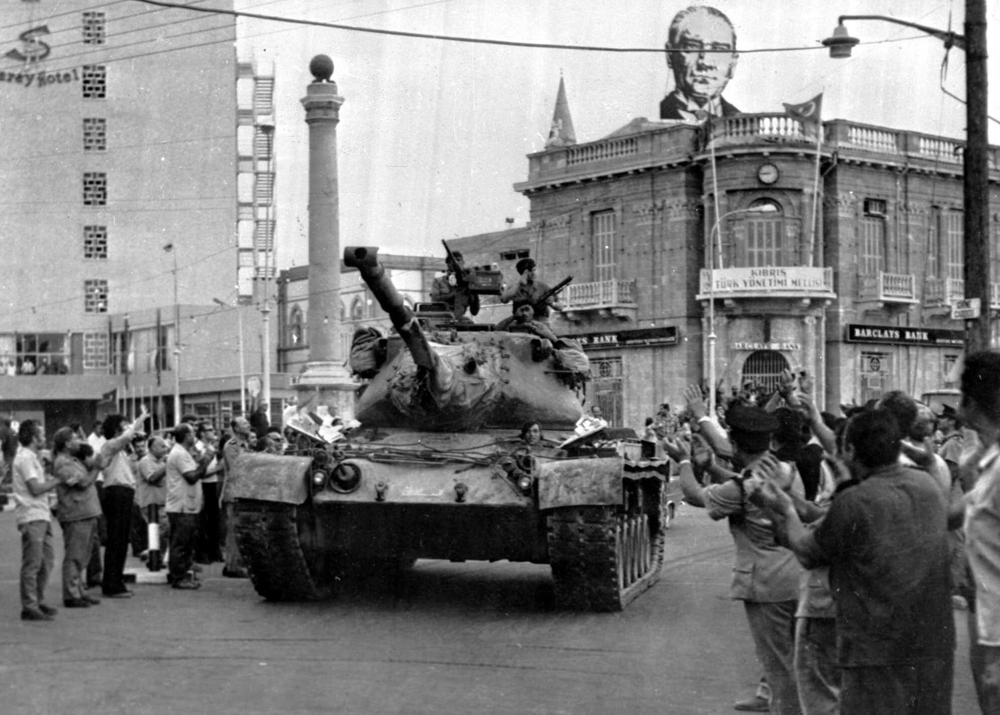
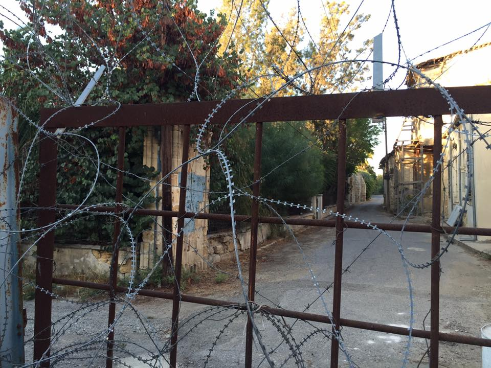
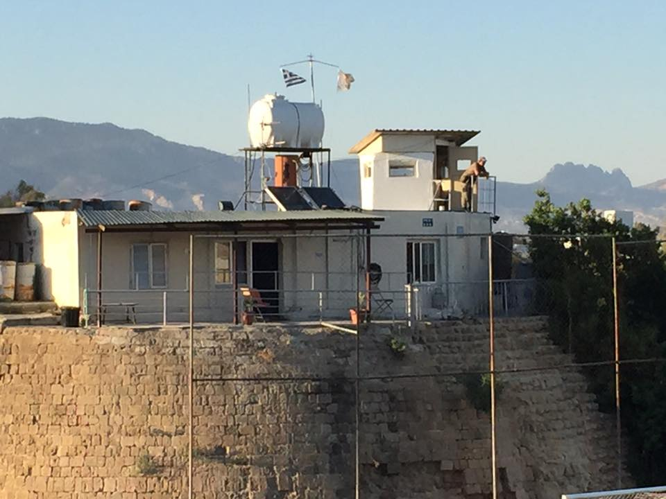

```{r setup, include=FALSE, cache=F, message=F, warning=F, results="hide"}
knitr::opts_chunk$set(cache=TRUE, warning=F, message=F)
knitr::opts_chunk$set(fig.path='figs/', fig.width = 14, fig.height = 8.5)
knitr::opts_chunk$set(cache.path='cache/')

knitr::opts_chunk$set(
                  fig.process = function(x) {
                      x2 = sub('-\\d+([.][a-z]+)$', '\\1', x)
                      if (file.rename(x, x2)) x2 else x
                      }
                  )
```


```{r loadstuff, include=FALSE}
knitr::opts_chunk$set(cache=TRUE, echo=FALSE, message=FALSE, warning=FALSE)
options(knitr.kable.NA = '')
library(tidyverse)
library(stevemisc)
library(peacesciencer)
library(fixest)
library(kableExtra)
library(modelsummary)
library(patchwork)

options("modelsummary_format_numeric_latex" = "plain")

```

```{r loaddata, cache=T, eval=T, echo=F, message=F, error=F, warning=F}

# NMC <- read_csv("~/Dropbox/data/cow/nmc/6.0/NMC-60-abridged.csv")
# FAS <- read.csv("~/Dropbox/data/fas-nukes/number-of-nuclear-warheads-in-the-inventory-of-the-nuclear-powers-1945-2014.csv") %>% tbl_df()
# 
Mods <- readRDS("Mods.rds")
Sims <- readRDS("Sims.rds")
Data <- readRDS("Data.rds")

# cow_ddy %>%
#   filter(ccode1 == 652 & ccode2 == 666) %>%
#   add_nmc() %>%
#   select(ccode1:year, cinc1, cinc2) %>%
#     mutate(ccode1 = "Syria",
#          ccode2 = "Israel") %>%
#   mutate(ndircincprop = ifelse(cinc1 > cinc2, cinc2/cinc1, cinc1/cinc2)) -> isr_syr
```

# Introduction
### Goal for Today

*Discuss the core findings and intuition behind "the democratic peace."*

### Confrontation of the Day: The Turkish Invasion of Cyprus (MIC#1293)


```{r mic-of-the-day, eval=TRUE, echo=FALSE, out.width="90%"}

```

###

```{r , eval=TRUE, echo=FALSE, out.width="90%"}

```


###

```{r , eval=TRUE, echo=FALSE, out.width="90%"}

```


###

```{r , eval=TRUE, echo=FALSE, out.width="90%"}

```


###

```{r , eval=TRUE, echo=FALSE, out.width="90%"}

```


###

```{r , eval=TRUE, echo=FALSE, out.width="90%"}

```


###

```{r , eval=TRUE, echo=FALSE, out.width="90%"}

```

# A Review of the Democratic Peace
## Core and Auxiliary Findings
### What We Know About the Democratic Peace

The core findings:

- Jointly democratic dyads rarely fight each other, and (effectively) never in war.
- Democracies are still as conflict-prone at the unit-level.

i.e. the "democratic peace" is dyadic, not monadic.

### Other Findings and Arguments

The democratic peace research program clusters into two categories.

1. Democratic war avoidance
2. Democratic war behavior

### Democratic War Avoidance

1. Democracies don’t fight wars against each other. (core)
2. Democra*tizing* states are war-prone (e.g. Serbia). Mature democracies are the peaceful ones.
3. Democracies conclude what disputes they do have with negotiation and compromise.
4. Democracies as major powers are more constrained than democratic minor powers.

### Democratic War Behavior

1. Democracies are essentially as war-prone as non-democracies. (core)
2. Democracies win the wars they fight.
3. Democracies fight shorter wars.
4. Democracies are as likely as non-democracies to target weak rivals.
5. Democracies are more likely to initiate wars against autocracies (not the other way around).
6. Democracies incur fewer battle deaths in the wars they initiate.

### Democratic Peace Explanations

Institutional explanations

- Constraining effects (e.g. Morgan and Campbell, 1991)
- Informing effects (e.g. Schultz, 1999)
- Selection effects (e.g. BDM et al., 1999)

Normative explanations

- "Norm of bounded competition" (Dixon, 1994)
- Contingent consent (Schmitter and Karl, 1991)
- "Principle of cosmopolitanism" (Kant, 1795)

## What's Wrong With These Explanations?
### What's Wrong With Normative Explanations

- Perceptions assumed, but never explicated.
- Begging the question

### What's Wrong With Institutional Explanations

- Perceptions assumed, but never explicated.
- It is a *stretch* to say democratic major powers are more constrained.

### What's Wrong With Both?

*Both assume a monadic component.*

- Democracies should be "kinder, gentler" in general, but they're not.
- Democracies should be more constrained/cautious in general, but they're not.

This is an uncomfortable tension that follows putting the cart before the horse.

- Everything is correlational, and fits the fact (after the fact).

## Does Democracy Have Anything to Do With It?
### A Spurious Peace

The biggest challenges to democratic peace wonder whether democracy has anything to do with "the democratic peace."

- Common interests peace
- Market-oriented/contractualist peace
- Territorial peace

### Common Regimes or Common Interests?

The first challenge tried to shoehorn the democratic peace into more realist thinking.

- i.e. democracies have more common interests in light of the Cold War.

The proxy here of interest: shared alliances.

- However, the effect of joint democracy typically still lingers.

No matter, these critiques are pointing to another problem in the democratic peace.


###

```{r, echo=F}
Data[[1]] %>% 
  filter(polity2 >= 6) %>% 
  filter(year <= 1913) %>% 
  group_by(statenme) %>% 
  summarize(n = n(), min = min(year), max=max(year)) %>%
  kbl(., longtable = T, booktabs = TRUE, linesep='',
      col.names = c("State", "Num. Years", "Min. Year", "Max. Year"),
      caption = "The Pre-WW1 Democracies",
      align = c("l","c","c","c")) %>%
  row_spec(0, bold=TRUE) 
```


###

```{r reg-table-1, echo=F, eval=T, fig.width = 14, fig.height = 8.5, warning = F, message = F, results="asis"}

modelsummary(list("Conf. Onset" = Mods[[1]], "Min. Fatalities" = Mods[[3]], 
                  "Max. Fatalities" = Mods[[4]]),
             # output="latex",  
             longtable=TRUE,
             title = "A Dangerous Dyad-ish Analysis of Inter-state Conflict, 1816-1913",
             gof_omit = "IC|F|Log.|R2$|R2",
             coef_map = c("claim" = "Territorial Claim",
                          "spatial" = "Territorial Rivalry",
                          "landcontig" = "Land Contiguity",
                          "othercontig" = "Other Contiguity",
                          "ndircincprop" = "CINC Proportion",
                          "bothmaj" = "Both Major Powers",
                          "onlyonemaj" = "Major-Minor",
                          "cow_defense" = "Defense Pact",
                          "jointdem" = "Joint Democracy",
                          "minwbgdppc" = "Min. GDP per Capita in Dyad"),
             stars = TRUE) %>%
  row_spec(0, bold=TRUE) %>%
  kable_styling(font_size = 7) %>%
  row_spec(c(14, 16), hline_after = TRUE) %>%
  row_spec(c( 15, 16), background="#eeeeee") 

```

### The Market Peace

"Market peace" arguments contend market-oriented development explains both democracy and peace (e.g. Gartzke, 2007; Mousseau, 2013).

- Historically, market activity led to major democratic reforms.
- Market activity imposes large opportunity cost on disruption, and another avenue for "competition."

Some issues:

- Data are temporally limited
- Definitions (e.g. "contractualism") are unclear
- Itself ignores a feedback loop
- Results very sensitive to research design

### The Territorial Peace

Gibler (2007, 2012) argues the democratic peace is a territorial peace. Argument:

- Threatened territory leads to centralization/autocracy at home to defend territory.
- Territory is sufficiently important to defend with violence.
- With a few obvious exceptions (e.g. Israel, India), democracies are unlikely to emerge under conditions of territorial threat.

Findings:

- Border settlement precedes democratization (e.g. Gibler and Owsiak, 2018)
- Auxiliary DPT findings are omitted variable bias (e.g. Miller and Gibler, 2011; Gibler and Miller, 2013)
- Democracies don't have signaling advantages (Gibler and Hutchison, 2013)

# Conclusion
### Takeaways/Things to Think About

The democratic peace is a set of facts that we know and do not know why.

- Still no convincing reason to think democracy *causes* peace.
- Major conceptual problems about what is a democracy.
- "Irrelevant" dyads do a lot of heavy lifting.
- A major Cold War collider.

### Takeaways/Things to Think About

My worry: the democratic peace is a backward-looking phenomenon.

- Easily "bushwhacked" (pun intended)
- No promise for a future of resource scarcity and climate change.