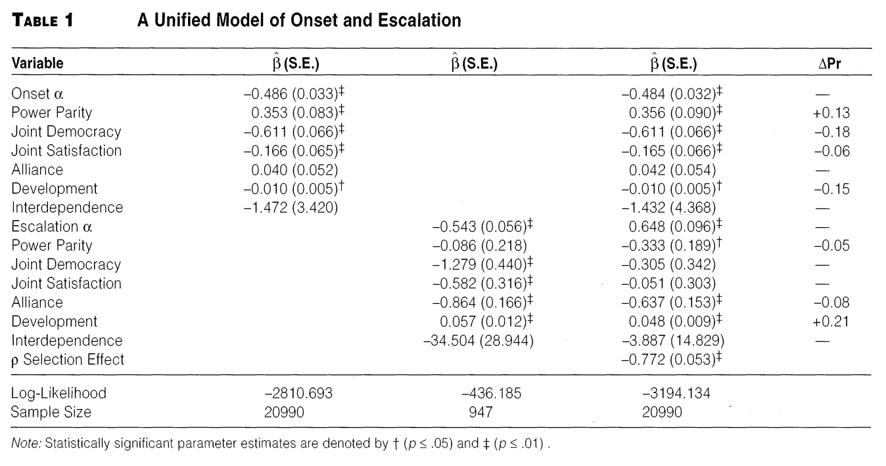

```{r setup, include=FALSE, cache=F, message=F, warning=F, results="hide"}
knitr::opts_chunk$set(cache=TRUE)
knitr::opts_chunk$set(fig.path='figs/')
knitr::opts_chunk$set(cache.path='cache/')

knitr::opts_chunk$set(
                  fig.process = function(x) {
                      x2 = sub('-\\d+([.][a-z]+)$', '\\1', x)
                      if (file.rename(x, x2)) x2 else x
                      }
                  )
```

```{r loadstuff, include=FALSE}
knitr::opts_chunk$set(cache=TRUE)
options(knitr.kable.NA = '')
library(tidyverse)
library(stevemisc)
library(countrycode)
library(knitr)
library(stargazer)
```

```{r loaddata, cache=T, eval=T, echo=F, message=F, error=F, warning=F}

Data <- read.csv("~/Dropbox/projects/mid-project/gml-mid-data/2.03/gml-ndy-2.03.csv") %>% tbl_df()
MIDA <- read.csv("~/Dropbox/projects/mid-project/gml-mid-data/2.03/gml-mida-2.03.csv") %>% tbl_df()
Cont <- read.csv("~/Dropbox/data/cow/contiguity/3.2/contdird.csv") %>% tbl_df()
Majors <- read.csv("~/Dropbox/data/cow/states/majors2016.csv") %>% tbl_df()
Contcd <- read.csv("~/Dropbox/data/cow/coldepcont/contcold.csv") %>% tbl_df()
Alliance <- read_csv("~/Dropbox/data/cow/alliance/4.1/alliance_v4.1_by_dyad_yearly.csv")
NMC <- read_csv("~/Dropbox/data/cow/cinc/NMC_5_0.csv")
Polity <- readxl::read_xls("~/Dropbox/data/polity/p4v2016.xls")
# ATOP <- haven::read_dta("~/Dropbox/data/atop/atop3_0ddyr.dta")

Contcd %>%
  rename(ccode1 = statelno, ccode2 = statehno) %>%
  select(ccode1, ccode2, year, land, sea, total) %>%
  left_join(Data, .) -> Data

Cont %>%
  rename(ccode1 = state1no, ccode2 = state2no) %>%
  select(ccode1, ccode2, year, conttype) %>%
  left_join(Data, .) -> Data

Data %>%
  mutate(conttype = ifelse(is.na(conttype), 6, conttype),
         land = ifelse(is.na(land), 0, land),
         sea = ifelse(is.na(sea), 0, sea),
         total = ifelse(is.na( total), 0, total),
         contig = ifelse(conttype == 6 & total == 0, 0, 1),
         # Code regions...
         region1 = NA,
         region1 = ifelse(ccode1 < 200, "Americas", region1),
         region1 = ifelse(ccode1 >= 200 & ccode1 < 400, "Europe", region1),
         region1 = ifelse(ccode1 >= 400 & ccode1 < 600, "Africa", region1),
         region1 = ifelse(ccode1 >= 600 & ccode1 < 700, "ME/NA", region1),
         region1 = ifelse(ccode1 >= 700 & ccode1 < 900, "Asia", region1),
         region1 = ifelse(ccode1 >= 900, "Oceania", region1),
         region2 = NA,
         region2 = ifelse(ccode2 < 200, "Americas", region2),
         region2 = ifelse(ccode2 >= 200 & ccode2 < 400, "Europe", region2),
         region2 = ifelse(ccode2 >= 400 & ccode2 < 600, "Africa", region2),
         region2 = ifelse(ccode2 >= 600 & ccode2 < 700, "ME/NA", region2),
         region2 = ifelse(ccode2 >= 700 & ccode2 < 900, "Asia", region2),
         region2 = ifelse(ccode2 >= 900, "Oceania", region2),
         # Code majors...
         maj1 = NA,
         maj1 = ifelse(ccode1 == 2 & year >= 1898, 1, maj1),
         maj1 = ifelse(ccode1 == 200, 1, maj1),
         maj1 = ifelse(ccode1 == 220 & year <= 1940, 1, maj1),
         maj1 = ifelse(ccode1 == 220 & year >= 1945, 1, maj1),
         maj1 = ifelse(ccode1 == 255 & year <= 1918, 1, maj1),
         maj1 = ifelse(ccode1 == 255 & (year >= 1925 & year <= 1945), 1, maj1),
         maj1 = ifelse(ccode1 == 255 & year >= 1991, 1, maj1),
         maj1 = ifelse(ccode1 == 300 & year <= 1918, 1, maj1),
         maj1 = ifelse(ccode1 == 325 & (year >= 1860 & year <= 1943), 1, maj1),
         maj1 = ifelse(ccode1 == 365 & year <= 1917, 1, maj1),
         maj1 = ifelse(ccode1 == 365 & year >= 1922, 1, maj1),
         maj1 = ifelse(ccode1 == 710 & year >= 1950, 1, maj1),
         maj1 = ifelse(ccode1 == 740 & (year >= 1895 & year <= 1945), 1, maj1),
         maj1 = ifelse(ccode1 == 740 & year >= 1991, 1, maj1),
         maj1 = ifelse(is.na(maj1), 0, maj1),
         maj2 = NA,
         maj2 = ifelse(ccode2 == 2 & year >= 1898, 1, maj2),
         maj2 = ifelse(ccode2 == 200, 1, maj2),
         maj2 = ifelse(ccode2 == 220 & year <= 1940, 1, maj2),
         maj2 = ifelse(ccode2 == 220 & year >= 1945, 1, maj2),
         maj2 = ifelse(ccode2 == 255 & year <= 1918, 1, maj2),
         maj2 = ifelse(ccode2 == 255 & (year >= 1925 & year <= 1945), 1, maj2),
         maj2 = ifelse(ccode2 == 255 & year >= 1991, 1, maj2),
         maj2 = ifelse(ccode2 == 300 & year <= 1918, 1, maj2),
         maj2 = ifelse(ccode2 == 325 & (year >= 1860 & year <= 1943), 1, maj2),
         maj2 = ifelse(ccode2 == 365 & year <= 1917, 1, maj2),
         maj2 = ifelse(ccode2 == 365 & year >= 1922, 1, maj2),
         maj2 = ifelse(ccode2 == 710 & year >= 1950, 1, maj2),
         maj2 = ifelse(ccode2 == 740 & (year >= 1895 & year <= 1945), 1, maj2),
         maj2 = ifelse(ccode2 == 740 & year >= 1991, 1, maj2),
         maj2 = ifelse(is.na(maj2), 0, maj2)) -> Data

Data %>%
  mutate(region = NA,
         region = ifelse(region1 == "Americas" & region2 == "Americas", "Americas", region),
         region = ifelse(region1 == "Europe" & region2 == "Europe", "Europe", region),
         region = ifelse(region1 == "Africa" & region2 == "Africa", "Africa", region),
         region = ifelse(region1 == "ME/NA" & region2 == "ME/NA", "ME/NA", region),
         region = ifelse(region1 == "Asia" & region2 == "Asia", "Asia", region),
         region = ifelse(region1 == "Oceania" & region2 == "Oceania", "Oceania", region),
         prd = NA,
         prd = ifelse(contig == 1 | (maj1 == 1 | maj2 == 1), 1, 0)) -> Data


Alliance %>%
  select(ccode1, ccode2, year, defense, neutrality, nonaggression, entente) %>%
  left_join(Data, .) %>%
  mutate(defense = ifelse(is.na(defense), 0, defense),
         neutrality = ifelse(is.na(neutrality), 0, neutrality),
         nonaggression = ifelse(is.na(nonaggression), 0, nonaggression),
         entente = ifelse(is.na(entente), 0, entente)) -> Data

NMC %>%
  select(ccode:cinc) %>%
  rename(ccode1 = ccode,
         milex1 = milex,
         milper1 = milper,
         irst1 = irst,
         pec1 = pec,
         tpop1 = tpop,
         upop1 = upop,
         cinc1 = cinc) %>%
  left_join(Data, .) -> Data

NMC %>%
  select(ccode:cinc) %>%
  rename(ccode2 = ccode,
         milex2 = milex,
         milper2 = milper,
         irst2 = irst,
         pec2 = pec,
         tpop2 = tpop,
         upop2 = upop,
         cinc2 = cinc) %>%
  left_join(Data, .) -> Data

#democracy %>% tbl_df() %>%
#  select(cown, year, polity2) %>%
#  rename(ccode1 = cown,
#         polity21 = polity2) %>%
#  left_join(NDY, .)

Polity %>%
  select(ccode, scode, year, polity2) %>%
      mutate(ccode = ifelse(ccode == 305 & year < 1919, 300, ccode),
             ccode = ifelse(ccode == 347, 345, ccode),
             ccode = ifelse(ccode == 364, 365, ccode),
             ccode = ifelse(ccode == 769, 770, ccode),
             ccode = ifelse(ccode == 818, 816, ccode),
             ccode = ifelse(ccode == 529, 530, ccode)) %>%
  rename(ccode1 = ccode,
         scode1 = scode,
         polity21 = polity2) %>%
  left_join(Data, .) -> Data

Polity %>%
  select(ccode, scode, year, polity2) %>%
      mutate(ccode = ifelse(ccode == 305 & year < 1919, 300, ccode),
             ccode = ifelse(ccode == 347, 345, ccode),
             ccode = ifelse(ccode == 364, 365, ccode),
             ccode = ifelse(ccode == 769, 770, ccode),
             ccode = ifelse(ccode == 818, 816, ccode),
             ccode = ifelse(ccode == 529, 530, ccode)) %>%
  rename(ccode2 = ccode,
         scode2 = scode,
         polity22 = polity2) %>%
  left_join(Data, .) -> Data

Data %>% 
  mutate(war = ifelse(hostlev == 5, 1, 0),
         landcontig = ifelse(conttype == 1, 1, 0),
         othercontig = ifelse(conttype > 1 & conttype != 0, 1, 0),
         bilat = ifelse(numa + numb == 2, 1, 0),
         allied = ifelse(defense == 1 | neutrality == 1 | nonaggression == 1 | entente == 1, 1, 0),
         jointdem = ifelse(polity21 >= 6 & polity22 >= 6, 1, 0),
         relpow = ifelse(cinc1 > cinc2, cinc1/cinc2, cinc2/cinc1),
         relpowd = ifelse(relpow >=3, 1, 0)) -> Data


```

# Introduction
### Goal for Today

*Highlight why disputes, once initiated, escalate to war and why selection matters.*

### A Buried Lede

We've spent much effort looking at the correlates of war by reference to MID onset.

- Understandable: war is a rare event. MIDs are more common.
- However, war is ultimately what we want to explain.

Importantly, the same factors that coincide with MID onset need not coincide with MID escalation.

### A Typology of Escalation

MIDs of interest cluster into different patterns.

- One-day/single-incident/unreciprocated MIDs that never escalate.
- Crises that become wars (e.g. July Crisis)
- Crises resolved short of war (e.g. Agadir Crisis, Trent Affair, Cuban Missile Crisis)
- Fatal MIDs short of war (e.g. Kargil War, Falkland War, Operation Just Cause)

### 

```{r num-unrecip-one-day-fatal-mids, echo=F, eval=T, fig.width = 14, fig.height = 8.5}

midnums <- nrow(MIDA)

MIDA %>% filter(recip == 0) %>%
  summarize(sum = n()) %>% pull(sum) -> unrecip

MIDA %>% filter(maxdur == 1) %>%
  summarize(sum = n()) %>% pull(sum) -> oneday

MIDA %>% filter(maxdur == 1 & recip == 0) %>%
  summarize(sum = n()) %>% pull(sum) -> onedayunrecip

MIDA %>% filter(maxdur <= 180 & recip == 0) %>%
  summarize(sum = n()) %>% pull(sum) -> unrecipsix

MIDA %>% filter(fatality == 1) %>%
  summarize(sum = n()) %>% pull(sum) -> fatal

MIDA %>% filter(hostlev == 5) %>%
  summarize(sum = n()) %>% pull(sum) -> wars

tribble(
  ~Category, ~Value,
  "Unreciprocated", unrecip/midnums,
  "One-day MIDs", oneday/midnums,
  "One Day,\nUnreciprocated", onedayunrecip/midnums,
  "Six Months or Fewer,\nUnreciprocated", unrecipsix/midnums,
  "Fatal MIDs", fatal/midnums,
  "Wars\n(Including Joiner MIDs)", wars/midnums
) %>%
  mutate(perc = paste0(mround2(Value),"%")) %>%
  ggplot(.,aes(reorder(Category, -Value), Value)) + theme_steve_web() +
  geom_bar(stat="identity", fill="#e41a1c", alpha=0.8, color="black") +
  geom_text(aes(label=perc), vjust=-.5, colour="black",
            position=position_dodge(.9), size=4, family="Open Sans") +
  scale_y_continuous(labels= scales::percent) +
  xlab("Type of MID") + ylab("Percentage of MIDs") +
  labs(title = "Crises Get Our Attention but They're Fortunately Uncommon",
       subtitle = "In fact, almost half of all MIDs are unreciprocated and last less than six months, a coding quirk to pick up ''six-month count'' ''continuous action'' MIDs.",
       caption = "Data: Gibler-Miller-Little MID Data (v. 2.03)")
  
```

<!-- Percentage of MIDs that are:

- Unreciprocated (48.52%)
- One day in length (28.18%)
- One day, unreciprocated (21.42%)
- Six months or fewer, unreciprocated (44.75%)
    - ed. This follows the "six-month count" rule in the MID data.

It's difficult to imagine war following when your typical MID looks like this. -->


```{r num-mids-hostlev, echo=F, eval=F, fig.width = 14, fig.height = 8.5}

MIDA %>%  group_by(hostlev) %>%
  summarize(count = n()) %>%
  ungroup() %>%
  mutate(hostlev = c("2: Threat to\nUse Force", "3: Display of Force", "4: Use of Force", "5: War")) %>%
  ggplot(., aes(hostlev, count)) + theme_steve_web() + 
  scale_color_brewer(palette="Set1") +
  geom_bar(stat="identity", alpha=0.8, color="black", fill="#e41a1c")  +
  geom_text(aes(label=count), vjust=-.5, colour="black",
            position=position_dodge(.9), size=4) +
  ylab("MID Count") + xlab("Hostility Levels") +
  labs(caption="Data: Gibler-Miller-Little MID Data (v. 2.03), 1816-2010.",
       title="Number of MIDs by Dispute Hostility Level",
       subtitle = "Most MIDs involve some kind of use of force.")
  

```


###
```{r num-mids-hiact, echo=F, eval=T, fig.width = 14, fig.height = 8.5}

MIDA %>%  group_by(hiact) %>%
  summarize(count = n()) %>%
  ungroup() %>%
  ggplot(., aes(as.factor(hiact), count)) + theme_steve_web() +
  geom_bar(stat="identity", alpha=0.8, color="black", fill="#619cff")  +
  geom_text(aes(label=count), vjust=-.5, colour="black",
            position=position_dodge(.9), size=4, family="Open Sans") +
  scale_x_discrete(labels = c("Threat to\nUse Force", "Threat to\nBlockade",
                              "Threat to\nOccupy\nTerritory",
                              "Threat to\nDeclare War",
                              "Show of\nForce", "Alert",
                              "Mobilization", "Border\nFortification",
                              "Border\nViolation","Blockade",
                              "Occupation\nof\nTerritory", "Seizure",
                              "Attack","Clash", "Declaration\nof\nWar",
                              "Use of\nCBRN\nWeapons", "Begin\nInterstate\nWar",
                              "Join\nInterstate\nWar")) +
  geom_vline(xintercept=4.5, linetype="dashed") +
  geom_vline(xintercept = 9.5, linetype="dashed") +
  geom_vline(xintercept = 16.5, linetype="dashed") +
  annotate("text", x= 16.25, y=590, family="Open Sans", hjust=1, size=3.5, label="Use of Force", fontface="bold") +
  annotate("text", x= 9.25, y=590, family="Open Sans", hjust=1, size=3.5, label="Show of Force", fontface="bold") +
  annotate("text", x= 4.25, y=590, family="Open Sans", hjust=1, size=3.5, label="Threat of Force", fontface="bold") +
  annotate("text", x= 18.25, y=590, family="Open Sans", hjust=1, size=3.5, label="War", fontface="bold") +
  ylab("MID Count") + xlab("Highest Level of Action") +
  labs(caption="Data: Gibler-Miller-Little MID Data (v. 2.03), 1816-2010.
       Note: MID#1109 is unique for being the only dispute in the data for which the highest action was the use of CBRN weapons. Other CBRN weapon uses (e.g. World War II, Iran-Iraq War) happen during war itself, a higher hostility level.",
       title="Number of MIDs by Highest Action Observed at Dispute-Level",
       subtitle = "Most common hiacts: Attack (n: 577), Clash (n: 480), Show of Force (n: 307), Seizure (n: 265)")
  

```

# How Do We Explain Escalation?
## Contextual Factors
### How Do We Explain Escalation?

We generally focus on two things:

1. Contextual factors
2. Strategic interaction between states

### Contextual Factors

Contextual influences on dispute escalation stay close to the "dangerous dyads" framework.

- Relative Power
- System polarity
- Alliances
- Contiguity
- Arms races
- Joint democracy
- Issue type

### The Problem of Selection

However, what's true for dispute onset may not be true for dispute escalation.

- States select into disputes looking down the proverbial game tree.

We would need to better model the **selection effects** in the disputes we do observe.

- We usually do this with a Heckman (1976) model.

### The Canonical Case of Selection


Heckman's motivating example was women in the labor force.

- Preliminary finding: more women are in the labor force, working longer hours, and getting higher wages.
- Marital status (divorced) and education are thought to explain this.

The issue: we only have wage data on women in the labor force.

- Married women work when the market wage *y* is greater than non-market wage ($y^*$).
- We only have wage data when $y > y^*$.
- Women's labor force participation data suffered from selection bias.

Two-stage selection modeling gives greater confidence to our covariates of women's wages in the labor force.

# Reed's (2000) Unified Statistical Model
### Reed's (2000) Design

*DVs*: 

- onset of a MID, escalation of MID to war

*IVs*:

- Power parity (i.e. weaker state's CINC/stronger state's CINC)
- Satisfaction with the status quo (i.e. alliance similarity w/ the US)
- Joint democracy (both states >=6 on Polity 2 score)
- Alliance (both states share a defense pact)
- Economic interdependence (volume of dyadic trade/country GDP [weak-link])
- Economic growth (rate of growth over three years of less-developed state)

### Reed's (2000) Design

Important methodological notes:

- Model includes peace years/splines for temporal auto-correlation
- *Unit of analysis*: politically relevant dyad-years
- *Temporal domain*: 1950-1985
- *Statistical method*: Heckman selection model
    - This will model selection into MID and then escalation to war simultaneously.

###

```{r reed2000-tab1-mod1, eval=F, echo=F, fig.width=14, fig.height=8.5, warning=F, message=F}
library(dotwhisker)
tribble(
  ~term, ~estimate, ~std.error, ~model,
  "Power Parity", .353, .083, "Model 1",
  "Joint Democracy", -.611, .066, "Model 1",
  "Joint Satisfaction", -.166, .065, "Model 1",
  "Alliance", .040, .052, "Model 1",
  "Economic Development", -.010, .004, "Model 1"
  
) %>%
  mutate(statistic = estimate/std.error,
         p.value = 1.96*pnorm(-abs(statistic)),
         model = "Dispute Onset") %>%
  dwplot(.,dot_args = list(aes(colour = model, shape = model), size = 1.1)) + theme_steve_web() +
  xlab("Coefficient Estimate") +
  geom_vline(xintercept = 0, colour = "grey60", linetype = 2) +
  theme(legend.position = "bottom") +
  labs(title = "What Explains Dispute Onset? (Model 1 in Reed's [2000] Table 1)",
       subtitle = "Dyads closer to equal in power are more likely to have MIDs. Joint democracies, satisfied dyads, and developed dyads are less likely to have MIDs.",
       caption = "Reproduction of Model 1 in Reed (2000). Note: alphas omitted to save space. Economic interdependence also omitted to clarify  more precise, if smaller, effects.") +
  scale_colour_discrete(name = "Model") + scale_shape_discrete(name = "Model")
```



### What Do We Know About Dispute Onset?

Reed's simple model of MID onset has the following findings:

- Dyads with near equally powerful states are more likely to have MIDs.
- Joint democracies have fewer MIDs than jointly autocratic states (or mixed dyads).
- States satisfied with the U.S.-led status quo are less likely to have MIDs.
- Shared defense pacts have no effect on MID onset.
- Jointly developed states are less likely to have MIDs.
- Economic interdependence has no discernible effect.

###

```{r reed2000-tab1-mod2, eval=F, echo=F, fig.width=14, fig.height=8.5, warning=F, message=F}

tribble(
  ~term, ~estimate, ~std.error, ~model,
  "Power Parity", .086, .218, "Model 1",
  "Joint Democracy", -1.279, .440, "Model 1",
  "Joint Satisfaction", -.5895, .295, "Model 1",
  "Alliance", -.864, .166, "Model 1",
  "Economic Development", .057, .012, "Model 1"
  
) %>%
  mutate(statistic = estimate/std.error,
         p.value = 1.96*pnorm(-abs(statistic)),
         model = "Dispute Escalation") %>%
  dwplot(.,dot_args = list(aes(colour = model, shape = model), size = 1.1)) + theme_steve_web() +
  xlab("Coefficient Estimate") +
  geom_vline(xintercept = 0, colour = "grey60", linetype = 2) +
  theme(legend.position = "bottom") +
  labs(title = "What Explains Escalation to War? (Model 2 in Reed's [2000] Table 1)",
       subtitle = "MIDs among more developeed dyads are more likely to escalate to war, but MIDs among allies and democracies are less likely to escalate.",
       caption = "Reproduction of Model 2 in Reed (2000). Note: alphas omitted to save space. Economic interdependence also omitted to clarify more precise, if smaller, effects.") +
  scale_colour_discrete(name = "Model") + scale_shape_discrete(name = "Model")
```


### What Do We Know About Dispute Escalation?

Reed's simple model of MID escalation suggests:

- Power parity may lead to more MIDs but seems to have no effect on escalation.
- MIDs involving two democracies are *much* less likely to end up in war.
- MIDs involving two satisfied states are also much less likely to escalate.
- Economic interdependence seems to have a small *positive* effect on escalation.


###

```{r reed2000-tab1-mod3, eval=F, echo=F, fig.width=14, fig.height=8.5, warning=F, message=F}

tribble(
  ~term, ~estimate, ~std.error, ~model,
  "Power Parity", .356, .090, "Dispute Onset",
  "Joint Democracy", -.611, .066, "Dispute Onset",
  "Joint Satisfaction", -.165, .066, "Dispute Onset",
  "Alliance", -.042, .054, "Dispute Onset",
  "Economic Development", -.010, .004, "Dispute Onset",
  
  "Power Parity", -.334, .168, "Dispute Escalation",
  "Joint Democracy", -.305, .342, "Dispute Escalation",
  "Joint Satisfaction", -.051, .303, "Dispute Escalation",
  "Alliance", -.637, .153, "Dispute Escalation",
  "Economic Development", .048, .009, "Dispute Escalation"
) %>%
  mutate(statistic = estimate/std.error,
         p.value = 1.96*pnorm(-abs(statistic))) %>%
dwplot(.,dot_args = list(aes(colour = model, shape = model), size = 1.1)) + theme_steve_web() +
  xlab("Coefficient Estimate") +
  geom_vline(xintercept = 0, colour = "grey60", linetype = 2) +
  theme(legend.position = "bottom") +
  labs(title = "A Unified Model of Onset and Escalation (Model 3 in Reed's [2000] Table 1)",
       subtitle = "A unified model reveals a lot of interesting findings, especially among power parity and jointly democratic dyads.",
       caption = "Reproduction of Model 3 in Reed (2000). Note: alphas omitted to save space. Economic interdependence also omitted to clarify more precise, if smaller, effects.") +
  scale_colour_discrete(name = "Model") + scale_shape_discrete(name = "Model")

```


### What Do We Know About Dispute Escalation?

Implications of Reed's (2000) unified model:

- Power parity leads to MIDs, but MIDs between equals are less likely to lead to war.
- *Joint democracy leads to fewer MIDs, not necessarily fewer wars.*
    - Would be consistent with Senese's (1997) finding.
- Likewise: satisfied states have fewer MIDs, not necessarily fewer wars.
- Allies still have disputes, just unlikely to escalate to war.

# Conclusion
### Conclusion

It's important to separate correlates of dispute onset from dispute escalation.

- Factors that promote MID onset need not promote war onset.
- This can have important implications for scholarship like democratic peace. 
