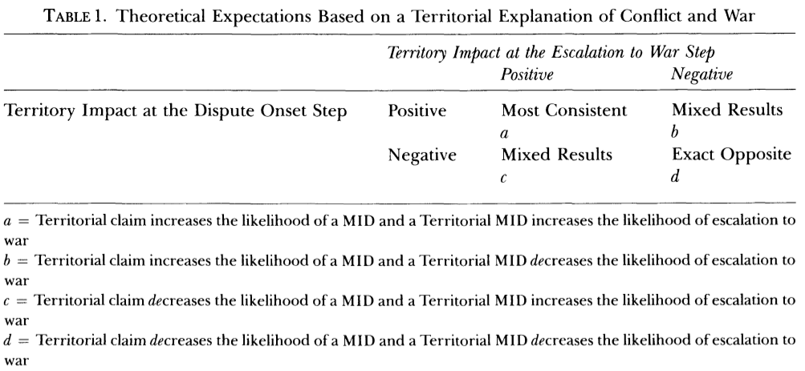
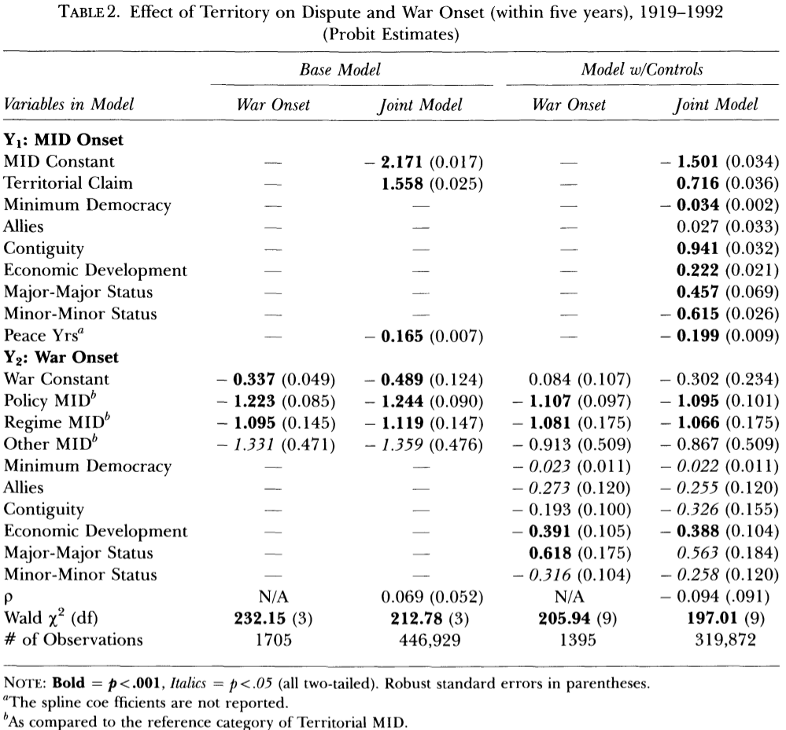

```{r setup, include=FALSE, cache=F, message=F, warning=F, results="hide"}
knitr::opts_chunk$set(cache=TRUE)
knitr::opts_chunk$set(fig.path='figs/')
knitr::opts_chunk$set(cache.path='cache/')

knitr::opts_chunk$set(
                  fig.process = function(x) {
                      x2 = sub('-\\d+([.][a-z]+)$', '\\1', x)
                      if (file.rename(x, x2)) x2 else x
                      }
                  )
```

```{r loadstuff, include=FALSE}
knitr::opts_chunk$set(cache=TRUE)
options(knitr.kable.NA = '')
library(tidyverse)
library(stevemisc)
library(countrycode)
library(knitr)
library(stargazer)
library(dotwhisker)
```

# Introduction
### Goal for Today

*Highlight why disputes, once initiated, escalate to war and why selection matters.*


### Territorial Disputes and War

Vasquez (1993, 1995) argues territorial issues are a root cause of war.

- He draws from evolutionary psychology, primitive anthropology, and sociobiology to make that argument.
- However, data limitations hindered an issue-politics paradigm in IR.

The release of version 2.0 of CoW-MID changed this.

- From there, a slew of scholarship argued territorial MIDs are more likely to lead to war.

### Non-Random Sampling and Selection Bias

However, MIDs are not a "random data-generating process" (DGP).

- i.e. Second Kashmir War (MID\#1312) was not a roll of the dice.
- The India-Pakistan dyad is not randomly drawn from an urn.

### Non-Random Sampling and Selection Bias


However, *all* our statistical models assume random DGP.

- This is the inference in inferential statistics.
- i.e. we infer about the population with a sample of the population.

MIDs are not randomly sampled. They're event data.

### Non-Random Sampling and Selection Bias

Important for our purposes. MIDs are events that, by definition, carry a higher probability of war.

- We don't know yet if territorial issues are truly war-prone.
- We just know territorial MIDs are more likely to lead to war and most wars are fought over territory.

### Possible Relationships Between Territory and War



### Table 1 in Senese and Vasquez (2003)

Our intuition suggests the top-left quadrant.

- i.e. disputed territory leads to MIDs.
- MIDs over distribution of territory lead to war.

### Table 1 in Senese and Vasquez (2003)

Other empirical scenarios are plausible and consistent with the data.

- States may have a lot of territorial MIDs but those rarely escalate (i.e. top-right)
- Territorial MIDs lead to war but states are reticent to initiate MIDs (i.e. bottom-left)
- We're all wrong about the bellicosity of territorial issues (i.e. bottom-right)

# Senese and Vasquez (2003)
### Senese and Vasquez (2003)

Senese and Vasquez (2003) will use a selection model to test the following:

- Dyads with territorial claims are more likely to culminate in MIDs.
- Territorial MIDs are more likely to escalate toward war.

### Senese and Vasquez's (2003) Design

*DVs*: 

- onset of a MID, war as highest fatality-level

This is functionally similar what Reed (2000) did in his model.

### Senese and Vasquez's (2003) Design

*Primary IVs*:

- Selection model: territorial claim (Huth, 1996)
- War/escalation model: Policy/Regime/Other MIDs to baseline of territorial MIDs.

If the steps-to-war intuition is correct:

- Dyad-years with territorial claims are more likely to lead to MIDs. And:
- MIDs over other issues should be less war-prone than territorial MIDs.

### Senese and Vasquez's (2003) Design

*Other IVs (i.e. controls)*

- Contiguity
- Minimum democracy (i.e. weak-link specification)
- Joint alliance
- Economic development
- Great power status (i.e. major-major, minor-minor)
    - Baseline: a major-minor (e.g. USA-Canada) dyad-year

### Senese and Vasquez's (2003) Design

Important methodological notes:

- Model includes peace years/splines for temporal auto-correlation.
- *Unit of analysis*: non-directed dyad-years
- *Temporal domain*: 1919-1992
- *Statistical method*: Heckman selection model
    - This will model selection into MID and then escalation to war simultaneously.

###

```{r sv2003-mod3-tab2, eval=F, echo=F, fig.width=14, fig.height=8.5, warning=F, message=F}

tribble(
  ~term, ~estimate, ~std.error,
  "Policy MID", -1.107, .097,
  "Regime MID", -1.081, .175,
  "Other MID", -.913, .509,
  "Minimum Democracy", -.023, .011,
  "Joint Alliance", -.273, .120,
  "Contiguity", -.193, .100,
  "Economic Development", -.391, .105,
  "Major-Major Status", .618, .175,
  "Minor-Minor Status", -.316, .104
  
) %>%
  mutate(statistic = estimate/std.error,
         p.value = 1.96*pnorm(-abs(statistic)),
         model = "War Onset") %>%
  dwplot(.,dot_args = list(aes(colour = model, shape = model), size = 1.1)) + theme_steve_web() +
  xlab("Coefficient Estimate") +
  geom_vline(xintercept = 0, colour = "grey60", linetype = 2) +
  theme(legend.position = "bottom") +
  labs(title = "What Explains War Onset? (Model 3 in Senese and Vasquez' [2003] Table 2)",
       subtitle = "MIDs over regime type and general policy concerns are much less likely to escalate to war than MIDs over territory.",
       caption = "Reproduction of Model 3 in Table 2 of Senese and Vasquez (2003).") +
  scale_colour_discrete(name = "Model") + scale_shape_discrete(name = "Model")
```



### What Do We Know About War Onset?

Senese and Vasquez (2003) have the following findings about war onset:

- Regime and Policy MIDs are much less likely to escalate to war than territorial MIDs.
    - Other MIDs drifts negative but estimated effect is diffuse.
- Joint democracy "weak-link" has a small but discernible negative effect on escalation.
- Allies are unlikely to escalate MIDs to war.
- Economic developed dyads are unlikely to escalate MIDs to war.
- Major-Majors (e.g. France-Germany) are more war-prone than Major-Minors (e.g. USA-Canada).
    - Also: Minor-Minors (e.g. Canada-Mexico) are less war-prone than Major-Minors.


###

```{r sv2003-mod4-tab2, eval=F, echo=F, fig.width=14, fig.height=8.5, warning=F, message=F}

tribble(
  ~term, ~estimate, ~std.error, ~model,
  "Territorial Claim", .716, .036, "MID Onset",
  "Minimum Democracy", -.034, .002, "MID Onset",
  "Joint Alliance", .027, .033, "MID Onset",
  "Contiguity", .941, .032, "MID Onset",
  "Economic Development", .222, .021, "MID Onset",
  "Major-Major Status", .457, .069, "MID Onset",
  "Minor-Minor Status", -.615, .026, "MID Onset",
  
  "Policy MID", -1.107, .097, "War Onset",
  "Regime MID", -1.081, .175, "War Onset",
  "Other MID", -.913, .509, "War Onset",
  "Minimum Democracy", -.023, .011, "War Onset",
  "Joint Alliance", -.273, .120, "War Onset",
  "Contiguity", -.193, .100, "War Onset",
  "Economic Development", -.391, .105, "War Onset",
  "Major-Major Status", .618, .175, "War Onset",
  "Minor-Minor Status", -.316, .104, "War Onset"
) %>%
  mutate(statistic = estimate/std.error,
         p.value = 1.96*pnorm(-abs(statistic))) %>%
dwplot(.,dot_args = list(aes(colour = model, shape = model), size = 1.1)) + theme_steve_web() +
  xlab("Coefficient Estimate") +
  geom_vline(xintercept = 0, colour = "grey60", linetype = 2) +
  theme(legend.position = "bottom") +
  labs(title = "A Unified Model of MID Onset and War Onset (Model 4 in Senese and Vasquez's [2003] Table 2)",
       subtitle = "Consistent with the steps-to-war argument, territorial claims to MIDs and MIDs over territory are the most war-prone type of MID.",
       caption = "Reproduction of Model 4 in Senese and Vasquez (2003).") +
  scale_colour_discrete(name = "Model") + scale_shape_discrete(name = "Model")

```


### What Do We Know About Conflict?

Implications of Senese and Vasquez's (2003) unified model:

- *Importantly:* territorial claims lead to MIDs and MIDs over territory are the most war-prone.
    - This is ultimately what they're focused on testing.

### What Do We Know About Conflict?

Other findings: 

- Joint democracy is pacifying at both phases of conflict.
- Economically developed states have more MIDs, but are unlikely to escalate.
    - Both are inconsistent with Reed (2000) whose findings may be sensitive to his temporal domain.
- Contiguity leads to MIDs but most wars involve non-contiguous states.
    - This is still the case, btw, in the GML MID data.

###

```{r sv-tab3-initiation, eval=T, echo=F, fig.width=14, fig.height=8.5, warning=F, message=F}

tribble(
  ~Condition, ~fit, ~lwr, ~upr,
  "Presence of a Territorial Claim", .0088, .0073, .0105,
  "Absence of a Territorial Claim", .0012, .0011, .0013,
) %>%
   ggplot(.,aes(colour = Condition)) +
#    geom_hline(yintercept = 0.5, colour = gray(1/2), lty = 2) + 
    geom_linerange(aes(x = Condition, ymin = lwr,
                       ymax = upr),
                   lwd = 1, position = position_dodge(width = 1/2)) + 
    geom_pointrange(aes(x = Condition, y = fit, ymin = lwr,
                        ymax = upr),
                    lwd = 1/2, position = position_dodge(width = 1/2),
                     fill = "WHITE") +
    coord_flip() + theme_steve_web() +
  ylab("Predicted Probability (with Confidence Intervals)") +
  xlab("") +
  labs(title = "The Presence of a Territorial Claim Increases the Likelihood of MID Onset by Over 600%",
       subtitle = "MIDs are still (fortunately) rare events but the presence of a territorial claim has a large effect on conflict initiation.",
       caption = "Reproduction of first two rows in Table 3 of Senese and Vasquez (2003)") 
```

###

```{r sv-tab3-escalation, eval=T, echo=F, fig.width=14, fig.height=8.5, warning=F, message=F}

tribble(
  ~Condition, ~fit, ~lwr, ~upr,
  "Presence of a Territorial MID", .312, .277, .348,
  "Presence of a Policy MID", .055, .043, .070,
  "Presence of a Regime MID", .060, .033, .096
) %>%
   ggplot(.,aes(colour = Condition)) +
#    geom_hline(yintercept = 0.5, colour = gray(1/2), lty = 2) + 
    geom_linerange(aes(x = Condition, ymin = lwr,
                       ymax = upr),
                   lwd = 1, position = position_dodge(width = 1/2)) + 
    geom_pointrange(aes(x = Condition, y = fit, ymin = lwr,
                        ymax = upr),
                    lwd = 1/2, position = position_dodge(width = 1/2),
                     fill = "WHITE") +
    coord_flip() + theme_steve_web() +
  ylab("Predicted Probability (with Confidence Intervals)") +
  xlab("") +
  labs(title = "Territorial MIDs are More than Four Times as Likely to Culminate in War Relative to MIDs Over Other Issues",
       subtitle = "The predicted probability of war onset is still around .3 but the difference in bellicosity is clear.",
       caption = "Reproduction of first three rows in Table 3 of Senese and Vasquez (2003)") 
```

# Conclusion
### Conclusion

Senese and Vasquez (2003) present a unified explanation of territorial conflict.

- Territorial claims between states are likely to become militarized.
- Territorial MIDs are likely to lead to war.


It's important to separate correlates of dispute onset from dispute escalation.

- Factors that promote MID onset need not promote war onset.

<!-- ### How This Relates to International Conflict

Consider the familiar argument about territorial disputes and war.

- We know wars are fought over territory more than any other issue.
- We have arguments (e.g. Vasquez, 1993/1995) to explain this.

So, we know territorial disputes are likely to lead to war.

- We *don't* know that territory is truly war-prone.

How does this make sense?

### Possible Relationships between Territory and War


### Table 1 in Senese and Vasquez (2003)

Our intuition suggests top-left quadrant.

- i.e. territorial issues lead to disputes. Territorial disputes escalate to war.

Other empirical scenarios are plausible.

- Top-right quadrant: states have a lot of territorial disputes, but those rarely escalate to war.
- Bottom-left quadrant: states are reticent to initiate territorial disputes because those that are initiated likely become wars.
- Bottom-right quadrant: we're all wrong about the bellicosity of territorial issues.
 
Notice the conceivable scenarios still consistent with the claim territorial disputes lead to war?

###


### Interpreting Reed's (2000) selection model

Implications of Reed's (2000) model:

- Power parity leads to MIDs, but MIDs between equals are less likely to lead to war.
- *Joint democracy leads to fewer MIDs, not necessarily fewer wars.*
    - Would be consistent with Senese's (1997) finding.
- Likewise: satisfied states have fewer MIDs, not necessarily fewer wars.
- Allies still have disputes, just unlikely to escalate to war.


###


### Table 2 in Senese and Vasquez (2003)

Table 2 supports the Senese and Vasquez' hypothesis about the danger of disputed territory.

- The war onset models tell us what we already know.
- Other issue-type MIDs are not as war-prone as territorial MIDs.
- The joint models illustrate territorial claims in a dyad lead to MIDs more than dyads without territorial claims.
- Other issue-type MIDs are not as war-prone as territorial MIDs in a sample selection model.


###


### Table 3 in Senese and Vasquez (2003)

How to read Table 3:

- Predicted probability of MID onset with territorial claim: .0088
- Predicted probability of MID onset without territorial claim: .0012
    - These are fortunately "rare events" but notice the lower-bound of the territorial claim probability does *not* overlap the upper-bound "no-territorial claim" probability.
- Likewise: predicted probability of territorial MID escalating to war: .312
- Predicted probability of a policy or regime MID escalating to war: no higher than .06

## Strategic Factors
### Influence Strategies

- Bullying (escalation for any response short of total acquiescence)
- Reciprocating (tit-for-tat responses)
- Appeasing (opposite of bullying: use of positive inducements instead of negative ones)
- Trial-and-error (i.e. "going with what works")

### Results of Influence Strategies

- Bullying is most frequently used strategy; also most likely to escalate.
- Reciprocating is most successful
- Appeasing has bad name post-Munich Crisis; also war-prone
- Trial-and-error leads to mixed results.

# Conclusion
### Conclusion

It's important to separate correlates of dispute onset from dispute escalation.

- Factors that promote MID onset need not promote war onset.
- This can have important implications for scholarship like democratic peace. -->