```{r setup, include=FALSE, cache=F, message=F, warning=F, results="hide"}
knitr::opts_chunk$set(cache=TRUE, warning=F, message=F, echo=FALSE, fig.width = 14, fig.height = 8.5)
knitr::opts_chunk$set(fig.path='figs/')
knitr::opts_chunk$set(cache.path='cache/')

knitr::opts_chunk$set(
                  fig.process = function(x) {
                      x2 = sub('-\\d+([.][a-z]+)$', '\\1', x)
                      if (file.rename(x, x2)) x2 else x
                      }
                  )
```


```{r loadstuff, include=FALSE}
knitr::opts_chunk$set(cache=TRUE)
options(knitr.kable.NA = '')
library(tidyverse)
library(stevemisc)
library(peacesciencer)
library(fixest)
library(kableExtra)
library(modelsummary)
library(patchwork)
library(cowplot)
library(artyfarty)

options("modelsummary_format_numeric_latex" = "plain")
options(knitr.kable.NA = '')
```

```{r loaddata, cache=T, eval=T, echo=F, message=F, error=F, warning=F}

# Mods <- readRDS("Mods.rds")
# Sims <- readRDS("Sims.rds")
# Data <- readRDS("Data.rds")

CCWP <- read_csv("~/Dropbox/data/ccwp/CCWP-Data.csv") %>% 
  mutate(period = case_when(yrbeg1 <= 1918 ~ "Pre-World War 1", 
                            between(yrbeg1, 1919, 1945) ~ "Inter-war", 
                            yrbeg1 > 1945 ~ "Post-WWII"),
         b1950 = ifelse(yrbeg1 < 1950, "Before 1950", "After 1950")) %>%
  mutate(period = fct_inorder(period),
         b1950 = fct_inorder(b1950))
```

# Introduction
### Goal for Today

*Discuss what we know about how states finance war.*


### Confrontation of the Day: MIC#0089 (Franco-Spanish War)

```{r mic-of-the-day, eval=TRUE, echo=FALSE, out.width="100%"}
# knitr::include_graphics("mic2331.jpg")

p1 <- ggdraw() + draw_image("mic0089-1.jpg", scale = 1.1)
p2 <- ggdraw() + draw_image("mic0089-2.jpg", scale = .8)

plot_grid(p1, p2)
```

### MIC#0089

- *Who*: France vs. Spain (Sept. 21, 1822 - Nov. 13, 1823)
- *Why*: Restoration of Ferdinand VII
- *What happened*:
  - 6 April: fighting starts on the banks of the Bidassoa
  - 21 August-27 September: surrender of A Coruña, Pamplona, San Sebastián
  - 31 August: Battle of Trocadero
  - 23 September: Cortes dissolves itself
  - 13 November: France finally leaves Spain

### The Fall out of MIC#0089

Spain actually defaults after this war.

- Ferdinand VII refused to honor debts accumulated by the liberal Cortes.
- This included £12.9 million to Haldimand and Sons, among a few other private lenders (prominently in the UK).

However, this was more a practicality than a "stand."

- Spain's finances led to the Florida sale (1819), the revolution in 1821, and accelerated the independence movements in Latin America.
- Spain couldn't secure a loan afterward from the Rothschild bank.

# How Do States Pay for War?
### How Do States Pay for War?

```{r w, eval=TRUE, echo=FALSE, out.width="80%"}

```

Debt. The answer is debt.

## The Centrality of Debt to War Finance
### The Centrality of Debt to War Finance

Debt is the foremost form of war finance.

- Almost 9 of 10 war participants resort to some form of borrowing to pay for war.

Debt is increasingly held externally.

- Before 1950, about 70% of states borrowed domestically. After 1950: about 40%.
- For external debts: 52% before 1950, 72% afterward.


## Why Debt?
### Why Debt?

```{r war-bonds, eval=TRUE, echo=FALSE, out.width="100%"}
# knitr::include_graphics("mic2331.jpg")

p3 <- ggdraw() + draw_image("buy-war-bonds.jpg", scale = .95)
p4 <- ggdraw() + draw_image("give-war-bonds-xmas.jpeg", scale = .95)

plot_grid(p3, p4)
```

### Some Assumptions

1. Citizens like to keep their money.
2. Leaders want to hold onto power.

### Some Takeaways

Citizens are willing to sacrifice their income, or at least say they are.

- Caveats: probably limited to unique (WW2) moment in time, and likely hypothetical and conditional.
- Strategic leaders assuredly know this, and try not to press their luck.

Leaders avoid interacting citizens with war finance where they can.

- Domestic taxation for war is effectively a new tax.


###

```{r}
CCWP %>% filter(stateabb == "USA") %>%
  select(WAR, domtax, dombrw, print, domwf, mnyabrd, plunder) %>%
  mutate_at(vars("domtax", "dombrw", "print", "domwf", "mnyabrd", "plunder"),
            ~case_when(. == 0 ~ "None",
                       . == 1 ~ "<25%",
                       . == 2 ~ "25-50%",
                       . == 3 ~ "50-75%",
                       . == 4 ~ ">75%")) %>%
    kbl(., 
        caption = "How the U.S. Has Financed Its Wars",
      longtable = TRUE, booktabs = TRUE, linesep = '',
      col.names = c("", "Dom. Taxation",
                    "Dom. Borrowing",
                    "Printing Money",
                    "Dom. War Finance",
                    "Money Abroad",
                    "Plunder"),
      align = c("lcccccc")) %>%
  row_spec(0, bold=TRUE) %>%
  footnote(general = "Data: Confronting the Costs of War Project, v. 2.0") %>%
  kable_styling(font_size = 6)
```

## State Capacity and the Endgoeneity of War Finance
### State Capacity and the Endgoeneity of War Finance

"War makes the state and the state makes war" (Tilly, 1990).

- Taxation may be optimal for financing war, but that depends on state capacity.
- War, in turn, increases state capacity for revenue extraction.
- However, this may attract the attention of a belligerent (e.g. Japan v. China in the late 1930s).
- This in turn drives up interest for (external) borrowing.

## Sovereign-to-Sovereign Lending
### Sovereign-to-Sovereign Lending

Private lenders were more common in the past; now it's sovereign lenders.

- Indeed, the rise of sovereign lending is central to understanding the global monetary system as a whole.

Sovereign lending comes with associated quirks.

- Sidesteps "guns vs. butter" trade-off for recipient.
- Revenue potential for lender.
- Creates post-war dependency.
- Permits issue linkage.

## A Tweet Thread from Paul Poast
###

```{r, eval=TRUE, echo=FALSE, out.width="70%"}
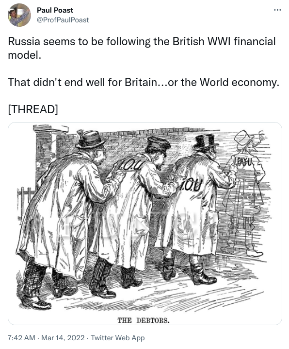
```


###

```{r, eval=TRUE, echo=FALSE, out.width="80%"}
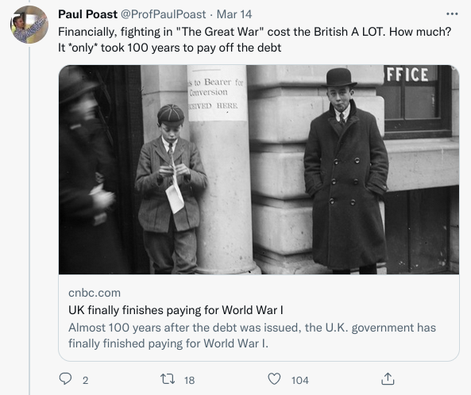
```

###

```{r, eval=TRUE, echo=FALSE, out.width="90%"}
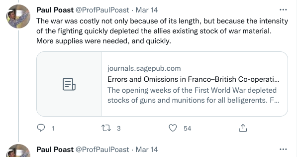
```

###

```{r, eval=TRUE, echo=FALSE, out.width="80%"}
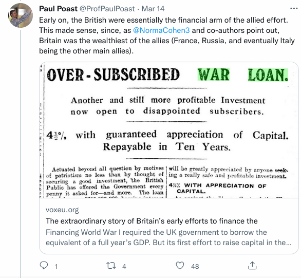
```

###

```{r, eval=TRUE, echo=FALSE, out.width="80%"}
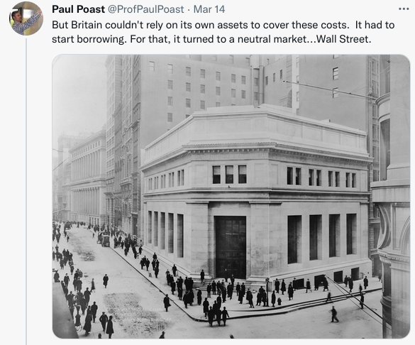
```


###

```{r, eval=TRUE, echo=FALSE, out.width="90%"}
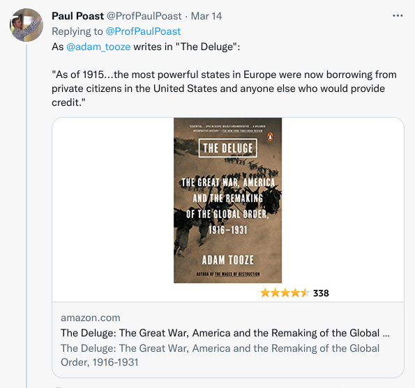
```

###

```{r, eval=TRUE, echo=FALSE, out.width="90%"}
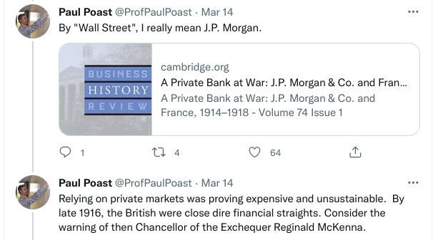
```

###

```{r, eval=TRUE, echo=FALSE, out.width="90%"}
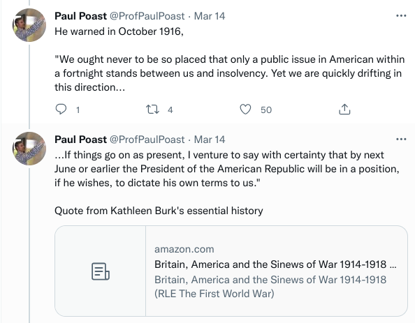
```

###

```{r, eval=TRUE, echo=FALSE, out.width="90%"}
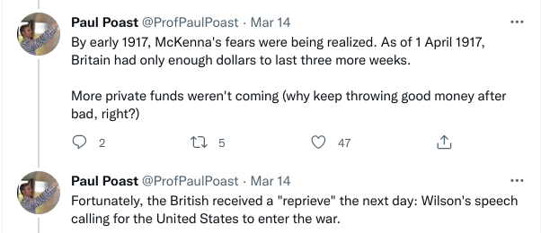
```

###

```{r, eval=TRUE, echo=FALSE, out.width="80%"}
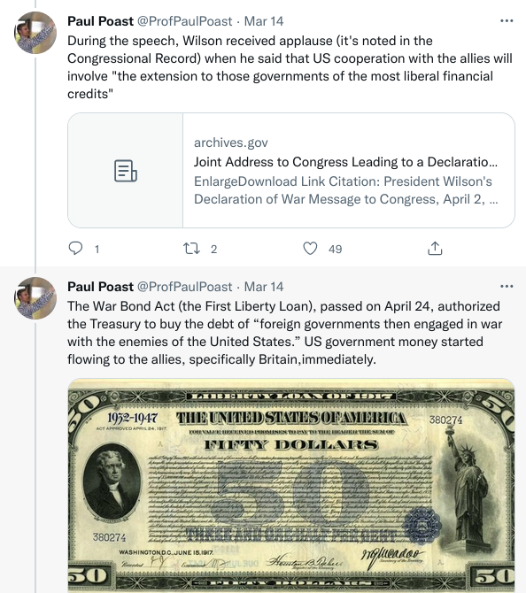
```

###

```{r, eval=TRUE, echo=FALSE, out.width="90%"}
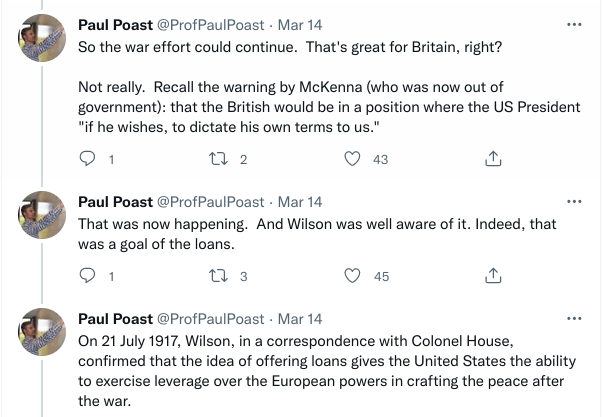
```

###

```{r, eval=TRUE, echo=FALSE, out.width="80%"}
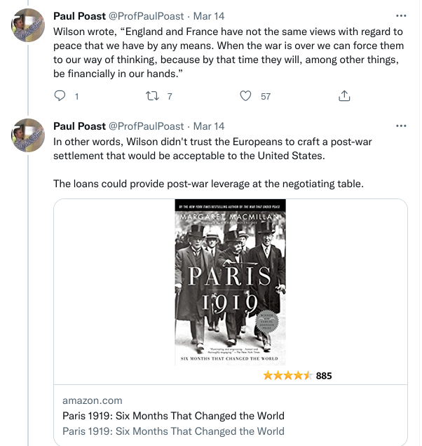
```

###

```{r, eval=TRUE, echo=FALSE, out.width="90%"}
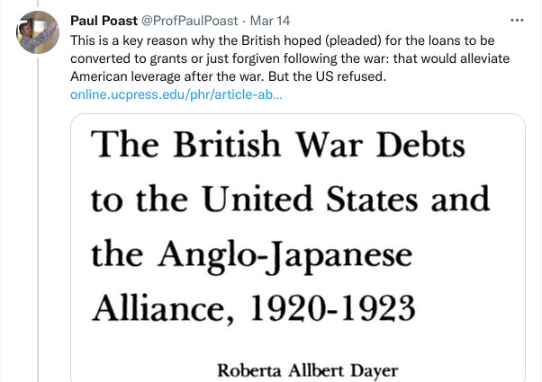
```

###

```{r, eval=TRUE, echo=FALSE, out.width="80%"}
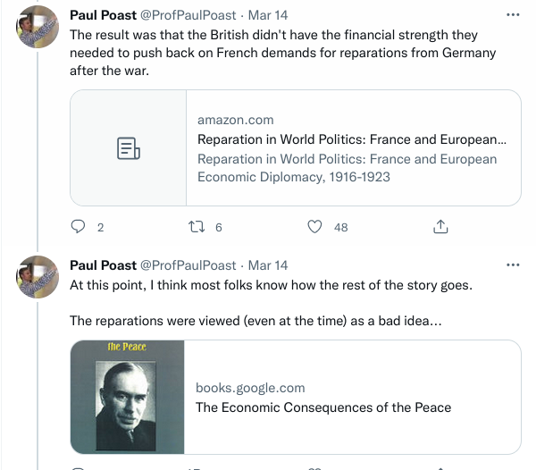
```

###

```{r, eval=TRUE, echo=FALSE, out.width="80%"}
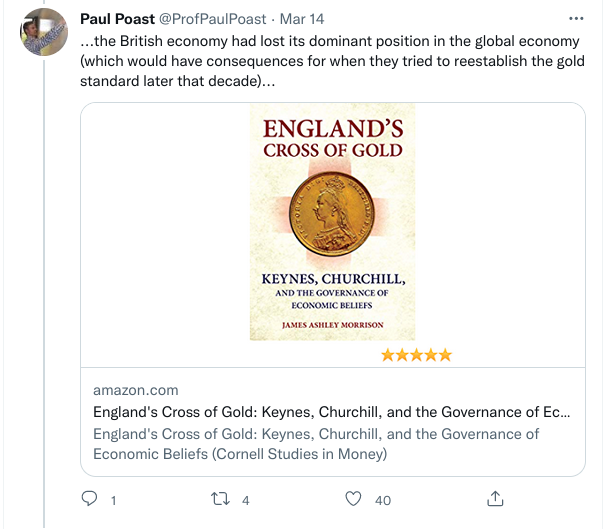
```

###

```{r, eval=TRUE, echo=FALSE, out.width="90%"}
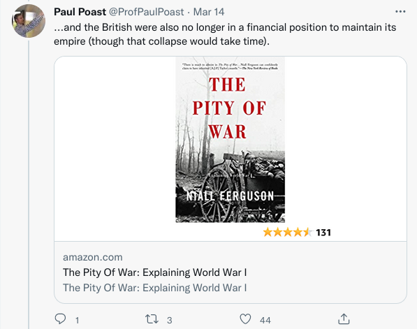
```

###

```{r, eval=TRUE, echo=FALSE, out.width="90%"}
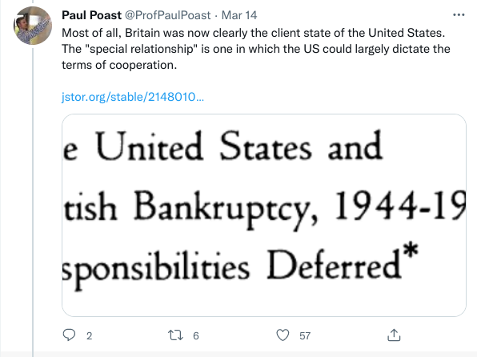
```


# Conclusion
### Conclusion

States must finance war.

- Lot of recent energy into this topic. Data are playing catch-up.
- Leaders try to play "hide-and-seek" strategy (from public) with war finance.
- Debt, prominently sovereign-to-sovereign debt, is central to war finance.
- Wartime loans are an instrument of international power.
