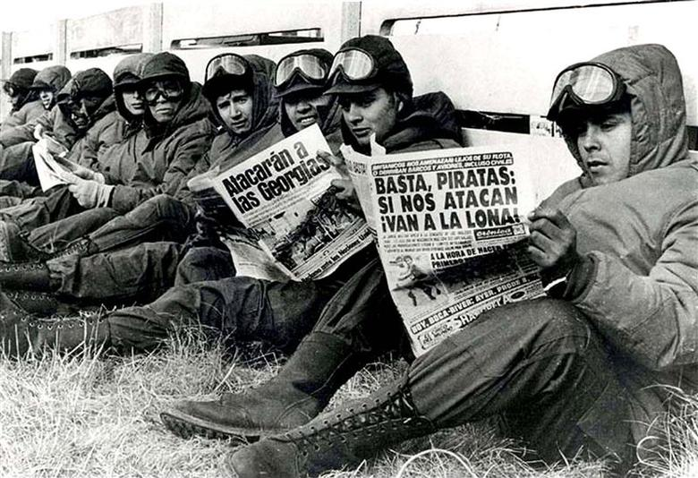
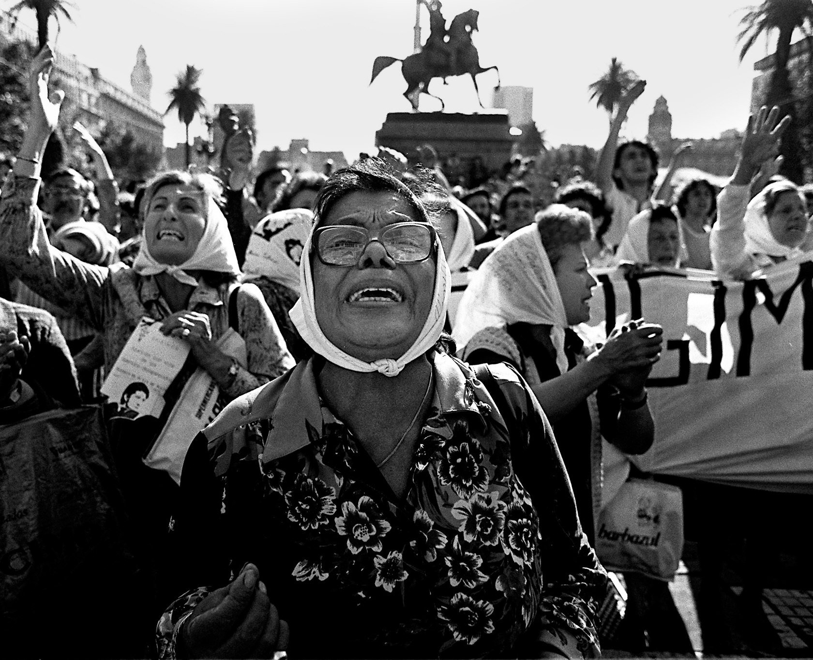
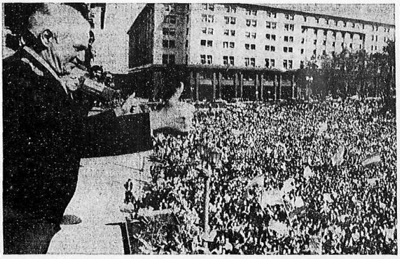
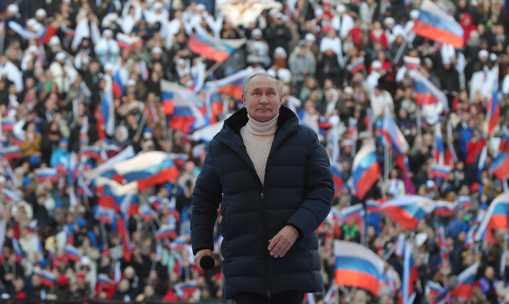

```{r setup, include=FALSE, cache=F, message=F, warning=F, results="hide"}
knitr::opts_chunk$set(cache=TRUE, warning=F, message=F, echo=FALSE, fig.width = 14, fig.height = 8.5)
knitr::opts_chunk$set(fig.path='figs/')
knitr::opts_chunk$set(cache.path='cache/')

knitr::opts_chunk$set(
                  fig.process = function(x) {
                      x2 = sub('-\\d+([.][a-z]+)$', '\\1', x)
                      if (file.rename(x, x2)) x2 else x
                      }
                  )
```


```{r loadstuff, include=FALSE}
knitr::opts_chunk$set(cache=TRUE)
options(knitr.kable.NA = '')
library(tidyverse)
library(stevemisc)
library(peacesciencer)
library(fixest)
library(kableExtra)
library(modelsummary)
library(patchwork)
library(cowplot)
library(artyfarty)

options("modelsummary_format_numeric_latex" = "plain")
options(knitr.kable.NA = '')
```

```{r loaddata, cache=T, eval=T, echo=F, message=F, error=F, warning=F}

Mods <- readRDS("Mods.rds")
Sims <- readRDS("Sims.rds")
Data <- readRDS("Data.rds")

```

# Introduction
### Goal for Today

*Discuss the importance of leaders (and leader motivation) to understanding inter-state conflict.*


### Confrontation of the Day: Falklands War (MIC#3630)

```{r mic-of-the-day, eval=TRUE, echo=FALSE, out.width="90%"}

```

### MIC#3630

- *Who*: Argentina vs. United Kingdom (31 March 1982 - 14 June 1982)
- *Why*: Falkland Islands (o "Las Malvinas" en español)
- *What happened (synopsis)*:
  - 31 March: mutual show of force, first initiated by ARG.
  - 2 April: the invasion proper
  - 25 April: recapture of South Georgia
  - 2 May: sinking of the Belgrano (sea denial)
  - 29 May: Battle of Goose Green
  - 13 June: Mount Tumbledown
  - 14 June: Argentine governor in Stanley surrenders


### Plaza de Mayo (Argentina), March 30, 1982



### Plaza de Mayo (Argentina), April 2, 1982



### The Falklands War as Proof of Concept(s)

Rightly or wrongly, the Falklands War is a case in point for a lot of important topics.

- "Diversionary conflict"
- "Rally effect"
- "Gambling for resurrection"

It's easy to think of this re: Argentina, but it's applicable to Thatcher as well.

- Thatcher had been polling in the high 20s/low 30s for every month from late 1980 to Feb. 1982.

### 

```{r}
readxl::read_excel("~/Dropbox/projects/stevedata/data-raw/thatcher_approval/thatcher_approval.xlsx") %>%
  fill(year) %>%
  separate(poll_date, "month", sep= " ", remove=FALSE) %>% 
  mutate(date = lubridate::ymd(paste0(year, month, day))) %>% 
  filter(year <= 1982) %>%
  select(date, thatcher_sat, thatcher_dis) %>%
  gather(var, val, -date) %>%
  mutate(var = ifelse(var == "thatcher_sat", "Satisfied", "Dissatisfied")) %>%
  ggplot(.,aes(date, val,  linetype=var, color=var)) + 
  geom_line(size=1.1)  +
  theme_steve_web() +
  scale_x_date(minor_breaks = "1 month") +
  labs(title = "Public Opinion about Margaret Thatcher, 1980-1982",
       linetype = "", color = "",
       x = "", y = "Satisfaction/Dissatisfaction Ratings",
       subtitle = "Thatcher's satisfaction ratings jumped from 30 (Feb. 1982) to 59 (June 1982), in large part because of the Falklands War. This is quite the 'rally.'",
       caption = "Data: ?thatcher_approval in {stevedata} (by way of Ipsos).")

```


# Why Study Leaders?
### Why Study Leaders?

Simple: leaders make decisions for war, not "states."

- Clinton was fine with escalating campaign with Yugoslavia during impeachment scandal.
- Regime change in Iraq was more a Bush hobby horse than anything else.
- Hussein invaded Kuwait convinced (H.W.) Bush was weak and wouldn't stop him.

These are just a few examples. Leader attributes are everywhere in every war in our collective mindset.

### Why Study Leaders?

However, they were often absent in our scholarly approaches to conflict.

- "Structural" approaches "black boxed" the state.
- Regime-based approaches (i.e. DPT) were mute on leaders of institutions that concerned them.

This relegates leaders to the proverbial "error term."

- They influence the outcome that interests us, but don't appear in our analyses.
- They don't even appear in our unit of analysis (e.g. dyad-year, state-year)
- For the longest time, we didn't have data on them.

## Leader Data
### Archigos Data

We have Chiozza and Goemans largely to thank for (2003, 2004, 2009) for changing this.

- Archigos is a systematic data set of all leaders from 1870 to 2015, recording how leaders enter and exit office.

###

```{r}
gwcode_democracy %>%
  group_by(gwcode) %>%
  mutate(regime_change = case_when(
    polity2 > -6 & lag(polity2, 1) <= -6 ~ 1,
    between(polity2, -5, 5) & lag(polity2, 1) %in% c(-10:-6, 6:10) ~ 1,
    polity2 >= 6 & lag(polity2, 1) < 6 ~ 1,
    is.na(polity2) ~ NA_real_,
    TRUE ~ 0
  )) %>% mutate(l1_polity2 = lag(polity2, 1)) %>% 
  filter(between(year, 1870, 2014)) %>%
  group_by(year) %>% 
  summarize(n = n(), sum = sum(regime_change, na.rm=T),
            prop = sum/n) %>% 
  ggplot(.,aes(year, sum)) + 
  geom_bar(stat="identity", alpha= 0.8, fill="#619cff", color="black") +
  theme_steve_web() +
  scale_x_continuous(breaks = seq(1870, 2010, by = 10)) +
  labs(x = "", y = "Number of States Experiencing a 'Regime Change'",
       title = "The Number of States Experiencing a 'Regime Change' versus Leader Turnover, 1870-2014",
       subtitle = "In a given year, only about 2% of the international system will change among autocracy/anocracy/democracy, but about 22% of the system will change leaders.") -> p1

Data[[1]] %>%
  left_join(., archigos %>% select(obsid, entry, exit, exitcode)) %>%
  group_by(obsid) %>%
  slice(n()) %>%
  group_by(year) %>%
  summarize(n = n()) %>%
  filter(year != 2015) %>%
  ggplot(.,aes(year, n))  + 
  geom_bar(stat="identity", alpha= 0.8, fill="#619cff", color="black") +
  theme_steve_web() +
  scale_x_continuous(breaks = seq(1870, 2010, by = 10)) +
  labs(x = "", y = "Number of States Experiencing Leader Turnover",
       caption = "'Regime change' defined as alternating around autocracy/anocracy/democracy zones from previous year.\nData generated in {peacesciencer} from `gwcode_democracy` and the Archigos data provided in the package.") -> p2


p1/p2
```

### How Do Leaders Enter Office?

- *Regular*: entry by explicit rules or established conventions.
    - In democracy: elections. In monarchies: hereditary succession. In autocracies, perhaps: one-party elections (think: China)
- *Foreign imposition:* self-explanatory, but *direct* and not indirect.
    - e.g. the U.S. installed Guillermo Endara as Panama's leader after removing Noriega in 1989.
- *Irregular*: entry outside explicit rules/conventions.
    - e.g. the revolution in 1959 overthrew Bautista and installed Castro in Cuba.

### How Do Leaders Enter Office?

```{r}

archigos %>% count(entry) %>%
  mutate(tot = sum(n),
         perc = n/tot,
         perc = make_perclab(perc)) %>%
  select(-tot) %>%
  kbl(., booktabs = TRUE, linesep= '', longtable = TRUE,
      col.names = c("Entry Type", "Count", "Percentage"),
      caption = "Leader Entry in the Archigos Data, 1870-2015",
      align = c("lcc")) %>%
  row_spec(0, bold=TRUE)
```


### How Do Leaders Exit Office?

```{r}

archigos %>% count(exit) %>%
  filter(exit != "Still in Office") %>%
  mutate(tot = sum(n),
         perc = n/tot,
         perc = make_perclab(perc)) %>%
  select(-tot) %>%
  kbl(., booktabs = TRUE, linesep= '', longtable = TRUE,
      col.names = c("Exit Type", "Count", "Percentage"),
      align = c("lcc"),
      caption = "Leader Exit in the Archigos Data, 1870-2015") %>%
  row_spec(0, bold=TRUE) %>%
  footnote(general = "Omits those still in office at end of 2015.")
```

### 

```{r}
archigos %>%
  filter(exit == "Irregular") %>%
  count(exitcode) %>%
  mutate(label = c("Assassination by\nUnsupported Individual",
                   "Irregular,\nOther",
                   "Popular Protest,\nwith\nForeign Support",
                   "Popular Protest,\nwithout\nForeign Support",
                   "Military,\nwith\nForeign Support",
                   "Military,\nwithout\nForeign Support",
                   "Other\nGovt. Actors,\nwith\nForeign Support",
                   "Other\nGovt. Actors,\nwithout\nForeign Support",
                   "Rebels,\nwith\nForeign Support",
                   "Rebels,\nwithout\nForeign Support",
                   "Military\nPower Struggle\nShort of Coup",
                   "Unknown")) %>%
  ggplot(.,aes(label, n)) + theme_steve_web() +
  geom_bar(stat="identity", alpha=0.8, fill="#619cff", color="black") +
  geom_text(aes(label = n), family="Open Sans", vjust = -0.5) +
  labs(x = "Irregular Exit Codes",
       y = "",
       title = "The Distribution of Irregular Exits by Particular Irregular Exit Codes",
       subtitle = "About 47% of all irregular leader exits are done by military coup. Over half involve the military in some direct way.",
       caption = "Data: Archigos (v. 4.1), by way of {peacesciencer}.")
```


### The Focus (and Drawbacks) of Archigos

Archigos' data are somewhat limited.

- Beyond entry/exit dates/types, they say little of leaders (beyond their name, gender, and year they were born).

This is somewhat by design.

- The primary focus has always been about understanding how survival incentives influence leader decisions for war.

## Is War "Ex Post" Inefficient?
### Is War "Ex Post" Inefficient?

<!-- Good for the Leader, Good for "the State" -->


```{r putin, eval=TRUE, echo=FALSE, out.width="95%"}

```

<!--  -->


### Good for the Leader, Good for "the State"

Prominent IR assumption: war is "ex post inefficient."

- Its outcome always reveals something that could've been achieved (would've been preferable) w/o fighting.

If it's true for "the state", is it true for the leader?

- i.e. war may be a net public bad, but is it a private good for the leader's coalition?
- Does it help the leader hold onto power?


### The Important Concepts


- "Diversionary conflict"
- "Rally effect"
- "Gambling for resurrection"


## Some Stylized Facts
### Research Design

*DV*: initiation of inter-state conflict

- GML MID data (v. 2.2.1)
- See Miller (Forthcoming) for details.

*IV*: leader tenure

- minimum days in office for leader in calendar year
- was it the leader's first year in office
- Caveat: tenure can proxy many things, like security (e.g. Chiozza and Goemans, 2003), experience (Potter, 2007), or information (Wu and Wolford, 2018)

*Controls/Other notes*: 

- Controls: CINC, polity2
- Unit of analysis: leader-year

###

```{r reg-table-1}
modelsummary(list("All Leader Years" = Mods[[1]], 
                  "Democracies" = Mods[[2]],
                  "Autocracies" = Mods[[3]],
                  "Anocracies" = Mods[[4]]),
             # output="latex",  
             longtable=TRUE,
             title = "Simple Models of Inter-state Conflict Initiation in Leader-Years",
             gof_omit = "IC|F|Log.|R2$|R2",
             coef_map = c("z_min_daysoffice" = "Minimum Days in Office for Leader in Year",
                          "z_cinc" = "CINC",
                          "z_polity2" = "Polity Score"),
             stars = TRUE) %>%
  row_spec(0, bold=TRUE) %>%
  kable_styling(font_size = 8)
```


###

```{r reg-table-2}
modelsummary(list("All Leader Years" = Mods[[5]], 
                  "Democracies" = Mods[[6]],
                  "Autocracies" = Mods[[7]],
                  "Anocracies" = Mods[[8]]),
             # output="latex",  
             longtable=TRUE,
             title = "Simple Models of Inter-state Conflict Initiation in Leader-Years",
             gof_omit = "IC|F|Log.|R2$|R2",
             coef_map = c("first_year" = "Leader's First Year",
                          "z_cinc" = "CINC",
                          "z_polity2" = "Polity Score"),
             stars = TRUE) %>%
  row_spec(0, bold=TRUE) %>%
  kable_styling(font_size = 8)
```


###

```{r}

bind_rows(Sims) %>%
  mutate(y = plogis(y),
         lbl = rep(c("First Day", 
                       "Start of Second Year",
                       "Start of Third Year",
                       "Start of Fifth Year",
                       "Start of 10th Year"), 3000),
         lbl = fct_inorder(lbl)) %>%
  group_by(model, lbl) %>%
  summarize(mean = mean(y),
            lwr = quantile(y, .05),
            upr = quantile(y, .95)) %>%
  ungroup() %>%
  mutate(model = fct_relevel(model, c("Autocracies", "Anocracies", "Democracies"))) %>%
  ggplot(.,aes(x = lbl, y = mean, ymin=lwr, ymax=upr)) +
  theme_steve_web() +
  geom_pointrange() +
  facet_wrap(~model) + coord_flip() +
  labs(x = "", y = "Mean Simulated Probability of Conflict Initiation (with 90% Intervals)",
       title = "More Secure (i.e. Longer Tenured) Leaders are More Likely to Initiate Conflicts",
       subtitle = "The effect is stronger in democracies than other regime types, particularly autocracies.",
       caption = "Simulations based on model output from Table 1 in this presentation.")

```


###

```{r war-fate-leaders, fig.height=8.5, fig.width = 14, echo=F, eval = T, message =F, warning = F}

tribble(
  ~Type, ~`War Outcome`, ~`Leader Fate`, ~Count,
  "Democracy", "Victory", "Stayed in Power", 20,
  "Democracy", "Victory", "Out of Power", 9,
  "Democracy", "Victory", "Punished", 1,
  "Democracy", "Small Loss", "Stayed in Power", 1,
  "Democracy", "Small Loss", "Out of Power", 6,
  "Democracy", "Small Loss", "Punished", 2,
  "Democracy", "Big Loss", "Stayed in Power", 0,
  "Democracy", "Big Loss", "Out of Power", 1,
  "Democracy", "Big Loss", "Punished", 1,
  "Mixed Regime", "Victory", "Stayed in Power", 23,
  "Mixed Regime", "Victory", "Out of Power", 8,
  "Mixed Regime", "Victory", "Punished", 3,
  "Mixed Regime", "Small Loss", "Stayed in Power", 13,
  "Mixed Regime", "Small Loss", "Out of Power", 11,
  "Mixed Regime", "Small Loss", "Punished", 11,
  "Mixed Regime", "Big Loss", "Stayed in Power", 1,
  "Mixed Regime", "Big Loss", "Out of Power", 9,
  "Mixed Regime", "Big Loss", "Punished", 9,
  "Dictatorship", "Victory", "Stayed in Power", 34,
  "Dictatorship", "Victory", "Out of Power", 5,
  "Dictatorship", "Victory", "Punished", 2,
  "Dictatorship", "Small Loss", "Stayed in Power", 31,
  "Dictatorship", "Small Loss", "Out of Power", 18,
  "Dictatorship", "Small Loss", "Punished", 15,
  "Dictatorship", "Big Loss", "Stayed in Power", 2,
  "Dictatorship", "Big Loss", "Out of Power", 6,
  "Dictatorship", "Big Loss", "Punished", 6
) -> goemans2011tab32 # p. 58

goemans2011tab32 %>%
  filter(`Leader Fate` != "Punished") %>%
  group_by(`War Outcome`) %>%
  mutate(tot = sum(Count)) %>%
  group_by(`War Outcome`, `Leader Fate`) %>%
  summarize(perc = sum(Count)/unique(tot)) %>%
  mutate(lab = paste0(round(perc*100, 1), "%")) %>%
  ggplot(.,aes(`War Outcome`, perc, fill=`Leader Fate`)) +
  theme_steve_web() +
  geom_bar(stat="identity", position = "dodge",
           alpha = I(0.8),color = I("black")) +
    geom_text(aes(label=lab), vjust=-.5, colour="black",
            position=position_dodge(.9), size=4) +
  ylab("Percentage") +
  scale_fill_manual(values = pal("five38")) +
  scale_y_continuous(labels = scales::percent, limits = c(0,1)) +
  labs(title = "War and the Fate of Leaders",
       subtitle = "Leaders are more (less) likely to be replaced from office following defeat (victory) in war.",
       caption = "Source: Goemans, Hein. 2000. ''War and Punishment : The Causes of War Termination and the First World War''. Princeton, NJ: Princeton University Press. [Table 3.2, p. 58]")
```

###

```{r war-fate-leaders-democracy, fig.height=8.5, fig.width = 14, echo=F, eval = T, message =F, warning = F}
goemans2011tab32 %>%
  filter(`Leader Fate` != "Punished") %>%
  mutate(Type = ifelse(Type == "Democracy", "Democracy", "Non-Democracy"),
         `War Outcome` = ifelse(`War Outcome` == "Victory", "Victory", "Loss")) %>%
  group_by(Type, `War Outcome`) %>%
  mutate(tot = sum(Count)) %>%
  group_by(Type, `War Outcome`, `Leader Fate`) %>%
  summarize(perc = sum(Count)/unique(tot)) %>%
  mutate(lab = paste0(round(perc*100, 1), "%")) %>%
  ggplot(.,aes(`War Outcome`, perc, fill=`Leader Fate`)) +
  theme_steve_web() +
  facet_wrap(~Type) +
  geom_bar(stat="identity", position = "dodge",
           alpha = I(0.8),color = I("black")) +
  geom_text(aes(label=lab), vjust=-.5, colour="black",
            position=position_dodge(.9), size=4) +
  ylab("Percentage") +
  scale_fill_manual(values = pal("five38")) +
  scale_y_continuous(labels = scales::percent, limits = c(0,1)) +
  labs(title = "Democratic Leaders Fare Worse than Non-Democrats in Their Post-War Tenure",
       subtitle = "Democratic leaders are more likely to be replaced after losing a war and are less likely to stay in office after winning a war.",
       caption = "Source: Goemans, Hein. 2000. ''War and Punishment : The Causes of War Termination and the First World War''. Princeton, NJ: Princeton University Press. [Table 3.2, p. 58]")
```

###

```{r removal-type-democracy-nondemocracy, fig.height=8.5, fig.width = 14, echo=F, eval = T, message =F, warning = F}

goemans2011tab32 %>%
  filter(`Leader Fate` != "Stayed in Power") %>%
  mutate(Type = ifelse(Type == "Democracy", "Democracy", "Non-Democracy"),
         `War Outcome` = ifelse(`War Outcome` == "Victory", "Victory", "Loss")) %>%
  group_by(Type, `Leader Fate`) %>% # , `War Outcome` in second place
  mutate(tot = sum(Count)) %>%
  distinct(tot) %>%
  group_by(Type) %>% # , `War Outcome`
  mutate(max = max(tot),
         perc = tot/max(tot),
         perc2 = 1 - (perc),
         perc = ifelse(perc == 1, max(perc2), perc),
         lab = paste0(round(perc*100, 1), "%")) %>%
  ggplot(.,aes(Type, perc, fill=`Leader Fate`)) +
  geom_bar(stat="identity", position = "dodge",
           alpha = I(0.8),color = I("black")) +
  theme_steve_web() +
  geom_text(aes(label=lab), vjust=-.5, colour="black",
            position=position_dodge(.9), size=4) +
  scale_fill_manual(labels = c("Peacefully Removed From Power",
                               "Exiled or Violently Removed From Power"), values=pal("five38")) +
  ylab("Percentage") +
  scale_y_continuous(labels = scales::percent, limits = c(0,1)) +
  labs(title = "''Democrats Leave Office in Limousines. Autocrats Leave Office in Body Bags.''",
       subtitle = "Democratic leaders are more likely to lose office after war, but their means of removal are generally much more benign.",
       caption = "Source: Goemans, Hein. 2000. ''War and Punishment : The Causes of War Termination and the First World War''. Princeton, NJ: Princeton University Press. [Table 3.2, p. 58]")
```

# Conclusion
### Conclusion

1. States don't make decisions for war; leaders do.
2. War may be "ex post inefficient" for states, but not necessarily for leaders.
3. Despite conventional wisdom, leaders are more likely to initiate conflicts the more secure they are.
4. Political insecurity's effects on conflict initiation are weaker (stronger) among democracies (non-democracies).
5. Diversions/gambles are endogenous to the costs (benefits) of leader exit (tenure).