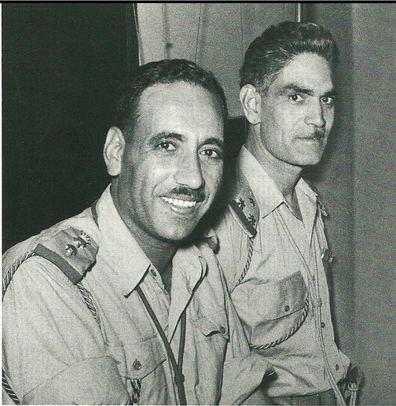

```{r setup, include=FALSE, cache=F, message=F, warning=F, results="hide"}
knitr::opts_chunk$set(cache=TRUE, warning=F, message=F, echo=FALSE, fig.width = 14, fig.height = 8.5)
knitr::opts_chunk$set(fig.path='figs/')
knitr::opts_chunk$set(cache.path='cache/')

knitr::opts_chunk$set(
                  fig.process = function(x) {
                      x2 = sub('-\\d+([.][a-z]+)$', '\\1', x)
                      if (file.rename(x, x2)) x2 else x
                      }
                  )
```


```{r loadstuff, include=FALSE}
knitr::opts_chunk$set(cache=TRUE)
options(knitr.kable.NA = '')
library(tidyverse)
library(stevemisc)
library(peacesciencer)
library(fixest)
library(kableExtra)
library(modelsummary)
library(patchwork)
library(cowplot)
library(artyfarty)

options("modelsummary_format_numeric_latex" = "plain")
options(knitr.kable.NA = '')
```

```{r loaddata, cache=T, eval=T, echo=F, message=F, error=F, warning=F}

Mods <- readRDS("Mods.rds")
Sims <- readRDS("Sims.rds")
Data <- readRDS("Data.rds")

```

# Introduction
### Goal for Today

*Discuss what we know about leader turnover, leader attributes, and inter-state conflict.*


### Confrontation of the Day: MIC#2331

```{r mic-of-the-day, eval=TRUE, echo=FALSE, out.width="100%"}
# 

p1 <- ggdraw() + draw_image("mic2331.jpg", scale = 0.8)
p2 <- ggdraw() + draw_image("mic2331-3.png", scale = 1.1)

plot_grid(p1, p2)
```

### MIC#2331

- *Who*: United Kingdom vs. Iraq and UAR (14 July 1958 - 2 Nov. 1958)
- *Why*: overthrow of the Iraqi monarchy; threats to Jordan
- *What happened (synopsis)*:
  - 14 July: overthrow of the Iraqi monarchy, UKG goes on alert
  - 17 July: show of force starts
  - 19 October: Britain starts withdrawal from Jordan
  - 2 November: Britain completes withdrawal from Jordan
  
### Leaders and Conflict

1. How do survival incentives shape decisions for/against war?
2. How are states' decisions for war shaped by which leader is in power?

# Leader Attributes and War
## Ex Post, Ex Ante
### Leader Attributes and War

If successive leaders evaluate war/peace differently, then leader turnover can produce variation in war and peace.

- *Ex post*
- *Ex ante*

### Ex Post Leader Turnover and War

- *Unit of analysis*: politically relevant directed dyad-years
- *DV*: Confrontation onset, escalation to war (A vs. B, GML MID v.2.2.1)
- *IVs*: irregular leader turnover in dyad-year, regular leader turnover in dyad-year
    - Benchmarks to comparison against *no* leader turnover in dyad-year
- *Controls*: land contiguity, relative power (W/S), major power in dyad, defense pact (CoW), minimum democracy, minimum GDP per capita, minimum level of militarization

  
###

```{r reg-table-turnover}
modelsummary(list("Onset" = Mods[[3]],
                  "Escalation" = Mods[[5]]),
             longtable = TRUE,
             title = "The Effect of Leader Turnover on Confrontation Onset/Escalation",
             gof_omit = "IC|F|Log.|R2$|R2",
             coef_map = c("dyad_ilt" = "Irregular Leader Turnover in Dyad",
                          "dyad_lt" = "Regular Leader Turnover in Dyad",
                          "landcontig" = "Land Contiguity",
                          "z_cincoprop" = "CINC Proportion (W/S)",
                          "cowmajdyad"=  "Major Power in Dyad",
                          "cow_defense" = "Defense Pact",
                          "z_mindemest" = "Democracy (Weak-Link)",
                          "z_minwbgdppc" = "GDP per Capita (Minimum)"),
             stars = TRUE) %>%
    row_spec(0, bold=TRUE) %>%
  kable_styling(font_size = 7) %>%
  row_spec(c(4), hline_after = TRUE) %>%
  row_spec(c(1:4), background="#eeeeee") 
```


## Which Leaders Are More Likely to Use Force?
### Which Leaders Are More Likely to Use Force?

- *Unit of analysis*: leader-years
- *DV*: did leader initiate a conflict in leader-year?
- *IVs*: leader gender,  military service, was leader previously a rebel, war outcome in previous military (rebel) service, years of experience in politics before becoming a leader, level of education
- *Controls:* CINC, level of democracy, leader age, leader year in office


###

```{r reg-table-attributes}
modelsummary(Mods[[2]],
             # output="latex",  
             longtable=TRUE,
             title = "Leader Attributes and Conflict Initiation",
             gof_omit = "IC|F|Log.|R2$|R2",
             coef_map = c("female" = "Female Leader",
                         # "leaderage" = "Leader Age",
                        #  "yrinoffice" = "Leader Year in Office",
                          "milservice_nocombat" = "Military Service (No Combat)",
                          "combat" = "Military Service (Combat)",
                          "rebel" = "Previous Rebel",
                          "warwin" = "Won War in Military",
                          "warloss" = "Lost War in Military",
                          "rebelwin" = "Won War as Rebel",
                          "rebelloss" = "Lost War as Rebel",
                          "leveledu" = "Level of Education",
                          "yrsexper" = "Years in Politics Before Becoming Leader"
                          ),
             stars = TRUE) %>%
  row_spec(0, bold=TRUE) %>%
  kable_styling(font_size = 6) %>%
  footnote(general = "Control variables/temporal adjustments omitted for presentation.")
```

## Leader Attributes and Conflict Initiation
### Leader Attributes and Conflict Initiation

- Women are more likely to initiate conflicts than men.
- Leaders with military experience are more likely to initiate conflicts than leaders without military experience.
- Leaders who were previously rebels are more generally likely to initiate conflicts.
- More experienced leaders (in office, in politics) are more likely to initiate conflicts.

###

```{r}
Data[[3]] %>%
  mutate(rivalry = ifelse(ideological == 0 & interventionary == 0 & 
                            positional == 0 & spatial == 0, 0, 1))  %>%
  distinct(obsid, gender, rivalry) %>%
  group_by(gender, rivalry) %>% 
  count() %>%
  group_by(gender) %>%
  mutate(tot_gender = sum(n),
         perc = make_perclab(n/tot_gender)) %>%
  select(-tot_gender) %>%
  ungroup() %>%
  mutate(gender = ifelse(gender == "F", "Female", "Male"),
         rivalry = ifelse(rivalry == 0, "No Rivalry", "Rivalry")) %>%
  kbl(., booktabs = TRUE, linesep= '', longtable = TRUE,
      col.names = c("Leader Gender", "Rivalry", "No. of Leaders", "Percentage"),
      caption = "Leader Gender and Rivalry",
      align = c("llcc")) %>%
  row_spec(0, bold=TRUE) %>%
  footnote(general = "May double-count leaders who presided over changes in rivalry status.")
```

###

```{r}
Data[[3]]%>%
  mutate(rivalry = ifelse(ideological == 0 & interventionary == 0 & 
                            positional == 0 & spatial == 0, 0, 1)) %>%
  filter(rivalry == 1 & gender == "F") %>% distinct(obsid, leader) -> female_rivalry_leaders

# female_rivalry_leaders %>% pull(obsid)

Data[[2]] %>%
  filter(obsid %in% c(female_rivalry_leaders %>% pull(obsid))) %>%
  group_by(obsid) %>%
  summarize(n = n(),
            sum_onset = sum(gmlmidonset),
            sum_ongo = sum(gmlmidongoing),
            sum_onsetinit = sum(gmlmidonset_init),
            sum_ongoinit = sum(gmlmidongoing_init)) %>%
  left_join(female_rivalry_leaders, .)  %>%
  kbl(., booktabs = TRUE, linesep= '', longtable = TRUE,
      col.names = c("Leader ID", "Name", "Years",
                    "Conflicts", "Conflict Years",
                    "Conflicts Started", "Conflict Years (Started)"),
      caption = "The Conflict Behavior of Female Leaders in Rivalry",
      align = c("llccccc")) %>%
  row_spec(0, bold=TRUE) %>%
  footnote(general = "Data: GML MID v. 2.2.1 by way of {peacesciencer}") %>%
  kable_styling(font_size = 5)
```

###

```{r}
Sims[[2]] %>% mutate(y = plogis(y)) %>% group_by(cat) %>% summarize(mean = mean(y), lwr = quantile(y, .05), upr = quantile(y, .95)) %>% ggplot(., aes(cat, mean, ymin=lwr, ymax=upr)) + coord_flip() +
   theme_steve_web() +
  geom_pointrange(position = position_dodge(width = .3), size=1.1) +
  labs(color = "", shape = "",
       y = "Mean Simulated Probability of Being Targeted in a Dispute (with 90% Intervals)",
       x = "",
       title = "Leader Military Experience and Conflict Initiation",
       subtitle = "Horowitz and Stam (2014) suggest the most belligerent leaders with military backgrounds are the ones without combat experience.",
       caption = "Simulations from model provided earlier in this presentation.")
```

## The Biden Hypothesis
### 

> Mark my words. It will not be six months before the world tests Barack Obama like they did John Kennedy. The world is looking. We’re about to elect a brilliant 47-year-old senator president of the United States of America. Remember, I said it standing here, if you don’t remember anything else I said. Watch, we're going to have an international crisis, a generated crisis, to test the mettle of this guy.
>
> --- **Joe Biden (Oct. 19, 2008)**


### Are Younger Leaders More Likely to Be Targeted?
 

```{r, eval=TRUE, echo=FALSE, out.width="100%"}

```

### Testing the Biden Hypothesis

A test of the Biden hypothesis:

- *Unit of analysis*: politically relevant directed leader-dyad-years
- *DV*: Initiation of a dispute (A vs. B, GML MID v.2.2.1)
- *IVs*: Leader age (A,B), year in office (A,B)
- *Controls*: minimum democracy, female leader (B), relative power, land contiguity, (CoW) defense pact

###

```{r reg-table-biden}
modelsummary(Mods[[1]],
             # output="latex",  
             longtable=TRUE,
             title = "Testing the Biden Hypothesis, 1870-2010",
             gof_omit = "IC|F|Log.|R2$|R2",
             coef_map = c("leaderage1" = "Leader Age (A)",
                          "leaderage2" = "Leader Age (B)",
                          "ln_yrinoffice1" = "Year in Office (A)",
                          "ln_yrinoffice2" = "Year in Office (B)",
                          "leaderage2:ln_yrinoffice2" = "Leader Age (B)*Year in Office (B)"),
             stars = TRUE) %>%
  row_spec(0, bold=TRUE) %>%
  kable_styling(font_size = 8) %>%
  footnote(general = "Control variables omitted for presentation.")
```

###

```{r}
Sims[[1]] %>%
  mutate(y = plogis(y)) %>%
  mutate(yrinoffice = fct_inorder(yrinoffice),
         leader_age = ifelse(leaderage2 == 45, "45 Year Old", "65 Year Old")) %>%
  group_by(leader_age, yrinoffice) %>%
  summarize(mean = mean(y),
            lwr = quantile(y, .05),
            upr = quantile(y, .95)) %>%
  ggplot(.,aes(yrinoffice, y=mean, ymin=lwr, ymax=upr, color=leader_age, shape=leader_age))+
  theme_steve_web() +
  coord_flip() +
  geom_pointrange(position = position_dodge(width = .3), size=1.1) +
  scale_color_brewer(palette = "Dark2") +
  labs(color = "", shape = "",
       y = "Mean Simulated Probability of Being Targeted in a Dispute (with 90% Intervals)",
       x = "",
       title = "Testing the Biden Hypothesis, 1870-2010",
       subtitle = "Generally, older leaders like Biden are more likely to be 'tested' than younger leaders like Obama in their first year, but notice how age interacts with years in office.",
       caption = "Simulations from model provided earlier in this presentation. Ages chosen for simulation to approximate the ages of Obama and Biden around the time of Biden's remarks.")
```

# Conclusion
### Conclusion

- Leader turnover is associated with conflict onset (if not escalation), ex post.
- Identifying ex ante leader turnover's relationship with conflict is more difficult.
- Conflict initiation is (generally) the domain of the older, more experienced leaders.
- Female leaders are relatively rare, and their association with conflict is more about the select countries in which they emerged.
- There might be a distinction in the military effect, between those who fought and those who didn't.