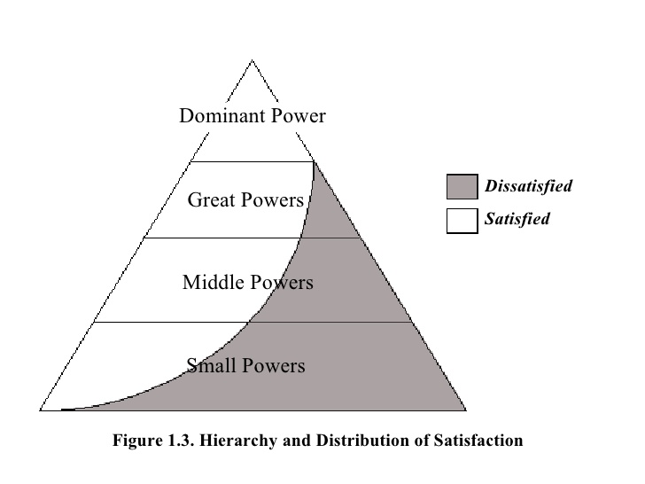
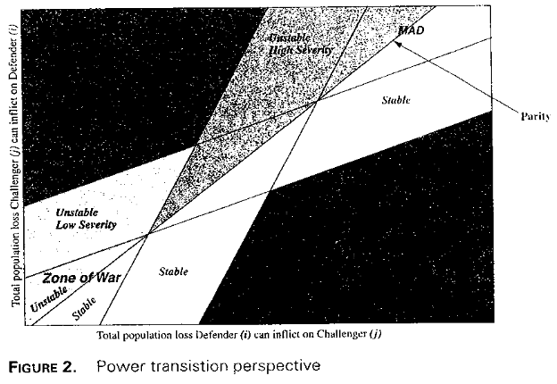

```{r setup, include=FALSE, cache=F, message=F, warning=F, results="hide"}
knitr::opts_chunk$set(cache=TRUE)
knitr::opts_chunk$set(fig.path='figs/')
knitr::opts_chunk$set(cache.path='cache/')

knitr::opts_chunk$set(
                  fig.process = function(x) {
                      x2 = sub('-\\d+([.][a-z]+)$', '\\1', x)
                      if (file.rename(x, x2)) x2 else x
                      }
                  )
```

```{r loadstuff, include=FALSE}
knitr::opts_chunk$set(cache=TRUE)
options(knitr.kable.NA = '')
library(car)
library(tidyverse)
library(janitor)
library(knitr)
library(stevemisc)
```

```{r loaddata, cache=T, eval=T, echo=F, message=F, error=F, warning=F}

# ICOWactive <- read.csv("~/Dropbox/data/icow/icow-provisional-1.01/200199.csv") %>% tbl_df()
CINC <- read.csv("~/Dropbox/data/cow/cinc/NMC_5_0.csv") %>% tbl_df()
FAS <- read.csv("~/Dropbox/data/fas-nukes/number-of-nuclear-warheads-in-the-inventory-of-the-nuclear-powers-1945-2014.csv") %>% tbl_df()


```

# Introduction
### Goal for Today

*Discuss offense-defense balance and power transition theory.*

# Offense-Defense Balance
### Offense-Defense Balance

Offense-defense balance is another component of structural perspectives of IR. Main points:

- Weapons are either offensive or defensive in nature.
- We can observe an imbalance between offense and defense in the international system.
- These variations affect patterns of international politics.

**Central conclusion:** systemic war is more likely when there's an imbalance toward offense and/or leaders can't tell the difference.

### Rationales for War Under Offense Dominance

- Offense dominance leads to opportunistic expansionism.
- First strike advantages are observable.
- Cost-benefit calculus favors offense over defense.
- Even defensively oriented states are compelled to offense.
    - Think: security dilemma

### Offense-Defense Balance and the Security Dilemma

The interaction (i.e. offense/defense indistinguishability) is an important part of the theory.

| | **Offense Dominance** | **Defense Dominance** |
|:------------|:-------------:|:-----------------:|
| **Indistinguishable** | Doubly dangerous | Security dilemma |
| **Distinguishable**   | Aggression possible | Doubly stable |

### Determinants of Offense-Defense Balance

- Military factors (really: military technology)
- Geography
- Social and political order
- Diplomacy

### Some Problems with Offense-Defense Hypotheses
 
- How are any weapons distinguishable? Consider:
    - Tanks, the classic offensive weapon, have important defensive utility
    - Nuclear weapons, most destructive offensive weapon, have defensive logic.
- Diplomacy does not hang well with the other explanations.
- Ultimately non-falsifiable (anything can be tailored to fit the theory).
- Conceptually indistinguishable from balance of power or military skill.
    - Van Evera: "war is far more likely when conquest is easy, and that shifts in the offense-defense balance have a large effect on the risk of war." See the problem?
- Never explicit about what constitutes offense or defense dominance.
    - Categorization is ad hoc.

# Power Transition Theory 
### Power Transition Theory

Power transition theory (PTT) has a curious origin.

- Grand theories and research paradigms are typically introduced in articles or scholarly books.
- PTT was introduced in a 1958 introductory textbook by AFK Organski, titled *World Politics*.

### Anarchy and Hierarchy

The basic premise of PTT is that the international system is *hierarchic*.

- Anarchy is an unexceptional observation according to Organski.

A power pyramid is a better understanding of the international system.
 
- Hegemon
- Great powers
- Middle powers
- Minor powers

### 



### Status Quo and Revisionist States

States are either status quo states or revisionist states.

- Status quo states are those that are satisfied with the current conduct of international
politics.
    - The hegemon is by definition a status quo state.
- Revisionist states are dissatisfied with the current order.

This leads to an important divergence with neorealism.

- States in PTT are policy-motivated, not strictly survival-oriented.

## A Critique of Power Transition Theory
### A Critique of Power Transition Theory

We should raise several critical questions about this approach.

1. How do we know status quo/revisionist ex ante?
2. Why didn't the U.S. and Soviet Union fight?
3. What predicts power transition wars?
4. Why would any state want to fight a power transition war?

### Status Quo and Revisionist States

PTT's hypothesis is an implied boolean proposition.

- Revisionist AND great power AND power transition --> war.
- PTT distinguishes itself from neorealism with this assumption of policy motivations.

So how do we know a state is "revisionist?"

- We typically think of Imperial/Nazi Germany as the classic case of this.

Notice the inferential problem?

### The Measurement Problem

We need an ex ante indicator of revisionist state. Attempts include:

- National size and development (Houweling and Siccama, 1988)
- Gross national income (Organski and Kugler, 1980)
- Demographics/birth rates (e.g. Kugler, 2006)
- UN roll call votes (Reed et al. 2008; Sample, 2017)
- Territorial claims/disputes (Sample, 2017)

### The Measurement Problem

Each of these proposals have significant problems.

- GNI and size proxy "power" and not revisionism.
    - i.e. they measure why bargaining breaks down and not the contested policy benefit.
- Similar statement can be made for demographics/birth rates, but those predict poorly.
- UN votes impose global measure when most conflict is dyadic/local.

Territorial claims better get at this, but it's not clear it's helping PTT's case.

- Disputed territory is a different problem altogether.

### 

```{r ptt, eval=TRUE, echo=FALSE}
knitr::include_graphics("~/Dropbox/teaching/posc3610/kuglerlemke2000ptrp/kuglerlemke2000ptrp-fig2.png")
```

<!--  -->

### 

```{r stockpiles, echo=F, eval=T, fig.width = 14, fig.height = 8.5, warning = F, message = F}
FAS %>%
  filter(Country == "United States" | Country == "Russia") %>%
  group_by(Year, Country) %>%
  summarize(sum = sum(`Nuclear.weapons.inventory.by.country`)) %>%
  ggplot(.,aes(Year, sum, fill=Country, group = Country)) + theme_steve_web() +
  geom_bar(aes(fill=Country), stat="identity",  color="black", alpha=I(0.5)) +
  scale_x_continuous(breaks = seq(1945, 2015, by =5)) +
  xlab("Year") + ylab("Number of Nuclear Warheads in Inventory") +
  labs(title = "Number of Nuclear Warheads in Inventory of the U.S. and Russia/USSR, 1945-2014",
       subtitle = "The Soviet Union surpassed the U.S. in nuclear stockpiles in 1956. The difference became quite lopsided in the 1970s and 1980s.",
       caption = "Data: Federation of American Scientists")
```


### 

```{r usarus, echo=F, eval=T, fig.width = 14, fig.height = 8.5, warning = F, message = F}

CINC %>%
  filter(ccode == 2 | ccode == 365) %>%
  filter(year > 1944 & year < 1991) %>%
  mutate(Country = ifelse(ccode == 2, "United States", "Russia/USSR")) %>%
  ggplot(., aes(x=year, y=cinc, linetype=Country, color=Country)) + geom_line(size = 1.5) + theme_steve_web() +
ylim(.1, .32) +
 scale_x_continuous(breaks = seq(1945, 1990, by = 5)) +
xlab("Year") + ylab("Composite Index of National Capabilities (CINC)") +
annotate("text", x = 1947, y = .27, 
         label = "United States",
         family = "Open Sans") +
annotate("text", x = 1947, y = .11, 
         label = "USSR/Russia",
         family = "Open Sans") + 
annotate("rect", xmin = 1970, xmax = 1989, ymin = -Inf, ymax = Inf, alpha = .2) +
annotate("text", x = 1980, y = .11, 
         label = "Power Transition\n(1970-1988)",
         family = "Open Sans") +
  labs(title = "Why Didn't the Cold War Get Hot?",
       subtitle = "We observe a power transition incidentally around the time of a détente between both Cold War rivals.",
       caption = "Data: Correlates of War National Military Capabilities Data (v. 5.0)") +
  theme(legend.position = "bottom")


```

###

```{r rusjpn, echo=F, eval=T, fig.width = 14, fig.height = 8.5}


CINC %>%
  filter(ccode == 740 | ccode == 365) %>%
  filter(year > 1954) %>% 
  mutate(Country = ifelse(ccode == 740, "Japan", "Russia/USSR")) %>%
  ggplot(., aes(x=year, y=cinc, linetype=Country, color=Country)) +
  geom_line(size = 1.5) + theme_steve_web() +
ylim(.01, .20) +
 scale_x_continuous(breaks = seq(1955, 2010, by = 5)) +
xlab("Year") + ylab("Composite Index of National Capabilities (CINC)") +
annotate("text", x = 1960, y = .19, family = "Open Sans",
         label = "Russia/Soviet Union") +
annotate("text", x = 1958, y = .05, family = "Open Sans", 
         label = "Japan") + 
annotate("rect", xmin = 1997, xmax = 2005, ymin = -Inf, ymax = Inf, alpha = .2) +
annotate("text", x = 2001, y = .10, family = "Open Sans", 
         label = "Power Transition\n(1997-2005)") +
  labs(title= "What About Russia and Japan?",
       subtitle = "We oberve a power transition between Russia and Japan in our lifetimes, but no serious conflict.",
       caption = "Data: Correlates of War National Military Capabilities Data (v. 5.0)")  +
  theme(legend.position = "bottom")

```

###

```{r usachn, echo=F, eval=T, fig.width = 14, fig.height = 8.5}

CINC %>%
  filter(ccode == 710 | ccode == 2) %>%
  filter(year > 1950) %>%
  mutate(Country = ifelse(ccode == 710, "China", "United States")) %>%
ggplot(., aes(x=year, y=cinc, linetype=Country, color=Country)) + geom_line(size = 1.5) +
ylim(.08, .40) +
scale_x_continuous(breaks = seq(1950, 2010, by = 5)) + theme_steve_web() +
xlab("Year") + ylab("Composite Index of National Capabilities (CINC)") +
annotate("text", x = 1952,
         y = .13, label = "China",
         family = "Open Sans") +
annotate("text", x = 1952,
         y = .35, label = "United States", family="Open Sans") + 
annotate("rect", xmin = 1995, xmax = 2012, ymin = -Inf, ymax = Inf, alpha = .2) +
annotate("text", x = 2002, y = .25, label = "Rise of China \n(1995-present)",
         family = "Open Sans") +
  labs(title = "Has China Already Risen?",
       subtitle = "Using available data, we should've already expected the power transition war to happen.",
       caption = "Data: Correlates of War National Military Capabilities Data (v. 5.0)") +
  theme(legend.position = "bottom")

```

### Why Fight a Power Transition War?

It's not yet evident why the power transition war is fought.

- For declining hegemon: *act now*.
- For rising great power: wait.

Put in other words, the power transition war happens when it makes the least sense to fight it.

# Conclusion
### Conclusion

Offense-defense balance/PTT offers different structural perspectives for systemic insecurity/war.

- PTT: states are motivated by policy too; anarchy is unexceptional.
- O/D: weapon balance and distinguishability matter.

All told, these structural theories point to systemic aspects of the international system that
promote inter-state conflict.

- None are coherent arguments.
