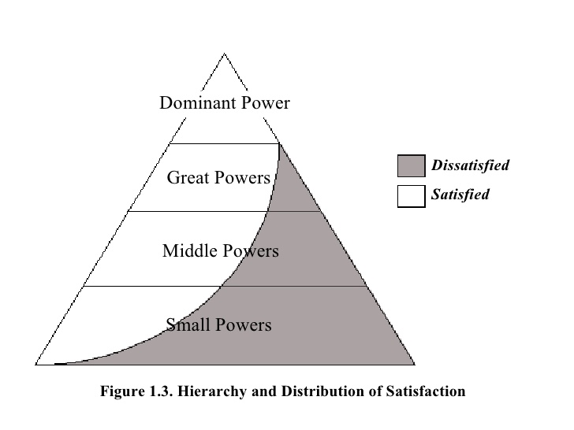
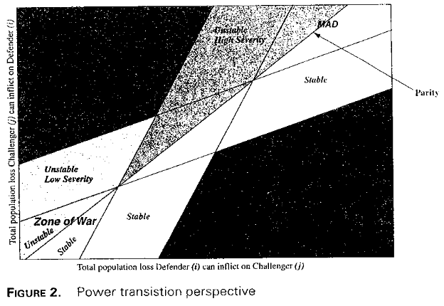

```{r setup, include=FALSE, cache=F, message=F, warning=F, results="hide"}
knitr::opts_chunk$set(cache=TRUE, warning=F)
knitr::opts_chunk$set(fig.path='figs/')
knitr::opts_chunk$set(cache.path='cache/')

knitr::opts_chunk$set(
                  fig.process = function(x) {
                      x2 = sub('-\\d+([.][a-z]+)$', '\\1', x)
                      if (file.rename(x, x2)) x2 else x
                      }
                  )
```


```{r loadstuff, include=FALSE}
knitr::opts_chunk$set(cache=TRUE)
options(knitr.kable.NA = '')
library(tidyverse)
library(stevemisc)
library(peacesciencer)
library(fixest)
library(kableExtra)
library(modelsummary)
library(patchwork)

options("modelsummary_format_numeric_latex" = "plain")

```

```{r loaddata, cache=T, eval=T, echo=F, message=F, error=F, warning=F}

NMC <- read_csv("~/Dropbox/data/cow/nmc/6.0/NMC-60-abridged.csv")
FAS <- read.csv("~/Dropbox/data/fas-nukes/number-of-nuclear-warheads-in-the-inventory-of-the-nuclear-powers-1945-2014.csv") %>% tbl_df()

Mods <- readRDS("Mods.rds")
Sims <- readRDS("Sims.rds")
Data <- readRDS("Data.rds")

cow_ddy %>%
  filter(ccode1 == 652 & ccode2 == 666) %>%
  add_nmc() %>%
  select(ccode1:year, cinc1, cinc2) %>%
    mutate(ccode1 = "Syria",
         ccode2 = "Israel") %>%
  mutate(ndircincprop = ifelse(cinc1 > cinc2, cinc2/cinc1, cinc1/cinc2)) -> isr_syr
```

# Introduction
### Goal for Today

*Discuss power transition theory and the empirical relationship between power and conflict at the dyadic level.*

### MIC of the Day: Battle of Ciudad Juárez (MIC#2185)

```{r juarez, eval=TRUE, echo=FALSE}

```


<!--  -->


# Power Transition Theory 
### Power Transition Theory

Power transition theory (PTT) has a curious origin.

- Grand theories and research paradigms are typically introduced in articles or scholarly books.
- PTT was introduced in a 1958 introductory textbook by AFK Organski, titled *World Politics*.

### Anarchy and Hierarchy

The basic premise of PTT is that the international system is *hierarchic*.

- Anarchy is an unexceptional observation according to Organski.

A power pyramid is a better understanding of the international system.
 
- Hegemon
- Great powers
- Middle powers
- Minor powers

### 



### Status Quo and Revisionist States

States are either status quo states or revisionist states.

- Status quo states are those that are satisfied with the current conduct of international
politics.
    - The hegemon is by definition a status quo state.
- Revisionist states are dissatisfied with the current order.

This leads to an important divergence with neorealism.

- States in PTT are policy-motivated, not strictly survival-oriented.

## A Critique of Power Transition Theory
### A Critique of Power Transition Theory

We should raise several critical questions about this approach.

1. How do we know status quo/revisionist ex ante?
2. Why didn't the U.S. and Soviet Union fight?
3. Why does the power transition war happen?

### Status Quo and Revisionist States

PTT's hypothesis is an implied boolean proposition.

- Revisionist AND great power AND power transition --> war.
- PTT distinguishes itself from neorealism with this assumption of policy motivations.

So how do we know a state is "revisionist?"

- We typically think of Imperial/Nazi Germany as the classic case of this.

Notice the inferential problem?

### The Measurement Problem

We need an ex ante indicator of a revisionist state. Attempts include:

- National size and development (Houweling and Siccama, 1988)
- Gross national income (Organski and Kugler, 1980)
- Demographics/birth rates (e.g. Kugler, 2006)
- UN roll call votes (Reed et al. 2008; Sample, 2017)
- Territorial claims/disputes (Sample, 2017)

### The Measurement Problem

Each of these proposals have significant problems.

- GNI and size proxy "power" and not revisionism.
    - i.e. they measure why bargaining breaks down and not the contested policy benefit.
- Similar statement can be made for demographics/birth rates, but those predict poorly.
- UN votes impose global measure when most conflict is dyadic/local.

Territorial claims better get at this, but it's not clear it's helping PTT's case.

- Disputed territory is a different problem altogether.

### 

```{r ptt, eval=TRUE, echo=FALSE}

```

<!--  -->

### 

```{r stockpiles, echo=F, eval=T, fig.width = 14, fig.height = 8.5, warning = F, message = F}
FAS %>%
  filter(Country == "United States" | Country == "Russia") %>%
  group_by(Year, Country) %>%
  summarize(sum = sum(`Nuclear.weapons.inventory.by.country`)) %>%
  ggplot(.,aes(Year, sum, fill=Country, group = Country)) + theme_steve_web() +
  geom_bar(aes(fill=Country), stat="identity",  color="black", alpha=I(0.5)) +
  scale_x_continuous(breaks = seq(1945, 2015, by =5)) +
  xlab("Year") + ylab("Number of Nuclear Warheads in Inventory") +
  labs(title = "Number of Nuclear Warheads in Inventory of the U.S. and Russia/USSR, 1945-2014",
       subtitle = "The Soviet Union surpassed the U.S. in nuclear stockpiles in 1956. The difference became quite lopsided in the 1970s and 1980s.",
       caption = "Data: Federation of American Scientists")
```


### 

```{r usarus, echo=F, eval=T, fig.width = 14, fig.height = 8.5, warning = F, message = F}

NMC %>%
  filter(ccode == 2 | ccode == 365) %>%
  filter(year > 1944 & year < 1991) %>%
  mutate(Country = ifelse(ccode == 2, "United States", "Russia/USSR")) %>%
  ggplot(., aes(x=year, y=cinc, linetype=Country, color=Country)) + geom_line(size = 1.5) + theme_steve_web() +
ylim(.1, .32) +
 scale_x_continuous(breaks = seq(1945, 1990, by = 5)) +
xlab("Year") + ylab("Composite Index of National Capabilities (CINC)") +
annotate("text", x = 1947, y = .27, 
         label = "United States",
         family = "Open Sans") +
annotate("text", x = 1947, y = .11, 
         label = "USSR/Russia",
         family = "Open Sans") + 
annotate("rect", xmin = 1970, xmax = 1989, ymin = -Inf, ymax = Inf, alpha = .2) +
annotate("text", x = 1980, y = .11, 
         label = "Power Transition\n(1970-1988)",
         family = "Open Sans") +
  labs(title = "Why Didn't the Cold War Get Hot?",
       subtitle = "We observe a power transition incidentally around the time of a détente between both Cold War rivals.",
       caption = "Data: Correlates of War National Military Capabilities Data (v. 6.0)") +
  theme(legend.position = "bottom")


```

<!-- ### -->

<!-- ```{r rusjpn, echo=F, eval=T, fig.width = 14, fig.height = 8.5} -->


<!-- NMC %>% -->
<!--   filter(ccode == 740 | ccode == 365) %>% -->
<!--   filter(year > 1954) %>%  -->
<!--   mutate(Country = ifelse(ccode == 740, "Japan", "Russia/USSR")) %>% -->
<!--   ggplot(., aes(x=year, y=cinc, linetype=Country, color=Country)) + -->
<!--   geom_line(size = 1.5) + theme_steve_web() + -->
<!-- ylim(.01, .20) + -->
<!--  scale_x_continuous(breaks = seq(1955, 2015, by = 5)) + -->
<!-- xlab("Year") + ylab("Composite Index of National Capabilities (CINC)") + -->
<!-- annotate("text", x = 1960, y = .19, family = "Open Sans", -->
<!--          label = "Russia/Soviet Union") + -->
<!-- annotate("text", x = 1958, y = .05, family = "Open Sans",  -->
<!--          label = "Japan") +  -->
<!-- annotate("rect", xmin = 1997, xmax = 2005, ymin = -Inf, ymax = Inf, alpha = .2) + -->
<!-- annotate("text", x = 2001, y = .10, family = "Open Sans",  -->
<!--          label = "Power Transition\n(1997-2005)") + -->
<!--   labs(title= "What About Russia and Japan?", -->
<!--        subtitle = "We oberve a power transition between Russia and Japan in our lifetimes, but no serious conflict.", -->
<!--        caption = "Data: Correlates of War National Military Capabilities Data (v. 5.0)")  + -->
<!--   theme(legend.position = "bottom") -->

<!-- ``` -->

###

```{r usachn, echo=F, eval=T, fig.width = 14, fig.height = 8.5}

NMC %>%
  filter(ccode == 710 | ccode == 2) %>%
  filter(year > 1950) %>%
  mutate(Country = ifelse(ccode == 710, "China", "United States")) %>%
ggplot(., aes(x=year, y=cinc, linetype=Country, color=Country)) + geom_line(size = 1.5) +
ylim(.08, .40) +
scale_x_continuous(breaks = seq(1950, 2015, by = 5)) + theme_steve_web() +
xlab("Year") + ylab("Composite Index of National Capabilities (CINC)") +
annotate("text", x = 1952,
         y = .13, label = "China",
         family = "Open Sans") +
annotate("text", x = 1952,
         y = .35, label = "United States", family="Open Sans") + 
annotate("rect", xmin = 1995, xmax = 2016, ymin = -Inf, ymax = Inf, alpha = .2) +
annotate("text", x = 2002, y = .25, label = "Rise of China \n(1995-present)",
         family = "Open Sans") +
  labs(title = "Has China Already Risen?",
       subtitle = "Using available data, we should've already expected the power transition war to happen.",
       caption = "Data: Correlates of War National Military Capabilities Data (v. 6.0)") +
  theme(legend.position = "bottom")

```

### Why Fight a Power Transition War?

It's not yet evident why the power transition war is fought.

- For declining hegemon: *act now*.
- For rising great power: wait.

Put in other words, the power transition war happens when it makes the least sense to fight it.


# A Dyadic Assessment of Power and Conflict
### What Does This Look Like Dyadically?

**Unit of analysis**: non-directed dyad-year

- *dyad*: a pairing of any two states (e.g. USA-Canada, India-Pakistan)
- *year*: should be intuitive
- *non-directed*: USA-Canada and Canada-USA are observationally the same.
    - Useful for explaining simple onsets.
    - Operationally: keep the dyad where `ccode2` > `ccode1`.
    
###

```{r sample-dyad-years-usa-can, eval=T, echo=F}

cow_ddy %>%
  select(ccode1, ccode2, year) %>%
  head(10) %>%
  kable(., caption="A Simple Table of Ten Dyad Years for the U.S. (2) and Canada (20)",
        longtable = T, booktabs = TRUE)

```

### Dependent Variables

**Dependent Variables**: (i.e. the thing(s) we want to explain)

- *confrontation onset*: binary, indicates a unique confrontation onset in dyad-year
- *sum of minimum fatalities*: total (minimum) estimated fatalities in dyad-year
- *sum of maximum fatalities*: total (maximum) estimated fatalities in dyad-year
- *dyadic war*: whether a confrontation escalated to over 1,000 dyadic (minimum) fatalities

### 

```{r sample-dyad-years-ind-pak, eval=T, echo=F}

Data[[1]] %>%
  kable(., caption="A Simple Table of Ten Dyad Years for India (750) and Pakistan (770)",
        longtable = T, booktabs = TRUE) %>%
  kable_styling(font_size = 8)

```

### Main Independent Variable

**Main Independent Variable**: CINC proportion (weaker/stronger)

- *Intuition:* higher values = more equal dyadic pairings.
- *Neorealism*: more equal pairings should be less conflict-prone.
- *PTT*: more equal pairings should be more conflict-prone (assuming other things).

This is what we are interested in primarily as a "cause" of the "effect."

###

```{r isr-syr-capabilities, echo=F, eval=T, fig.width = 14, fig.height = 8.5}

isr_syr %>%
  select(ccode1, year, cinc1) %>%
  rename(ccode = ccode1,
         cinc = cinc1) -> syr

isr_syr %>%
  select(ccode2, year, cinc2) %>%
  rename(ccode = ccode2,
         cinc = cinc2) %>%
  bind_rows(syr, .) %>%
  ggplot(.,aes(year, cinc, color=ccode, linetype=ccode)) +
  theme_steve_web() +
  scale_x_continuous(breaks = seq(1950, 2020, by=10)) +
  geom_line(size = 1.1) +
  labs(color = "", linetype="",
       x = "", y = "CINC Score",
       title = "CINC Scores and Proportions (Weaker/Stronger) of Israel and Syria, 1948-2016",
       subtitle = "Both sides were historically evenly matched, even as Israel gets the better of most confrontations.") -> p1

isr_syr %>%
  ggplot(.,aes(year, ndircincprop)) + theme_steve_web()  +
  scale_x_continuous(breaks = seq(1950, 2020, by=10)) +
  geom_line(size = 1.1) +
  labs(x = "", y = "CINC Proportion (Weaker/Stronger)",
       caption = "Data: Correlates of War National Material Capabilities (6.0)") -> p2


p1/p2

```


### Control Variables

**Control Variables**: (i.e. things we believe may confound this relationship)

- land contiguity, major powers in the dyad, defense pact, joint democracy, advanced economies
- This is very much a "Dangerous Dyads" type of analysis (Bremer, 1992).

**Other notes**: (i.e. things that academics care a lot about)

- Confrontation data: Gibler and Miller (forthcoming)
- Sample: politically relevant dyads (i.e. neighbors and/or dyads with a major power)
- Onset estimated using logistic regression. 
- Fatalities estimated with Heckman sample correction, selecting on ongoing confrontations.
    - Otherwise: basic OLS ("linear regression").
- War model is probit with Heckman sample correction.
    
###

```{r reg-table-1, echo=F, eval=T, fig.width = 14, fig.height = 8.5, warning = F, message = F, results="asis"}

modelsummary(list("Conf. Onset" = Mods[[1]], "Min. Fatalities" = Mods[[3]], 
                  "Max. Fatalities" = Mods[[4]],
                  "Dyadic War" = Mods[[5]]),
             output="latex",  longtable=TRUE,
             title = "A Dangerous Dyad-ish Analysis of Inter-state Conflict",
             gof_omit = "IC|F|Log.|R2$|R2",
             coef_map = c("ndircincprop" = "CINC Proportion",
                          "landcontig" = "Land Contiguity",
                          "bothmaj" = "Both Major Powers",
                          "onlyonemaj" = "Major-Minor",
                          "cow_defense" = "Defense Pact",
                          "jointdem" = "Joint Democracy",
                          "minwbgdppc" = "Min. GDP per Capita in Dyad"),
             stars = TRUE) %>%
  kable_styling(font_size = 8) %>%
  footnote(general = "I'm aware that there's a separation problem in Model 5 for joint democracy. Stay out of my mentions.")

```


### How to Interpret a Regression Table Like This

1. Find the variable(s) of interest.
2. Look for direction (positive/negative)
3. Look for "stars" (to determine statistical significance)


###

```{r reg-table-2, echo=F, eval=T, fig.width = 14, fig.height = 8.5, warning = F, message = F, results="asis"}

modelsummary(list("Conf. Onset" = Mods[[1]], "Min. Fatalities" = Mods[[3]], 
                  "Max. Fatalities" = Mods[[4]],
                  "Dyadic War" = Mods[[5]]),
             output="latex",  longtable=TRUE,
             title = "The Important Results of Our Analysis (Omitting the Control Variables)",
             gof_omit = "IC|F|Log.|R2$|R2",
             coef_map = c("ndircincprop" = "CINC Proportion"),
             stars = TRUE)  %>%
  kable_styling(font_size = 8)  %>%
  column_spec(1, italic = FALSE, color='#000000')

```


###

```{r reg-table-3, echo=F, eval=T, fig.width = 14, fig.height = 8.5, warning = F, message = F, results="asis"}

modelsummary(list("Conf. Onset" = Mods[[1]], "Min. Fatalities" = Mods[[3]], 
                  "Max. Fatalities" = Mods[[4]],
                  "Dyadic War" = Mods[[5]]),
             output="latex",  longtable=TRUE,
             title = "The Important Results of Our Analysis (Omitting the Control Variables and Color Coded)",
             gof_omit = "IC|F|Log.|R2$|R2",
             coef_map = c("ndircincprop" = "CINC Proportion"),
             stars = TRUE)  %>%
  kable_styling(font_size = 8) %>%
  column_spec(c(2, 3), color="#00cc00") %>%
  column_spec(c(4,5), color="#cc0000") %>%
  row_spec(3, color="#000000", bold=FALSE)

```

###

```{r reg-table-4, echo=F, eval=T, fig.width = 14, fig.height = 8.5, warning = F, message = F, results="asis"}

modelsummary(list("Conf. Onset" = Mods[[1]], "Min. Fatalities" = Mods[[3]], 
                  "Max. Fatalities" = Mods[[4]],
                  "Dyadic War" = Mods[[5]]),
            # output="latex",  longtable=TRUE,
             title = "The Important Results of Our Analysis (Omitting the Control Variables, Color Coded, Identifying Significance)",
             gof_omit = "IC|F|Log.|R2$|R2",
             coef_map = c("ndircincprop" = "CINC Proportion"),
             stars = TRUE)  %>%
  kable_styling(font_size = 8) %>%
  column_spec(c(2, 3), color="#00cc00") %>%
  column_spec(c(4,5), color="#cc0000") %>%
  column_spec(2, bold=TRUE) %>%
  row_spec(3, color="#000000", bold=FALSE)

```

### The Takeaways


- The more equal the dyad, the greater the likelihood of a confrontation onset (positive and significant).
- No discernible effect of dyadic power parity on minimum/maximum fatalities (notice: no "stars")
- No discernible effect of dyadic power parity on escalation to dyadic war.


# Conclusion
### Conclusion

PTT offers a different structural perspective for systemic insecurity/war.

- Hierarchy and not anarchy, peace through preponderance and not parity, policy-oriented behavior vs. security-oriented behavior.
- What is "revisionist" still plagues this program.

Dyadically:

- Power parity is positively associated with confrontation onset.
- No relationship with severity of the confrontation.

All told:

- Think of power as a means and not an end.
- Power is our more ubiquitous concept in IR, if not (perhaps) our most important.