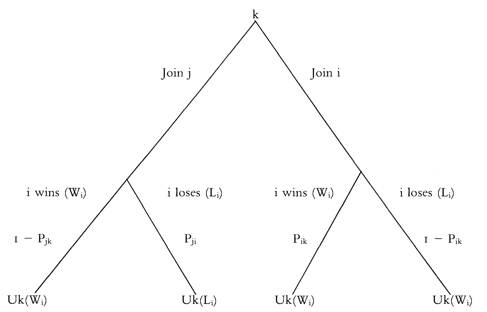

# Introduction
### Goal for Today

*Introduce students to thinking rationally and strategically in world politics.*

# Rationality
<!-- ### Introducing Rationality

"Rationality" is a broad, all-encompassing term that means different things to different people.

- Highly specialized, sometimes overlapping or conflictual discussions in fields of economics, evolutionary biology, political science, psychology, and sociology.

A bite-sized definition for this class may be an intellectual disservice. -->

### Introducing Rationality

Generally, we refer to behavior that is optimal toward solving a problem as ``rational''.

- This definition (and my understanding) is more rooted in the economic tradition.

<!-- ### A (Brief) History of Rationality

``Rationality'' in IR follows a critique of classical realism.

- Generally, classical realists were skeptical of designs for rational control of human behavior.
- Argued for natural man (i.e. the state) as the Hobbesian man in the "state of nature."
- Classical realism off after WWI, as you can imagine.

Resurgence of rationality in American politics starts with the Cold War.

- Renewed optimism in positivist, scientific enterprise.
- Rationality was as much normative as it was positivist. -->

### Outlining a Rational Actor Model

1. Identify problem.
2. Identify and rank goals.
3. Gather information (can always be ongoing).
4. Identify alternatives for reaching goals.
5. Analyze alternatives by considering consequences and effectiveness of each, weighted by probability.
    - This is **expected utility theory**, to be discussed shortly.
6. Select alternative with greatest expected utility.
7. Implement decision.
8. Monitor implementation and evaluate outcome.

### A Comment on Rationality

We can qualify "rationality" in any number of ways.

- "Thick" vs. "thin"
- "Maximizing" vs. "satisficing"
- Bounded rationality, broadly stated

Generally, we think of rationality as instrumental amid these limitations.

## Expected Utility Theory
### Expected Utility Theory

Expected utility theory gives us a tool for understanding decision-making.

- **Expected utillity theory** states a decision-maker chooses
between uncertain  prospects by comparing the weighted sums obtained by adding the utility values of outcomes multiplied by their respective probabilities.

Theory states the decision-maker chooses the alternative that provides the most net benefits.

- i.e. the alternative that maximizes her expected utility.

### Expected Utility Theory

Formally, this looks like:
\begin{equation}
	EU = p_1(b_1 - c_1) + p_2(b_2 - c_2) + \ldots + p_n(b_n - c_n)
\end{equation}

This can also be expressed as:

\begin{equation}
EU = \sum_{i=1}^n(p_iu_i)
\end{equation}

### Expected Utility Theory

In a pedagogical example, we typically consider just two outcomes: success or failure.

- Outcomes ($b_i$) are usually standardized to be 0 (failure) or 1 (success).

Thus: 

\begin{equation}
	EU(Decision) = p(1 - c) + (1-p)(0 - c)
\end{equation}

### Clarifying Our Terms

Let's make sure we're on the same page with our terms.

- **Probability** ($p_i$, where $0 < p_i < 1$) is the likelihood of an outcome.
- **Benefit** ($b_i$) is the gain in utility that may follow from a decision.
- **Cost** ($c_i$) is the disutility that may follow from a decision.
    - These commonly include transaction costs and opportunity costs.
- **Utility** (aka: value) is benefit minus cost (i.e. $u_i = b_i - c_i$).

###

| **Expected Utility Score** | **Initiator** | **Opponent** |
|:---------------------------|:------:|:------:|
| Greater than or equal to zero | 65 | 11 |
| Less than zero | 11 | 65 |

Table: Interstate War Initiation and Expected Utility (*The War Trap*)

### A Simple Third-Party Joiner Problem

### A Simple Third-Party Joiner Problem

*k*'s expected utility for joining the war is:

\begin{equation}
\begin{array}{l}
	EU(k) = (p_{ik}*(U_{k}W_{i}) + (1 - p_{ik})*(U_{k}L_{i})) \\
	 \quad \quad \quad \quad - ((1 - p_{jk})*(U_{k}W_{i}) + p_{jk}*(U_{k}L_{i})) \\
	 
\end{array}
\end{equation}

\bigskip

Questions:

- When will *k* join *j* against *i*?
- What factors influence that decision?

### Thinking Strategically

The problem of international politics:

- Actors compete for scarce resources.
- They compete under conditions of anarchy.
- This makes all interactions fundamentally *strategic.*

### Clarifying What We Mean

We're making two assumptions here worth clarifying:

1. Actors are *rational* the extent to which they have interests, rank possible outcomes, and work toward maximizing utility.
2. Actors are *strategic* because they must condition their choice based on the expected response of other actors.

<!-- ### An Illustration of Cooperation

Stag Hunt is a useful illustration of how cooperation can improve quality of life. Consider:

- Player 1 and Player 2 are trying to take down a deer.
- Both need to shoot the deer (i.e. "cooperate") in order to get yummy deer meat.
- However, if one is unsure the other will shoot the deer, s/he can shoot a bunny (i.e. "defect") for a smaller dinner.

### The Stag Hunt Payoff Matrix

|                         | P2 Cooperates       | P2 Defects |
|-------------------------|---------------------|------------------|
| P1 Cooperates           |  4, 4         |  0, 2       |
| P1 Defects              |   2, 0        |  2, 2        |

Note that the payoffs for the first player (here: Player 1) are listed first.

### Solving This Game

Solving this (or most any) game requires finding a **Nash equilibrium**.

- Definition: the outcome of a game when no player has an incentive to *unilaterally* change behavior.

How can you find this?

- Find best responses for each potential decision and highlight it for a specific player.
- The quadrant(s) where each payoff is highlighted is a Nash equilibrium.

### The Stag Hunt Payoff Matrix

|                         | P2 Cooperates | P2 Defects |
|-------------------------|---------------------|------------------|
| P1 Cooperates |  **4, 4**         |  0, 2       |
| P1 Defects    |   2, 0         |  **2, 2**        |

### So Why Do Actors Cooperate?

Implications from the stag hunt:

- Actors cooperate because they *trust* the other side will cooperate.
- Cooperation creates abundance for both sides in this scenario.
- If you don't trust the other side, cooperation is hard to start.
- If you've been cooperating, breaking that trust seems impractical and makes no side better off. -->

### The Prisoner's Dilemma

The **prisoner's dilemma** is one of the most ubiquitous pedagogical games in game theory.

- It’s a useful description for most of international politics.
- In short: it’s a situation when the mutually optimal outcome is individually irrational.
	- Much like the heart of international politics.
- Demonstrates individual-level pursuit of self-interest can have perverse group consequences.

### The Situation

The players (Player 1, Player 2) have just robbed a bank.

- The police has insufficient evidence for a serious conviction.
- The fuzz has only enough evidence for a minor, unrelated conviction.

In custody, detectives isolate the criminals and try to coerce a confession.

- Assume there's a prior commitment from both criminals to clam up.
- However, this can't be enforced (noncooperative game theory).

### The Situation and the Payoffs

The criminals have only two choices: cooperate (with each other, by clamming up) or defect to the police.

- If they both keep quiet: police can only pursue the minor conviction.
- If one defects while the other keeps quiet: the rat turns state's evidence, the other gets the books thrown at him.
- If they both rat on each other, they get a partial sentence for making things easy for prosecutors.

### The Prisoner's Dilemma Payoff Matrix

|                         | P2 Cooperates | P2 Defects |
|-------------------------|---------------------|------------------|
| P1 Cooperates |  -1, -1        |  -10, 0       |
| P1 Defects    |   0, -10         |  -6, -6        |

### Solving This Game

Solving this (or most any) game requires finding a **Nash equilibrium**.

- Definition: the outcome of a game when no player has an incentive to *unilaterally* change behavior.

How can you find this?

- Find best responses for each potential decision and highlight it for a specific player.
- The quadrant(s) where each payoff is highlighted is a Nash equilibrium.

### The Prisoner's Dilemma Payoff Matrix

|                         | P2 Cooperates | P2 Defects |
|-------------------------|---------------------|------------------|
| P1 Cooperates |  -1, -1         |  -10, **0**       |
| P1 Defects    |   **0**, -10         |  **-6, -6**        |

### The Implications of the Prisoner's Dilemma

In situations with payoffs structured like the prisoner's dilemma, the prospects for cooperation versus conflict look dim.

- Defect is a **dominant strategy**. Each player is better off defecting no matter what the other player does.
- Ideal payoffs per player: *DC > CC > DD > CD*.
	- *Ordinal* payoffs are all that matter in a single-shot game.
- The Nash equilibrium is **Pareto inferior**.
	- The "best" outcome is when no player can maximize her payoff without making some other player worse off is the **Pareto efficient** outcome.
	- Clearly, the Pareto efficient outcome is *CC*, though rational players won't choose *C*.
	
###

### A Game of Chicken

Can you solve a game of Chicken (i.e. with *T* > *R* > *S* > *P* payoffs)?

|                         | P2 Cooperates | P2 Defects |
|-------------------------|---------------------|------------------|
| P1 Cooperates |  0,0        |  -1, 1       |
| P1 Defects    |   1, -1         |  -10, -10        | 

### A Game of Chicken

|                         | P2 Cooperates | P2 Defects |
|-------------------------|---------------------|------------------|
| P1 Cooperates |  0,0        | **1, -1**      |
| P1 Defects    |   **1, -1**         |  -10, -10        | 

<!-- # Strategy and Extensive Form Games
###

### Possible Outcomes of the Game

1. The status quo
2. A negotiated settlement
3. A (or B) acquiesces.
	- i.e. one side concedes the issue without being attacked.
4. A (or B) capitulates.
	- i.e. one side concedes the issue *after* a preliminary attack.
5. A (or B) retaliates to an attack.
	- i.e. both sides fight a war.

### Assumptions of the Game

1. Decision-makers are rational and strategic.
2. *p*=1 or *p*=0 **only** for acquiescence, capitulation, or status quo.
	- i.e. the utility of all other outcomes is weighted by probability.
3. The utility of negotiation or war is a lottery
	- $p_A$, $p_B$ = probability of "winning" the lottery
	- $1 - p_A$, $1 - p_B$ = probability of "losing" the lottery.
	- Do note these are not identical variables.
4. Each state leader prefers negotiation over war.
	- This is also common knowledge.

### Assumptions of the Game

5. Violence involves costs *not* associated with negotiations.
	- Capitulation: the capitulating state eats the costs of the attack.
		- This also implies a first-strike advantage.
	- Any attack: the attacking state incurs costs associated with failed diplomacy.
6. Both A and B prefer any policy change to the status quo, but: $SQ_i > ACQ_i$.
7. Foreign policies follow domestic political considerations.
	- These may or may not include consideration of international constraints.
	
### Additional Restrictions of the Game

These assumptions imply the following preference restrictions.

- SQ > Acquiescence or capitulation by A (or B).
- Acquiescence (by the opponent) is most preferred outcome.
- Acquiescence by $i$ > Capitulation by $i$.
- Negotiation > Acquiescence/capitulation/an initiated war by $i$.
- Capitulation by $i$ > Initiated war from $j$
- War started by $i$ > War started by $j$
- Capitulation by $i$ > zero in negotiations
- War started by $j$ > zero in negotiations.

### Interesting Implications of IIG

War is the complete and perfect information equilibrium *iff* (sic):

1. A prefers to initiate war > acquiescence to B's demands.
2. A prefer to capitulate, but B has a first-strike advantage.
3. B prefers to fight a war started by A rather than acquiesce to A's demands.
4. B prefers to force A to capitulate rather than negotiate.
	- We call this a "hawk" in this game.
	- A "dove" prefers negotiations over a first-strike.
	
### Interesting Implications of IIG

*Uncertainty doesn't automatically lead to higher probability of war.*

- If A mistakes that B is a dove (when, in fact, B is a hawk) and
- B mistakenly believes A would retaliate, if attacked. Then:
- A offers negotiation to B.
- B responds with negotiation to A.

### War as Failed Bargain

However, even the IIG misses that wars are failed bargains

- States have numerous issues among them they try to resolve.
- They may use threats of force to influence bargaining.
- If bargaining fails, states, per our conceptual thinking, resort to war.

*However, there is conceptually a range of possible negotiated settlements both sides would prefer to war.*
    
### A Simple Model of Crisis Bargaining

To that end, we devise a simple theoretical model of crisis bargaining.

- There are two players (A and B).
- A makes an offer (0 $< x <$ 1) that B accepts or rejects.
    - If B accepts, A gets $1 - x$ and B gets $x$.
    - If B rejects, A and B fight a war.

### A Simple Model of Crisis Bargaining

The war's outcome is determined by Nature (*N*)

- In game theory, Nature is a preference-less robotic actor that assigns outcomes based on probability.
- If (A or B) wins, (A or B) gets all the good in question minus the cost of fighting a war ($1 - k$)
    - Assume: $k > 0$
    - Costs could obviously be asymmetrical (e.g. $k_A$, $k_B$), but it won't change much about this illustration.
- The loser gets none of the good and eats the war cost too ($-k$).

We assume minimal offers that equal the utility of war induce a pre-war bargain.

### A Simple Model of Crisis Bargaining

Here's a simple visual representation of what we're talking about.

### Solving This Game

How do we solve this game? How do A and B avoid a war they do not want to fight?

- The way to solve extensive form (i.e. "tree") games like this is **backwards induction**.
- Players play games ex ante (calculating payoffs from the beginning)
rather than ex post (i.e. hindsight).
- They must anticipate what their choices to begin games might do as
the game unfolds.

In short, we can solve a game by starting at the end and working
back to the beginning.

### Solving This Game

For our purpose, we need to get rid of Nature.

- Nature  doesn't have preferences and doesn't "move." It just assigns outcomes.
- Here, it simulates what would happen if B rejected A's demand.

We can calculate what would happen if Nature moved by calculating the expected utility of war for A and B.

### Expected Utility for A of the War

\begin{eqnarray}
EU(\textrm{A} | \textrm{B Rejects Demand)} &=& (1 - p)(1 - k) + p(-k)   \nonumber \\
   &=& 1 - k - p + pk - pk \nonumber \\
   &=& 1 - p - k \nonumber
\end{eqnarray}

### Expected Utility for B of the War

\begin{eqnarray}
EU(\textrm{B} | \textrm{B Rejects Demand)} &=& (1 - p)(-k) + p(1 - k)   \nonumber \\
   &=& -k + pk + p - pk \nonumber \\
   &=& p - k \nonumber
\end{eqnarray}

### The Game Tree, with Nature Removed

### Solving This Game

Now, continuing the backward induction, we focus on B.

- B ends the game with the decision to accept or reject.
- B does not need to look ahead, per se. It's now evaluating whether it maximizes its utility by accepting or rejecting a deal.

### Solving This Game

Formally, B rejects when $p - k > x$.

- It accepts when $x \ge p - k$.
- Notice A has a "first-mover advantage" in this game.
    - This allows it to offer the bare minimum to induce B to accept.
    - It would not offer anymore than necessary because that drives down A's utility.

We say A's offer of $x = p - k$ is a minimal one for B to accept.

### Solving This Game

Would A actually offer that, though?

- In other words, are $x = p - k$ and $1 - x \ge 1 - p - k$ both true?

Recall: we just demonstrated $x = p + k$. From that, we can say  $1 - x \ge 1 - p - k$ by definition.

- The costs of war ($k$) are positive values to subtract from the utility of fighting a war.

### The Proof

What A would get (1 - *x*) must at least equal 1 - *k - p*. Therefore:

\begin{eqnarray}
1 - x &\ge& 1 - k - p     \nonumber \\
1 - 1 + k + p   &\ge& x \nonumber \\
p + k &\ge& x \nonumber
\end{eqnarray}

### Solving This Game

We have just identified an equilibrium where two states agree to a pre-war solution over a contentious issue.

- There exists a bargaining space where A and B resolve their differences and avoid war.

###

-->

# Conclusion
### Conclusion

We can understand matters of war and peace as rational decisions amid strategic constraints.

- Actors are instrumentally rational.
- Actors make decisions under uncertainty by thinking about expected utility.
- Normal form games provide useful illustrations of strategic situations in IR.
