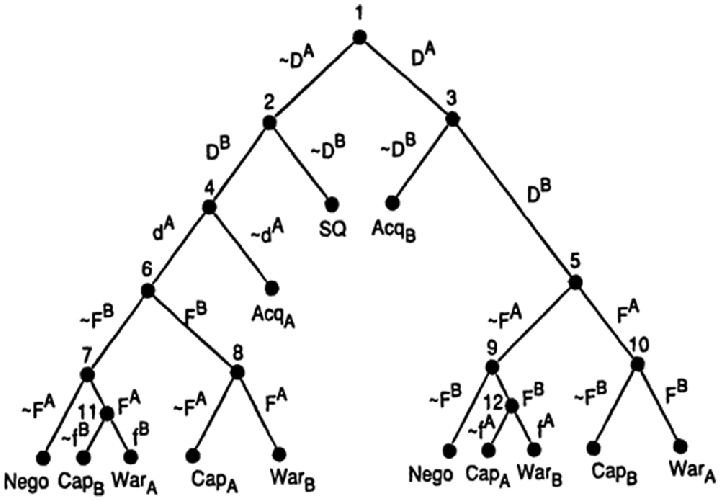
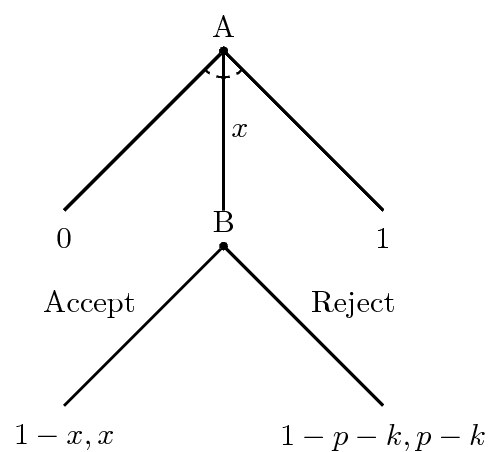
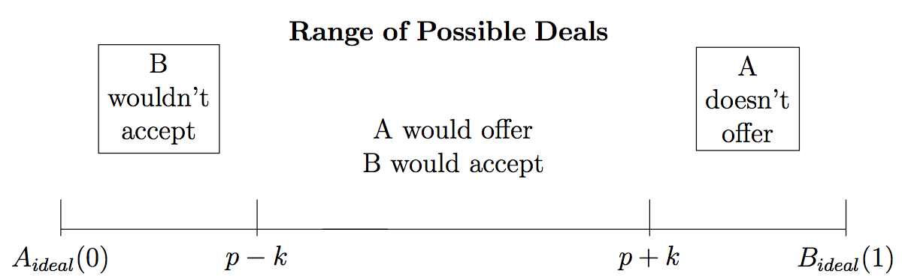

# Introduction
### Goal for Today

*Introduce students to thinking rationally and strategically in world politics.*

# Strategy and Extensive Form Games
### International Interaction Game

### Possible Outcomes of the Game

1. The status quo
2. A negotiated settlement
3. A (or B) acquiesces.
	- i.e. one side concedes the issue without being attacked.
4. A (or B) capitulates.
	- i.e. one side concedes the issue *after* a preliminary attack.
5. A (or B) retaliates to an attack.
	- i.e. both sides fight a war.

### Assumptions of the Game

1. Decision-makers are rational and strategic (recall previous lecture).
2. *p*=1 or *p*=0 **only** for acquiescence, capitulation, or status quo.
	- i.e. the utility of all other outcomes is weighted by probability.
3. The utility of negotiation or war is a lottery
	- $p_A$, $p_B$ = probability of "winning" the lottery
	- $1 - p_A$, $1 - p_B$ = probability of "losing" the lottery.
	- Do note these are not identical variables.
4. Each state leader prefers negotiation over war.
	- This is also common knowledge.

### Assumptions of the Game

5. Violence involves costs *not* associated with negotiations.
	- Capitulation: the capitulating state eats the costs of the attack.
		- This also implies a first-strike advantage.
	- Any attack: the attacking state incurs costs associated with failed diplomacy.
6. Both A and B prefer any policy change to the status quo, but: $SQ_i > ACQ_i$.
7. Foreign policies follow domestic political considerations.
	- These may or may not include consideration of international constraints.
	
### Additional Restrictions of the Game

These assumptions imply the following preference restrictions.

- SQ > Acquiescence or capitulation by A (or B).
- Acquiescence (by the opponent) is most preferred outcome.
- Acquiescence by $i$ > Capitulation by $i$.
- Negotiation > Acquiescence/capitulation/an initiated war by $i$.
- Capitulation by $i$ > Initiated war from $j$
- War started by $i$ > War started by $j$
- Capitulation by $i$ > zero in negotiations
- War started by $j$ > zero in negotiations.

### Interesting Implications of IIG

War is the complete and perfect information equilibrium *iff* (sic):

1. A prefers to initiate war > acquiescence to B's demands.
2. A prefer to capitulate, but B has a first-strike advantage.
3. B prefers to fight a war started by A rather than acquiesce to A's demands.
4. B prefers to force A to capitulate rather than negotiate.
	- We call this a "hawk" in this game.
	- A "dove" prefers negotiations over a first-strike.
	
### Interesting Implications of IIG

*Uncertainty doesn't automatically lead to higher probability of war.*

- If A mistakes that B is a dove (when, in fact, B is a hawk) and
- B mistakenly believes A would retaliate, if attacked. Then:
- A offers negotiation to B.
- B responds with negotiation to A.

### War as Failed Bargain

However, even the IIG misses that wars are failed bargains

- States have numerous issues among them they try to resolve.
- They may use threats of force to influence bargaining.
- If bargaining fails, states, per our conceptual thinking, resort to war.

*However, there is conceptually a range of possible negotiated settlements both sides would prefer to war.*
    
### A Simple Model of Crisis Bargaining

To that end, we devise a simple theoretical model of crisis bargaining.

- There are two players (A and B).
- A makes an offer (0 $< x <$ 1) that B accepts or rejects.
    - If B accepts, A gets $1 - x$ and B gets $x$.
    - If B rejects, A and B fight a war.

### A Simple Model of Crisis Bargaining

The war's outcome is determined by Nature (*N*)

- In game theory, Nature is a preference-less robotic actor that assigns outcomes based on probability.
- If (A or B) wins, (A or B) gets all the good in question minus the cost of fighting a war ($1 - k$)
    - Assume: $k > 0$
    - Costs could obviously be asymmetrical (e.g. $k_A$, $k_B$), but it won't change much about this illustration.
- The loser gets none of the good and eats the war cost too ($-k$).

We assume minimal offers that equal the utility of war induce a pre-war bargain.

### A Simple Model of Crisis Bargaining

Here's a simple visual representation of what we're talking about.

### Solving This Game

How do we solve this game? How do A and B avoid a war they do not want to fight?

- The way to solve extensive form (i.e. "tree") games like this is **backwards induction**.
- Players play games ex ante (calculating payoffs from the beginning)
rather than ex post (i.e. hindsight).
- They must anticipate what their choices to begin games might do as
the game unfolds.

In short, we can solve a game by starting at the end and working
back to the beginning.

### Solving This Game

For our purpose, we need to get rid of Nature.

- Nature  doesn't have preferences and doesn't "move." It just assigns outcomes.
- Here, it simulates what would happen if B rejected A's demand.

We can calculate what would happen if Nature moved by calculating the expected utility of war for A and B.

### Expected Utility for A of the War

\begin{eqnarray}
EU(\textrm{A} | \textrm{B Rejects Demand)} &=& (1 - p)(1 - k) + p(-k)   \nonumber \\
   &=& 1 - k - p + pk - pk \nonumber \\
   &=& 1 - p - k \nonumber
\end{eqnarray}

In plain English: A's expected utility for the war is the probability (1 - p) of winning the war, weighting the value of the good (i.e. 1), minus the cost of war (k).

### Expected Utility for B of the War

\begin{eqnarray}
EU(\textrm{B} | \textrm{B Rejects Demand)} &=& (1 - p)(-k) + p(1 - k)   \nonumber \\
   &=& -k + pk + p - pk \nonumber \\
   &=& p - k \nonumber
\end{eqnarray}

In plain English: B's expected utility for the war is the probability (p)  of winning the war, weighting the value of the good (i.e. 1), minus the cost of war (k).

### The Game Tree, with Nature Removed

### Solving This Game

Now, continuing the backward induction, we focus on B.

- B ends the game with the decision to accept or reject.
- B does not need to look ahead, per se. It's now evaluating whether it maximizes its utility by accepting or rejecting a deal.

### Solving This Game

Formally, B rejects when $p - k > x$.

- It accepts when $x \ge p - k$.
- Notice A has a "first-mover advantage" in this game.
    - This allows it to offer the bare minimum to induce B to accept.
    - It would not offer anymore than necessary because that drives down A's utility.

We say A's offer of $x = p - k$ is a minimal one for B to accept.

### Solving This Game

Would A actually offer that, though?

- In other words, are $x = p - k$ and $1 - x \ge 1 - p - k$ both true?

Recall: we just demonstrated $x = p - k$. From that, we can say  $1 - x \ge 1 - p - k$ by definition.

- The costs of war ($k$) are positive values to subtract from the utility of fighting a war.

### The Proof

What A would get (1 - *x*) must at least equal 1 - *k - p*. Therefore:

\begin{eqnarray}
1 - x &\ge& 1 - k - p     \nonumber \\
1 - 1 + k + p   &\ge& x \nonumber \\
p + k &\ge& x \nonumber
\end{eqnarray}

### Solving This Game

We have just identified an equilibrium where two states agree to a pre-war solution over a contentious issue.

- There exists a bargaining space where A and B resolve their differences and avoid war.

###

# Conclusion
### Conclusion

War is a form of bargaining failure. It never happens in a world of complete/perfecct information, except for:

- Issue indivisibility
- Incomplete information
- Commitment problems