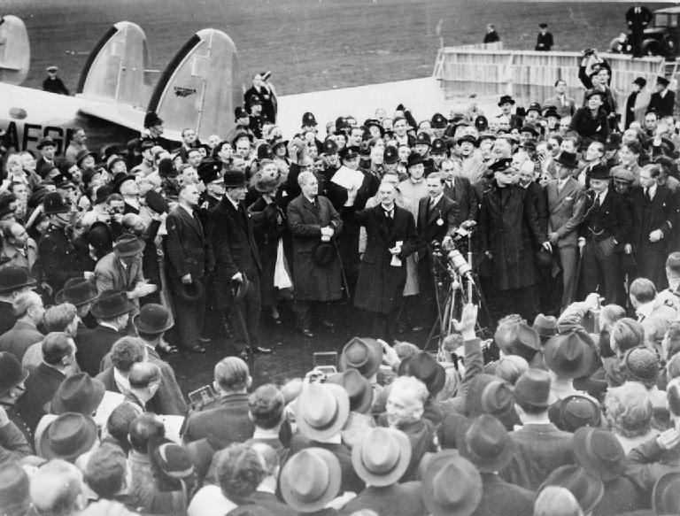
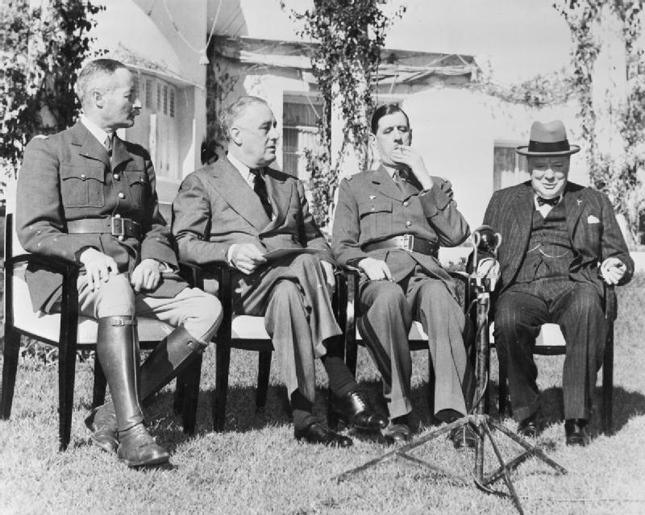

```{r setup, include=FALSE}
knitr::opts_chunk$set(cache=FALSE)

library(tidyverse)
library(stevemisc)
library(countrycode)
library(knitr)
library(maddison)
library(stringr)
library(dotwhisker)

NDY <- read_csv("~/Dropbox/projects/mid-project/gml-mid-data/2.03/gml-ndy-disputes-2.03.csv")
MIDA <- read_csv("~/Dropbox/projects/mid-project/gml-mid-data/2.03/gml-mida-2.03.csv")

```

# Introduction
### Puzzle for Today

*What explains the duration of peace following a conflict?*

# Conflict Recurrence
### The Problem

All conflicts must end (Ikle, 1971) but disputes routinely recur.

- France and Prussia/Germany contested 12 MIDs between 1848-1941.
    - Four were wars and an additional six were uses of force.
- India and Pakistan have been in 39 MIDs between 1947 and 2010.
    - Only four were anything other than uses of force or war.
- Likewise, Israel and Syria have been in 34 MIDs between 1948 and 2010.

###

```{r, eval=F, echo=F, fig.width=14, fig.height=8.5, warning=F, message=F}

tibble(year = seq(1947, 2010),
       const = 1) -> cyear

NDY %>% filter(ccode1 == 750 & ccode2 == 770) %>%
  select(dispnum, year, fatality) %>%
  group_by(year) %>%
  summarize(sum = n(),fatality = max(fatality)) %>%
  full_join(., cyear) %>%
  arrange(year) %>%
  mutate(sum = ifelse(is.na(sum), 0, sum)) %>%
  ggplot(.,aes(year,sum)) + theme_steve() +
  geom_bar(stat = "identity", fill = "black", color="black", alpha=I(0.6)) +
  scale_x_continuous(breaks = seq(1945, 2010, by = 5)) +
  xlab("Year") + ylab("Number of Ongoing MIDs in the Year") +
  annotate("rect", xmin=1946.5, xmax=1951.5, ymin=0, ymax=3, alpha=.3, fill="red") +
  annotate("rect", xmin=1954.5, xmax=1956.5, ymin=0, ymax=3, alpha=.3, fill="red") +
  annotate("rect", xmin=1957.5, xmax=1959.5, ymin=0, ymax=3, alpha=.3, fill="red") +
  annotate("rect", xmin=1961.5, xmax=1962.5, ymin=0, ymax=3, alpha=.3, fill="red") +
  annotate("rect", xmin=1963.5, xmax=1967.5, ymin=0, ymax=3, alpha=.3, fill="red") +
  annotate("rect", xmin=1970.5, xmax=1972.5, ymin=0, ymax=3, alpha=.3, fill="red") +
  annotate("rect", xmin=1980.5, xmax=1981.5, ymin=0, ymax=3, alpha=.3, fill="red") +
  annotate("rect", xmin=1982.5, xmax=1986.5, ymin=0, ymax=3, alpha=.3, fill="red") +
  annotate("rect", xmin=1989.5, xmax=1991.5, ymin=0, ymax=3, alpha=.3, fill="red") +
  annotate("rect", xmin=1992.5, xmax=2003.5, ymin=0, ymax=3, alpha=.3, fill="red") +
  annotate("rect", xmin=2007.5, xmax=2010.5, ymin=0, ymax=3, alpha=.3, fill="red") +
  labs(title = "India and Pakistan Have Contested 39 MIDs since Independence and Have Been in Almost Constant Conflict",
       subtitle = "The red shades capture fatal MIDs, including MIDs that became wars from 1947-1949, 1964-1966, 1971, and 1993-1999.",
       caption = "Data: GML MID Data (v. 2.01)")

```

```{r, eval=T, echo=F, fig.width=14, fig.height=8.5, warning=F, message=F}

tibble(year = seq(1947, 2010),
       const = 1) -> cyear

NDY %>% filter(ccode1 == 750 & ccode2 == 770) %>%
  select(dispnum, year, fatality) %>%
  group_by(year) %>%
  summarize(sum = n(),fatality = max(fatality)) %>%
  mutate(isfatal = ifelse(fatality == 0, 0, 1)) %>%
  full_join(., cyear) %>%
  arrange(year) %>%
  mutate(sum = ifelse(is.na(sum), 0, sum),
         isfatal = ifelse(is.na(isfatal), 0, isfatal),
         `Fatal MID?` = ifelse(isfatal == 0, "Not Fatal", "Fatal")) %>%
  ggplot(.,aes(year,sum, fill = `Fatal MID?`)) + theme_steve_web() +
  geom_bar(stat = "identity",  color="black", alpha=I(0.8)) +
  scale_x_continuous(breaks = seq(1945, 2010, by = 5)) +
  xlab("Year") + ylab("Number of Ongoing MIDs in the Year") +
  scale_fill_manual(values=c("#bb0000", "gray66")) +
  labs(title = "India and Pakistan Have Contested 39 MIDs Since Independence and Have Been in Almost Constant Conflict",
       subtitle = "The red shades capture years in which there were fatal MIDs, including MIDs that became wars from 1947-1949, 1964-1966, 1971, and 1993-1999.",
       caption = "Data: GML MID Data (v. 2.03)")
```


## Four Primary Approaches
### Four Primary Approaches

1. Bargaining
2. Enduring rivalries
3. Conflict management
4. Deterrence

### Bargaining Approaches to Conflict Recurrence

Bargaining models do well to endogenize (sic) all phases of conflict (see: Filson and Werner). Core findings:

- Power is central to explaining international conflict 
    - See also: asymmetric information
- Incentives to renegotiate (however arrived) explain conflict recurrence.
- Third-party mediation mollifies commitment problems.

### Enduring Rivalries and Conflict Recurrence

Intuitively, most conflict recurrence is between enduring rivals.

- e.g. India-Pakistan, France-Prussia/Germany, etc.
- Rivalry scholars tend to treat this as a sample selection issue.

There is some focus on how dispute outcomes facilitate new dispute onset.

- Hensel (1994): 93% of disputes followed by a decisive outcome are followed by a new dispute (in Latin America).

### Conflict Management and Conflict Recurrence

Conflict management scholars place high emphasis on how disputes end.

- e.g. third-party intervention, UN peacekeeping missions, even regime type.
- Generally, more multilateralism and more negotiation -> more stability

Some core findings:

- Third-party interventions are good for peace.
- UN PKOs -> more stability after disputes.

Scholars additionally quibble about selection issues.

- e.g. do PKOs and mediators follow the more difficult conflicts or the easier ones?

### Conflict Recurrence as Deterrence Failure?

Scholars in this vein see conflict recurrence as a form of deterrence failure. Findings:

- Imposed settlements are more peaceful than negotiated ones.
- Cease-fires can help maintain peace.
- Victor-imposed regime change are followed by longer peace spells.

## Settlement and Recurrent Conflict
### "Peace for Our Time"



### Announcing Unconditional Surrender Ultimatum in Casablanca



### Types of Settlement

- **Negotiated**: an agreement, formal or informal, struck by both sides of a conflict absent any attempt of external imposition.
- **Imposed**: an agreement forced on another state without invitation.
- **None**: a dispute ends because both sides stop fighting without any agreement about the pre-war status quo or conflict.

###

```{r, eval=T, echo=F, fig.width=14, fig.height=8.5, warning=F, message=F}

MIDA %>%
  group_by(settle) %>%
  summarize(sum = n()) %>%
  filter(settle != -9) %>%
  mutate(cat = c("Negotiated", "Imposed", "None", "Unclear"),
         perc = round((sum/sum(sum))*100, 2),
         perc = paste0(perc,"%")) %>%
  ggplot(.,aes(cat, sum)) + theme_steve_web() +
  geom_bar(stat="identity", fill = "black", color="black", alpha=I(0.6)) +
  geom_text( aes(label=perc), vjust=-.5, colour="black",
            position=position_dodge(.9), size=4) +
  xlab("Settlement Type") + ylab("Number of MIDs") +
  labs(title = "Most MIDs (67%) End in No Settlement Type",
       subtitle = "Most MIDs stop because both sides stop fighting and not necessarily that they ''agreed'' to stop fighting.",
       caption = "Data: GML MID Data (v. 2.01)")

```

### Why Should Imposed Settlements Be More Peaceful?

Quackenbush argues imposed settlements are a case of unilateral deterrence.

- In mutual deterrence, both sides need to be deterred.
- In unilateral deterrence, only one side (i.e. the loser) needs to be deterred.

Unilateral deterrence is actually more peaceful than mutual deterrence.

###

| **Settlement Type** | **Events** | **E(Events)** | **Chi-sq** | **p-Value** |
|:--------------------|:----------:|:-------------:|:----------:|:-----------:|
| Imposed | 237 | 353.08 | 46.84 | <.001 |
| No Settlement | 1466 | 1341.87 | 31.82 | <.001 |
| Negotiated | 427 | 435 | .19 | .663 |

Table: Log-Rank Tests for Settlement Types and Peace Duration (Quackenbush, 2014)

Notice: we observe fewer peace failures if the settlement in the previous dispute was imposed.

- We observe *more* peace failures if there was no settlement type whatsoever.

###

```{r, eval=T, echo=F, fig.width=14, fig.height=8.5, warning=F, message=F}

tribble(
  ~term, ~estimate, ~std.error, ~model,
  "Negotiated Settlement", .361, .087, "Model 2",
  "No Settlement", .513, .087, "Model 2",
  "Minimum Democracy", -.020, .006,"Model 2",
  "Change in Relative Power", 1.782, .603,"Model 2",
#  "Change in Relative Power*ln(Time)", 1.046, .840,
  "Contiguity", .775, .079, "Model 2",
  "Decisive Outcome", .144, .061, "Model 2",
#  "Decisivie Outcome*ln(Time)", -.039, .056,
  "War", -.105, .099, "Model 2",
  "Negotiated Settlement", .352, .087, "Model 3",
  "No Settlement", .507, .087, "Model 3",
  "Minimum Democracy", -.020, .006,"Model 3",
  "Change in Relative Power", -1.774, 1.63,"Model 3",
  "Change in Relative Power*ln(Time)", 1.046, .840, "Model 3",
  "Contiguity", .776, .080, "Model 3",
  "Decisive Outcome", .144, .061, "Model 3",
  "Decisive Outcome*ln(Time)", -.039, .056, "Model 3",
  "War", .933, .435, "Model 3",
  "War*ln(Time)", -.281, .113, "Model 3"
) %>%
  mutate(statistic = estimate/std.error,
         p.value = 1.96*pnorm(-abs(statistic))) %>%
  dwplot(.,dot_args = list(aes(colour = model, shape = model), size = 1.1)) + theme_steve_web() +
  xlab("Coefficient Estimate") +
  geom_vline(xintercept = 0, colour = "grey60", linetype = 2) +
  theme(legend.position = "bottom") +
  labs(title = "Cox Model Results for the Effect of Settlement Type on Peace Duration",
       subtitle = "Notice how negotiated/no settlements increase the likelihood of survival ''failure'' relative to the baseline of imposed settlements.",
       caption = "Reproduction of Model 2 and Model 3 in Table 13.2 (Quackenbush, 2015)") +
  scale_colour_discrete(name = "Model") + scale_shape_discrete(name = "Model")
```


### Empirical Findings

Imposed settlements least likely to be followed by peace failure than other settlement types.

- Follows implications of perfect deterrence theory on unilateral deterrence.

Other findings:

- Jointly democratic disputes have longer peace spells.
- Changes in relative power -> peace failure.
    - This importantly goes away the longer the peace spell.
- Contiguous states have shorter peace spells than states further away.
- No differences between war and MIDs.
    - Until you model an interaction with time.

###

```{r, eval=T, echo=F, fig.width=14, fig.height=8.5, warning=F, message=F}
tibble(x = seq(0, 350),
       `Imposed` = x^-.12,
       `Negotiated` = x^-.17,
       `None` = x^-.20) %>%
  gather(`Settlement Type`, value, -x) %>%
  ggplot(.,aes(x,value,linetype=`Settlement Type`, color = `Settlement Type`)) + theme_steve_web() +
  xlab("Duration in Months") + ylab("Survival Function") + geom_line(size = 1.5) +
  theme(legend.position = "bottom") +
  scale_x_continuous(breaks = seq(0, 350, by = 50)) +
  ylim(0,1) +
  labs(title = "Survival Curves by Settlement Type",
       subtitle = "Quackenbush's argument is settlement imposition is a form of unilateral deterrence, which is more peaceful than settlement negotiation.")

```

# Conclusion
### Conclusion

Why do disputes recur?

- Four primary theoretical perspectives
- Bargaining models assume changes in relative power drive conflict recurrence.
- Deterrence models see conflict recurrence as deterrence failure.
    - Counterintuitively: settlement imposition works better than settlement negotiation.