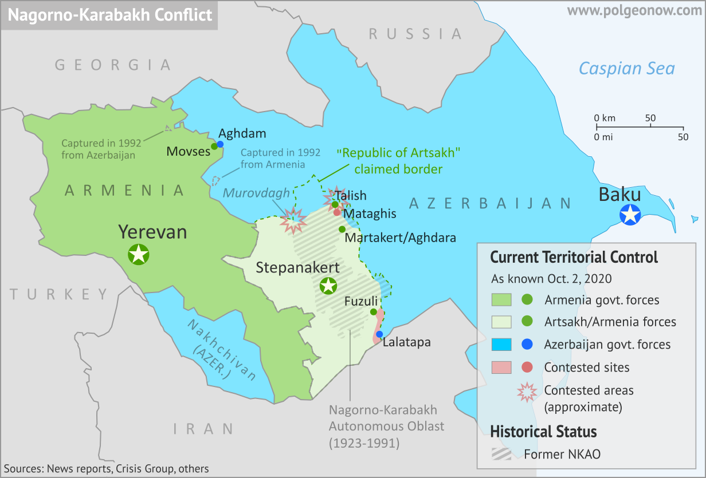

```{r setup, include=FALSE, cache=F, message=F, warning=F, results="hide"}
knitr::opts_chunk$set(cache=TRUE, warning=F, message=F, echo=FALSE, fig.width = 14, fig.height = 8.5)
knitr::opts_chunk$set(fig.path='figs/')
knitr::opts_chunk$set(cache.path='cache/')

knitr::opts_chunk$set(
                  fig.process = function(x) {
                      x2 = sub('-\\d+([.][a-z]+)$', '\\1', x)
                      if (file.rename(x, x2)) x2 else x
                      }
                  )
```


```{r loadstuff, include=FALSE}
knitr::opts_chunk$set(cache=TRUE)
options(knitr.kable.NA = '')
library(tidyverse)
library(stevemisc)
library(peacesciencer)
library(fixest)
library(kableExtra)
library(modelsummary)
library(patchwork)
library(cowplot)


options("modelsummary_format_numeric_latex" = "plain")
options(knitr.kable.NA = '')
```

```{r loaddata, cache=T, eval=T, echo=F, message=F, error=F, warning=F}

Mods <- readRDS("Mods.rds")
Sims <- readRDS("Sims.rds")
Data <- readRDS("Data.rds")

```

# Introduction
### Goal for Today

*Discuss why inter-state conflict is not IID (independent and identically distributed).*

### Pop Quiz!

What do you think are the most confrontation-prone dyads?


###

```{r}
Data[[1]] %>%
  arrange(-n) %>%
  head(10) %>%
  mutate(ccode1 = countrycode::countrycode(ccode1, "cown", "country.name"),
         ccode2 = countrycode::countrycode(ccode2, "cown", "country.name")) %>%
  select(ccode1, ccode2, n, n_confyears, first, last) %>%
  kbl(., longtable=TRUE, booktabs = TRUE, linesep='',
      col.names = c("Country 1", "Country 2", "Num. Confs.", "Num. Conf. Years",
                    "First Conf. Year", "Last Conf. Year"),
      align = c("llcccc"),
      caption = "Dyads with Most Unique Confrontations, 1816-2014") %>%
  kable_styling(font_size = 8) %>%
  row_spec(0, bold=TRUE) %>%
  footnote(general = "Data: Gibler and Miller (Forthcoming).",
           number = "Excludes dyadic conflict participations without direct hostilities.")
```


###

```{r}
Data[[1]] %>%
  arrange(-n_confyears) %>%
  head(10) %>%
  mutate(ccode1 = countrycode::countrycode(ccode1, "cown", "country.name"),
         ccode2 = countrycode::countrycode(ccode2, "cown", "country.name")) %>%
  select(ccode1, ccode2, n, n_confyears, first, last) %>%
  kbl(., longtable=TRUE, booktabs = TRUE, linesep='',
      col.names = c("Country 1", "Country 2", "Num. Confs.", "Num. Conf. Years",
                    "First Conf. Year", "Last Conf. Year"),
      align = c("llcccc"),
      caption = "Dyads with the Most Confrontation-Years, 1816-2014") %>%
  kable_styling(font_size = 8) %>%
  row_spec(0, bold=TRUE) %>%
  footnote(general = "Data: Gibler and Miller (Forthcoming).",
           number = "Excludes dyadic conflict participations without direct hostilities.")
```


###

```{r}
Data[[1]] %>%
  arrange(-prop_conf) %>%
  filter(n_dyadyears >= 10) %>%
  head(10) %>%
  mutate(ccode1 = countrycode::countrycode(ccode1, "cown", "country.name"),
         ccode2 = countrycode::countrycode(ccode2, "cown", "country.name"),
         prop_conf = round(prop_conf, 3),
         ccode2 = ifelse(ccode2 == "Republic of Vietnam", "South Vietnam", ccode2)) %>%
  select(ccode1, ccode2, n, n_confyears, n_dyadyears, prop_conf) %>%
  #select(ccode1, ccode2, n, n_confyears, first, last) %>%
  kbl(., longtable=TRUE, booktabs = TRUE, linesep='',
      col.names = c("Country 1", "Country 2", "Num. Confs.", "Num. Conf. Years",
                     "Num. Dyad-Years", "Prop. Conf."),
      align = c("llcccccc"),
      caption = "Dyads with Greatest Proportion of Confrontation-Years, 1816-2014") %>%
  kable_styling(font_size = 8) %>%
  row_spec(0, bold=TRUE) %>%
  footnote(general = "Data: Gibler and Miller (Forthcoming).",
           number = "Excludes dyadic conflict participations without direct hostilities.")
```

### MIC of the Day: The Azeri-Armenian War of 1993–1994 (MIC#3564)

```{r mic-of-the-day, eval=TRUE, echo=FALSE, out.width="100%"}

```

### The Azeri-Armenian War of 1993–1994 (MIC#3564)

**Synopsis**:

- *Who*: Armenia (w/ Russia) vs. Azerbaijan (w/ Iran, Turkey)
- *Why*: Consolidation of Nagorno-Karabakh amid splintering of USSR
    - N-K was more Armenian than Azeri, but was administered by Azerbaijan
- *What (Happened):* CIS-brokered ceasefire; Armenia victory
    - De facto autonomy for N-K (now: Artsakh), unification w/ Armenia
    - Armenian fatalities: 1,732 (min.) to 5,751 (max.)
    - Azeri fatalities: 2,600 (min.) to 4,670 (max.)
    
### (Somewhat) Current Map of the Situation

```{r arm-aze-map, eval=TRUE, echo=FALSE, out.width="90%"}

```


### What is Happening Here?

- A small group of dyads are disproportionately responsible for large conflicts/wars (Maoz and Mor, 2002).
- Seems that previous crises makes future crises more likely (Colaresi and Thompson, 2002).

### Some Quick-Cut Stats


Per Gibler and Miller (Forthcoming): 

- The top 10 most confrontation-prone dyads are responsible for >18% of all confrontations.
- The top 10 most confrontation-prone dyads are responsible for about 13% of all approx. fatalities.
- 50% of all confrontation dyads have more than one confrontation in their history.

# Rivalries
### What is a Rivalry?

We call this phenomenon a "rivalry."

- States view each other as threats and compete against each other.
- This can obviously vary in size and scope (e.g. Cold War vis-a-vis Eritrea-Ethiopia).

Conflict, and esp. conflict recurrence, follows under these circumstances.

- Importantly: conflict is not "IID" (independent and identically distributed).

## How Do We Identify Rivalries?
### How Do We Identify Rivalries?

1. Dispute density
2. Diplomatic history

### Dispute Density Approach

Most classic rivalry scholarship identified rivalries based on past disputes.

### Wayman (2000)

Wayman (2000) used MIDs to identify rivalries on three criteria:

1. Severity: must have at least five reciprocated MIDs.
2. Durability: must be at least 25 years between first MID and the termination of the last one.
3. Continuity: cannot have a gap of more than 10 years between last disputes.

### Diehl and Goertz (2000)

Diehl and Goertz (2000) take a different approach in their rivalry classification:

1. Enduring: at least six disputes over a period lasting at least 20 years.
2. Isolated: Two or fewer disputes (i.e. less intense)
3. Proto: More than two, fewer than six.

Klein, Goertz, and Diehl (2006) drop this classification and simply code rivalry for at least three MIDs between 1816-2001.

- Gaps of around 50 years constitute new rivalry onset.

### Diplomatic History Approach

A better way to identify rivalries may entail examining diplomatic histories (Thompson and Dreyer, 2012).

- Do states communicate to each other as threats?
- Do their diplomatic offices discuss of others as threats?
- Are their military exercises conducted with a target in mind?


### Differences Between the Approaches

There's a clear difference in approach:

- Dispute density: use previous disputes to identify rivals.
- Diplomatic history: read diplomatic documents and make subjective judgment calls.

This does lead to a lot of different identifications.

- Thompson and Dreyer (2012) note six different rivalry measures produce consensus in only 6.5% of cases.


### Do We Prefer One Approach to the Other?

Yes generally, Thompson and Dreyer's diplomatic history approach.

- Dispute density approaches identify rivalries where they make no sense (e.g. Ecuador-U.S, Canada-U.S.)
- Diplomatic history requires judgment calls but lends to better face validity.


More importantly: dispute density approaches use past conflicts to predict future conflicts.

- Diplomatic history approaches identify rivalries independent of conflicts.


### Classifying Rivalries

<!-- Thompson and Dreyer use "international rivalries" as umbrella term but rivalries clearly vary: -->

**Spatial**: contest control of territory, broadly defined 

- (e.g. Armenia-Azerbaijan)

**Positional**: competition for relative shares of influence 

- (e.g. Russia-U.S. [then and now])

**Ideological**: contest virtues of competing economic/political systems 

- (e.g. West/East Germany, South/North Yemen)
- Only one ideological rivalry *doesn't* have some other component to it (CRC-Nicaragua, 1948-1990).

**Interventionary**: states intervene to reduce threat/acquire leverage

- Note: This type is almost exclusively a SSA phenomenon (e.g. DRC-Rwanda).
- Some other rivalries have interventionary components though (e.g. Honduras-Nicaragua in the 1980s)


###

```{r}

td_rivalries %>%
  group_by(type1) %>% count() %>%
  ungroup() %>%
  mutate(perc = n/sum(n),
         perc = paste0(mround(perc, 2), "%"),
         lbl = paste0(n, " (",perc,")")) %>%
  ggplot(.,aes(type1, n)) +
  theme_steve_web() +
  geom_bar(stat = "identity", fill="#619cff", color="black") +
  geom_text(aes(label=lbl), color="black",
            position=position_dodge(width=.9), size=4, vjust = -.5, family="Open Sans") +
  scale_x_discrete(labels = c("Ideological", "Interventionary", "Positional", "Spatial")) +
  labs(x = "", y = "",
       title = "The Distribution of Strategic Rivalries by Primary Type, 1494-2010",
       subtitle = "45% of 197 rivalries in the data are primarily spatial. Interventionary rivalries are the rarest, accounting for just over 6% of all rivalries.",
       caption = "Data: Thompson and Dreyer (2012)")

```


###

```{r}

td_rivalries %>%
  mutate(spatial = case_when(
    type1 == "spatial" ~ 1,
    type2 == "spatial" ~ 1,
    type3 == "spatial" ~ 1,
    TRUE ~ 0
  ),
  positional = case_when(
    type1 == "positional" ~ 1,
    type2 == "positional" ~ 1,
    type3 == "positional" ~ 1,
    TRUE ~ 0
  ),
  ideological = case_when(
    type1 == "ideological" ~ 1,
    type2 == "ideological" ~ 1,
    type3 == "ideological" ~ 1,
    TRUE ~ 0
  ),
  interventionary = case_when(
    type1 == "interventionary" ~ 1,
    type2 == "interventionary" ~ 1,
    type3 == "interventionary" ~ 1,
    TRUE ~ 0
  )) %>%
  summarize_at(vars("spatial", "positional", "ideological", "interventionary"), ~mean(.)) %>%
  gather(var, val) %>%
  mutate(label = paste0(mround(val, 2), "%")) %>%
  ggplot(.,aes(var, val)) +
  theme_steve_web() +
  geom_bar(stat = "identity", fill="#619cff", color="black") +
  geom_text(aes(label=label), color="black",
            position=position_dodge(width=.9), size=4, vjust = -.5, family="Open Sans") +
  scale_y_continuous(labels = scales::percent) +
  scale_x_discrete(labels = c("Ideological", "Interventionary", "Positional", "Spatial")) +
    labs(x = "", y = "",
       title = "The Distribution of Rivalry Types Observed by Any Type, 1494-2010",
       subtitle = "72% of all rivalries have at least some spatial component, and a majority have a positional component as wel. Ideological and interventionary components are much rarer.",
       caption = "Data: Thompson and Dreyer (2012)")

```


###

```{r}
td_rivalries %>%
  filter(ccode1 == 2) %>%
  select(rivalryname, styear, endyear, type1, type2) %>%
  kbl(., longtable=TRUE, booktabs = TRUE, linesep ='',
      align = c("lcccc"),
      caption = "American Strategic Rivalries, 1816-2010",
      col.names = c("Rivalry", "Start Year", "End Year", "Type 1", "Type 2")) %>%
  row_spec(0, bold=TRUE) %>%
  footnote(general = "Data: Thompson and Dreyer (2012).",
           number = "End years of 2010 indicate ongoing rivalries.") %>%
  kable_styling(font_size = 9)
```

## How Do Rivalries Form/End?
### How Do Rivalries Form/End?

Rivalry scholars assume two models for rivalry formation.

1. Punctuated Equilibrium
2. Evolutionary

###

```{r,  eval=T, echo=F, fig.width=14, fig.height=8.5, warning=F, message=F}

tibble(x = seq(1,300),
       # y = 5,
       y = ifelse(x > 75 & x < 225, 25, 5)) %>%
  ggplot(.,aes(x,y)) + geom_line(color = "#F8766D", size = 1.5) + 
  theme_steve_web() +
  scale_y_continuous(breaks = NULL, limits =c(0, 40)) +
  scale_x_continuous(breaks = c(75, 225),
                     labels = c("Shock", "Shock")) +
  xlab("Time") + ylab("Severity") +
  annotate("text", x = 150, y = 26, label = "Basic Rivalry Level", family= "Open Sans") +
  geom_vline(xintercept = 0, color="gray66", linetype="dashed") +
  geom_hline(yintercept = 0, color = "gray66", linetype = "dashed") +
  geom_segment(aes(x = 75, xend = 75, y = 0, yend = 5, colour = "segment"),
               linetype="dotted", color = "gray33") +
  geom_segment(aes(x = 225, xend = 225, y = 0, yend = 5, colour = "segment"),
               linetype="dotted", color = "gray33") +
  labs(title = "Punctuated Equilibrium Model of Rivalry",
       subtitle = "Exogenous ''shocks'' explain rivalry onset and termination, sandwiching baseline levels of hostility/severity.")

```

### "Shocks" and Rivalry Formation/Termination

"Shocks" that began rivalries:

- Cold War, generally (e.g. take your pick among the former Cominform states)
- The world wars (e.g. Russia-United States 1, Germany-Poland, Hungary-Serbia)
- Regime change (e.g. Iran-Iraq 2, Iran-Saudi Arabia)
- Territorial annexation (e.g. Japan-United States)

"Shocks" that ended rivalries:

- Cold War, generally (e.g. Russia-United States 1)
- The world wars (e.g. Germany-United States [1,2])
- Other wars (e.g. Mexico-United States, North Vietnam-South Vietnam)
- Regime change (e.g. SAF-Zambia; SAF-Zimbabwe)
- Territorial annexation (e.g .Spain-United States)

### Evolutionary Model of Rivalries

Hensel (1999) argues rivalries follow a life cycle.

- i.e. early, intermediate, and advanced
- Disputes become more likely and more severe the further along in the life cycle.

Implication: rivalries are more likely to end the longer they last (see: Bennett 1998).

### Rivalry Context, Conflict, and Termination

```{r}
Data[[3]] %>%
  group_by(rivalrycat) %>% 
  summarize(sum = sum(n_onsets),
            meanfatal = mean(sumfatal)) %>%
  mutate(meanfatal = format(round(meanfatal, 2), big.mark=",")) -> hold_this

td_rivalries %>%
  select(rivalryname, styear, endyear) %>% 
  left_join(Data[[3]], .) %>%
  filter(endyear != 2010) %>%
  group_by(rivalryname) %>%
  slice(n()) %>%
  group_by(rivalrycat) %>%
  summarize(n =n()) %>%
  left_join(hold_this, .) %>%
  kbl(., align = c("lccc"),
      longtable = TRUE, booktabs = TRUE,
      col.names = c("Category", "No. of Confs.", "Avg. Fatalities (in Confs.)", "No. of Terminations at Stage")) %>%
  row_spec(0, bold=TRUE) %>%
  kable_styling(font_size = 8) %>%
  footnote(general = "Data: Gibler and Miller (Forthcoming); Thompson and Dreyer (2012)",
           number = "Treat with some caution. Results tentative. Statistics on terminations omit rivalries ongoing as of 2010.",
           alphabet = "Rivalry stage determined analogously to Hensel (1999), but also Diehl and Goertz (2012).")

```

# Conclusion
### Conclusion

Why do disputes recur? Rivalry is one explanation.

- Disputes lead states to view each other as threats, which begets more disputes.
- There are several identification schemes, but diplomatic history approaches do best.
- Inter-state conflict is not IID.