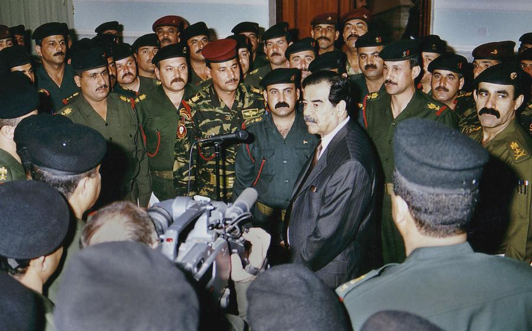
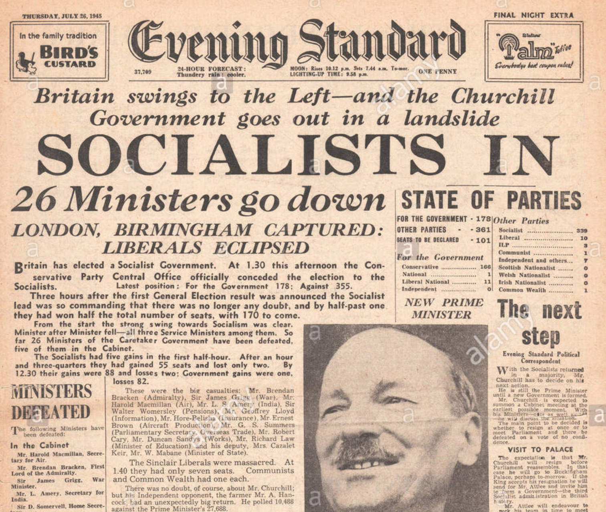
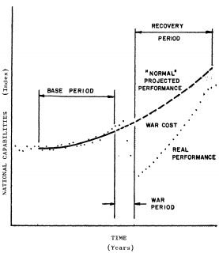

```{r setup, include=FALSE, cache=F, message=F, warning=F, results="hide"}
knitr::opts_chunk$set(cache=TRUE)
knitr::opts_chunk$set(fig.path='figs/')
knitr::opts_chunk$set(cache.path='cache/')

knitr::opts_chunk$set(
                  fig.process = function(x) {
                      x2 = sub('-\\d+([.][a-z]+)$', '\\1', x)
                      if (file.rename(x, x2)) x2 else x
                      }
                  )
```

```{r loadstuff, include=FALSE}
knitr::opts_chunk$set(cache=FALSE)

library(tidyverse)
library(stevemisc)
library(countrycode)
library(knitr)
library(maddison)
library(stringr)


```

# Introduction
### Puzzle for Today

*The consequences of war seem intuitive, but how would we know? How can we measure them?*

### Saddam Hussein With His Elite Republican Guard



### Churchill's Government Goes Down in Flames



### A Problem of Assessment

No doubt war has consequences, but how do we assess them? Effects can be:

- Permanent and temporary
- Short-term and long-term
- Direct or indirect
- Positive and negative

Indeed, war can have positive side effects (or "externalities").

# A Framework for Understanding the Consequences of War
### A Framework

Thompson (1993) suggests a framework for evaluating the consequences of war.

1. National Consequences
2. International Consequences

## National Consequences of War
###  National Consequences of War

We can further classify national consequences of war by three factors.

1. Economic conditions
2. Demographic factors
3. Sociopolitical conditions

### Economic Conditions

Intuitively, war destroys stuff.

- Destroys land, labor, and capital
- Siphons labor force toward war effort

However, some effects can be positive.

- Namely: innovations in research, tech, and even medicine.

### Economic Conditions

In fact, it's not even clear there is a discernible negative economic consequence to war.

- Koubi (2005) finds war *increased* economic growth in her sample of countries from 1960-1989.

### Demographic Factors

War does have pervasive effects on demography.

- Increases mortality rates
- Stunts marriage rates and child birth


Should be no surprise this disproportionately targets young men.


###

```{r birth-rates-europe-1900-1920, eval=T, echo=F, fig.width=14, fig.height=8.5, warning=F, message=F, cache=T}
NMC <- read_csv("~/Dropbox/data/cow/cinc/NMC_5_0.csv") # Total population in thousands

NMC %>%
  filter(stateabb == "BEL" | stateabb == "UKG" | stateabb == "FRN" | stateabb == "ITA") %>%
  select(stateabb, year, tpop) %>%
  rename(Year = year) -> NMC

Bel <- read_table("~/Dropbox/data/hmd/Births/BEL.Births.txt", skip=2) %>%
  mutate(Country = "Belgium", stateabb = "BEL")
#Belpop <- read_table("~/Dropbox/data/hmd/population/Population5/BEL.Population5.txt", skip=2) %>% group_by(Year) %>%
#  summarize(Pop = sum(Total)) %>%
#  mutate(Country = "Belgium")


#left_join(Belbir, Belpop) %>%
#  filter(Year > 1915)

Ukg <- read_table("~/Dropbox/data/hmd/Births/GBRCENW.Births.txt", skip=2) %>%
  mutate(Country = "United Kingdom",
         Female = as.numeric(Female),
         Male = as.numeric(Male),
         Total = as.numeric(Total),
         stateabb = "UKG")
Fra <- read_table("~/Dropbox/data/hmd/Births/FRATNP.Births.txt", skip=2) %>%
  mutate(Country = "France", stateabb = "FRN")
Ita <- read_table("~/Dropbox/data/hmd/Births/ITA.Births.txt", skip=2) %>%
  mutate(Country = "Italy", stateabb = "ITA")
#Ger <- read_table("~/Dropbox/data/hmd/Births/DEUTNP.Births.txt", skip=2) %>%
#  mutate(country = "Germany")
#Nth <- read_table("~/Dropbox/data/hmd/Births/NLD.Births.txt", skip=2) %>%
#  mutate(country = "Netherlands") 

Bel %>%
  bind_rows(.,Ukg) %>%
  bind_rows(.,Fra) %>%
  bind_rows(.,Ita) %>%
#  bind_rows(.,Nth) %>%
  filter(Year >= 1900 & Year <= 1920) %>%
  left_join(.,NMC) %>% 
  mutate(tpop = ifelse(stateabb == "FRN" & Year == 1941, 38553816/1000, tpop),
         tpop = ifelse(stateabb == "FRN" & Year == 1942, 38359515/1000, tpop),
         tpop = ifelse(stateabb == "FRN" & Year == 1943, 38100000/1000, tpop),
         tpop = ifelse(stateabb == "FRN" & Year == 1944, 37938417/1000, tpop),
         tpop = ifelse(stateabb == "BEL" & Year == 1941, 8323415/1000, tpop),
         tpop = ifelse(stateabb == "BEL" & Year == 1942, 8310173/1000, tpop),
         tpop = ifelse(stateabb == "BEL" & Year == 1943, 8304673/1000, tpop),
         tpop = ifelse(stateabb == "BEL" & Year == 1944, 8350309/1000, tpop),) %>%
  mutate(birthrate = ((Total/1000)/tpop)*1000) %>% 
  ggplot(.,aes(Year, birthrate, color=Country,linetype=Country)) + theme_steve_web() +
  geom_line(size=1.1) + scale_color_brewer(palette = "Set1") +
  scale_x_continuous(breaks = seq(1900, 1920, by = 2)) +
  ylab("Birth Rates (per 1,000 in the Population)") +
  labs(title = "War Is Hell on Birth Rates and It Especially Was During World War I",
       subtitle = "This four-year war saw as high as a 50% decrease in birth rates by the war's end for Italy.",
       caption = "Data: Human Mortality Database (birth rates) and Correlates of War (total population)")

```


### Demographic Factors

But again, some effects can be positive.

- WWI empowered suffrage movements
- Vietnam War empowered broader movements of franchise for kids your age.
- WWII further integrated the military and the civilian workforce.

### Sociopolitical Conditions

"War makes the state and the state makes war."

- War empowers state capacity
- War increases revenue/extraction/spending.

Some effects might actually be positive in the long-run.


###

```{r willing-to-fight-evs-1981-1999, eval=T, echo=F, fig.width=14, fig.height=8.5, warning=F, message=F, cache=T}
EVS <- read.csv("~/Dropbox/data/evs/evs-longitudinal.csv", na.strings = c(".a",".b",".c",".d",".e")) %>% tbl_df()

EVS %>%
  mutate(evsccode = s003) %>%
  arrange(evsccode) %>%
  mutate(country = countrycode::countrycode(evsccode, "un", "country.name")) %>%
  rename(year = s020) %>%
#  mutate(willfight = car::recode(e012, "0=1; 1=1; 2=0")) %>%
  group_by(country) %>%
  summarize(meanfight = mean(e012, na.rm=T)) %>%
  filter(!is.na(meanfight) & !is.na(country)) %>%
  mutate(lab = paste0(round(meanfight*100),"%")) %>%
  ggplot(.,aes(reorder(country, -meanfight), meanfight)) + theme_steve_web() +
  geom_point(col="blue", size=7) +   # Draw points
  geom_segment(aes(x=country, 
                   xend=country, 
                   y=0, 
                   yend=meanfight), 
               linetype="dashed", 
               size=0.1) +   # Draw dashed lines
  coord_flip() + geom_text(color="white", size=2.7, aes(label=lab)) +
  scale_y_continuous(labels = scales::percent) +
  labs(title = "Citizens in Countries That Experienced World War II's Highest Costs Are Less Willing to Fight for Their Country",
       subtitle = "It should be unsurprising that Germany and Italy rank near the bottom of this list.",
       caption = "Data: Three-wave aggregate of European Values Survey data (1981, 1990, 1999).") +
  xlab("") + ylab("Percent of Citizens Willing to Fight for Their Country")
  
```

### War and Regime Change

By far, most concerns for sociopolitical consequences of war concern regime change.

###

```{r war-outcome-violent-replacement-bdm-etal-1992-1, eval=T, echo=F, fig.width=14, fig.height=8.5, warning=F, message=F}
library(dotwhisker)
tribble(
  ~term, ~estimate, ~std.error,
  "Initiator Wins", -1.16, .364,
  "Target Wins", -1.13, .349,
  "Target Loses", -.589, .290,
  "Log(battle deaths/population)", .142, .07
  
) %>%
  mutate(statistic = estimate/std.error,
         p.value = 1.645*pnorm(-abs(statistic)),
         model = "War Onset") %>%
  dwplot(.,
         dot_args = list(aes(colour = model, shape = model), size=3.5),
         whisker_args = list(size=1)) + theme_steve_web() +
  xlab("Coefficient Estimate") +
  geom_vline(xintercept = 0, colour = "grey60", linetype = 2) +
  theme(legend.position = "bottom") +
  labs(title = "Don't Initiate a War and Lose It",
       subtitle = "States that initiate wars and lose it are more likely to experience a violent regime change than other participant-outcome types.",
       caption = "Reproduction of Model 2 in Table 1 of Bueno de Mesquita et al. (1992). Note: the reference category is the initiator losing a war.") +
  scale_colour_discrete(name = "Model") + scale_shape_discrete(name = "Model")
```

###

```{r war-outcome-violent-replacement-bdm-etal-1992-2, eval=T, echo=F, fig.width=14, fig.height=8.5, warning=F, message=F}

tribble(
  ~Category, ~Probability,
  "Initiator Wins", .008,
  "Initiator Loses", .44,
  "Target Wins", .11,
  "Target Loses", .22
) %>%
  ggplot(.,aes(Category, Probability)) + theme_steve_web() +
  geom_bar(stat="identity", alpha=0.8, fill="#619cff", color="black") +
  geom_text(aes(label=Probability), vjust=-.5, colour="black",
            position=position_dodge(.9), size=4, family="Open Sans") +
  xlab("") +
  labs(title = "The Greatest Probability of Violent Regime Change Comes in Losing a War a State Leader Initiated",
       subtitle = "The lowest probability comes in an initiator winning a war but do note targets winning wars are still 13 times more likely than winning initiators to be violently replaced following the war.",
       caption = "Reproduction of Table 2 in Bueno de Mesquita et al. (1992).")

```


## International Consequences of War
### International Consequences of War

We can lump the international consequences of war to these factors.

1. Geopolitical situations/orientations
2. Territorial changes
3. Changes in relative capabilities
4. Alignment patterns
5. Economic consequences
6. Rivalry/recurring conflict (i.e. the next week)

## The Phoenix Factor
### The Phoenix Factor

What are the economic effects of major wars? Some arguments:

- "Scissor effect": winners and losers diverge until economic uncertainty brings the winner to the loser.
- "Permanent loss": winners and losers diverge and that stays in the long-run.

Against this, Organski and Kugler (1977, 1980) argue for a "Phoenix Factor."

- i.e. economic consequences of the war are temporary.


### The Hypothetical Costs of Major Wars



###

```{r gdppercap-ukg-fra-gmy-1900-1940, eval=T, echo=F, fig.width=14, fig.height=8.5, warning=F, message=F}
maddison %>%
  filter(year > "1899-01-01" & year < "1941-01-01") %>%
  filter(country == "United Kingdom" | country == "Germany" | country == "France") %>%
  rename(Country = country) %>%
  mutate(year = as.numeric(str_sub(year, 1, 4))) %>%
  ggplot(.,aes(year, gdp_pc, linetype = Country, color=Country)) + geom_line(size=1.5) +
  theme_steve_web() + ylab("GDP per Capita") + xlab("Year") +
  scale_x_continuous(breaks = seq(1900, 1940, by=5)) +
  scale_y_continuous(labels = scales::comma) +
  labs(title = "GDP per Capita of the United Kingdom, France, and Germany, 1900-1940",
       subtitle = "Germany suffered for its defeat in World War I, but didn't stay down long.",
       caption = "Maddison historical GDP data (via maddison package in CRAN)") +
  scale_color_brewer(palette = "Set1")
```

###

```{r gdppercap-usa-gmy-fra-ukg-1940-1960, eval=T, echo=F, fig.width=14, fig.height=8.5, warning=F, message=F}
maddison %>%
  filter(year > "1939-01-01" & year < "1961-01-01") %>%
  filter(country == "United States" | country == "Germany" | country == "France" |
           country == "United Kingdom") %>%
  rename(Country = country) %>%
  mutate(year = as.numeric(str_sub(year, 1, 4))) %>%
  ggplot(.,aes(year, gdp_pc, linetype = Country, color=Country)) + geom_line(size=1.5) +
  theme_steve_web() + ylab("GDP per Capita") + xlab("Year") +
  scale_x_continuous(breaks = seq(1940, 1960, by=2)) +
  scale_y_continuous(labels = scales::comma) +
  labs(title = "GDP per Capita for Select Belligerent Countries During and After WWII, 1940-1960",
       subtitle = "This serves as an empirical illustration of Organski and Kugler's (1977, 1980) ''Phoenix Factor''",
       caption = "Maddison historical GDP data (via maddison package in CRAN)")+
  scale_color_brewer(palette = "Set1")
```

# Conclusion
### Conclusion

War has consequences, so how do you assess them?

- National/international effects
- Clear negative effects and positive externalities
- The important effect on leader tenure