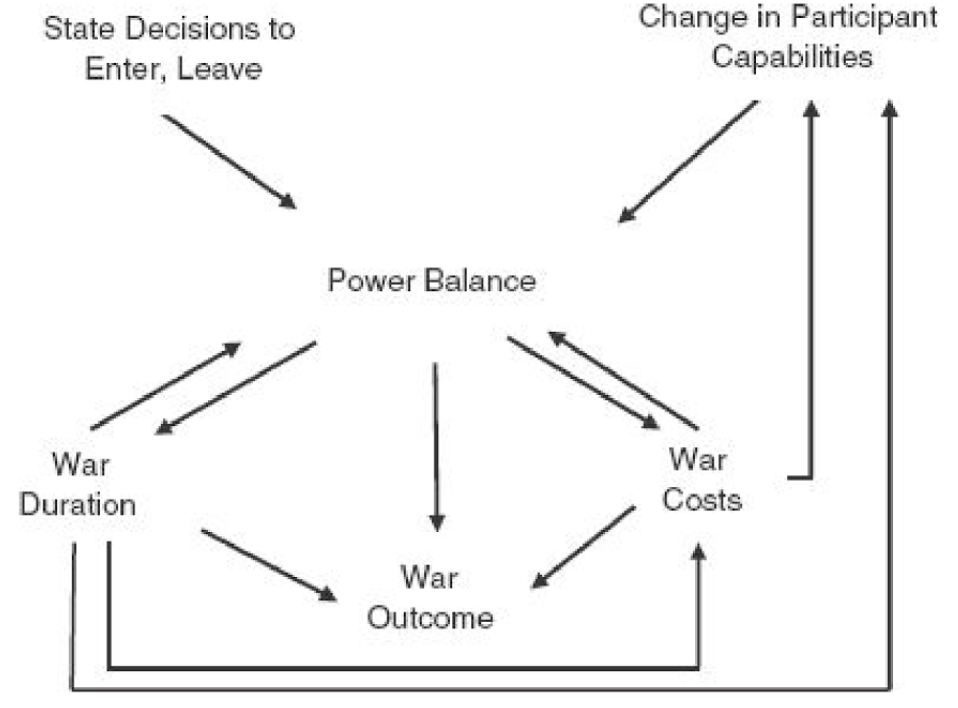
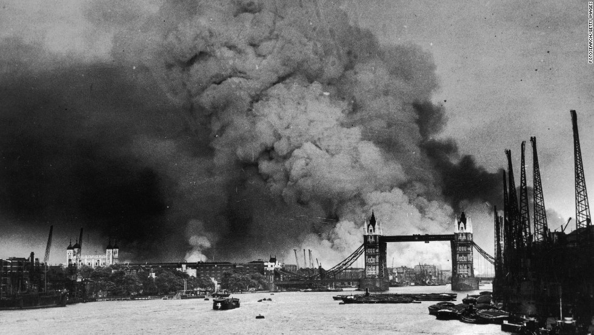
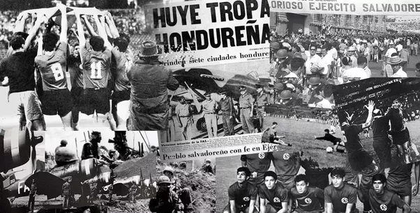
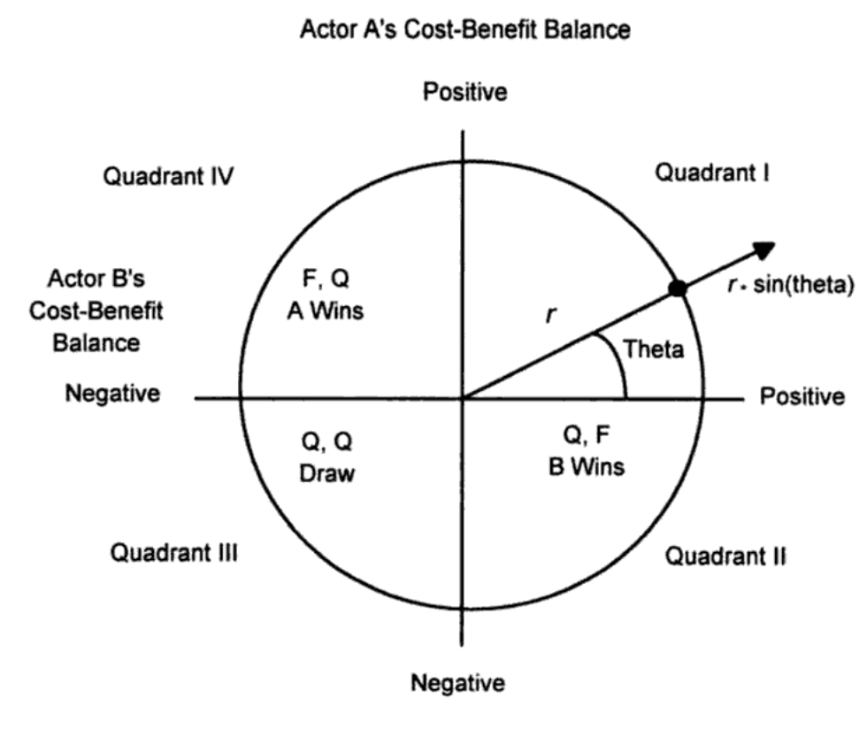

```{r setup, include=FALSE, cache=F, message=F, warning=F, results="hide"}
knitr::opts_chunk$set(cache=TRUE)
knitr::opts_chunk$set(fig.path='figs/')
knitr::opts_chunk$set(cache.path='cache/')

knitr::opts_chunk$set(
                  fig.process = function(x) {
                      x2 = sub('-\\d+([.][a-z]+)$', '\\1', x)
                      if (file.rename(x, x2)) x2 else x
                      }
                  )
```

```{r loadstuff, include=FALSE}
knitr::opts_chunk$set(cache=TRUE)
options(knitr.kable.NA = '')
library(tidyverse)
library(stevemisc)
library(countrycode)
library(knitr)
# library(kableExtra)
library(stargazer)
```

```{r loaddata, cache=T, eval=T, echo=F, message=F, error=F, warning=F}

MIDA <- read.csv("~/Dropbox/projects/mid-project/gml-mid-data/2.03/gml-mida-2.03.csv") %>% tbl_df()

Wars <- read.csv("~/Dropbox/data/cow/wars/Inter-StateWarData_v4.0.csv") %>% tbl_df()

```

# Introduction
### Question for Today

*What happens when war starts?*

### When War Starts

You'll notice we've talked about causes of war with saying little about war.

- Most our analyses have focused on MID onset.
- We just finished with MID escalation.

In other words: we belabored the first two conflict "phases" without addressing the third.

### A Framework for Studying the Evolution of War




# Properties of War
## War Expansion
### Not All Wars Look Like WWII




### The Football War Might Actually Be Closer to Typical



### Are All Wars Comparable?

The disparity leads some to assume they're different phenomena.

- Most classic scholarship cares about "big wars."
- In contrast, more recent scholarship is interested in "small wars."
    - Better descriptor: "nonsystemic wars"
    
### "Born Big?"

Most scholarship assumes these "big wars" are "born big."

- If so, there's nothing left to explain about its evolution.

However, this would be misleading. Examples:

- WWI: started as an Austrian threat to use force against Serbia.
- WWII: started as a British/French threat against Germany re: Poland
- Gulf War I: started as an Iraqi threat to Kuwait re: slant drilling.

There's a corollary issue of selection bias.

- Again: these are *not* typical cases of war.

###

```{r num-participants-war, echo=F, eval=T, fig.width = 14, fig.height = 8.5}

Wars %>%
  group_by(WarNum) %>%
  summarize(n = n()) %>%
  group_by(n) %>%
  summarize(warp = n()) %>%
  ggplot(.,aes(as.factor(n), warp)) + 
  geom_bar(stat = "identity", position = "dodge", alpha = I(0.8),color = I("black")) + 
  theme_steve_web() + 
  annotate("text", x = 7, y = 5, label = "Seven\nWeeks\nWar") +
  annotate("text", x = 9, y = 5, label = "World\nWar\nI") +
  annotate("text", x = 11, y = 5, label = "World\nWar\nII") +
  annotate("text", x = 10, y = 5, label = "\nKorean\nWar") +
  annotate("text", x = 8, y = 5, label = "\nGulf\nWar") +
  xlab("Number of Participants in War") + ylab("Count") +
    scale_y_continuous(breaks = seq(0, 60, by = 10)) +
  labs(title = "Most Wars (60%) are Bilateral",
       subtitle = "There is still substantial variation in war expansion even as wars like WWII are outliers.",
       caption = "Data: Correlates of War Inter-State War Data (v. 4.0)")
  

```

### Explaining Expansion

How do we explain the wars that do expand?

- Opportunity/willingness
- Expected utility theory

### Opportunity/Willingness

The opportunity/willingness framework translates well from MID onset to war evolution.

- Problem: how do you measure it?

### Opportunity/Willingness

Siverson and Starr (1991) offer the following measurements.

- Opportunity: warring border states
    - measurement: contiguity (broadly defined)
- Willingness: warring alliance partners
    - measurement: alliances (vary by type)
    
###

| **War Involvement** | **No** | **Yes** | **TOTAL** |
|:--------------------|:------:|:-------:|:---------:|
| No | 2,320 | 1,335 | 3,655 |
| Yes | 8 | 86 | 94 |
| Total | 2,328 | 1,421 | 3,749 |

Table: Warring Border States OR Alliance Partners and War Involvement (1816-1965)

*Data come from Siverson and Starr (1991)*

### Limitations With This Approach

This scholarship implicitly treats war as a "disease" you "catch."

- Importantly: war is a choice that state leaders make.
- They make these choices weighing costs and benefits.

## War Expansion by Rational Choice
### War Expansion by Rational Choice

Altfeld and Bueno de Mesquita (1979) use expected utility to model third-party decisions to join war.

### Expected Utility for War

The intuition is simple:

- Joining a war is an expected utility calculation.
- One decision is preferred to the other when the **expected** utility for one is greater than the other.
- Importantly: utility is weighted by probability.

### The Parameters in the Calculations

Let State B's decision for joining an A-C War be modeled with:

- $U_{ba}$ ($U_{bc}$): utility for B of A (or C) winning the war.
- $K_{ba}$ ($K_{bc}$): costs B expects to endure for helping A (or C) win the war.

$\frac{b}{a + b + c}$: probability *B*'s participation matters (as modeled by CINC scores) to the outcome.

### When Does B Prefer to Help A Beat C?

\begin{eqnarray}
(\frac{b}{a + b + c})(U_{ba}) - K_{ba} &>& (\frac{b}{a + b + c})(U_{bc}) - K_{bc}     \nonumber \\
(\frac{b}{a + b + c})(U_{ba}) -  (\frac{b}{a + b + c})(U_{bc})  &>& K_{ba} - K_{bc} \nonumber \\
(\frac{b}{a + b + c})(U_{ba} -  U_{bc}) &>& K_{ba} - K_{bc} \nonumber
\end{eqnarray}

###

| **Actual Choice** | **p(Join Weaker)** | **p(Stay Neutral)** | **p(Join Stronger)** |
|:------------------|:------------------:|:-------------------:|:--------------------:|
| Join Weaker | 16 | 4 | 0 |
| Stay Neutral | 1 | 104 | 3 |
| Join Stronger | 1 | 5 | 10 | 

Table: Predicted and Actual Third-Party War Choices (Altfeld and BdM (1979))

<!-- ## War Duration
###

```{r, echo=F, eval=T, fig.width = 14, fig.height = 8.5}

MIDA %>%
  filter(hostlev == 5 & mindur != 1) %>%
  group_by(mindur) %>%
  summarize(n = n()) %>%
  mutate(category=cut(mindur, breaks=c(-Inf, 1, 30, 60, 120, 365, 730, 1095, Inf), 
                       labels=c("One-day","2-30\ndays","31-60\ndays", "61-120\ndays",
                                "121-365\ndays",
                                "1-2 years", "2-3 years", "Longer than\n3 years"))) %>%
  group_by(category) %>%
  summarize(n = n()) %>%
  mutate(perc = round((n/sum(n))*100, 2),
         perc = paste0(perc,"%")) %>%
  ggplot(., aes(category, n)) +
  geom_bar(stat = "identity", position = "dodge", alpha = I(0.8),color = I("black")) +
  theme_steve() +
  xlab("Duration Category") + ylab("Count") +
  geom_text(aes(label=perc), vjust=-.5, colour="black",
            position=position_dodge(.9), size=4) +
  labs(title = "Your Typical War Is Going to Last 365 Days or Fewer",
       subtitle = "...and still plenty wars last several years.",
       caption = "Data: Gibler-Miller-Little MID Data (v. 2.01)")

```

-->

## War Durations
### War Duration

There is considerable interest in how long wars last.

- Longer wars typically indicate substantially higher (broadly defined) costs.

Yet, there's substantial variation among wars.

- Vietnam War lasted more than 10 years.
- The Football War lasted a few days.
- The Six Day War lasted... well, six days.

###

```{r war-duration, echo=F, eval=T, fig.width = 14, fig.height = 8.5}

MIDA %>%
  filter(hostlev == 5 & mindur != 1) %>%
  group_by(mindur) %>%
  summarize(n = n()) %>%
  mutate(category=cut(mindur, breaks=c(-Inf, 1, 30, 60, 120, 365, 730, 1095, Inf), 
                       labels=c("One-day","2-30\ndays","31-60\ndays", "61-120\ndays",
                                "121-365\ndays",
                                "1-2 years", "2-3 years", "Longer than\n3 years"))) %>%
  group_by(category) %>%
  summarize(n = n()) %>%
  mutate(perc = round((n/sum(n))*100, 2),
         perc = paste0(perc,"%")) %>%
  ggplot(., aes(category, n)) +
  geom_bar(stat = "identity", position = "dodge", alpha = I(0.8),color = I("black")) +
  theme_steve_web() +
  xlab("Duration Category") + ylab("Count") +
  geom_text(aes(label=perc), vjust=-.5, colour="black",
            position=position_dodge(.9), size=4) +
  labs(title = "Your Typical War Is Going to Last 365 Days or Fewer",
       subtitle = "...and still plenty wars last several years.",
       caption = "Data: Gibler-Miller-Little MID Data (v. 2.03)")

```

### What Explains War Duration?

Per Bennett and Stam (1996), wars generally last longer when:

- Terrain is "rougher" relative to more "open."
- Power is balanced among disputants.
- More troops are committed to combat zones.
- *Fewer* states are involved.

    
## War Outcomes
### War Outcomes

Who wins the war? Seems like an important question.

- Like war duration, though, we won't know until war is over.


###

```{r war-outcomes, echo=F, eval=T, fig.width = 14, fig.height = 8.5}

MIDA %>%
  filter(hostlev == 5 & mindur != 1) %>%
  group_by(outcome) %>%
  filter(outcome != 9) %>%
  summarize(n = n()) %>%
  mutate(category=c("Victory by\nSide A", "Victory by\nSide B",
                    "Yield by\nSide A", "Yield by\nSide B",
                    "Stalemate", "Compromise")) %>%
  mutate(perc = round((n/sum(n))*100, 2),
         perc = paste0(perc,"%")) %>%
  ggplot(., aes(category, n)) +
  geom_bar(stat = "identity", position = "dodge", alpha = I(0.8),color = I("black")) +
  theme_steve_web() +
  xlab("Outcome Category") + ylab("Count") +
  geom_text(aes(label=perc), vjust=-.5, colour="black",
            position=position_dodge(.9), size=4) +
  labs(title = "Most Wars End in a Victory for One Side or the Other",
       subtitle = "but almost 20% of wars end with no change to the motivating issue that caused the war.",
       caption = "Data: Gibler-Miller-Little MID Data (v. 2.01)")

```

### War Outcomes

Initiators generally win their wars.

- Yet there's still substantial variation and even more confusion distinguishing between MID/war initiation.

Conventional wisdom holds power matters most.

- Its likelihood of winning a war should increase monotonically with increases in relative power.


###

```{r traditional-view-power-war, echo=F, eval=T, fig.width = 14, fig.height = 8.5}
x <- seq(0, 1, length.out =100)

tibble(x = x,
       awins = x*1,
       bwins = (1-x)*1) %>%
  ggplot(.,aes(x, awins)) + theme_steve_web() +
  geom_path(aes(, awins), color = "#F8766D", size = 1.5) +
  geom_path(aes(, bwins), color = "#00BCF4", size=1.5, linetype="dashed") +
  ylab("Pr(Win)") + xlab("A's Capabilities Relative to B") +
  annotate("text", x = 0, y = .10, label = "Pr(A wins)", family="Open Sans") +
  annotate("text", x = 0, y = .90, label = "Pr(B wins)", family = "Open Sans") +
  labs(title = "The Traditional View of the Impact of Power on War Outcomes",
       subtitle = "Conventional wisdom holds for a linear relationship between power and war outcomes.",
       caption = "Stam III, Allan C. 1996. Win, Lose, or Draw: Domestic Politics and the Crucible of War. Ann Arbor, MI: University of Michigan Press")

```

### A Better View of Power and War Outcomes

The conventional wisdom is missing much about the nature of war.

- Wars can (and do) end in stalemates or draws.
- States see benefits and costs associated with continued combat.
- "Costs" can be understood as wherewithal to absorb damage from opponent.

Understanding war as mutual coercion in a cost-benefit analysis better approximates how wars can end.

###



###

```{r likelihood-war-outcomes, echo=F, eval=T, fig.width = 14, fig.height = 8.5}
x <- seq((pi/4), (2*pi), length.out =100)

tibble(x = x,
       awins = sin(x)*(1 - cos(x)),
       bwins = cos(x)*(1 - sin(x)),
       draw = (1 - cos(x))*(1 - sin(x))) %>%
  ggplot(.,aes(x, draw)) + theme_steve_web() +
  geom_path(aes(, awins), color = "#F8766D", size = 1.5) +
  geom_path(aes(, bwins), color = "#00BCF4", size=1.5, linetype="dashed") + 
  geom_path(aes(, draw), color = "#7CAE00", size=1.5, linetype = "dotted") +
  scale_y_continuous(breaks = NULL) +
  ylab("Likelihood of War Outcome") +
  xlab("Theta") +
  annotate("text", x = 2, y = 1.5, label = "Greatest probability\nfor A to win", family="Open Sans") +
  annotate("text", x = 5.75, y = 1.5, label = "Greatest probability\nfor B to win", family="Open Sans") +
  annotate("text", x = 5*pi/4, y = 2.5, label = "Greatest probability\nof a draw", family="Open Sans") +
  scale_x_continuous(breaks = c(pi/4, pi/2, 3*pi/4,
                                pi, 5*pi/4, 3*pi/2,
                                7*pi/4, 2*pi),
                     labels = c("pi/4", "pi/2", "3pi/4",
                                "pi", "5pi/4", "3pi/2",
                                "7pi/4", "2pi")) +
  geom_hline(yintercept = 0, linetype = "dashed") +
  geom_vline(xintercept = pi/4, linetype = "dashed") +
  labs(title = "Likelihood of War Outcomes",
       subtitle = "Importantly, the probability of A winning and B winning can both rise at the same time.",
       caption="Stam III, Allan C. 1996. Win, Lose, or Draw: Domestic Politics and the Crucible of War. Ann Arbor, MI: University of Michigan Press")
  

```


###

```{r war-fatalities, echo=F, eval=T, fig.width = 14, fig.height = 8.5}

Wars %>%
  group_by(WarNum) %>%
  summarize(n = sum(BatDeath)) %>%
  mutate(category=cut(n, breaks=c(-Inf, 3000, 10000, 50000, 100000,
                                       1000000, 5000000, 10000000, Inf), 
                       labels=c("1,000-3,000\nFatalities","3,000-10,000\nFatalities",
                                "10,000-50,000\nFatalities", "50,000-100,0000\nFatalities",
                                "100,000-1,000,000\nFatalities",
                                "1,000,000-5,000,000\nFatalities",
                                "5,000,000-10,000,000\nFatalities",
                                "More Than 10,000,000\nFatalities"))) %>%
  group_by(category) %>%
  summarize(n = n()) %>%
  mutate(perc = round((n/sum(n))*100, 2),
         perc = paste0(perc,"%")) %>%
  ggplot(.,aes(category, n)) + 
  geom_bar(stat = "identity", position = "dodge", alpha = I(0.8),color = I("black")) + 
  theme_steve_web() + 
  annotate("text", x = 6, y = 3.5, label = "Vietnam War,\nIran-Iraq War") +
  annotate("text", x = 7, y = 3, label = "World\nWar\nI") +
  annotate("text", x = 8, y = 3, label = "World\nWar\nII") +
  xlab("Number of Estimated Fatalities in Combat") + ylab("Count") +
  labs(title = "The Median War Claims Fewer Than 10,000 Fatalities in Combat",
       subtitle = "...and, by the grace of god, wars like the world wars are rare events.",
       caption = "Data: Correlates of War Inter-State War Data (v. 4.0)")
  

```

# Conclusion
### Conclusion

Most conflict studies dance around war dynamics but few address it.

- Most analyses are concerned with MID (or war) onset and less properties of the war itself.

Big questions: when does war expand?

- Bilateral wars seldom carry systemic consequences.
- Opportunity/willingness provide some clues.
- Certainly: war expansion is more choice than contagion.

### Conclusion

War is a fatality threshold for which there is substantial variation. Descriptively:

- Most wars last a year or less
- Most wars end in victory, but stalemates are still common.
- Most wars claim fewer than 10,000 fatalities.