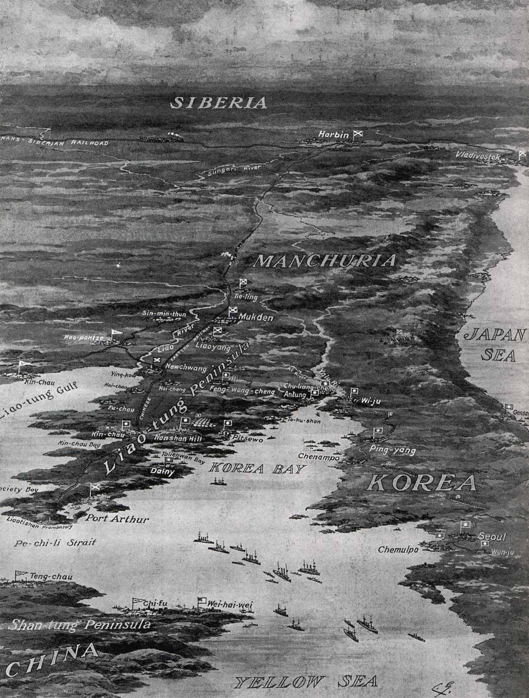

```{r setup, include=FALSE, cache=F, message=F, warning=F, results="hide"}
knitr::opts_chunk$set(cache=TRUE, warning=F, message=F, echo=FALSE, fig.width = 14, fig.height = 8.5)
knitr::opts_chunk$set(fig.path='figs/')
knitr::opts_chunk$set(cache.path='cache/')

knitr::opts_chunk$set(
                  fig.process = function(x) {
                      x2 = sub('-\\d+([.][a-z]+)$', '\\1', x)
                      if (file.rename(x, x2)) x2 else x
                      }
                  )
```


```{r loadstuff, include=FALSE}
knitr::opts_chunk$set(cache=TRUE)
options(knitr.kable.NA = '')
library(tidyverse)
library(stevemisc)
library(peacesciencer)
library(fixest)
library(kableExtra)
library(modelsummary)
library(patchwork)
library(cowplot)


options("modelsummary_format_numeric_latex" = "plain")
```

```{r loaddata, cache=T, eval=T, echo=F, message=F, error=F, warning=F}

Mods <- readRDS("Mods.rds")
Sims <- readRDS("Sims.rds")
Data <- readRDS("Data.rds")

part_wars <- readxl::read_excel("~/Dropbox/teaching/posc3610/war-outcomes/part-wars.xlsx")

```

# Introduction
### Goal for Today

*Discuss what we know about the outcomes of war---win, lose, or draw.*

### MIC of the Day: Russo-Japanese War (MIC#0180)

```{r mic-of-the-day, eval=TRUE, echo=FALSE, out.width="100%"}

```

### Russo-Japanese War

No one thought Japan stood a real chance at war's onset.

- Even the Japanese weren't terribly optimistic, but:
    - They didn't think Russia was negotiating in good faith, and
    - *Really* wanted to dislodge Russia from the Korean peninsula.

The onset of war happened when negotiations were still on the table.

### Russo-Japanese War

No one thought Japan could win, but Japan fared better in each battle.

- Battle of Port Arthur: stalemate, both sides claiming victory.
- Battle of Yalu River: Japanese victory
- Siege of Port Arthur: Japanese victory
- Battle of the Yellow Sea: indecisive
- Battle of Sandepu: indecisive
- Battle of Mukden: major Japanese victory
- Battle of Tsushima: decisive Japanese victory

After this, Russia had lost Manchuria, Korea, Port Arthur and the Sakhalins. Russia sued for peace.

### Russo-Japanese War as "Real War"

It's not that Russia could not have sent more troops.

- A variety of problems made this impractical.

 A march on Moscow (or Tokyo) was never at stake in this war.

- However, Japan's victories updated Russia's prior beliefs about what would happen if it came to that.

Japan waged a real war against Russia to influence Russia's expectations about a potential fight to the finish.

- War results in a relatively quick disclosure of information ("principle of convergence").

# War Outcomes
## Why Wars End
### Why Wars End

Let's contrast two wars involving Russia.

- WWII: ended with the USSR advancing on Berlin and occupying the Reichstag.
- Russo-Japanese War: ended with Russia suing for peace.

Both are major power wars but ended quite differently (beyond the outcome difference). Why?


### Types of War Termination

Scholars generally assume one-sided termination to wars.

- i.e. war continues until one side no longer sees the benefit of war.
- The side that gives up loses; the other side is the victor.

###

```{r, eval = T, echo = F, fig.width=14, fig.height = 8.5}

x <- seq(1, 100)
y <- sqrt(x)
y2 <- sqrt(x) + 4

tibble(
  x = seq(0,100),
  y = sqrt(x),
  y2 = sqrt(x) + 4
) %>%
  ggplot(., aes(x, y)) + theme_steve_web() +
  geom_path(aes(, y), color = "#000000", size = 1.5) +
  geom_hline(yintercept = 6.25, color="#00BCF4", size=1.5, linetype = "dotted") +
  geom_hline(yintercept = 10.25, color = "#F8766D", size=1.5, linetype="dotted" ) +
#  ylim(0, 12) +
  scale_y_continuous(breaks = NULL, limits = c(0, 12)) +
  scale_x_continuous(breaks = NULL) +
  geom_hline(yintercept = 0, linetype = "dashed") +
  geom_vline(xintercept = 0, linetype = "dashed") +
  annotate("text", x = 2.5, y = 10.5, hjust =0,
           label = "State A's Threshold", color = "#F8766D") +
  annotate("text", x = 2.5, y = 6.5, hjust =0,
           label = "State B's Threshold", color = "#00BCF4") +
  ylab("Expected Benefits of War") + xlab("Time") +
  labs(title = "War as Coercion Between State A and B, Over Time",
       subtitle = "The rising costs of war (black line) rise and surpass the threshold of benefits for B, but not A in this illustration.")
#  geom_path(aes(, y2), color = "#00BCF4", size=1.5, linetype="dashed")


```


### The Limitations of One-Sided Termination

Importantly: it assumes the stakes in the war are fixed.

- States have a priori cost thresholds and fixed aims they pursue.
- The first past the threshold loses.

But this doesn't make a lot of sense from a bargaining perspective.

- The "losing" side should drop some of its war aims under these conditions.
- The "winning" side should demand more as well.

### The Stylized Case of World War I

Consider the exogenous shock of the Bolshevik revolution in WWI.

- Russia desperately wanted out of WWI.
- Germany (not exactly in the best shape) should've been eager to accept.

What happened instead: Germany launched a new offensive on 16 February 1918.

- End result: Germany acquires the Baltic states, separates Ukraine from Russia, and gets Kars for the Ottoman Empire.

### Two-Sided Termination?

This leads to an interest in two-sided termination.

- Both sides must prefer peace to war for war to end.
- Arguments about bargaining models aside, this would square with the prominence of draws/stalemates in war.

## The Outcomes of War
### What Can We Say About This?

Gibler and Miller (Forthcoming) have a list of 1,958 confrontations. Of those:

- 101 had as many as 1,000 fatalities or more.

Estimates exclude WW2 and Latvian War of Liberation, which had cases of side-switching.

### 

```{r}

part_wars %>%
  mutate(outcome_conf = case_when(
    outcome == "Win" & sidea == 1 ~ "Victory for Side A",
    outcome == "Win" & sidea == 0 ~ "Victory for Side B",
    outcome == "Draw" ~ "Draw/Stalemate"
  )) %>% na.omit %>%
  distinct(dispnum, outcome_conf) %>%
  mutate(outcome_conf = fct_inorder(outcome_conf)) %>%
  #group_by(outcome_conf) %>% tally() %>%
  ggplot(.,aes(outcome_conf)) + 
  geom_bar(color="black", fill="#619cff") +
  geom_text(stat='count', aes(label=..count..), vjust=-1, family="Open Sans") +
  theme_steve_web() +
  scale_y_continuous(limits = c(0, 50)) +
  labs(title = "The Outcomes of War Confrontations",
       subtitle = "Draws, like the Korean War or the Taiwan Straits Crises account for over 22% of war outcomes.",
       x = "", y ="",
       caption = "Data: Gibler and Miller (Forthcoming). Initiators are coded at confrontation-level, not war-level. Outcomes hand-coded because of inadequacy of outcome data at the confrontation-level.\nOutcomes exclude World War 2 and Latvian Liberation for sake of side-switching.")

```

### What Explains War Outcomes?

A general model of war outcomes:

- *Unit of analysis*: Directed war-dyads (Gibler and Miller, Forthcoming). Exclusions:
    -  Participation in war short of mutual attack (e.g. France-UK in Franco-Siamese War).
    - "Irrelevant" war dyads (think: Brazil-Japan in WW2, or ROK-China in Vietnam War).
    - *N*: 590 (492, after missing data exclusions).
- *DV*: outcome (one of "Win", "Loss", or "Draw")


### What Explains War Outcomes?

*IVs*: 

- Estimated (min.) enemy/self fatality ratio 
  - Enemy/self fatalities: total dyadic war fatalities/maximum estimated military personnel during war.
- Relative power (i.e. $CINC_A/(CINC_A + CINC_B)$)
- Estimated level of democracy (continuous, via Marquez (2016))
- Did state initiate the confrontation/was on side that initiated confrontation.
- Was war bilateral?

*Model/Other Notes*: 

- Bayesian multinomial logit (these are never fun to interpret)

###

```{r, echo=F}

Data[[1]] %>%
  filter(dispnum == 2115) %>% 
  select(ccode1, ccode2, #outcome, 
         sumfatalmin2, sumfatalmax2, sumfatalmin1, sumfatalmax1,
         maxmilper1, maxmilper2,
         lowcasrat1, highcasrat1) %>%
  mutate_at(vars("sumfatalmin2", "sumfatalmax2", 
                 "sumfatalmin1", "sumfatalmax1"),
            ~format(., big.mark=",", scientific=FALSE)) %>%
  mutate_at(vars("lowcasrat1", "highcasrat1"), ~round(., 3)) %>%
  mutate(ccode1 = countrycode::countrycode(ccode1, "cown", "country.name"),
         ccode2 = countrycode::countrycode(ccode2, "cown", "country.name"),) %>%
  kbl(., booktabs = TRUE,
      align = "c",
      caption = "Casualty/Fatality Ratios of the Iran-Iraq War",
      col.names = c("State A", "State B",# "Outcome",
                    "Min. Enemy Fat.", "Max. Enemy Fat.",
                    "Min. Fat.", "Max. Fat.",
                    "Max. Size", "Max. Enemy Size",
                    "Cas. Rat. (Low)", "Cas. Rat. (High)")) %>%
  row_spec(0, bold=TRUE) %>% 
  kable_styling(font_size = 5)
```

For Iran:

- At least 95,147 Iraqis died in the war.
- At its peak, Iraq had an estimated 1,000,000 soldiers
- At most, Iran lost 255,824 troops in the war.
- At its peak, Iran had ~654,000 soldiers.

Iran's casualty ratio:

$$
lowcasrat_{Iran} = \frac{95147/1000000}{(95147/1000000) + (255824/654000)} \approx .196
$$


### Interpreting the Model Output

Listen, I'm not evil, so let's go straight to data visualization here. Assume three hypotheticals.

1. Belligerents are typical in every way, except relative power varies from min. to max. [0:1]
2. Belligerents are typical in every way, except casualty ratio varies from min. to max. [0:1]
3. Belligerents are typical in every way, except initiator and democracy varies.
<!-- 4. Belligerents are typical in every way, except war is bilateral or multilateral. -->

What are the estimated probabilities of war outcomes for belligerents?


###

```{r}
Sims[[2]] %>%
  group_by(relpow1, .category) %>%
  summarize(mean = mean(.epred),
            lwr = quantile(.epred, .1),
            upr = quantile(.epred, .9)) %>%
  ggplot(.,aes(relpow1, y=mean, ymin=lwr, ymax=upr, fill=.category)) +
  theme_steve_web() +
  geom_line(aes(color=.category, linetype = .category), size=1.2) +
  geom_ribbon(aes(fill = .category), alpha = I(0.2), color = I("black")) +
  scale_x_continuous(breaks = seq(0, 1, by=.1)) +
  labs(x = "Range of Relative Power",
       y = "Mean Probability of War Outcome (with 80% Intervals)",
       color = "", fill="", linetype="",
       title = "The Simulated Probability of War Outcome by Relative Power",
       subtitle = "Increasing power imbalances of A over B actually increase the likelihood of a stalemate.")

```

### The Relationship Between Relative Power and War Outcome

Increasing power of A over B actually increase likelihood of stalemate over victory.

- For every Gulf/Iraq War, there is a Korean War or Taiwan Straits Crisis.
- Potential caveats, though, about adjusting power to distance.


###

```{r}
Sims[[3]] %>%
  group_by(lowcasrat1, .category) %>%
  summarize(mean = mean(.epred),
            lwr = quantile(.epred, .1),
            upr = quantile(.epred, .9)) %>%
  ggplot(.,aes(lowcasrat1, y=mean, ymin=lwr, ymax=upr, fill=.category)) +
  theme_steve_web() +
  geom_line(aes(color=.category, linetype = .category), size=1.2) +
  geom_ribbon(aes(fill = .category), alpha = I(0.2), color = I("black")) +
  scale_x_continuous(breaks = seq(0, 1, by=.1)) +
  labs(x = "Range of Casualty Ratio",
       y = "Mean Probability of War Outcome (with 80% Intervals)",
       color = "", fill="", linetype="",
       title = "The Simulated Probability of War Outcome by Casualty Ratio",
       subtitle = "The greater the enemy casualties over your own, the more likely you win.")

```


### Democracies and War Outcomes

Quackenbush (in *WDWKAW*) references an empirical debate from the 1990s about democracies and war.

- Lake (1992): democracies are superior war-fighters.
    - Assumptions: counter-coalitions, less rent-seeking, greater legitimacy
- Reiter and Stam (1998): democracies are *choosier* war-fighters.

Both predict what we observe (democracies win wars), but:

- Lake's implication: no difference between democratic initiators and democratic targets
- Reiter and Stam's implication: democratic initiators fare better than democratic targets.


###

```{r}
Sims[[1]] %>%
  group_by(sidea1, maxquds1, .category) %>%
  summarize(mean = mean(.epred),
            lwr = quantile(.epred, .1),
            upr = quantile(.epred, .9)) %>%
  ungroup() %>%
  mutate(demlab = case_when(maxquds1 == -1.7 ~ "Autocracy",
                            maxquds1 == 0 ~ "Anocracy",
                            maxquds1 == 1.7 ~ "Democracy"),
         demlab = fct_inorder(demlab),
         sidealab = ifelse(sidea1 == 0, "Target", "Initiator")) %>%
  # filter(demlab == "Democracy") %>%
  ggplot(.,aes(sidealab, y=mean, ymin=lwr, ymax=upr, 
               shape=.category, color=.category)) +
#  geom_pointrange(position = position_jitter()) + coord_flip()
  geom_pointrange(position = position_dodge(width =.3), size=1.1) + coord_flip() +
  facet_wrap(~demlab) +
  theme_steve_web() +
  labs(title = "The Simulated Probability of War Outcome, by Initiation and Democracy",
       x = "", y = "Mean Probability of War Outcome (with 80% Intervals)",
       color = "", shape = "",
       subtitle = "Democracies generally fare better in war than autocracies, and fare better in the wars they pick.")
```


### The Simulations, in Plain English

For autocracies, probability of W-L-D:

- Targets: .247, .632, .121
- Initiators: .138, .540, .322
- Autocracies actually fare worse in the wars they pick.

For anocracies, probability of W-L-D:

- Targets: .356, .368, .276
- Initiators: .317, .371, .312
- Anocracies fare no better or worse in the wars they pick.

For democracies, probability of W-L-D:

- Targets: .376, .157, .468
- Initiators: .561, .198, .240
- Democracies fare much better in wars they pick.


# Conclusion
### Conclusion

What we know about war outcomes.

- Most wars are not "total wars", and end because both sides agree to stop fighting.
- Stalemates are an important outcome in war
- Generally: the more losses you impose, the better you do.
- Democracies fare better than autocracies in war outcomes.

### Conclusion

What would be nice to know:

- More, generally. We neglect "war dynamics" a fair bit in Diehl's (2006) "phases."
- Causal identification in strategic settings
- Geography and terrain
- The outcomes of battles vs. the outcomes of war
- Initiating the confrontation vs. initiating the war