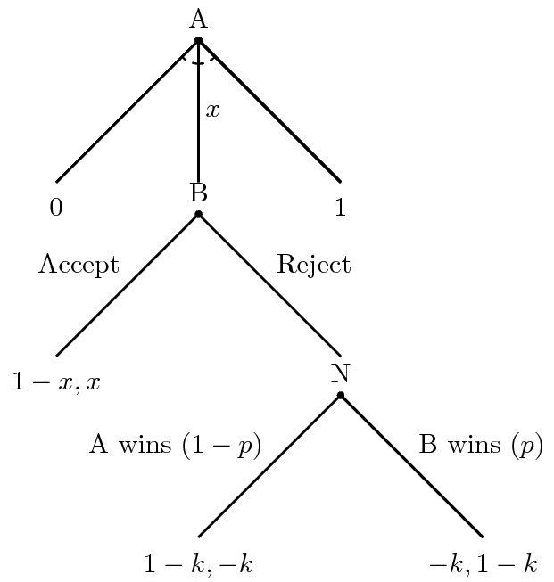
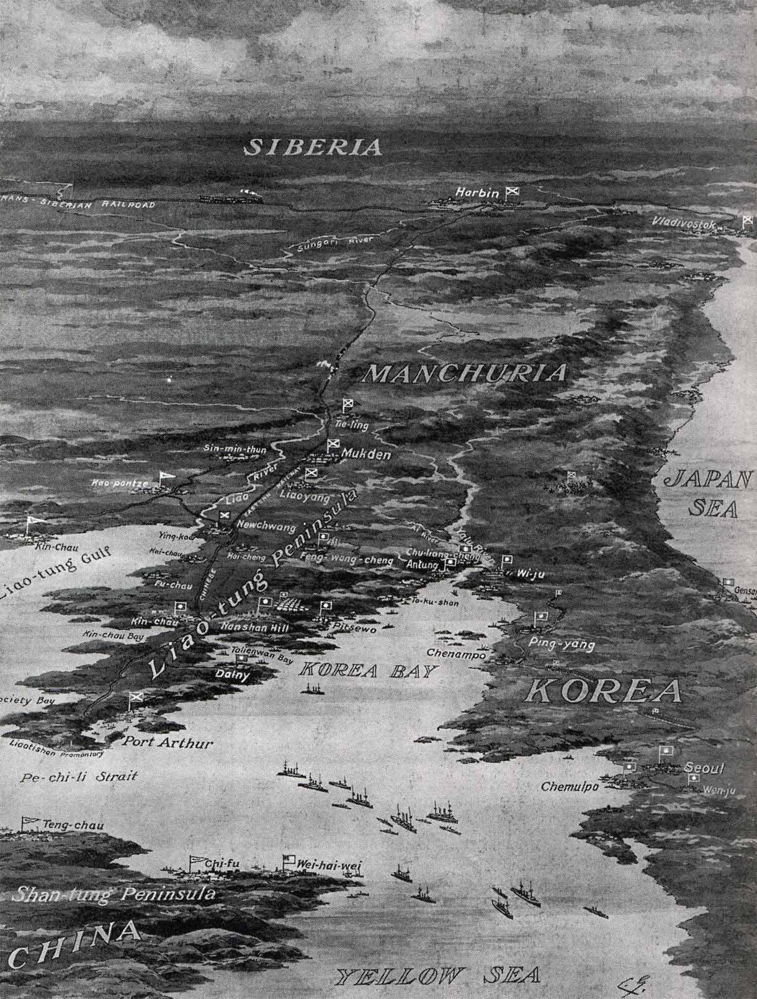

```{r setup, include=FALSE}
knitr::opts_chunk$set(cache=FALSE)

library(tidyverse)
library(stevemisc)
library(countrycode)
library(knitr)
# library(maddison)

```

# Introduction
### Puzzle for Today

*Some wars end with the occupation of the capital. Others end because both sides agree to stop fighting. Why?*

### Why Wars End

Let's contrast two wars involving Russia.

- WWII: ended with the USSR advancing on Berlin and occupying the Reichstag.
- Russo-Japanese War: ended with Russia suing for peace.

Both are major power wars but ended quite differently (beyond the outcome difference). Why?

# War Termination
### Types of War Termination

Scholars generally assume one-sided termination to wars.

- i.e. war continues until one side no longer sees the benefit of war.
- The side that gives up loses; the other side is the victor.

###

```{r, eval = T, echo = F, fig.width=14, fig.height = 8.5}

x <- seq(1, 100)
y <- sqrt(x)
y2 <- sqrt(x) + 4

tibble(
  x = seq(0,100),
  y = sqrt(x),
  y2 = sqrt(x) + 4
) %>%
  ggplot(., aes(x, y)) + theme_steve_web() +
  geom_path(aes(, y), color = "#000000", size = 1.5) +
  geom_hline(yintercept = 6.25, color="#00BCF4", size=1.5, linetype = "dotted") +
  geom_hline(yintercept = 10.25, color = "#F8766D", size=1.5, linetype="dotted" ) +
#  ylim(0, 12) +
  scale_y_continuous(breaks = NULL, limits = c(0, 12)) +
  scale_x_continuous(breaks = NULL) +
  geom_hline(yintercept = 0, linetype = "dashed") +
  geom_vline(xintercept = 0, linetype = "dashed") +
  annotate("text", x = 2.5, y = 10.5, hjust =0,
           label = "State A's Threshold", color = "#F8766D") +
  annotate("text", x = 2.5, y = 6.5, hjust =0,
           label = "State B's Threshold", color = "#00BCF4") +
  ylab("Expected Benefits of War") + xlab("Time") +
  labs(title = "War as Coercion Between State A and B, Over Time",
       subtitle = "The rising costs of war (black line) rise and surpass the threshold of benefits for B, but not A in this illustration.")
#  geom_path(aes(, y2), color = "#00BCF4", size=1.5, linetype="dashed")


```


### The Limitations of One-Sided Termination

Importantly: it assumes the stakes in the war are fixed.

- States have a priori cost thresholds and fixed aims they pursue.
- The first past the threshold loses.

But this doesn't make a lot of sense from a bargaining perspective.

- The "losing" side should drop some of its war aims under these conditions.
- The "winning" side should demand more as well.

### The Stylized Case of World War I

Consider the exogenous shock of the Bolshevik revolution in WWI.

- Russia desperately wanted out of WWI.
- Germany (not exactly in the best shape) should've been eager to accept.

What happened instead: Germany launched a new offensive on 16 February 1918.

- End result: Germany acquires the Baltic states, separates Ukraine from Russia, and gets Kars for the Ottoman Empire.

### Two-Sided Termination?

This leads to an interest in two-sided termination, but this is incomplete.

- What makes states at war prefer peace?
- If they preferred peace, why are they at war?

Ultimately, we need to return to the familiar problem of bargaining.

## A Reminder About Bargaining
### A Reminder About Bargaining




### Expected Utility for A of the War

\begin{eqnarray}
EU(\textrm{A} | \textrm{B Rejects Demand)} &=& (1 - p)(1 - k) + p(-k)   \nonumber \\
   &=& 1 - k - p + pk - pk \nonumber \\
   &=& 1 - p - k \nonumber
\end{eqnarray}


### Expected Utility for B of the War

\begin{eqnarray}
EU(\textrm{B} | \textrm{B Rejects Demand)} &=& (1 - p)(-k) + p(1 - k)   \nonumber \\
   &=& -k + pk + p - pk \nonumber \\
   &=& p - k \nonumber
\end{eqnarray}

### What's the Next Step in our Backward Induction?


### Now How Do We Proceed from Here?

- When does B accept A's offer?
- What does A offer to B?
- Would A ultimately make that offer to B?

### The Bargaining Space


### Bargaining Failure

When bargaining fails, war follows and generally for three reasons.

1. Issue indivisibility
2. Asymmetric (incomplete) information
3. Commitment problems

## War Termination from Information Convergence
### Incomplete Information

War as result of incomplete information is a convenient explanation.

- i.e. states disagree about terms of the model (e.g. *p* and *k*)

War necessarily results from when $p + k < p - k$.

- War can end when battles result in  $p + k \ge p - k$.

### Russo-Japanese War (1904-05)



### Russo-Japanese War (1904-05)

The Russo-Japanese War (1904-05) is a nice illustration of the **principle of convergence**.

- Issue: Port Arthur (Korea).

No one thought Japan stood a real chance at war's onset.

- Not even Japan did, actually.

The onset of war happened when negotiations were still on the table.

### Russo-Japanese War (1904-05)

No one thought Japan could win, but Japan fared better in each battle.

- Battle of Port Arthur: stalemate, both sides claiming victory.
- Battle of Yalu River: Japanese victory
- Siege of Port Arthur: Japanese victory
- Battle of the Yellow Sea: indecisive
- Battle of Sandepu: indecisive
- Battle of Mukden: major Japanese victory
- Battle of Tsushima: decisive Japanese victory

After this, Russia had lost Manchuria, Korea, Port Arthur and the Sakhalins. Russia sued for peace.

### Russo-Japanese War as Real War

It's not that Russia could not have sent more troops.

- A variety of problems made this impractical.


 A march on Moscow (or Tokyo) was never at stake in this war.

- However, Japan's victories updated Russia's prior beliefs about what would happen if it came to that.


Japan waged a real war against Russia to influence Russia's expectations about a potential fight to the finish.

- War results in a relatively quick disclosure of information.

## Other Explanations
### Problems With Information Convergence

Ramsay (2008) finds only a little support for the information convergence argument.

- intuitively: "quick disclosures" will struggle to explain longer wars.

Instead, we'll look at two other factors for how wars end.

1. Regime type
2. Commitment problems

### Regime Type and War Termination

Goemans (2000) has a general argument about regime type and war. Factors:

- Level of repression
- Level of exclusion

Findings:

- Mixed regimes (semi-repressive, moderately exclusionary): worst of both worlds, mostly likely to "gamble for resurrection."
- Democracies, strong non-democracies are more likely to lower their demands to end a war.

### Commitment Problems and War Termination

Concerns for commitment might prove more important.

- i.e. states don't adjust demands because they doubt the commitment on the other side is durable.

Reiter (2009) uses case studies to make this case:

- States with commitment concerns and hope for victory actually increase their demands in war despite discouraging information.
- States with same concerns and *no* hope for victory will adjust demands.
- Importantly, domestic politics don't seem to be as important.

# Conclusion
### Conclusion

Most wars end because both sides agree to stop fighting. General explanations:

- Incomplete information, and information convergence
- Regime variation
- Commitment problems
