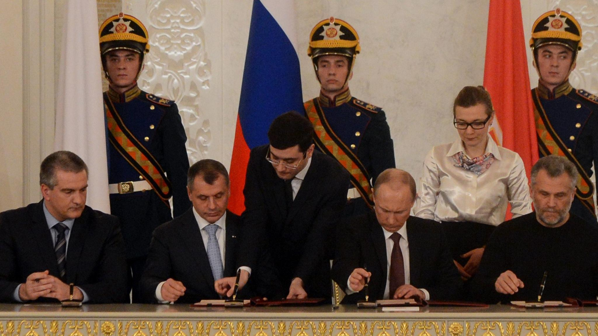

```{r setup, include=FALSE, cache=F, message=F, warning=F, results="hide"}
knitr::opts_chunk$set(cache=TRUE, warning=F, message=F, echo=FALSE, fig.width = 14, fig.height = 8.5)
knitr::opts_chunk$set(fig.path='figs/')
knitr::opts_chunk$set(cache.path='cache/')

knitr::opts_chunk$set(
                  fig.process = function(x) {
                      x2 = sub('-\\d+([.][a-z]+)$', '\\1', x)
                      if (file.rename(x, x2)) x2 else x
                      }
                  )
```


```{r loadstuff, include=FALSE}
knitr::opts_chunk$set(cache=TRUE)
options(knitr.kable.NA = '')
library(tidyverse)
library(stevemisc)
library(peacesciencer)
library(fixest)
library(kableExtra)
library(modelsummary)
library(patchwork)
library(cowplot)


options("modelsummary_format_numeric_latex" = "plain")
```

```{r loaddata, cache=T, eval=T, echo=F, message=F, error=F, warning=F}

# Mods <- readRDS("Mods.rds")
# Sims <- readRDS("Sims.rds")
# Data <- readRDS("Data.rds")

```

# Introduction
### Goal for Today

*Wrap up the semester. We made it!*

### MIC of the Day: The Annexation of Crimea (MIC#4683)

```{r mic-of-the-day, eval=TRUE, echo=FALSE, out.width="95%"}

```

# What Do We Know About War?
### What Do We Know About War?

1. Factors that promote war
2. Factors that promote peace

### Disputed Territory and Conflict

What we know:

- Contiguity is a crude proxy for disputing territory.
- States have fought over the allocation of territory more than any other issue.
- Our thorniest issues in international politics come connected to the allocation of territory.

What we don't know:

- The substance of the disputed territory itself.
- Claims that aren't militarized (i.e. the dogs that don't bark)
- Whether/which territorial issues are connected to conflict (see: PRK-ROK, IND-PAK)
- When territorial rivals pursue settlement/negotiation.
- Territorial conflict and norms against territorial conquest.

### Alliances and Conflict

What we know:

- Alliances are associated with conflict escalation in a short turnaround.
- Alliances with major powers are especially dangerous.
- Alliances are almost a necessary conditions for multilateral interstate wars.
- Alliances have a greater deterrent effect after WW2.

What we don't know:

- Is this a temporally limited topic? 
- Are these patterns changing?
- The causal sequence of alliance formation -> war

### Arms Races and Conflict

What we know:

- Arms races lead to war (no, seriously)...
- ...though Wallace (1979, 1982) was almost assuredly way off on his approach.
- Arms races are more likely proximate than root causes.

What we don't know:

- What really is "the arms race" in modern times?
- Why are arms races are present in so few wars?
- Is this a temporally limited topic?
- The domestic politics of the arms race.
- The nexus between "arms race" and military tech.

### Rivalry and Conflict

What we know:

- Conflict is not IID; rivalry is the reason why.
- Rivalry is akin to a force magnifier for other risk factors.

What we don't know:

- Dynamics/evolution of rivalry, within and between rivals.
- The evolving nature of rivalry patterns, over time.
- Variation in rivalry patterns, across space.
- "Rivalry swapping"

### Democracy and (War and) Peace

What we know:

- Jointly democratic dyads rarely fight each other, almost never in war.
- Democracies are no more peaceful in general
- Democracies are generally "choosier", and fare better in conflict.

What we don't know:

- Was this just a (Cold War) moment in time?
- Does democracy really "cause" peace?

# Looking Ahead
### Looking Ahead

Open questions/things I suspect you'll deal with over your life:

- The slow rollback of democratic supremacy.
- The decline (retreat) of American hegemony
- The fog of so-called "cyber conflict"
- Environmental conflict and the spoiling of the earth as common
- "Hide-and-seek" war efforts, and their (lack of obvious) consequences