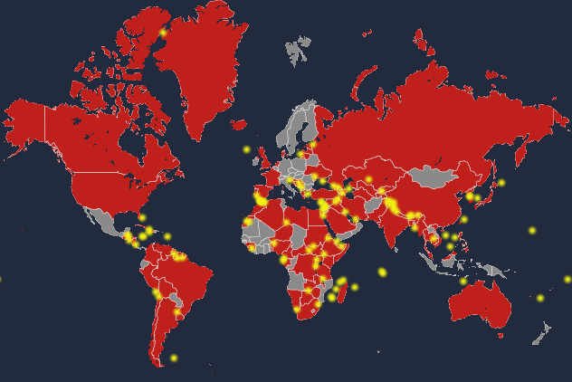

```{r setup, include=FALSE}
knitr::opts_chunk$set(cache=FALSE, warning=F)
mon <- as.Date("2018-01-08")
lastday <- as.Date("2018-04-27")
finalexam <- as.Date("2018-04-30") # 8 a.m.

advdate <- function(obj, adv) {
 tmon <- obj + 7*(adv-1)
 tfri <- obj + 4 + 7*(adv-1)
 tmon <- format(tmon, format="%m/%d")
 tfri <- format(tfri, format="%m/%d")
 zadv <- sprintf("%02d", adv)
 tmp <- paste("Week ",zadv,sep='',", ", tmon," - ",tfri)
 return(tmp)
}

library(RefManageR)
library(stevemisc)
# library(knitcitations)
# library(rcrossref)
bib <- ReadBib("~/Dropbox/master.bib")
myopts <- BibOptions(bib.style = "authoryear", style="latex", first.inits=FALSE, max.names = 20)

```

# Introduction
### Goal for Today

Familiarize students with the topic of the course and the instructor's expectations.

###



# Structure of This Course
### Structure of This Course

- Intro
    - Importantly, we'll define our terms (e.g. "dispute", "war")
- A review of the "correlates of war"
    - i.e. disputed territory is a root cause of most wars.
    - Other correlates of war and peace include alliances, joint democracy, and rivalry.
- How disputes escalate and end

### Structure of This Course

*This is a quantitative class.*

- We will give considerable detail about how to read/interpret regression tables.

You'll want to get comfortable with this.

# POSC 3610 Syllabus
### Course Objectives

1. Define inter-state conflict, militarized interstate disputes, and war.

2. Summarize the basic premise of why structural properties of the international system may lead states to fight each other.

3. Grasp not just democratic peace theory, but the full implications of the central claim of the peaceful nature of democracies.

4. Delineate why territory, as opposed to neighborly interactions, leads states to conflict.

5. Model war as a costly lottery.

6. Understand why sample selection is critical to claims about war and peace in international politics.

7. Read research designs and interpret regression results.

### Books

```{r, echo = FALSE, results="asis"} 
bib["vasquez2009twp"]
```


## Course Policy
### Grading Policy

| **Assignment** | **(Due) Date** | **Percent of Grade** |
|:-----------|:----------:|:----------------:|
| Attendance/Participation | | 20% |
| Midterm | Oct. 11 | 20% |
| "Steps to War" Paper | *before* Dec. 1, 9 a.m. | 20% |
| Final | Dec. 12, 3-5:30 p.m. | 40% |

### Attendance/Participation Policy

```{r, include=FALSE}
options(scipen=999)
Attend <- read.csv("~/Dropbox/teaching/attendance-grades-relationship.csv")
Attend$rgrade <- round(Attend$grade, 0)
Attend$perattend <- (Attend$attendance/Attend$max)*100
Attend <- subset(Attend, !is.na(rgrade))
Attend$name <- as.numeric(Attend$name)
Attend$id <- as.numeric(Attend$id)
Attend$term <- as.numeric(Attend$term)
Attend$class <- as.numeric(as.factor(Attend$class))
M1 <- lm(rgrade ~ perattend, Attend)
M2 <- lm(rgrade ~ perattend, data=subset(Attend, perattend >= 75))
library(broom)

M1df <- tidy(M1)
M2df <- tidy(M2)
library(ggplot2)
library(kfigr)
```

Effectively mandatory: I deduct all participation points after five unexcused absences.

- Don't ask me how many you missed. You'll know more than me.
- Each class you miss coincides with an estimated `r round(M1$coefficients[2], 3)*5` points in your overall grade.

Be prepared to answer questions. I might assign quizzes.

- Quizzes will be graded/weighted against your participation grade for the semester.

###

```{r attendplot, eval=T, echo=F, fig.height=8.5, fig.width = 14}


estdecrease <- round(M1df[2,2]*5, 3)
estdecrease_t <- round(M1df[2, 4], 3)

subtitletext <- paste0("Each missed class coincides with an estimated decrease of ", estdecrease, " points in the final grade (t = ", estdecrease_t, ")")

ggplot(Attend, aes(x = perattend, y = grade)) + geom_point() + 
  labs(x="Percent Attendance in Class", y="Final Grade in Class (0-100)") +
                              geom_smooth(method=lm) + theme_steve_web() +
  labs(title = "The Relationship Between Class Attendance and Final Grades, Fall 2014-Present",
       subtitle = subtitletext)

```


###

```{r calendar, eval=T, echo=F, fig.height=8.5, fig.width = 14}
mon <- as.Date("2018-08-20")
lastday <- as.Date("2018-12-07")
finalexam <- as.Date("2018-12-12") # 8 a.m.
# fri <- as.Date("2016-01-08")

library(ggplot2)
library(ggcal)
library(stringr)

mydate <- seq(mon+2, lastday, by="1 day")
mydate <- c(mydate, finalexam)

# Empty dates in which I won't be here.
# Nov. 6 is Fall Break
# Nov. 8 is PSSI
# Thanksgiving is Nov. 19-23.

remove_dates <- c(as.Date("2018-11-06"),
                  as.Date("2018-11-08"),
                   seq(as.Date("2018-11-19"), as.Date("2018-11-23"), by = "1 day"))

mydate <- mydate[! mydate %in% remove_dates]

myfills <- ifelse(format(mydate, "%w") %in% c(0,1, 3, 5,6), "Other Day" ,"Class Day")

# Fill in exams

exam_dates <- c(as.Date("2018-10-11"), finalexam)
myfills <- ifelse(mydate %in% exam_dates, "Exam" ,myfills)

# Fill in paper due dates

myfills <- ifelse(mydate %in% c(as.Date("2018-12-01")), "Paper Due (Turnitin)", myfills)

give_me_days <- seq(as.Date("2018-08-01"), as.Date("2018-12-31"), by="1 day")
give_me_days <- as.numeric(str_sub(give_me_days, start= -2))

ggcal(mydate, myfills) +
  theme(plot.title=element_text(face="bold"),
        plot.caption=element_text(hjust=1, size=9,
                                    margin=margin(t=10), face="italic")) +
  scale_fill_manual(values=c("Class Day"="steelblue", 
                             "Other Day"="lightsteelblue",
                             "Exam"="lightpink2",
                             "Paper Due (Turnitin)" = "indianred4"),
                    breaks=c("Class Day","Exam","Paper Due (Turnitin)")) +
  theme(legend.position="bottom") +
#  geom_point(shape=1, size=7) +
  geom_text(aes(label=give_me_days)) +
  labs(caption = "Notable dates: Fall Break (Nov. 6), PSSI Meeting (Nov. 8), Thanksgiving Break (Nov. 19-23)")
```

### Cell Phones, Laptops, etc...

Unless SDS says its mandatory, put your laptops/phones away during class.

- They are terrible learning devices. Take notes by hand instead.
- You're on Facebook or playing Pokemon Go anyway. Don't pretend you're not.


### Email Policy

I'm usually quick to respond to student e-mails. However, I may not if:

1. You could answer your question by reading the syllabus.
2. You missed a class for which there was no exam.
3. You want to know what you missed for the class you skipped.
4. You're protesting a grade without specific objections.
	- Read the syllabus about protesting a grade.
5. You want to know how many classes you missed.
6. You're requesting an extension on an assignment.
7. You're protesting that a late assignment is not actually "late".
8. You're grade-grubbing.
9. You want an extra credit opportunity.

### Make-up Exams

**No, *and don't bother asking***.

- Sniffles/headaches don't count. Soldier through it.
- University-sponsored events/holidays count, but give me two weeks advance.

Students with valid excuses have one week *at the most* to make up an exam.

### Disabilities Policy

I'm more than happy to accommodate, but:

- The student has to take the intiative. I can't.
- Do let me know privately after class if I should expect to hear from SDS soon.

If you require the Test Proctoring Center, *schedule your midterm and final now*.

- I will not spend my free time watching you take an exam.

# Etiquette and Expectations
### My Contact Information

- *Name*: Steve Miller (as in the band)
- *E-mail*: \textcolor{clemsonorange}{svmille@clemson.edu}
- *Office Hours*: TR 1:30 p.m.-3:30 p.m.
- *Office*: 230A Brackett Hall
- *Website*: \textcolor{clemsonorange}{http://posc3610.svmiller.com}

### Additional Course Materials

I don't care much for Canvas. I only intend to use it for:

- Turnitin (and grading the Turnitin assignments)
- Classwide e-mails

I do like making lectures publicly available, though.

- Check course website at [svmiller.com](http://svmiller.com)
- Check my Github repository (just in case): [github.com/svmiller](http://github.com/svmiller)

### My Expectations

I come off as a bit cruel in my expectations.

- I expect a lot, and I expect a commitment from you.
- Otherwise, why bother? Your job is to become "pro-ready."

I also expect it to be a bit difficult for you.

- My philosophy: if you 100% understand something the first time you read it, you didn't learn anything.
- Read and re-read if necessary.
- Lectures should help, but they're not sufficient. You need to read.

I take seriously the "science" of political science.

- This may not be intuitive, but I'm also eager to help in-class or office hours.

I don't care for whom you'll vote or what you saw on TV. *Don't bring it up*.


### Etiquette Concerns

In-class:

- Raise your hand and ask a question the *moment* something doesn't make sense.
    - I do have a bad habit of talking a bit fast.
- *Do the reading before class*. Seriously.
- Resist the urge to write down every word on a slide.
    - Listening is more important than reading in this context.

### Etiquette Concerns

Outside class: 

- **Resist the urge** to e-mail me if you missed a class (for which there wasn't an exam).
    - Short answer: you missed what was on the syllabus.
- Please use conventional e-mail etiquette.
    - This is a good professional exercise for you.
- Knock first, even when the door is open.
- You may not use my office supplies.
- I am not a study session. Come prepared with something specific to ask or discuss.

# Homework
### You Have Homework!

Basically, read these on my website:

- [Taking Good Notes](http://svmiller.com/blog/2014/09/taking-good-notes/)
- [Set Up Google Scholar to Find Class Readings on Your Syllabus](http://svmiller.com/blog/2017/07/set-up-google-scholar-to-find-class-readings/)
- [Dos and Dont's of Writing for Students](http://svmiller.com/blog/2015/06/dos-and-donts-of-writing-for-students/)
- [Assorted Tips for Students on Writing Research Papers](http://svmiller.com/blog/2015/12/assorted-tips-students-research-papers/)
- [Exam Grading Policy](https://www.dropbox.com/s/apihjs7di81aqcv/svm-exam-grading-policy.pdf?dl=0)
- [Fun with Attendance and Grades (i.e. Students Should Attend Class)](http://svmiller.com/blog/2016/05/fun-with-attendance-grades/)
- [The Educational Power of Discomfort](http://svmiller.com/blog/2016/05/educational-power-discomfort/)
- [Everybody Writes: A Web Content Approach for Students](http://svmiller.com/blog/2016/05/everybody-writes-academic/)
- [Put Your Laptops Away, Kids (Vol. 2)](http://svmiller.com/blog/2016/05/put-your-laptops-away-2/)
- [Reading a Regression Table: A Guide for Students](http://svmiller.com/blog/2014/08/reading-a-regression-table-a-guide-for-students/)

Links available on the course website.
